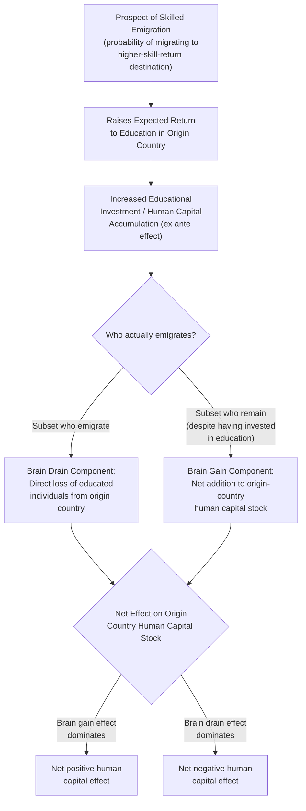

## Brain Drain and Brain Gain

### Overview

Brain drain and brain gain theory examines the effects of **high-skilled emigration on the sending (origin) country**, a perspective distinct from the destination-country labor-market focus of most of this chapter's other topics. "Brain drain" refers to the traditional concern that the emigration of a country's most educated and skilled workers represents a net loss of human capital to the origin country. "Brain gain" (or the "incentive effect" of migration prospects) refers to a countervailing mechanism by which the *possibility* of skilled emigration can raise educational investment and human capital accumulation in the origin country, potentially offsetting or even reversing the naive brain-drain loss calculation. This topic sits at the intersection of migration economics and development economics, and connects directly to the self-selection framework covered under **Skill Composition of Immigrant Flows**.

### The Traditional Brain Drain Concern

**Key Points**:

- The classic brain-drain argument holds that when highly-educated individuals (doctors, engineers, scientists, academics) emigrate from a developing country to a wealthier destination country, the origin country suffers a **direct loss of human capital** that is often costly to produce — since primary, secondary, and especially tertiary/professional education is frequently **subsidized** by origin-country governments (or financed through scarce domestic resources), the departure of educated individuals before they contribute a "return" on that investment through domestic labor-market participation represents an uncompensated transfer of resources to the (typically wealthier) destination country.
- This concern has been particularly emphasized in specific sectors with acute skill shortages in origin countries — most notably the emigration of **healthcare professionals** (physicians and nurses) from developing countries to wealthier destinations, where the loss of medical personnel can have direct and immediate consequences for the origin country's healthcare system capacity, distinct from the more diffuse human-capital-loss argument applicable to skilled emigration in general.
- Early brain-drain models (associated with development economists writing from the 1960s onward) generally treated migration decisions as **exogenous** to educational investment decisions — i.e., they modeled the loss from a *given*, already-realized pattern of skilled emigration, without considering how the **prospect** of emigration might itself have influenced how many people chose to acquire high skills/education in the first place.

### The Brain Gain / Incentive-Effect Counter-Argument

**Key Points**:

- **Mountford (1997)** and subsequent work by **Stark and colleagues** (e.g., Stark, Helmenstein, and Prskawetz, 1997) developed the key theoretical innovation: treating educational investment as an **endogenous** decision made under uncertainty about future migration opportunity, rather than treating migration as a simple exogenous drain on a fixed stock of already-educated workers.
- The core mechanism: if there is some probability that highly-educated individuals will be able to emigrate to a higher-return destination labor market (per the Roy-model logic under Skill Composition of Immigrant Flows), then the **prospect** of potential emigration raises the expected return to education for individuals in the origin country, since successful emigrants can capture the higher destination-country return to skill. This raises the **ex ante incentive** for individuals in the origin country to invest in education, even before knowing whether they personally will ultimately emigrate.
- Critically, **not everyone who responds to this incentive by acquiring additional education actually emigrates** — some who invest in education in response to the emigration prospect remain in the origin country. If this effect is large enough, the *net* stock of human capital remaining in the origin country after accounting for both the increased educational investment and the departure of some skilled emigrants can be **higher** than it would have been absent any migration prospect at all — this is the formal "brain gain" result.

### Diagram: Brain Drain vs. Brain Gain Mechanisms

### Formal Conditions for a Net Brain Gain

**Key Points**:

- The net effect depends on several parameters that the theoretical literature identifies as central:
  1. **The magnitude of the migration probability**: if the perceived probability of successful emigration is very low, the incentive effect on educational investment may be too small to generate a meaningful brain-gain offset; if too high, nearly everyone who invests in education actually leaves, limiting the residual brain-gain stock.
  2. **The responsiveness (elasticity) of educational investment decisions to the migration-probability incentive**: this is fundamentally an empirical behavioral parameter — how much does an increase in perceived emigration opportunity actually change individuals' human-capital investment decisions?
  3. **The gap between destination and origin returns to skill**: a larger gap (consistent with positive-selection conditions under the Roy model) increases the incentive-effect magnitude, since successful emigration is more valuable.
- [Inference] Theoretical models generally show that a net brain gain is **possible but not guaranteed** — it depends on this specific combination of parameters holding in a particular range, and the models do not imply that brain gain is a universal or automatic consequence of skilled-emigration prospects; it is a conditional, empirically-contingent possibility rather than a general law.

### Empirical Evidence on the Brain Gain Hypothesis

**Key Points**:

- Empirical testing of the brain-gain hypothesis has proven challenging, in substantial part because it requires estimating a **counterfactual** (what educational investment and human-capital accumulation would have been in the complete absence of any migration prospect) that is inherently difficult to observe directly.
- Empirical studies examining cross-country data on emigration rates and measures of human-capital accumulation (school enrollment, average education levels) have found **mixed results**: some studies find evidence broadly consistent with a positive incentive effect in specific country contexts or for specific education levels (e.g., some evidence has been found consistent with brain-gain effects concentrated at higher/tertiary education levels in some studies, since it is disproportionately higher-education achievers who have realistic emigration prospects to skill-selective destination countries), while other studies find limited or no clear evidence of a net positive effect, or find that the brain-drain loss dominates in specific country/sector contexts (notably, studies focused specifically on healthcare-worker emigration from countries with acute health-system shortages have generally been more skeptical that any brain-gain incentive effect offsets the direct, often severe, costs of losing scarce medical personnel).
- [Unverified] There is no single settled, generalizable empirical consensus on whether brain gain dominates brain drain on average across countries, or under what specific, precisely-quantified conditions one effect reliably dominates the other; this remains a genuinely and actively contested area of development and labor economics research, with findings appearing to depend substantially on the specific country, sector, time period, and migration-destination context studied.

### Additional Channels Beyond the Direct Human-Capital Stock Effect

Beyond the core educational-investment-incentive mechanism, the broader literature identifies several additional channels through which skilled emigration can affect origin countries, complicating a simple brain-drain-versus-brain-gain net accounting:

1. **Remittances**: emigrants frequently send financial remittances back to family members in the origin country, which can fund further human-capital investment (e.g., financing younger family members' education) or provide consumption-smoothing and investment capital, generating an additional positive channel distinct from the pure educational-investment-incentive effect described above.
2. **Return migration and circular migration**: some emigrants eventually return to the origin country, bringing back accumulated skills, savings, and international professional networks acquired abroad — this "brain circulation" channel can generate origin-country benefits distinct from (and generally more favorable than) a simple one-way permanent emigration assumption embedded in the simplest brain-drain models.
3. **Diaspora networks and knowledge/technology transfer**: skilled emigrant communities abroad ("diasporas") can facilitate trade, foreign direct investment, and knowledge/technology transfer back to the origin country through professional and business networks, a channel studied particularly in the context of technology-sector diaspora communities (e.g., studies of Indian and Chinese technology-sector diaspora networks and their relationship to origin-country technology-sector development).
4. **Loss of positive externalities/spillovers from skilled workers who remain**: a critique of the pure "stock accounting" approach to brain drain/gain is that highly-skilled workers may generate positive externalities for other workers in the origin country (e.g., a skilled physician improving public health outcomes for many others, or a skilled engineer contributing to broader firm-level productivity spillovers) — if these externalities are large, even a scenario in which the net *counted* human-capital stock is unchanged or slightly higher (per a narrow brain-gain calculation) could still represent a **net welfare loss** for the origin country if the departed individuals' externality-generating potential was not fully captured by those who remained. [Inference: quantifying these externality effects with precision is difficult, and the extent to which this consideration should shift the overall brain-drain/gain welfare assessment is not settled in the literature.]

### Worked Example

Consider a hypothetical developing country where, absent any emigration prospect, 100 individuals per cohort would invest in a costly medical education (each individual bearing a private cost, with substantial additional public subsidy). Suppose destination-country medical licensing recognition creates a genuine emigration opportunity, and this prospect raises the expected return to medical education sufficiently that **150 individuals** per cohort now choose to invest in medical training (reflecting the brain-gain incentive-effect mechanism). Suppose that, of these 150 trained individuals, **70 successfully emigrate** to practice medicine abroad, while **80 remain** in the origin country. Under a **naive brain-drain accounting** that ignores the endogenous educational-investment response, one might mistakenly compare the 70 emigrants directly against the original (counterfactual, absent-migration-prospect) baseline of 100 domestically-practicing physicians, concluding a net loss of 70 relative to that baseline understanding. But the correct comparison is between the **80 who remain** (out of the 150 induced to train by the emigration prospect) and the **100 who would have trained absent any migration prospect at all** — in this specific numerical illustration, the origin country actually ends up with **fewer** domestically-practicing physicians (80 vs. 100), representing a **net brain drain** in this example, despite the incentive effect having induced additional educational investment; a brain-gain outcome would instead require enough induced additional training (e.g., if 130 or more had chosen to train, leaving 60+ behind after 70 emigrated) that the number remaining exceeds the no-migration-prospect baseline. [Inference: this stylized numerical example illustrates the conditional logic of the model — the specific numbers used are illustrative only, not drawn from any particular empirical study, and real-world outcomes depend on the actual empirical magnitudes of the induced-investment and emigration-probability parameters in a given context, which vary substantially across countries and sectors.]

### Policy Implications and Debates

**Key Points**:

- If brain-gain incentive effects are empirically significant in a given context, this suggests that origin-country governments might, counter to the naive brain-drain intuition, have some interest in **facilitating rather than restricting** skilled emigration opportunities for their citizens (e.g., through bilateral labor-mobility agreements or recognition-of-credentials agreements with destination countries), since the resulting increase in domestic educational investment could outweigh the direct loss from departing emigrants.
- Conversely, in sectors or contexts where the empirical evidence suggests brain-drain losses dominate (e.g., the healthcare-worker emigration literature noted above), this suggests a stronger case for origin-country policies aimed at **retention** (e.g., improved domestic compensation and working conditions for scarce skilled professions) or for destination-country policies that mitigate the origin-country impact (e.g., some destination countries and international organizations have explored "ethical recruitment" guidelines discouraging active recruitment from countries experiencing acute health-workforce shortages, and some bilateral agreements have included origin-country compensation or training-support provisions).
- [Unverified] The practical effectiveness of such policy interventions (ethical recruitment guidelines, bilateral compensation schemes, circular-migration-promotion policies) in meaningfully altering brain-drain/gain outcomes is not conclusively established in the empirical literature and remains a subject of ongoing policy experimentation and academic debate.

### Empirical Evidence

- **Mountford (1997)**; **Stark, Helmenstein, and Prskawetz (1997)**: foundational theoretical papers establishing the brain-gain incentive-effect mechanism as a formal counterpoint to the traditional brain-drain framework.
- Cross-country empirical studies (various authors, using differing datasets on emigration rates and educational attainment across sending countries) have produced a range of findings, with some studies reporting evidence more consistent with net positive effects concentrated among countries with relatively low emigration rates and low baseline human-capital levels (where the incentive effect has more "room" to operate without an excessively high share of the newly-educated population actually departing), and other studies finding limited support or evidence of net losses in other contexts. [Unverified as a single generalizable finding; results are heterogeneous across the empirical literature.]
- Health-workforce-specific studies (examining physician and nurse emigration from various developing countries to destinations including the United States, United Kingdom, and other high-income countries) have generally emphasized the direct brain-drain costs to origin-country health systems more than any offsetting brain-gain incentive effect, reflecting both the acute, immediate nature of health-workforce shortages and some evidence that the incentive-effect mechanism may be weaker or slower-acting than the direct, immediate loss of already-trained personnel in this specific sector. [Inference: this sectoral emphasis in the literature reflects the particular policy salience and urgency of health-workforce shortages rather than necessarily reflecting a definitively larger or more certain net drain effect in this sector compared to others in a strict quantitative sense.]

### Comparative Note

| Consideration | Favors Net Brain Drain | Favors Net Brain Gain |
| --- | --- | --- |
| Migration probability | Very high (most trained individuals leave) | Moderate (meaningful share remains) |
| Responsiveness of education investment to migration prospect | Low | High |
| Sector | Acute-shortage sectors (e.g., healthcare) | Sectors with more elastic supply of training capacity |
| Additional channels considered | Externality loss from departed skilled workers | Remittances, diaspora networks, return/circular migration |
| Baseline human-capital level | High (less "room" for incentive effect) | Low (more room for induced investment) |

### Next Steps

- **Skill Composition of Immigrant Flows (Roy Model)**
- **Immigration Policy Design**
- **Remittances and Development Economics**
- **Return Migration and Selective Re-Emigration**
- **Healthcare Workforce Migration and Global Health Economics**
- **Diaspora Networks, Trade, and Technology Transfer**
- **Human Capital Theory and Externalities**