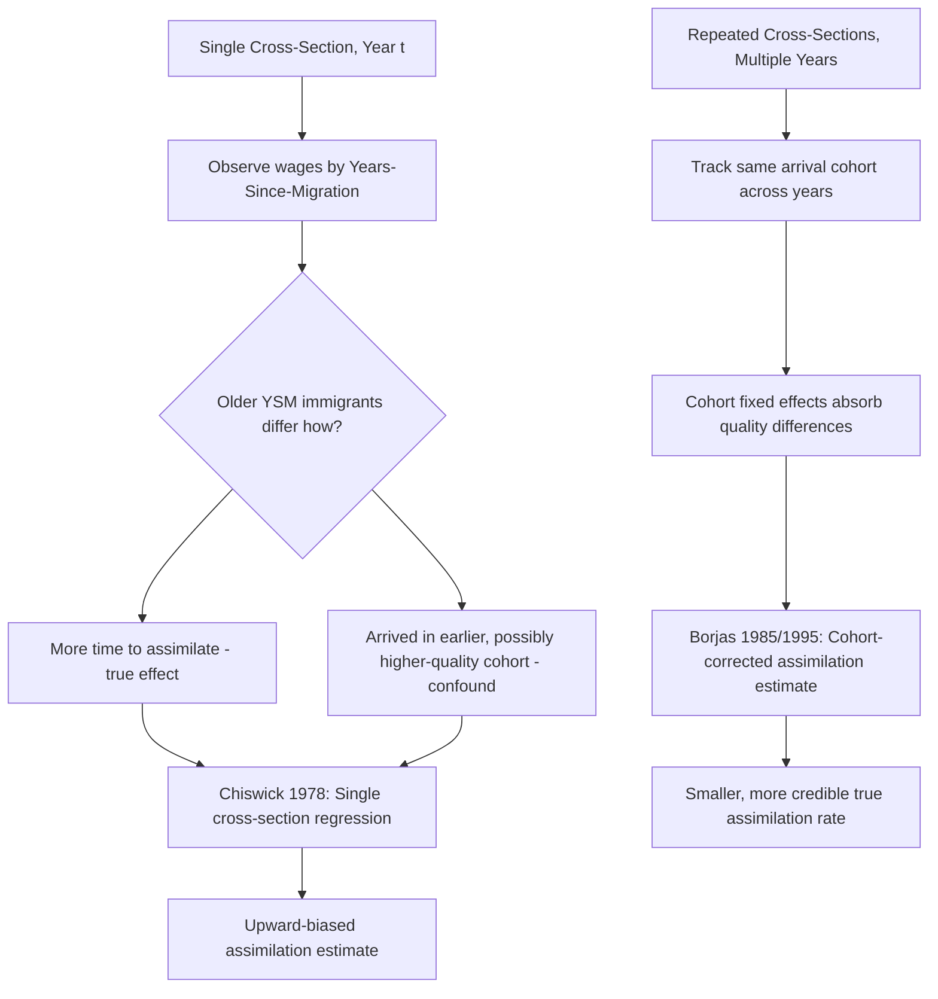

## Immigrant Assimilation and Wage Convergence

### Definitional Overview

Immigrant assimilation and wage convergence refers to the empirical and theoretical study of how immigrants' earnings evolve relative to native-born workers as time since migration ("years since migration," YSM) increases, and whether/how quickly immigrant wages converge toward (or diverge from) comparable native wages.

**Key Points**

- The foundational empirical question is whether immigrant-native wage gaps shrink with time spent in the host country (assimilation) and whether immigrants eventually reach wage parity or even overtake comparable natives
- A central methodological challenge is disentangling true within-cohort wage growth (assimilation) from changing cohort quality across successive immigrant arrival cohorts, since cross-sectional data conflates the two
- Chiswick's original (1978) cross-sectional finding of rapid, strong assimilation was substantially revised downward once Borjas (1985) demonstrated that cross-sectional estimates were biased by declining cohort quality over time

### Chiswick's Original Cross-Sectional Model

Chiswick (1978) estimated a standard Mincer-style earnings equation augmented with years-since-migration using a single cross-section of U.S. Census data:

$$\ln(w_i) = \beta_0 + \beta_1 S_i + \beta_2 X_i + \beta_3 X_i^2 + \beta_4 YSM_i + \beta_5 YSM_i^2 + \beta_6 \text{Immigrant}_i + \varepsilon_i$$

where $YSM_i$ is years since migration (zero for natives), $S_i$ is schooling, and $X_i$ is post-schooling experience. Chiswick found $\beta_4 > 0$ and large in magnitude, implying that immigrant earnings started below comparable native earnings at entry but grew fast enough with YSM to reach parity within roughly 10–15 years and *surpass* native earnings thereafter — the celebrated "overtaking" result.

### Borjas's Critique: The Cohort Quality Confound

Borjas (1985, 1995) identified a fundamental identification problem: a single cross-section cannot distinguish "assimilation" (true within-immigrant-cohort wage growth over time in the host country) from "cohort effects" (systematic differences in the initial skill/quality of successive arrival cohorts).

**The core problem formalized**: In a single cross-section observed in year $t$, an immigrant who arrived $YSM$ years ago belongs to arrival cohort $t - YSM$. If cohort quality has been declining over successive arrival years (e.g., due to changing source-country composition or changing U.S. immigration policy/selection), then in cross-section, older-YSM immigrants are *both* more assimilated *and* from higher-quality entry cohorts — the single cross-sectional YSM coefficient conflates both effects and is therefore upward-biased as an estimate of pure assimilation.

**Borjas's solution**: Using repeated cross-sections (e.g., multiple Census years) allows separate identification of cohort effects and assimilation effects by tracking the *same arrival cohort* across multiple observation years:

$$\ln(w_{i,c,t}) = \beta_0 + \beta_1 S_i + \beta_2 X_i + \beta_3 X_i^2 + \gamma_c + \delta \cdot YSM_{i,c,t} + \varepsilon_i$$

where $\gamma_c$ is a cohort-of-arrival fixed effect and $YSM_{i,c,t} = t - c$ varies both across cohorts and across observation years for a given cohort, allowing $\delta$ (true assimilation) to be separately identified from $\gamma_c$ (cohort quality). Borjas found that once cohort effects were properly netted out, true assimilation rates were substantially smaller than Chiswick's cross-sectional estimates, and complete wage convergence to native levels within a working lifetime was far from guaranteed for many cohorts — directly contradicting the "overtaking" result.

### Diagram: Cross-Sectional Bias vs. Cohort-Corrected Estimation

### Sources of Declining Cohort Quality (U.S. Context)

Borjas attributes declining cohort quality partly to shifts in U.S. immigration policy and source-country composition:

- The Immigration and Nationality Act of 1965 shifted admission criteria away from national-origin quotas (which had favored Northern/Western Europe) toward family reunification, changing the composition of source countries substantially over subsequent decades
- Source-country selection effects: per the **Roy model** applied to migration (Borjas 1987), whether a source country sends positively or negatively selected migrants (relative to that country's own income/skill distribution) depends on the *relative* returns to skill in the source versus destination country — countries with higher skill-return inequality than the U.S. tend to send negatively selected migrants (since low-skill workers gain relatively more from migrating to a more egalitarian wage structure), while countries with lower skill-return inequality than the U.S. tend to send positively selected migrants
- [Inference] This Roy-model selection framework is influential but its predictive power for actual observed cohort quality trends is only partially borne out empirically, since migration costs, network effects, refugee/asylum flows, and policy quotas interact with pure skill-based self-selection in ways the simple model does not capture

### The Roy Model of Immigrant Self-Selection (Formal Sketch)

Let $w_0$ be an individual's earnings in the source country and $w_1$ their potential earnings in the destination country, with:

$$\ln w_0 = \mu_0 + \varepsilon_0, \quad \ln w_1 = \mu_1 + \varepsilon_1$$

An individual migrates if $w_1 - w_0 > C$ (migration costs $C$). Given the correlation structure between $\varepsilon_0$ and $\varepsilon_1$ (typically assumed positive, reflecting general ability), the model predicts:

- If $\sigma_1 < \sigma_0$ (destination country has a more compressed wage-skill distribution than source), migrants are drawn disproportionately from the *lower* tail of the source-country skill distribution (negative selection)
- If $\sigma_1 > \sigma_0$ (destination country has a more dispersed distribution — higher returns to skill), migrants are drawn disproportionately from the *upper* tail (positive selection)

**Example**

Consider two source countries, A and B, both sending migrants to the same destination country with a relatively compressed wage structure (low returns to skill/education, e.g., due to a strong welfare state and wage-compression institutions). Country A itself has a highly unequal wage-skill relationship (very high returns to education domestically), while Country B has a fairly compressed wage-skill relationship similar to the destination. The Roy model predicts Country A will send more negatively selected migrants (its high-skill workers have little to gain from moving to a compressed-wage destination, while its low-skill workers gain considerably), whereas Country B's migrants will be closer to neutrally or positively selected relative to their home population, since the relative-return incentive to migrate is more uniform across the skill distribution. [Unverified — this is a theoretical illustration of the model's mechanics, not empirical data for specific named countries]

### Empirical Assimilation Estimates and Refinements

- LaLonde and Topel, Card, and others extended the cohort-fixed-effects framework with additional controls, generally confirming that true assimilation rates are positive but modest, with substantial heterogeneity by source-country, education level, and English-language proficiency at arrival
- **English language proficiency** is consistently found to be one of the strongest predictors of both initial wage gaps and subsequent assimilation speed, particularly for source countries linguistically distant from the destination country's dominant language
- **Return migration/selective emigration bias**: if immigrants who perform poorly are more likely to return to their home country (negative selection out of the sample over time), then even a repeated cross-section will overstate assimilation for those who remain, since the observed sample increasingly consists of positively-selected "stayers" — Lubotsky (2007) used matched Social Security earnings records to show that accounting for return migration substantially reduces estimated assimilation rates relative to standard cross-sectional and repeated-cross-section Census-based methods, since Census-based approaches cannot track individuals who leave the sample via emigration
- **Human capital transferability**: education and occupational credentials/experience acquired in the source country often transfer imperfectly to the destination labor market (due to licensing barriers, language of instruction, or employer skepticism about foreign credentials), producing a wage penalty at entry that erodes only partially over time as immigrants acquire host-country-specific human capital, re-credential, or build host-country work experience and networks

### Diagram: Determinants of Immigrant Wage Assimilation Speed

<svg xmlns="http://www.w3.org/2000/svg" viewBox="0 0 700 420" font-family="Helvetica, Arial, sans-serif">
<text x="350" y="28" text-anchor="middle" font-size="16" font-weight="bold" fill="#1a1a1a">Immigrant Wage Gap Over Years Since Migration (svg_diagram)</text>
<line x1="80" y1="360" x2="640" y2="360" stroke="#333" stroke-width="2" />
<line x1="80" y1="360" x2="80" y2="60" stroke="#333" stroke-width="2" />
<text x="360" y="390" text-anchor="middle" font-size="13" fill="#333">Years Since Migration</text>
<text x="35" y="210" text-anchor="middle" font-size="13" fill="#333" transform="rotate(-90 35 210)">Log Wage</text>

<line x1="80" y1="140" x2="640" y2="140" stroke="#8888ff" stroke-width="2" stroke-dasharray="6,3" />
<text x="550" y="132" font-size="12" fill="#5555dd">Comparable Native Wage</text>

<path d="M 100 300 C 250 180, 350 100, 500 90" fill="none" stroke="#cc4444" stroke-width="2.5" />
<text x="510" y="85" font-size="11" fill="#aa2222">Chiswick (uncorrected): overtaking</text>

<path d="M 100 300 C 250 250, 400 200, 600 175" fill="none" stroke="#228833" stroke-width="2.5" />
<text x="450" y="200" font-size="11" fill="#116622">Borjas (cohort-corrected): partial convergence</text>

<path d="M 100 300 C 250 270, 400 250, 600 230" fill="none" stroke="#996600" stroke-width="2.5" />
<text x="450" y="255" font-size="11" fill="#996600">Lubotsky (return-migration adjusted): slower still</text>
<circle cx="100" cy="300" r="4" fill="#333" />
<text x="60" y="315" font-size="11" fill="#333">Entry wage gap</text>
</svg>

### Second-Generation and Intergenerational Assimilation

Beyond first-generation wage convergence, a related literature examines **intergenerational mobility of immigrant children**:

- Second-generation immigrants (U.S.-born children of immigrants) typically show substantially smaller wage gaps relative to natives than their parents' generation, and in many studies fully close the gap or exceed native averages, particularly conditional on educational attainment
- Card's work on the "second-generation advantage" finds that children of immigrants often outperform third-plus-generation natives with similar parental socioeconomic status, attributed partly to selective immigrant parental ambition/investment in children's human capital [Inference — the precise causal mechanism (parental selection vs. immigrant-specific investment behavior vs. measurement issues in comparing generations) remains an active research question]

### Policy Implications

- Points-based immigration systems (Canada, Australia, and increasingly discussed in the U.S. and UK) are partly motivated by Roy-model logic and cohort-quality findings: by selecting immigrants on observable skill/education criteria at entry, policymakers aim to raise average cohort quality and thereby the pace and level of wage convergence
- Recognition of foreign credentials and targeted language-training programs are frequently proposed policy levers to accelerate assimilation given the empirical importance of credential transferability and language proficiency
- Refugee and family-reunification-based immigration streams typically show slower wage assimilation than skill/employment-based streams in comparative studies, which has fueled debate over optimal immigration-system composition, though this comparison raises normative questions (humanitarian and family-unification goals) that are separate from pure labor-market-efficiency considerations

### Related Topics

- The Roy Model of Self-Selection in Migration (Borjas 1987)
- Cohort Effects vs. Assimilation Effects in Panel/Repeated Cross-Section Design
- Return Migration and Selective Emigration Bias (Lubotsky 2007)
- Human Capital Transferability and Credential Recognition
- Second-Generation Immigrant Intergenerational Mobility
- Points-Based vs. Family-Based Immigration System Design
- Immigration's Labor Market Effects on Native Workers (Wage and Employment Impacts)
- Language Proficiency and Labor Market Outcomes