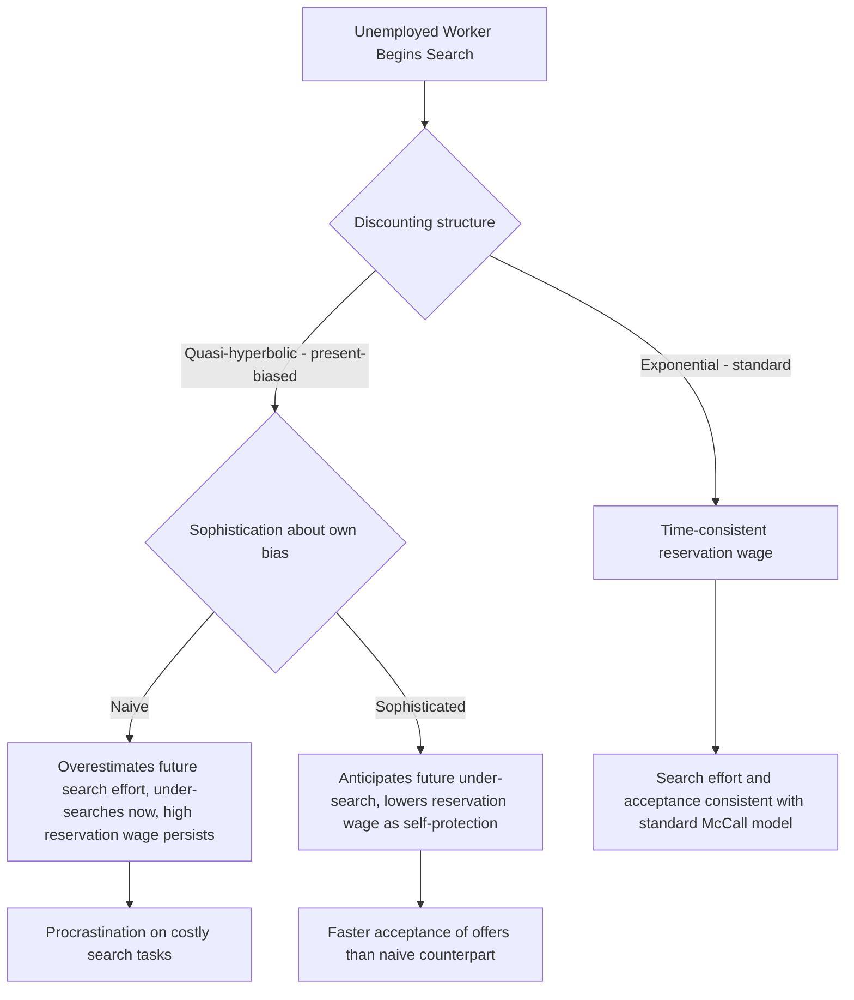

## Bounded Rationality in Job Search

### Definitional Overview

Bounded rationality in job search examines how deviations from the fully rational, unlimited-computation optimal-stopping framework of classical search theory affect job seekers' actual search behavior, reservation wage-setting, and unemployment duration. Rather than assuming job seekers solve the dynamic programming problem exactly, this literature incorporates cognitive limitations, biased beliefs, present-bias in decision-making, and limited attention into models of search.

**Key Points**

- Classical (McCall 1970) search theory assumes job seekers correctly compute a reservation wage via backward induction over an infinite (or long) horizon with full knowledge of the wage-offer distribution
- Behavioral extensions relax one or more of: rational expectations about the offer distribution, exponential (time-consistent) discounting, unlimited cognitive capacity to compute optimal stopping rules, and correct updating of beliefs about job-finding probabilities
- A central empirical motivation is the systematic and difficult-to-rationalize decline in job search effort and reservation wages observed as unemployment insurance benefits approach exhaustion, alongside self-reported biases in job seekers' beliefs about their own re-employment prospects

### The Classical Benchmark: McCall Search Model

The standard rational search model posits a worker who receives wage offers $w$ drawn from a known distribution $F(w)$ while unemployed, receiving flow unemployment benefit $b$ during search. The worker's optimal policy is a reservation wage $w^*$ solving:

$$w^* = b + \frac{1}{1+r}\int_{w^*}^{\infty} (w - w^*) \, dF(w)$$

The worker accepts any offer $w \geq w^*$ and rejects offers below it. This model is fully rational: it assumes correct knowledge of $F(w)$, correct application of Bayesian updating if learning occurs, and exponential discounting at rate $r$ implying dynamically consistent behavior.

### Deviation 1: Present-Bias and Hyperbolic Discounting

**DellaVigna and Paserman (2005)** and related work model job seekers with quasi-hyperbolic ($\beta$-$\delta$) preferences rather than standard exponential discounting:

$$U_t = u_t + \beta \sum_{\tau=t+1}^{\infty} \delta^{\tau - t} u_\tau, \quad 0 < \beta < 1$$

The parameter $\beta < 1$ generates present bias: costly search effort today is weighted more heavily (discounted less) relative to future job-finding benefits than a fully exponential discounter would, and the future self is not bound by present-self choices — generating a form of dynamic inconsistency.

**Key predictions distinguishing present-biased from standard search models**:

- Present-biased job seekers **procrastinate on costly search effort**, since the effort cost is borne immediately while the job-finding benefit is delayed
- Sophisticated present-biased agents (who correctly anticipate their own future self-control problems) set a *lower* reservation wage than naive present-biased agents, as a self-protective mechanism against their own anticipated future under-search — since sophisticated agents recognize they will search too little in the future, they compensate by being willing to accept more offers now
- This generates a testable, non-monotonic relationship between impatience and reservation wages that differs from standard exponential-discounting search theory, where more impatient (higher $r$) searchers unambiguously set lower reservation wages without this sophistication-dependent reversal

**Example**

DellaVigna and Paserman found empirically that more impatient individuals (proxied via survey-elicited discount rates or smoking status as a behavioral proxy for impatience) exhibited lower search intensity but did not show correspondingly higher exit rates from unemployment, a pattern difficult to reconcile with the standard exponential model (where impatience should straightforwardly reduce reservation wages and increase acceptance rates) but consistent with a present-bias interpretation in which impatient/present-biased individuals under-invest in the costly search effort needed to *generate* offers in the first place, even while nominally willing to accept offers once they arrive.

### Diagram: Standard vs. Present-Biased Search Behavior

### Deviation 2: Reference Dependence and Loss Aversion

Job seekers may evaluate wage offers relative to a reference point (e.g., their previous wage, or an aspiration level) rather than in absolute terms, per prospect theory (Kahneman and Tversky):

$$v(w) = \begin{cases} (w - r)^\alpha & \text{if } w \geq r \\ -\lambda(r - w)^\alpha & \text{if } w < r \end{cases}$$

where $r$ is the reference point (commonly the pre-unemployment wage) and $\lambda > 1$ captures loss aversion. This generates a reservation wage that is anchored to the previous wage rather than purely to the option value of continued search, potentially explaining:

- Downward wage rigidity in accepted job offers (workers strongly resist accepting jobs below their previous wage, more so than the pure option-value framework predicts)
- **DellaVigna, Lindner, Reizer, and Schmieder (2017)** develop a reference-dependent job search model finding that a reference point tied to the prior UI benefit level, rather than purely rational search, better explains the empirically observed spike in job-finding hazard rates precisely at UI benefit exhaustion — standard search theory predicts a *smooth* increase in hazard as the benefit-exhaustion date approaches (due to the falling continuation value of search), but a reference-dependent model with loss-averse evaluation of the benefit drop can generate a sharper, more discontinuous spike consistent with data from several countries

### Deviation 3: Limited Attention and Costly Cognition

**Rational inattention** models (following Sims 2003, applied to search by several authors) posit that job seekers face a cost of processing information about wage offers or the labor market, leading them to rationally choose to process only coarse, imprecise signals rather than optimally utilizing all available information. Applied to job search:

- Workers may not continuously reoptimize their reservation wage in response to every piece of new labor-market information, instead updating in discrete, costly "attention" episodes
- This can generate apparent "stickiness" in reservation wages and search behavior that looks like irrationality under the classical model but is consistent with rational responses to a positive cost of cognition

[Inference] Distinguishing rational inattention from other forms of bounded rationality (e.g., simple biased beliefs, present bias) is empirically difficult, since both can generate similar reduced-form patterns of sluggish adjustment; most identification strategies rely on structural estimation with strong auxiliary assumptions about the specific cost-of-attention function, making this an area with less empirical consensus than the present-bias and reference-dependence literatures.

### Deviation 4: Biased Beliefs About Job-Finding Prospects

A substantial survey-based literature (Spinnewijn 2015; Mueller, Spinnewijn, and Topa 2021) documents systematic biases in job seekers' *subjective beliefs* about their own re-employment probability relative to their realized outcomes:

- Job seekers are found, on average, to be **overoptimistic** about their job-finding probability early in an unemployment spell, with elicited subjective beliefs exceeding realized exit rates
- This overoptimism appears to *decline* only partially as unemployment duration lengthens, and is correlated with search effort: overoptimistic individuals search less than a rational-expectations benchmark would predict, since they (incorrectly) perceive a high probability of finding work without high search intensity
- [Unverified] The degree and persistence of this overoptimism bias appears to vary by country, benefit-system generosity, and survey elicitation methodology across the empirical literature, and results are not fully uniform across all studies

**Formal implication**: If a job seeker holds a subjective belief $\hat{F}(w)$ about the wage-offer distribution or a subjective job-finding hazard $\hat{h}$ that diverges from the true (objective) values $F(w)$ and $h$, their chosen reservation wage $\hat{w}^*$ solving the McCall equation under $\hat{F}$ and $\hat{h}$ will generally differ from the fully-informed rational benchmark $w^*$, and search effort choices based on $\hat{h}$ will be systematically distorted relative to a policy or welfare analysis conducted under the objectively true $h$ — a wedge with direct implications for optimal UI policy design (see below).

### Policy Implications: Optimal UI Design Under Bounded Rationality

**Key Points**

- If job seekers are overoptimistic about job-finding probability, standard moral-hazard-based UI design (which assumes fully rational agents correctly perceive and respond to the search-effort disincentive of benefits) may understate optimal benefit generosity, since overoptimistic agents under-respond to the moral hazard channel relative to the rational benchmark
- If job seekers are present-biased and naive about it, mandatory job-search requirements, structured search assistance, and "nudge"-style interventions (e.g., reminders, deadline-based search plans) can improve welfare by helping overcome self-control problems that the worker's own future selves would not otherwise resolve
- Behavioral job-search literature has motivated a range of applied "nudge" experiments — for example, providing structured planning prompts or reminders to unemployment insurance claimants has been tested as a low-cost intervention to increase search effort and reduce unemployment duration in several field experiments, generally with modest but sometimes statistically significant positive effects on exit rates [Unverified — effect sizes vary considerably by study design, country, and labor market conditions, and some replications find null or small effects]

### Diagram: Sources of Bounded Rationality in the Search Decision

<svg xmlns="http://www.w3.org/2000/svg" viewBox="0 0 700 440" font-family="Helvetica, Arial, sans-serif">
<text x="350" y="28" text-anchor="middle" font-size="16" font-weight="bold" fill="#1a1a1a">Channels of Bounded Rationality in Job Search (svg_diagram)</text>
<rect x="270" y="50" width="160" height="45" rx="6" fill="#eeeeee" stroke="#333" stroke-width="1.5" />
<text x="350" y="77" text-anchor="middle" font-size="13" fill="#111">Job Search Decision</text>
<line x1="300" y1="95" x2="140" y2="150" stroke="#666" stroke-width="1.5" />
<line x1="330" y1="95" x2="300" y2="150" stroke="#666" stroke-width="1.5" />
<line x1="370" y1="95" x2="420" y2="150" stroke="#666" stroke-width="1.5" />
<line x1="400" y1="95" x2="580" y2="150" stroke="#666" stroke-width="1.5" />
<rect x="60" y="150" width="160" height="60" rx="6" fill="#fde8e8" stroke="#aa3333" stroke-width="1.5" />
<text x="140" y="175" text-anchor="middle" font-size="12" font-weight="bold" fill="#aa3333">Present Bias</text>
<text x="140" y="192" text-anchor="middle" font-size="10" fill="#333">Procrastination on</text>
<text x="140" y="205" text-anchor="middle" font-size="10" fill="#333">costly search effort</text>
<rect x="220" y="150" width="160" height="60" rx="6" fill="#e8f0fd" stroke="#3355aa" stroke-width="1.5" />
<text x="300" y="175" text-anchor="middle" font-size="12" font-weight="bold" fill="#3355aa">Reference Dependence</text>
<text x="300" y="192" text-anchor="middle" font-size="10" fill="#333">Reservation wage anchored</text>
<text x="300" y="205" text-anchor="middle" font-size="10" fill="#333">to prior wage/benefit</text>
<rect x="380" y="150" width="160" height="60" rx="6" fill="#e8fdec" stroke="#227733" stroke-width="1.5" />
<text x="460" y="175" text-anchor="middle" font-size="12" font-weight="bold" fill="#227733">Limited Attention</text>
<text x="460" y="192" text-anchor="middle" font-size="10" fill="#333">Costly cognition leads to</text>
<text x="460" y="205" text-anchor="middle" font-size="10" fill="#333">infrequent belief updating</text>
<rect x="500" y="150" width="160" height="60" rx="6" fill="#fdf3e8" stroke="#aa7722" stroke-width="1.5" />
<text x="580" y="175" text-anchor="middle" font-size="12" font-weight="bold" fill="#aa7722">Biased Beliefs</text>
<text x="580" y="192" text-anchor="middle" font-size="10" fill="#333">Overoptimism about</text>
<text x="580" y="205" text-anchor="middle" font-size="10" fill="#333">job-finding probability</text>

<text x="350" y="260" text-anchor="middle" font-size="13" fill="#333" font-weight="bold">Observable Consequences</text>

<text x="350" y="290" text-anchor="middle" font-size="12" fill="#333">Under-search relative to rational benchmark;</text>

<text x="350" y="310" text-anchor="middle" font-size="12" fill="#333">hazard-rate spike at benefit exhaustion;</text>

<text x="350" y="330" text-anchor="middle" font-size="12" fill="#333">reservation wage stickiness; downward wage rigidity</text>

</svg>

### Methodological Approaches

- **Structural estimation** of behavioral search models (estimating $\beta$, $\delta$, $\lambda$, or belief-bias parameters directly from duration and reservation-wage data) allows counterfactual policy simulation but requires strong functional-form assumptions
- **Survey-elicited subjective expectations** (asking job seekers directly for their perceived job-finding probability, then comparing to realized outcomes) provide more direct evidence of belief bias without requiring the researcher to assume a specific behavioral model, at the cost of measurement and framing-effect concerns in the survey instrument itself
- **Lab and field experiments** (e.g., randomized nudges, reminders, or informational interventions) provide the cleanest causal identification of specific behavioral mechanisms but often address only one channel at a time and may have limited external validity to full-scale unemployment insurance systems

### Related Topics

- Classical McCall Search Theory and the Optimal Reservation Wage
- Unemployment Insurance Design and the Moral Hazard Trade-off
- Present Bias, Quasi-Hyperbolic Discounting, and Procrastination
- Prospect Theory and Reference-Dependent Preferences
- Rational Inattention Models (Sims)
- Subjective Expectations Elicitation in Labor Market Surveys
- Nudge Interventions in Active Labor Market Policy
- Duration Dependence and the Hazard Rate of Unemployment Exit