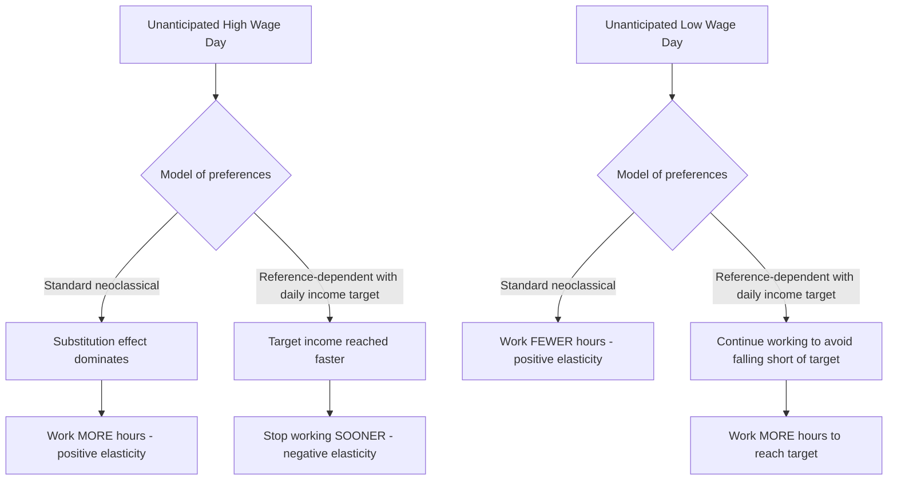

## Reference Dependence and Loss Aversion in Labor Supply

### Definitional Overview

Reference dependence and loss aversion in labor supply examines how workers' labor supply decisions (hours worked, effort, and daily stopping decisions) deviate from the neoclassical labor-leisure model when income or hours are evaluated relative to a reference point rather than in absolute terms, with losses relative to that reference point weighted more heavily than equivalent gains.

**Key Points**

- The neoclassical labor supply model predicts that workers should supply *more* hours when the wage is unexpectedly high (positive substitution effect, at least when income effects are small over short horizons) and should be indifferent to how a given income level was reached
- Reference-dependent models predict the opposite pattern is possible in specific settings: workers may supply *fewer* hours on high-wage days if they have a daily income target, because they reach that target faster and stop working sooner — the celebrated "target earner" or "income-targeting" hypothesis
- This literature originated largely from empirical anomalies in taxi-driver labor supply and has since been contested, replicated, and refined across many alternative settings and methodologies

### The Neoclassical Benchmark

The standard static labor supply model has a worker choosing hours $h$ to maximize utility $U(c, h) = u(c) - v(h)$ subject to budget constraint $c = wh + y_0$, where $w$ is the wage and $y_0$ is non-labor income. The first-order condition yields:

$$w \cdot u'(c) = v'(h)$$

Under this framework, a **transitory, unanticipated wage increase** should generate a positive labor supply response (workers should work *more* on high-wage days) because the substitution effect dominates for short-lived wage changes with negligible wealth effects — this is the standard prediction tested in the labor supply elasticity literature (see the broader intertemporal substitution literature, Lucas-Rapping / MaCurdy).

### The Camerer, Babcock, Loewenstein, and Thaler (1997) Taxi Driver Study

The foundational empirical paper in this literature studied New York City taxi drivers, who have flexibility to choose their daily stopping time and face day-to-day variation in the effective wage (driven by weather, day of week, and other demand shocks affecting fares per hour).

**Key finding**: Drivers appeared to work *fewer* hours on high-wage days and *more* hours on low-wage days — implying a **negative** daily labor supply elasticity, the opposite sign predicted by the standard intertemporal substitution model.

**Proposed behavioral mechanism**: Drivers set a daily income target $y^*$ (a reference point, potentially set adaptively based on typical daily needs or habituation to past earnings) and evaluate their utility using a loss-averse value function:

$$v(y) = \begin{cases} (y - y^*)^\alpha & \text{if } y \geq y^* \\ -\lambda(y^* - y)^\alpha & \text{if } y < y^* \end{cases}$$

with $\lambda > 1$ (loss aversion). Because falling short of the target is penalized more heavily than exceeding it is rewarded, drivers rationally (under this reference-dependent utility) continue driving longer on low-wage days to avoid falling short of $y^*$, and stop earlier on high-wage days once $y^*$ is reached, since additional hours beyond the target yield diminishing marginal utility from the "gain" region relative to the utility cost of continued effort $v(h)$.

### Diagram: Standard vs. Reference-Dependent Daily Labor Supply Response

### The Methodological Critique: Farber's Reanalysis

**Farber (2005, 2008, 2015)** substantially challenged the original finding on both empirical and theoretical grounds:

1. **Endogenous stopping time and mechanical bias**: Farber showed that the original Camerer et al. specification, which regressed *hours worked* on the *average wage for the day already realized*, contains a mechanical/definitional bias, since a driver who happens to stop early (for any reason) after a lucky high-fare early trip will mechanically show a higher realized average wage for a shorter shift — the negative correlation can arise from reverse causality/definitional artifact rather than true behavioral income targeting
2. **Correcting for this bias**, Farber found a much weaker or in some specifications a *positive* relationship between the wage and hours worked, consistent with (or at least not clearly contradicting) the standard neoclassical model
3. Farber's preferred approach models the *stopping decision* directly as a hazard/duration process (the probability of stopping at a given point in the shift as a function of hours worked so far, cumulative earnings so far, and the current marginal wage), rather than the aggregate daily hours-wage correlation, and finds mixed evidence: some reference-dependence-consistent patterns survive (e.g., an elevated stopping probability once cumulative earnings reach round-number thresholds) but the strong income-targeting story is not robustly supported

[Inference] The taxi-driver labor supply literature is widely cited as a cautionary methodological case study in behavioral economics: it illustrates how mechanical/definitional correlations in observational data can masquerade as evidence for a behavioral model unless the underlying stopping-time endogeneity is carefully addressed, and the current empirical consensus is considerably more mixed and modest than the original 1997 paper's striking headline result.

### Round-Number Reference Points and Bunching Evidence

Even after Farber's corrections, several studies find more narrowly-scoped evidence for reference dependence via **bunching at round-number income thresholds**:

- Analyses of the distribution of daily/weekly earnings among taxi drivers, and in some settings other gig/piece-rate workers, find excess density (bunching) in the earnings distribution near round numbers (e.g., $100, $150 in nominal daily earnings), consistent with drivers treating round numbers as salient reference points even if a smooth, single daily target does not govern the entirety of the stopping decision
- This is conceptually related to (though distinct from) the broader **bunching estimator literature** in public finance (Saez 2010), which examines bunching at kink points in tax schedules as evidence of labor supply responsiveness, though the reference-point bunching discussed here is about self-set psychological targets rather than externally imposed tax-schedule kinks

### Extensions to Other Labor Supply Settings

**1. Effort and Piece-Rate Compensation**

Reference-dependent models have been applied beyond daily stopping-time decisions to effort choice under piece-rate pay:

- Workers paid piece rates may exhibit effort responses consistent with loss-averse evaluation relative to a reference income level (e.g., a habituated past-earnings level or an explicit target communicated by the employer), generating effort patterns that a standard expected-utility-maximizing effort-cost model would not predict

**2. Reference Points Tied to Prior Wages (Downward Wage Rigidity)**

- A separate but related strand of the reference-dependence literature (distinct from the daily-target literature) examines resistance to nominal wage cuts: workers and firms appear reluctant to reduce nominal wages even during periods where a purely rational, forward-looking model would predict wage reductions are efficient, consistent with loss-averse evaluation of wage changes relative to the previous wage as reference point (Bewley's survey-based work on wage rigidity provides complementary qualitative evidence, though from a different methodological tradition than the formal prospect-theory modeling discussed here)

**3. Reference Dependence in Job Search** (see related chapter content on Bounded Rationality in Job Search): reservation wages anchored to the pre-unemployment wage, and hazard-rate spikes at UI benefit exhaustion, are argued by some researchers (DellaVigna, Lindner, Reizer, and Schmieder 2017) to share the same underlying reference-dependent/loss-averse preference structure as the daily labor-supply-target literature, suggesting a degree of cross-context consistency in how reference dependence manifests across different labor market decisions.

### Formal Model: Loss-Averse Effort/Hours Choice

A generalized reference-dependent labor supply model can be written as:

$$\max_h \; u(wh + y_0) - v(h) + \mu \cdot [\eta(wh - r) ]$$

where $r$ is the reference level of earnings, $\eta(\cdot)$ is a gain-loss value function with the kink/loss-aversion property $\eta'(x) < \eta'(-x)$ for $x > 0$ evaluated at symmetric points (steeper slope in losses than gains), and $\mu$ is the weight placed on gain-loss utility relative to standard consumption utility. Setting $\mu = 0$ recovers the standard neoclassical model exactly, making this a nested generalization that is empirically testable against the classical benchmark via the estimated $\mu$.

[Unverified] The specific functional form and the relative weight $\mu$ placed on reference-dependent utility versus standard consumption utility differ substantially across studies and are not fully standardized in the literature, making direct comparison of estimated loss-aversion parameters across different papers and labor market settings difficult.

### Diagram: Kinked Value Function and Its Labor Supply Implication

<svg xmlns="http://www.w3.org/2000/svg" viewBox="0 0 680 420" font-family="Helvetica, Arial, sans-serif">
<text x="340" y="28" text-anchor="middle" font-size="16" font-weight="bold" fill="#1a1a1a">Loss-Averse Value Function Over Daily Earnings (svg_diagram)</text>
<line x1="80" y1="220" x2="620" y2="220" stroke="#333" stroke-width="1" />
<line x1="340" y1="380" x2="340" y2="60" stroke="#333" stroke-width="2" />
<text x="600" y="240" font-size="12" fill="#333">Earnings relative to target (y - y*)</text>
<text x="345" y="70" font-size="12" fill="#333">Value v(y)</text>

<path d="M 100 90 Q 220 180, 340 220" fill="none" stroke="#cc4444" stroke-width="3" />
<text x="140" y="130" font-size="12" fill="#aa2222">Loss region (steep)</text>

<path d="M 340 220 Q 480 260, 600 285" fill="none" stroke="#228833" stroke-width="3" />
<text x="440" y="300" font-size="12" fill="#116622">Gain region (shallow)</text>
<circle cx="340" cy="220" r="4" fill="#333" />
<text x="350" y="215" font-size="11" fill="#333">Reference point (y*)</text>

<text x="150" y="360" font-size="11" fill="#666">Falling short of target: large disutility</text>

<text x="420" y="340" font-size="11" fill="#666">Exceeding target: diminishing marginal value</text>

</svg>

### Empirical and Theoretical Assessment

**Example**

Consider a bike messenger paid per delivery with a self-set informal daily target of $120. On a rainy day with unusually high per-delivery fares (surge pricing), a reference-dependent worker reaches $120 after only 4 hours and stops, whereas the standard model predicts they should work *longer* on this high-wage day to capitalize on the temporarily elevated return to effort. Farber-style stopping-hazard analysis of a large sample of such workers' shift-level data would test this by estimating whether the empirical stopping hazard rises discontinuously right around the $120 cumulative-earnings mark, independent of hours elapsed — a pattern that (if robust to the mechanical/reverse-causality critique) would constitute more credible evidence for the income-targeting hypothesis than the original raw hours-wage correlation. [Unverified — illustrative example constructed for pedagogical purposes]

**Key Points**

- The current state of the literature (post-Farber) is best characterized as: the strongest, simplest version of daily income-targeting is not robustly supported once mechanical/definitional biases are corrected, but narrower and more carefully identified forms of reference dependence (round-number bunching, wage-cut aversion, UI-exhaustion hazard spikes) retain reasonably credible empirical support across multiple independent studies and settings
- This has generated methodological caution across the broader behavioral labor supply literature about relying on simple correlational evidence and increased emphasis on hazard-based, experimental, and bunching-estimator identification strategies

### Related Topics

- Standard Intertemporal Substitution Labor Supply Models (MaCurdy, Lucas-Rapping)
- The Camerer-Babcock-Loewenstein-Thaler Taxi Driver Study and the Farber Critique
- Bunching Estimators in Public Finance and Labor Supply (Saez 2010)
- Downward Nominal Wage Rigidity
- Bounded Rationality in Job Search and Reference-Dependent Reservation Wages
- Piece-Rate Compensation and Effort Provision
- Prospect Theory Foundations (Kahneman and Tversky)
- Gig Economy Labor Supply and Platform-Based Earnings Data