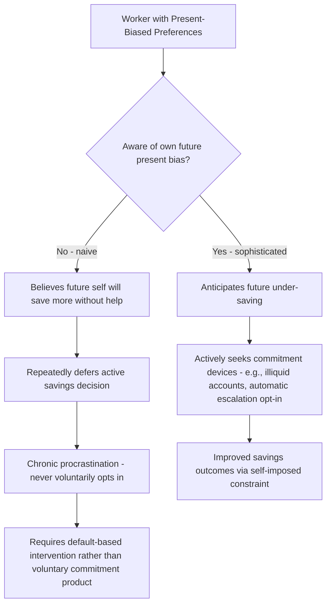

## Present Bias in Retirement and Savings Decisions

### Definitional Overview

Present bias in retirement and savings decisions examines how quasi-hyperbolic discounting and self-control problems cause workers to systematically under-save for retirement relative to a standard exponential-discounting benchmark, and how this behavioral friction has motivated the design of specific institutional features in retirement systems, most notably automatic enrollment and escalation defaults.

**Key Points**

- Standard life-cycle savings models (Modigliani-Brumberg) assume exponential discounting and predict that a fully rational, time-consistent worker will save optimally to smooth consumption across their lifetime, requiring no institutional intervention beyond removing liquidity constraints
- Present-biased preferences, formalized via the quasi-hyperbolic ($\beta$-$\delta$) discounting model (Laibson 1997), predict systematic under-saving because the immediate cost of foregone consumption today is weighted more heavily than the discounted future benefit of retirement consumption, even when the individual's own long-run preferences would favor saving more
- This literature directly motivated one of the most influential applied behavioral economics interventions in public policy: automatic enrollment in defined-contribution retirement plans (401(k)-type plans), which substantially raises participation rates by exploiting default-option inertia rather than requiring individuals to overcome active present-bias-driven procrastination

### The Quasi-Hyperbolic ($\beta$-$\delta$) Discounting Model

Laibson (1997) formalized present-biased preferences using the following discounted utility function, evaluated from the perspective of an individual at time $t$:

$$U_t = u_t + \beta \sum_{k=1}^{\infty} \delta^k u_{t+k}, \quad 0 < \beta < 1, \; 0 < \delta < 1$$

The parameter $\delta$ is the standard long-run exponential discount factor, while $\beta < 1$ applies a single additional discount to *all* future periods relative to the present, generating a discontinuous drop in relative valuation between "now" and "the very next period" that does not recur between any two future periods. This is the discrete-time discrete-jump analog of continuous hyperbolic discounting and is chosen for its tractability in dynamic programming applications.

**Key implication — dynamic inconsistency**: A $\beta$-$\delta$ agent's *planned* future consumption/savings path (as evaluated today) will generally not be followed once that future period actually arrives, because the future self re-solves the same problem with its own fresh $\beta$ discount applied to what is now *its* near future. This creates an internal conflict between successive "selves," modeled formally as an intrapersonal game played between the sequence of temporal selves.

### Sophistication vs. Naivety

A critical distinction in this literature, following O'Donoghue and Rabin (1999), is whether an agent is aware of their own future present bias:

- **Sophisticated agents** correctly anticipate that their future selves will also be present-biased and will deviate from any non-binding plan. Sophisticates may rationally demand commitment devices to bind their future selves' behavior, since they understand that without such a device, future-self will under-save just as much as present-self would prefer to under-save today
- **Naive agents** incorrectly believe their future selves will behave like a standard exponential discounter (i.e., that "tomorrow I will finally start saving properly"), and therefore do not seek out commitment devices, since they do not perceive a need for one — leading to a chronic pattern of repeatedly deferred savings intentions that never materialize
- **Partially naive agents** (with a perceived $\hat{\beta}$ between their true $\beta$ and 1) exhibit behavior between these two poles and are argued by several researchers to be the most empirically realistic characterization of typical savings behavior

[Inference] The sophistication/naivety distinction has first-order implications for policy design: commitment-device-based interventions (e.g., voluntary lock-in savings products) are effective primarily for sophisticated agents who will actively choose to use them, whereas naive agents are better served by default-based interventions that do not require them to recognize their own bias or take deliberate action at all — this is a widely cited rationale in the literature for why default/auto-enrollment designs have proven more broadly effective than voluntary commitment-device products in raising aggregate savings rates.

### Diagram: Sophisticated vs. Naive Present-Biased Savers

### Automatic Enrollment and the Power of Defaults

**Madrian and Shea (2001)** provided the foundational empirical demonstration of default effects in retirement savings, studying a firm that switched its 401(k) plan from opt-in (active enrollment required) to automatic enrollment (enrolled by default, with an opt-out option).

**Key findings**:

- Participation rates rose dramatically following the switch to automatic enrollment — a change that should have no effect whatsoever under a standard rational-choice model with negligible opt-out transaction costs, since opting out was made simple and costless in either regime
- The default contribution rate and default fund allocation set by the plan sponsor exerted a powerful "anchoring" effect: a large share of automatically-enrolled employees remained at the plan's default contribution rate and default investment fund for years afterward, rather than actively adjusting to a rate/allocation more suited to their individual circumstances, a pattern termed **default stickiness**
- [Unverified] The precise magnitude of the participation-rate increase varies by firm, industry, and specific plan design studied across the broader replication literature, though the qualitative direction (large positive effect of switching to auto-enrollment) is highly robust across nearly all studies in this area

**Interpretation through the present-bias lens**: Automatic enrollment functions as an effective intervention for *naive* present-biased agents precisely because it does not require them to take any deliberate action to begin saving — the default becomes the path of least resistance, sidestepping the procrastination channel entirely, whereas an opt-in system requires an active decision that a present-biased naif will indefinitely postpone.

### The Save More Tomorrow (SMarT) Program

**Thaler and Benartzi (2004)** designed and evaluated an explicit commitment-device intervention directly targeting present bias: the **Save More Tomorrow** program, which invites employees to commit *in advance* to automatically escalating their savings contribution rate at each future pay raise.

**Design logic exploiting behavioral features**:

1. **Timing with pay raises**: By tying the contribution increase to a future salary increase rather than an immediate pay cut, the program avoids the *immediate* loss-aversion-driven resistance to seeing take-home pay decline, since the increased contribution is taken from a *gain* (the raise) rather than from current income
2. **Automatic escalation with opt-out**: Once enrolled, contribution increases occur automatically at each subsequent raise unless the employee actively opts out, again leveraging default inertia to sustain commitment over time rather than requiring repeated active decisions
3. **Commitment made in advance**: Employees commit to the future increase *today*, when the utility cost of committing to a future action is heavily discounted by present bias, precisely the moment when a present-biased agent is most willing to make the commitment (since the immediate disutility of a *future* contribution increase is itself present-bias-discounted at the time of commitment)

**Empirical results**: In the original firm-level implementation studied by Thaler and Benartzi, employees who joined the SMarT program saw their savings rates rise substantially over several years (from roughly 3.5% to 13.6% of income across four pay raises in the studied sample), with high retention in the program (the large majority of participants remained enrolled through multiple raises). [Unverified — these are the original study's reported figures for a specific firm implementation; broader replications across different firms and countries generally confirm positive effects but with varying magnitudes]

### Diagram: The Save More Tomorrow Mechanism

<svg xmlns="http://www.w3.org/2000/svg" viewBox="0 0 700 400" font-family="Helvetica, Arial, sans-serif">
<text x="350" y="28" text-anchor="middle" font-size="16" font-weight="bold" fill="#1a1a1a">Save More Tomorrow: Timeline of Commitment (svg_diagram)</text>
<line x1="60" y1="200" x2="660" y2="200" stroke="#333" stroke-width="2" />
<circle cx="120" cy="200" r="6" fill="#2255aa" />
<text x="120" y="175" text-anchor="middle" font-size="12" fill="#2255aa" font-weight="bold">Today</text>
<text x="120" y="230" text-anchor="middle" font-size="11" fill="#333">Employee commits to</text>
<text x="120" y="245" text-anchor="middle" font-size="11" fill="#333">future contribution increases</text>
<text x="120" y="260" text-anchor="middle" font-size="10" fill="#666">(low present-bias cost:</text>
<text x="120" y="273" text-anchor="middle" font-size="10" fill="#666">commitment is itself deferred)</text>
<circle cx="320" cy="200" r="6" fill="#aa2222" />
<text x="320" y="175" text-anchor="middle" font-size="12" fill="#aa2222" font-weight="bold">Raise 1</text>
<text x="320" y="230" text-anchor="middle" font-size="11" fill="#333">Contribution rate rises</text>
<text x="320" y="245" text-anchor="middle" font-size="11" fill="#333">automatically</text>
<text x="320" y="260" text-anchor="middle" font-size="10" fill="#666">Take-home pay still increases</text>
<text x="320" y="273" text-anchor="middle" font-size="10" fill="#666">(no nominal loss perceived)</text>
<circle cx="500" cy="200" r="6" fill="#aa2222" />
<text x="500" y="175" text-anchor="middle" font-size="12" fill="#aa2222" font-weight="bold">Raise 2</text>
<text x="500" y="230" text-anchor="middle" font-size="11" fill="#333">Further automatic increase</text>
<text x="500" y="245" text-anchor="middle" font-size="11" fill="#333">unless opted out</text>
<circle cx="620" cy="200" r="6" fill="#228833" />
<text x="620" y="175" text-anchor="middle" font-size="12" fill="#228833" font-weight="bold">Later Raises</text>
<text x="620" y="230" text-anchor="middle" font-size="11" fill="#333">High retention;</text>
<text x="620" y="245" text-anchor="middle" font-size="11" fill="#333">savings rate compounds</text>
</svg>

### Additional Applications and Extensions

**1. Annuitization Puzzle**

Present bias and related behavioral factors are among several proposed explanations (alongside bequest motives and adverse selection in annuity pricing) for the "annuitization puzzle" — the empirical observation that far fewer retirees voluntarily purchase annuities than a standard life-cycle model with no bequest motive would predict, since annuities optimally insure against uncertain lifespan under standard rational preferences.

**2. Illiquidity as a Commitment Device**

Standard retirement account structures (e.g., penalties for early withdrawal before a specified age) can be interpreted through the present-bias lens as beneficial, welfare-improving illiquidity for a sophisticated present-biased saver, since the penalty functions as a commitment device protecting savings from the saver's own future temptation to withdraw for immediate consumption — this stands in some tension with a purely standard model, where the same illiquidity would be viewed as an unambiguous cost (reduced flexibility) with no offsetting benefit.

**3. Financial Literacy and Present Bias Interaction**

[Inference] Some researchers argue financial literacy interventions and present-bias-targeted default interventions are complementary rather than substitute policy tools, since financial illiteracy compounds present bias (workers may not correctly perceive the long-run cost of under-saving even if they were not present-biased at all), while default-based interventions address the behavioral friction directly regardless of the underlying literacy level — though the relative cost-effectiveness of literacy education versus default-based interventions remains debated and is sensitive to context and target population.

### Policy and Design Implications

**Key Points**

- The empirical success of automatic enrollment and automatic escalation has substantially influenced retirement policy design in several countries (e.g., the UK's National Employment Savings Trust auto-enrollment reforms, the U.S. Pension Protection Act of 2006's safe-harbor provisions encouraging employer adoption of auto-enrollment 401(k) design)
- Default contribution *rates* and default fund *allocations* matter enormously given the empirically documented default-stickiness phenomenon, implying substantial welfare consequences from the specific default parameters chosen by plan sponsors or policymakers, not merely from the binary choice of opt-in versus opt-out design
- [Speculation] As auto-enrollment becomes more widespread, some researchers raise the concern that overly conservative or overly low default contribution rates, if left unadjusted for long periods due to default stickiness, could induce persistent under-saving relative to what an even more aggressive default might have achieved — this remains a live design question rather than a settled finding, since raising defaults too aggressively could also trigger higher opt-out rates, an empirical trade-off not yet fully characterized in the literature

### Related Topics

- Quasi-Hyperbolic ($\beta$-$\delta$) Discounting and the Laibson Model
- Sophistication vs. Naivety in Present-Biased Preference Models (O'Donoghue and Rabin)
- Default Effects and Choice Architecture (Madrian and Shea)
- The Save More Tomorrow Program (Thaler and Benartzi)
- The Annuitization Puzzle
- Commitment Devices in Household Finance
- Life-Cycle Consumption and Savings Models (Modigliani-Brumberg)
- Financial Literacy and Retirement Preparedness