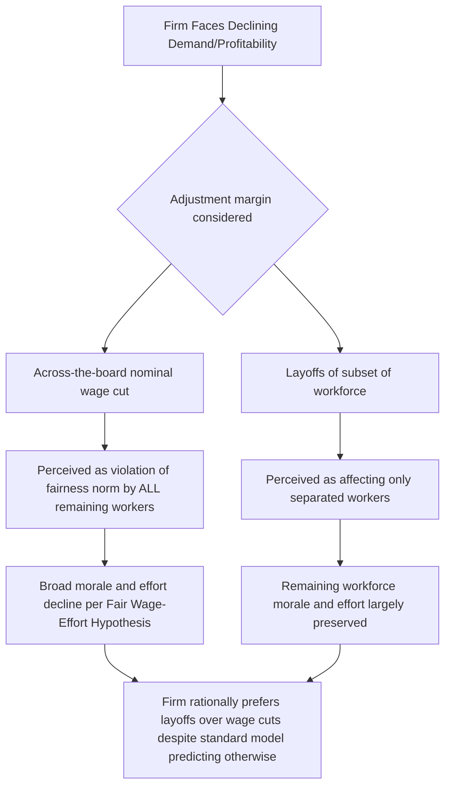

## Fairness Norms in Wage Setting

### Definitional Overview

Fairness norms in wage setting examine how perceptions of distributive and procedural fairness — rather than pure market-clearing supply-and-demand forces — constrain employer wage-setting behavior, generating outcomes such as downward nominal wage rigidity, compressed internal pay structures, and employer reluctance to cut wages even during clear excess-labor-supply conditions.

**Key Points**

- The central empirical puzzle motivating this literature is that nominal wage cuts are rare even during recessions with high unemployment, a pattern difficult to reconcile with a pure spot-market model where wages should adjust downward to clear excess labor supply
- Truman Bewley's extensive interview-based research with actual managers found that fairness concerns and morale effects, not contract or menu-cost frictions, were the dominant reason managers cited for avoiding wage cuts
- Akerlof and Yellen's **fair wage-effort hypothesis** formalizes the link between perceived wage fairness and worker effort, providing a theoretical microfoundation for why firms might rationally choose not to cut wages to the market-clearing level even absent any institutional or contractual constraint

### Bewley's Interview-Based Evidence

**Truman Bewley (1999, "Why Wages Don't Fall During a Recession")** conducted structured interviews with several hundred business executives, labor leaders, and unemployment counselors, primarily during and after the early-1990s U.S. recession, seeking a direct qualitative account of why observed nominal wage cuts were so much rarer than the pure excess-supply logic would predict.

**Key findings**:

- Managers overwhelmingly cited concerns about **worker morale** as the primary reason for avoiding wage cuts, rather than menu costs, union contracts, minimum wage floors, or efficiency-wage-style shirking deterrence per se
- Cutting wages was reported to damage morale not merely through the direct loss of income but through a perceived **violation of an implicit fairness norm** — workers evaluate wage changes relative to a reference point (often the previous wage, or wages of comparable workers/firms), and a cut below that reference point is perceived as a hostile or unfair act by the employer even if objectively justified by declining firm profitability or a weak labor market
- Layoffs were consistently preferred by managers over across-the-board wage cuts as the adjustment margin during downturns, because layoffs affect only a subset of the workforce (the "outsiders" being separated) and, in the managers' account, are perceived as less damaging to the morale and effort of the *remaining* workforce than a uniform wage cut that signals disrespect toward everyone still employed — this preference for **quantity adjustment (layoffs) over price adjustment (wage cuts)** is a central stylized fact this literature seeks to explain
- [Unverified] Bewley's methodology is interview-based rather than a large-sample randomized or quasi-experimental design; while highly influential and widely cited, some economists have raised standard concerns about interview-based evidence (small samples, potential interviewer-effect biases, and difficulty of falsification) relative to the quantitative/experimental identification strategies more common elsewhere in labor economics

### The Fair Wage-Effort Hypothesis (Akerlof and Yellen)

**Akerlof and Yellen (1990)** formalize the morale-effort link with a model in which worker effort $e$ is a function of the ratio between the wage actually paid $w$ and a perceived "fair" reference wage $w^f$:

$$e = e\left(\frac{w}{w^f}\right), \quad e' \geq 0 \text{ for } w \leq w^f$$

with $e(1) $ often normalized such that full/normal effort is provided when $w = w^f$, and effort falling off (workers withhold effort, e.g., through reduced diligence, increased shirking, or passive resistance) as the ratio $w/w^f$ falls below one. Crucially, once $w \geq w^f$, additional wage increases are assumed to generate little or no further effort gain (a form of satiation), meaning firms have no incentive to pay *above* the fair wage, but strong incentive to avoid paying *below* it.

**The reference wage $w^f$** can be constructed from several possible sources depending on the specific application:

- The worker's own previous wage at the same firm (historical/internal reference point)
- Wages paid to comparable workers within the same firm (internal equity/pay-comparison reference point — closely related to **relative deprivation** and **social comparison** theories in organizational behavior)
- Wages paid for comparable jobs at other firms or in the broader labor market (external/market reference point)
- A weighted combination reflecting the relative salience of internal versus external comparisons, which the model treats as an empirical parameter rather than deriving from first principles

**Firm's optimization under fair-wage constraint**: A firm minimizing labor cost per efficiency unit of effort chooses $w$ to minimize $w / e(w/w^f)$, which (under standard shirking/effort-elasticity assumptions, paralleling the Solow condition in efficiency wage theory) can yield an interior optimum at $w = w^f$ exactly — the firm finds it privately optimal to pay precisely the fair wage rather than either a lower wage (accepting an effort penalty) or a market-clearing wage below $w^f$ that would trigger effort withdrawal disproportionate to the cost savings.

### Diagram: Fair Wage-Effort Relationship

<svg xmlns="http://www.w3.org/2000/svg" viewBox="0 0 680 400" font-family="Helvetica, Arial, sans-serif">
<text x="340" y="28" text-anchor="middle" font-size="16" font-weight="bold" fill="#1a1a1a">Fair Wage-Effort Hypothesis (svg_diagram)</text>
<line x1="80" y1="340" x2="620" y2="340" stroke="#333" stroke-width="2" />
<line x1="80" y1="340" x2="80" y2="60" stroke="#333" stroke-width="2" />
<text x="350" y="370" text-anchor="middle" font-size="13" fill="#333">Wage / Fair Wage Ratio (w / w^f)</text>
<text x="35" y="200" text-anchor="middle" font-size="13" fill="#333" transform="rotate(-90 35 200)">Effort (e)</text>
<line x1="340" y1="340" x2="340" y2="60" stroke="#999" stroke-width="1" stroke-dasharray="4,4" />
<text x="345" y="72" font-size="11" fill="#666">w = w^f</text>

<path d="M 120 320 Q 250 250, 340 150 Q 430 110, 600 100" fill="none" stroke="#2255aa" stroke-width="3" />
<text x="150" y="300" font-size="12" fill="#2255aa">Steep effort penalty</text>
<text x="150" y="315" font-size="12" fill="#2255aa">below fair wage</text>
<text x="430" y="95" font-size="12" fill="#2255aa">Effort satiates above fair wage</text>
<circle cx="340" cy="150" r="4" fill="#aa2222" />
<text x="350" y="145" font-size="11" fill="#aa2222">Firm's optimal choice: w = w^f</text>
</svg>

### Reference Points and Social Comparison

The fair-wage literature draws heavily on social comparison theory from psychology and organizational behavior, positing that workers do not evaluate their wage in isolation but relative to relevant comparison groups:

- **Internal equity concerns**: pay compression within firms (smaller gaps between highest- and lowest-paid workers than a pure marginal-product model would predict) is partly attributed to firms' desire to avoid triggering fairness-based effort withdrawal among lower-paid workers who compare themselves to higher-paid colleagues
- **Card, Mas, Moretti, and Saez (2012)** provide direct experimental evidence: random disclosure of co-worker salary information to University of California employees caused workers paid below the median for their pay unit and occupation to report lower job satisfaction and search intentions, while workers paid above median showed no significant positive effect — an asymmetric response consistent with loss-averse, reference-dependent evaluation of relative pay rather than a symmetric social-comparison effect
- [Inference] This asymmetry (negative effects of unfavorable comparison outweighing any positive effect of favorable comparison) is broadly consistent with the loss-aversion structure embedded in prospect-theory-based models discussed elsewhere in the behavioral labor economics literature, suggesting some underlying theoretical unification across these related but historically separate literatures

### Diagram: Fairness Norms and the Wage-Cut Avoidance Decision

### Distinguishing Fairness Explanations from Alternative Theories

A recurring methodological challenge is separating the fair-wage-effort explanation for wage rigidity from competing explanations that can generate similar reduced-form predictions:

| Competing Theory | Mechanism | Distinguishing Prediction |
| --- | --- | --- |
| Fair wage-effort (Akerlof-Yellen) | Effort withdrawal in response to perceived unfair wage cuts | Rigidity should be more severe where effort/output is harder to monitor |
| Standard efficiency wage (Shapiro-Stiglitz) | Wage cuts reduce cost of job loss, increasing shirking incentive independent of fairness perception | Rigidity should track unemployment-benefit generosity and monitoring technology, not fairness framing per se |
| Implicit contract theory | Risk-averse workers and risk-neutral firms agree to insure wages against demand shocks in exchange for accepting layoff risk | Rigidity should be strongest in long-term, stable employment relationships with implicit insurance value |
| Menu costs / nominal rigidity (macro) | Costly to renegotiate/recontract nominal wages frequently | Rigidity should be primarily nominal (not real) and correlate with inflation environment |

[Inference] These explanations are not mutually exclusive and are widely viewed in the literature as complementary rather than competing in a strict sense; most researchers now treat downward wage rigidity as a multiply-determined phenomenon with fairness norms constituting one credible and empirically well-supported contributing channel rather than the sole explanation.

### Empirical Evidence Beyond Bewley's Interviews

- **Survey-based studies** in multiple countries (following Bewley's approach but with larger, more structured samples) have generally replicated the finding that managers cite morale/fairness concerns as a leading rationale for wage rigidity, lending some robustness to the qualitative finding beyond Bewley's original sample
- **Kahneman, Knetsch, and Thaler (1986)** conducted survey experiments asking respondents to judge the fairness of hypothetical firm pricing and wage-setting actions (e.g., a firm cutting wages when facing weaker local labor market conditions versus a firm cutting wages purely to increase profits despite unchanged market conditions) and found that respondents judged wage cuts motivated by profit-seeking (rather than by external market necessity) as substantially less fair — suggesting the *perceived justification* for a wage cut, not merely its magnitude, affects the fairness-violation response, a nuance the simpler Akerlof-Yellen formal model does not fully capture on its own
- Payroll/administrative micro-data studies (using large linked employer-employee datasets) generally confirm a sharp spike (bunching) at exactly zero in the distribution of year-over-year individual nominal wage changes, consistent with strong downward nominal wage rigidity, though the specific *causal* attribution of this bunching to fairness norms versus alternative explanations (menu costs, minimum wage floors, staggered contracting) remains an identification challenge across this literature

### Policy and Organizational Implications

**Key Points**

- Firms designing compensation systems, particularly regarding pay transparency policies, face a fairness-related trade-off: transparency can improve perceived procedural fairness and reduce suspicion of unjustified disparities, but (per the Card-Mas-Moretti-Saez asymmetric-response finding) may also generate morale costs among below-median earners that firms must weigh against transparency's other benefits
- The fair-wage-effort framework provides a partial theoretical rationale for why minimum wage increases in some empirical settings do not generate the straightforward employment losses that a pure competitive-market model predicts — if a wage floor also raises perceived fairness/morale and effort among low-wage workers, some of the direct labor-cost increase from a minimum wage hike may be offset by effort gains, though this remains one of several competing explanations for the broader minimum-wage employment-effects debate and is not the consensus primary explanation
- [Speculation] As pay transparency mandates become more common in several jurisdictions, this may generate a useful new wave of natural-experiment evidence on fair-wage-effort dynamics at scale, though this is a forward-looking research opportunity rather than an established empirical finding at present

### Related Topics

- Downward Nominal Wage Rigidity and Bunching at Zero
- Efficiency Wage Theory (Shapiro-Stiglitz Shirking Model)
- Implicit Contract Theory and Wage Insurance
- Pay Transparency and Employee Morale (Card, Mas, Moretti, and Saez)
- Reference Dependence and Loss Aversion in Labor Supply
- Interindustry Wage Differentials and Rent-Sharing
- Minimum Wage Employment Effects Debate
- Internal Labor Markets and Pay Compression