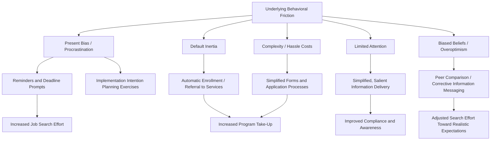

## Behavioral Interventions in Labor Market Policy

### Definitional Overview

Behavioral interventions in labor market policy refer to the design and evaluation of low-cost "nudge"-style policy tools that leverage insights from behavioral economics — default effects, present bias, limited attention, social norms, and simplified choice architecture — to improve labor market outcomes such as job search effort, unemployment insurance take-up, program enrollment, and job-finding rates, typically without altering the underlying financial incentives that traditional policy instruments rely upon.

**Key Points**

- Behavioral interventions are distinguished from traditional labor market policy (wage subsidies, UI benefit levels, training program funding) by their focus on *choice architecture and information delivery* rather than *changing relative prices or budget constraints*
- The theoretical motivation draws directly on the behavioral labor economics literatures already covered in this chapter: bounded rationality in job search, present bias, and reference dependence all imply specific, targeted policy levers distinct from what a purely neoclassical model would recommend
- A large share of the empirical evidence in this area comes from large-scale field experiments and randomized controlled trials (RCTs) conducted in partnership with public employment services, reflecting this subfield's close ties to applied experimental economics methodology

### Taxonomy of Behavioral Intervention Types

**1. Default and Choice-Architecture Interventions**

Interventions that change the default option a person receives absent active choice, exploiting well-documented default-option inertia:

- Automatic enrollment in job-search assistance programs or training programs (rather than requiring active opt-in application)
- Automatic referral/scheduling of unemployment insurance claimants to reemployment services, rather than requiring self-initiated sign-up
- Pre-filled or simplified application forms for social benefits, reducing the "hassle cost" (a documented behavioral friction distinct from pure information gaps) of program take-up

**2. Reminders and Deadline/Planning Prompts**

Interventions targeting present bias and limited attention/procrastination directly:

- Text message or letter reminders sent to unemployment insurance claimants prompting job search actions, appointment attendance, or deadline awareness
- Structured "implementation intention" planning prompts, in which claimants are asked to specify concrete plans (which employers to contact, when, and how) rather than a vague general intention to search, exploiting evidence from psychology that concrete implementation plans are more likely to be executed than abstract goals

**3. Social Norm and Peer Comparison Messaging**

Interventions that convey information about peer behavior or social norms to influence individual behavior:

- Informing job seekers of typical search intensity or job-finding rates among comparable peers, intended to correct potential misperceptions (see biased-beliefs literature) or invoke descriptive social-norm pressure
- [Inference] The effectiveness of norm-based messaging in labor market settings appears more mixed and context-dependent in the literature than in some other behavioral policy domains (e.g., energy conservation, where norm messaging has a more established evidence base), possibly because job search behavior is less publicly observable and comparison-salient than the behaviors targeted in those other domains

**4. Simplified Information and Reduced Complexity**

Interventions that reduce the cognitive/administrative burden of understanding program rules or requirements:

- Simplifying UI benefit communication materials to increase comprehension of job-search requirements and reduce inadvertent non-compliance
- Streamlined, jargon-reduced explanations of program eligibility criteria for training vouchers or wage subsidies, addressing the finding (noted in the discussion of wage subsidies elsewhere in this chapter) that low take-up is often partly attributable to complexity rather than lack of interest

### Diagram: Behavioral Intervention Types Mapped to Underlying Bias

### Landmark Field Experiments

**1. Job Search Reminders and Planning (Various Public Employment Service RCTs)**

Several large-scale RCTs conducted in partnership with national employment services (including studies in France, the U.S., and other OECD countries) have tested SMS/text-message reminders and structured search-planning tools among UI claimants.

**Example**

In a representative design of this type, a public employment service randomly assigns a subset of new UI claimants to receive weekly text-message reminders prompting a specific number of job applications and a link to a simple online planning tool, compared to a control group receiving standard services only. Typical findings across studies of this design show modest but sometimes statistically significant increases in exit rates from unemployment or reductions in average unemployment duration for treated groups, generally concentrated in specific claimant subgroups (e.g., those newly unemployed, versus long-term unemployed for whom reminders alone appear insufficient to overcome larger structural barriers). [Unverified — precise effect sizes vary considerably by country, program design, target population, and labor market conditions, and the literature does not support a single universal magnitude]

**2. Behavioral "Nudge Unit" Applications**

Government behavioral insights teams (e.g., the UK's Behavioural Insights Team, sometimes called the "Nudge Unit," and analogous units established in the U.S. and other countries) have run applied trials specifically targeting job-search behavior:

- Trials testing variations in the *framing and timing* of job-search action-planning exercises at the start of a UI claim, generally finding that requiring claimants to specify concrete action plans early in the claim period modestly increases subsequent search activity and exit rates relative to standard, more open-ended service delivery
- [Inference] A recurring theme across this applied literature is that behavioral interventions tend to generate meaningful but modest effect sizes relative to more resource-intensive traditional ALMP tools (e.g., intensive counseling, training programs, or wage subsidies), positioning behavioral "nudges" as a genuinely low-cost complement to, rather than a wholesale substitute for, traditional active labor market policy instruments

**3. Overcoming Take-Up Barriers via Simplification**

Studies of program take-up for tax credits, unemployment benefits, and training vouchers have found that reducing administrative complexity (e.g., pre-populating forms with already-available administrative data, reducing the number of required steps) meaningfully increases take-up among eligible non-participants, addressing the "hassle cost" channel distinct from pure lack of awareness or ineligibility.

### Formal Framework: Behavioral Interventions as Low-Cost Complements to Traditional Policy

Traditional ALMP instruments alter the *effective price* of job search or hiring (e.g., a wage subsidy of size $s$ per the formal treatment in the wage-subsidies section of this chapter). Behavioral interventions, by contrast, can be conceptualized as reducing an implicit "friction cost" $\phi$ that drives a wedge between intended and realized behavior:

$$\text{Realized search effort} = \text{Intended search effort} - \phi(\text{present bias, limited attention, complexity})$$

A behavioral intervention of cost $\kappa$ (typically very low relative to a wage subsidy or training program) reduces $\phi$ directly, generating a behavior change without altering the underlying price/incentive structure at all. This distinguishes the *cost-effectiveness* calculus of behavioral interventions from traditional ALMP: because $\kappa$ is often orders of magnitude smaller than the cost of a wage subsidy or training slot, even a modest effect size can generate a favorable cost-per-outcome ratio, which is frequently the primary policy rationale offered for scaling these interventions, rather than a claim that their *effect sizes* rival traditional instruments.

### Diagram: Cost-Effectiveness Comparison Framework

<svg xmlns="http://www.w3.org/2000/svg" viewBox="0 0 680 400" font-family="Helvetica, Arial, sans-serif">
<text x="340" y="28" text-anchor="middle" font-size="16" font-weight="bold" fill="#1a1a1a">Cost vs. Effect Size: Behavioral vs. Traditional ALMP (svg_diagram)</text>
<line x1="80" y1="340" x2="620" y2="340" stroke="#333" stroke-width="2" />
<line x1="80" y1="340" x2="80" y2="60" stroke="#333" stroke-width="2" />
<text x="350" y="370" text-anchor="middle" font-size="13" fill="#333">Program Cost per Participant</text>
<text x="35" y="200" text-anchor="middle" font-size="13" fill="#333" transform="rotate(-90 35 200)">Employment Effect Size</text>
<circle cx="150" cy="270" r="10" fill="#2255aa" />
<text x="150" y="300" text-anchor="middle" font-size="11" fill="#2255aa">SMS Reminders</text>
<circle cx="200" cy="250" r="10" fill="#2255aa" />
<text x="200" y="230" text-anchor="middle" font-size="11" fill="#2255aa">Planning Prompts</text>
<circle cx="260" cy="230" r="10" fill="#2255aa" />
<text x="290" y="235" text-anchor="middle" font-size="11" fill="#2255aa">Simplified Forms</text>
<circle cx="420" cy="170" r="14" fill="#aa2222" />
<text x="420" y="145" text-anchor="middle" font-size="11" fill="#aa2222">Intensive Counseling</text>
<circle cx="520" cy="120" r="16" fill="#aa2222" />
<text x="520" y="100" text-anchor="middle" font-size="11" fill="#aa2222">Training Programs</text>
<circle cx="470" cy="150" r="13" fill="#aa2222" />
<text x="470" y="185" text-anchor="middle" font-size="11" fill="#aa2222">Wage Subsidies</text>

<text x="200" y="380" font-size="11" fill="#666">Low cost, modest effect</text>

<text x="480" y="60" font-size="11" fill="#666">Higher cost, larger effect (typically)</text>

</svg>

### Limitations and Critiques

**Key Points**

- Behavioral interventions generally show **heterogeneous effects across subgroups**, often being more effective for recently unemployed or higher-attachment workers than for long-term unemployed or those facing more severe structural barriers (skills mismatch, health limitations, discrimination), limiting their usefulness as a stand-alone solution to persistent unemployment
- **Effect decay and scaling concerns**: some interventions that show strong effects in initial small-scale trials exhibit attenuated effects when scaled to full-population implementation, a general concern in applied behavioral economics policy work sometimes termed the "voltage effect" — attributed to factors including initial-trial novelty effects, less-careful implementation fidelity at scale, and selection differences between initial trial participants and the full target population
- **Equity concerns**: reliance on default-based interventions raises normative questions about the appropriate degree of paternalism in public policy, and there is ongoing debate (connected to the broader "libertarian paternalism" / nudge literature originating with Thaler and Sunstein) about whether behavioral interventions that exploit decision-making frictions are appropriately respectful of individual autonomy, even when demonstrably welfare-improving on average
- [Speculation] As more countries build permanent behavioral insights units embedded within public employment services, a plausible future direction is increased use of adaptive/personalized intervention targeting (delivering different behavioral treatments to different claimant subgroups based on predicted responsiveness), though this raises its own data-privacy and algorithmic-fairness considerations that are not yet fully resolved in current policy practice

### Integration with Traditional Active Labor Market Policy

Behavioral interventions are increasingly framed in the policy literature not as a replacement for traditional ALMP instruments (wage subsidies, training, job search assistance — as covered elsewhere in this chapter) but as a low-cost layer that can improve the *delivery and take-up efficiency* of those traditional instruments:

- Combining automatic enrollment in job-search assistance with behaviorally-informed reminder sequences has been argued to improve overall program effectiveness relative to either element alone
- Behavioral insights into stigma effects (see the wage-subsidies section) suggest that how a targeted hiring credit or training program is *framed and communicated* to both employers and workers may materially affect take-up and effectiveness independent of the underlying financial parameters of the program
- [Inference] The most credible current synthesis view in the literature treats behavioral and traditional ALMP tools as complements along a policy toolkit, with behavioral interventions offering a particularly favorable cost-effectiveness ratio for addressing specific, well-diagnosed frictions (procrastination, complexity, misperception) rather than as a general substitute for addressing demand-side labor market conditions or genuine skill deficits

### Related Topics

- Bounded Rationality in Job Search
- Present Bias in Retirement and Savings Decisions (Analogous Default/Commitment Mechanisms)
- Wage Subsidies and Hiring Credits (Take-Up and Stigma Effects)
- Libertarian Paternalism and Nudge Theory (Thaler and Sunstein)
- Randomized Controlled Trials in Labor Market Policy Evaluation
- Job Search Assistance and Public Employment Service Design
- Unemployment Insurance Design and Moral Hazard
- Implementation Intentions and Goal-Setting Psychology