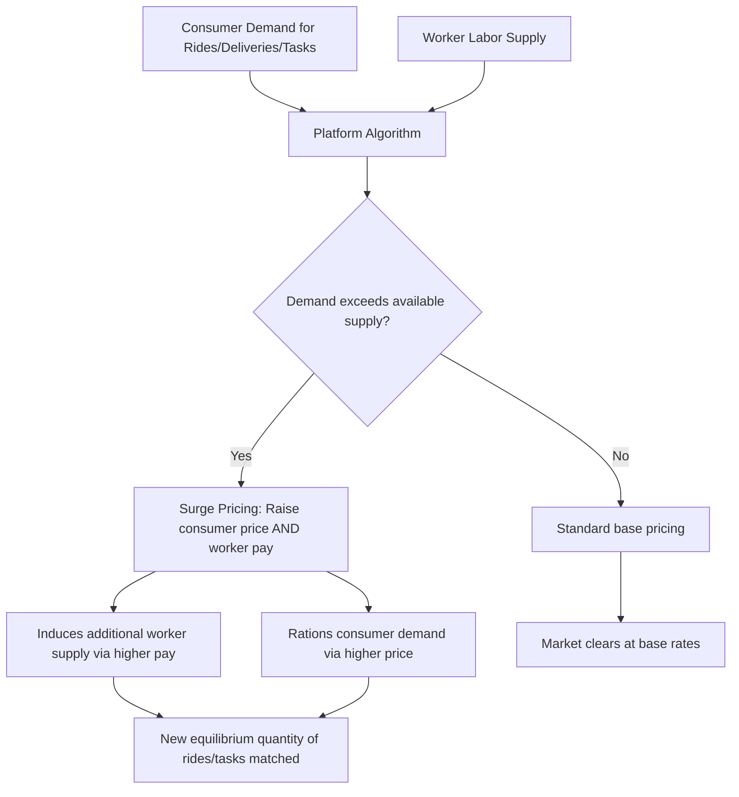

## Platform Based and Gig Work

### Definitional Overview

Platform-based and gig work refers to labor arrangements intermediated by digital platforms that match workers with discrete tasks, rides, deliveries, or short-term projects, typically under independent-contractor rather than employee classification. This chapter topic sits at the intersection of labor economics, industrial organization (two-sided markets), and labor law, and has generated a substantial body of research since the mid-2010s expansion of ride-hailing, delivery, and task-based platforms.

**Key Points**

- Platform work is most precisely characterized as a subset of the broader category of **nonstandard work arrangements** (which also includes temporary help agency work, on-call work, and independent contracting more generally), distinguished specifically by algorithmic matching and monitoring conducted through a digital platform intermediary
- A central economic feature of most labor platforms is that they operate as **two-sided markets**, simultaneously setting prices/wages to balance worker supply against consumer/client demand, which generates distinctive dynamic pricing and labor supply phenomena not present in standard employment relationships
- The employment classification question (employee vs. independent contractor) is not merely a legal technicality but has first-order economic consequences for benefits eligibility, minimum wage/overtime coverage, unemployment insurance access, and the incidence of employer payroll obligations, making it one of the most consequential and contested policy questions in this literature

### Two-Sided Market Structure and Dynamic Pricing

Platforms such as ride-hailing and delivery services function as two-sided markets connecting workers (supply side) and consumers (demand side), with the platform setting prices on both sides and often algorithmically adjusting the worker-side wage/pay rate in real time to balance supply and demand.

**Surge/dynamic pricing formalization**: Let $D(p)$ represent consumer demand as a function of price $p$, and $S(w)$ represent worker labor supply as a function of the pay rate $w$ offered. In a standard static two-sided-market clearing model, the platform (or a competitive equilibrium mechanism approximating one) sets $p$ and $w$ such that:

$$D(p) = S(w)$$

with the platform's take rate $\tau$ satisfying $p = w(1 + \tau)$ or an equivalent margin structure. During periods of unusually high demand relative to available worker supply (e.g., weather events, major public events, peak commuting hours), the algorithm raises both $p$ and $w$ simultaneously to induce additional worker labor supply (via the intertemporal substitution channel discussed in the standard labor supply literature) while rationing demand via the higher consumer price.

[Inference] Whether observed platform worker labor supply responds to short-run pay-rate surges in the manner a standard intertemporal-substitution model predicts, or instead shows patterns more consistent with the reference-dependent "income-targeting" behavior discussed in the reference-dependence chapter section (given the close conceptual parallel to the original taxi-driver studies), is itself an active area of platform-specific empirical research, with some studies finding support for standard substitution effects and others finding evidence more consistent with target-earning or habit-based stopping rules — the underlying empirical debate closely mirrors the taxi-driver literature discussed elsewhere in this course, now revisited with substantially richer platform-generated administrative data.

### Diagram: Platform Two-Sided Market Mechanics

### Worker Classification: Employee vs. Independent Contractor

The classification question determines which legal and regulatory frameworks apply to the working relationship, with substantial economic stakes for both platforms and workers.

**Standard multi-factor tests** used across jurisdictions typically examine:

- Degree of control the platform exercises over how, when, and where work is performed
- Whether the work performed is integral to the platform's core business
- Whether the worker has genuine opportunity for profit/loss through independent business judgment (e.g., working for multiple platforms simultaneously, controlling pricing)
- Permanence/exclusivity of the working relationship
- Whether the worker supplies their own tools/equipment (e.g., vehicle, phone)

**The "ABC test"** (adopted in several U.S. states, most prominently California via AB5, and contested/modified through subsequent ballot measures such as Proposition 22) presumes worker status as employee unless the hiring entity demonstrates all three of:

- (A) the worker is free from control and direction in performing the work
- (B) the work performed is outside the usual course of the hiring entity's business
- (C) the worker is customarily engaged in an independently established trade, occupation, or business of the same nature

[Unverified] Legal and regulatory treatment of platform worker classification varies substantially and continues to evolve across jurisdictions (with the EU's 2024 Platform Work Directive representing a significant multinational regulatory development), so any specific jurisdictional description should be verified against current law given the pace of legislative and judicial change in this area.

### Economic Consequences of Classification

| Dimension | Employee Classification | Independent Contractor Classification |
| --- | --- | --- |
| Minimum wage / overtime coverage | Typically covered under standard labor law | Typically exempt |
| Unemployment insurance | Employer contributes; worker eligible for benefits if separated | Generally ineligible unless specific state/platform program exists |
| Payroll tax incidence | Shared between employer and worker (e.g., FICA in the U.S.) | Worker bears full self-employment tax burden |
| Workers' compensation | Typically covered | Typically not covered absent specific arrangement |
| Flexibility over hours/schedule | May be more constrained depending on employer scheduling practices | Platforms typically emphasize worker discretion over when/whether to work as a defining, legally relevant feature |
| Benefits (health insurance, retirement) | Often employer-sponsored | Not provided by platform absent specific portable-benefits arrangement |

**Key Points**

- Platforms have generally argued that the flexibility/autonomy dimension (workers choosing their own hours with no minimum shift requirement) is a defining economic feature that both benefits workers directly and supports independent-contractor classification under most legal tests
- Worker advocates and some researchers argue that algorithmic control over pricing, task assignment, performance ratings, and platform access (e.g., deactivation policies) constitutes a substantial degree of *de facto* control inconsistent with genuine independent-contractor status regardless of the nominal scheduling flexibility
- **Portable benefits proposals** — mechanisms allowing benefits (retirement contributions, paid leave accrual, workers' compensation-style insurance) to accrue to a worker across multiple platforms/gigs rather than being tied to a single employer — have been proposed as a policy compromise attempting to extend some employee-like protections without requiring full employee reclassification, and several pilot programs and state-level statutes have begun testing this model

### Earnings Volatility and Income Instability

A distinguishing empirical feature of platform work relative to standard employment is substantially higher **within-worker earnings volatility**, both at the daily/weekly level (driven by demand fluctuations and algorithmic pay-rate variation) and at the longer-run level (driven by platform policy changes, market entry/exit of competing platforms, and algorithm updates affecting task allocation or pay structure).

- Studies using platform-provided or linked administrative earnings data (e.g., studies using JPMorgan Chase Institute banking-transaction data on gig platform income flows) generally find substantially higher month-to-month income volatility for platform workers relative to comparable traditional-employment workers, even after controlling for hours worked
- [Inference] This volatility has motivated research interest in whether platform work functions primarily as a **primary income source** for a subset of workers versus a **supplemental/buffer income source** used opportunistically to smooth consumption during income shortfalls from a primary job — survey and administrative evidence suggests substantial heterogeneity in this regard across the platform worker population, with the "supplemental income" pattern appearing common for a significant share of workers on many platforms, though the precise split varies by platform type and study

### Algorithmic Management

A defining feature of platform-based gig work relative to traditional independent contracting is **algorithmic management** — the use of automated systems to assign tasks, set pay rates, monitor performance, and make deactivation/access decisions with limited or no direct human supervisory interaction.

**Key mechanisms studied in the literature**:

- **Algorithmic task allocation**: which workers receive which ride/delivery/task requests, often based on proximity, historical performance ratings, and acceptance-rate metrics, raising questions about transparency and potential disparate impact across worker demographics
- **Dynamic and often opaque pay-rate determination**: workers frequently report limited visibility into how specific trip/task pay rates are calculated, which several researchers argue itself constitutes a distinct source of bounded-rationality-relevant friction (workers cannot form fully rational expectations about earnings when the pay-determination process is not transparent to them)
- **Rating-based reputation systems and deactivation risk**: customer/client ratings feeding into continued platform access create a form of ongoing performance monitoring functionally analogous to (but institutionally distinct from) traditional employee performance review, generating debate about whether this constitutes the kind of "control" relevant to employment-classification legal tests

### Diagram: Algorithmic Management Feedback Loop

<svg xmlns="http://www.w3.org/2000/svg" viewBox="0 0 700 400" font-family="Helvetica, Arial, sans-serif">

<text x="350" y="28" text-anchor="middle" font-size="16" font-weight="bold" fill="`#1a1a1a`">Algorithmic Management Feedback Loop (svg_diagram)</text>

<rect x="270" y="50" width="160" height="45" rx="6" fill="`#eeeeee`" stroke="#333" stroke-width="1.5" />

<text x="350" y="77" text-anchor="middle" font-size="13" fill="#111">Platform Algorithm</text>

<rect x="60" y="160" width="150" height="55" rx="6" fill="`#e8f0fd`" stroke="`#3355aa`" stroke-width="1.5" />

<text x="135" y="185" text-anchor="middle" font-size="12" font-weight="bold" fill="`#3355aa`">Task Assignment</text>

<text x="135" y="202" text-anchor="middle" font-size="10" fill="#333">Based on proximity, rating, history</text>

<rect x="270" y="160" width="150" height="55" rx="6" fill="`#fdf3e8`" stroke="`#aa7722`" stroke-width="1.5" />

<text x="345" y="185" text-anchor="middle" font-size="12" font-weight="bold" fill="`#aa7722`">Dynamic Pay Rate</text>

<text x="345" y="202" text-anchor="middle" font-size="10" fill="#333">Often limited worker visibility</text>

<rect x="480" y="160" width="160" height="55" rx="6" fill="`#fde8e8`" stroke="`#aa3333`" stroke-width="1.5" />

<text x="560" y="185" text-anchor="middle" font-size="12" font-weight="bold" fill="`#aa3333`">Rating / Reputation</text>

<text x="560" y="202" text-anchor="middle" font-size="10" fill="#333">Feeds into future task access</text>

<line x1="350" y1="95" x2="135" y2="160" stroke="#666" stroke-width="1.5" />

<line x1="350" y1="95" x2="345" y2="160" stroke="#666" stroke-width="1.5" />

<line x1="350" y1="95" x2="560" y2="160" stroke="#666" stroke-width="1.5" />

<path d="M 560 215 C 560 280, 350 300, 350 95" fill="none" stroke="#999" stroke-width="1.5" stroke-dasharray="5,4" />

<text x="420" y="290" font-size="11" fill="#666">Rating outcomes feed back into future assignment/pay</text>

</svg>

### Empirical Studies of Platform Labor Supply

**Example**

Chen, Chevalier, Rossi, and Oehlsen (2019) studied Uber driver labor supply using platform administrative data combined with a natural experiment (drivers viewing different randomly-assigned earnings-per-trip estimates before accepting rides) to estimate the labor supply elasticity and calculate the surplus drivers derive specifically from scheduling flexibility. Using a structural model comparing drivers' actual flexible-scheduling behavior to a counterfactual fixed-shift regime with the same average pay, the study estimated that flexibility itself constitutes a meaningfully valuable non-wage amenity to drivers — a finding frequently cited in policy debates over the appropriate weight to give scheduling flexibility when evaluating trade-offs against foregone employee benefits under reclassification proposals. [Unverified — a single influential study's structural estimates depend on specific modeling assumptions and a particular time period/platform, and should not be treated as a universal, time-invariant parameter applicable to all platforms or subsequent periods]

### Comparison to Traditional Nonstandard Work Arrangements

- Platform gig work shares several features with older nonstandard work categories (temp agency work, independent contracting, on-call work) studied in the pre-platform-era contingent work literature (Katz and Krueger's broader nonstandard work measurement studies), but is distinguished by the scale, algorithmic mediation, and real-time task-matching capability that digital platforms specifically enable
- [Inference] Some researchers argue platform work represents a genuinely novel labor market institution requiring new theoretical and regulatory frameworks, while others argue it is best understood as a technologically-enabled scaling of long-existing independent-contractor and piece-rate work arrangements without requiring fundamentally new economic theory — this remains a matter of ongoing scholarly and policy debate rather than a settled question

### Policy Landscape and Ongoing Developments

- Jurisdictions have pursued varied approaches: full employee reclassification requirements (parts of the EU under the 2024 Platform Work Directive), hybrid "third category" worker statuses with partial benefits short of full employee status (the UK's "worker" status as applied to platform drivers following the Uber BV v Aslam Supreme Court decision), and ballot-measure-created hybrid statuses preserving contractor classification while mandating specific minimum earnings guarantees and limited benefits (California's Proposition 22)
- Given the genuinely fast-moving and jurisdiction-specific nature of this regulatory landscape, current policy specifics should be verified against up-to-date sources for any jurisdiction of particular interest, since the landscape has changed substantially even within the past several years and continues to evolve

### Related Topics

- Two-Sided Markets and Platform Pricing Theory
- Nonstandard Work Arrangements and Contingent Employment (Katz and Krueger)
- Reference Dependence and Loss Aversion in Labor Supply (Applied to Gig-Worker Earnings Targets)
- Worker Classification Law and the ABC Test
- Portable Benefits Policy Design
- Algorithmic Management and Workplace Surveillance
- Income Volatility and Consumption Smoothing Among Nonstandard Workers
- Minimum Earnings Guarantees and Hybrid Worker Status Models