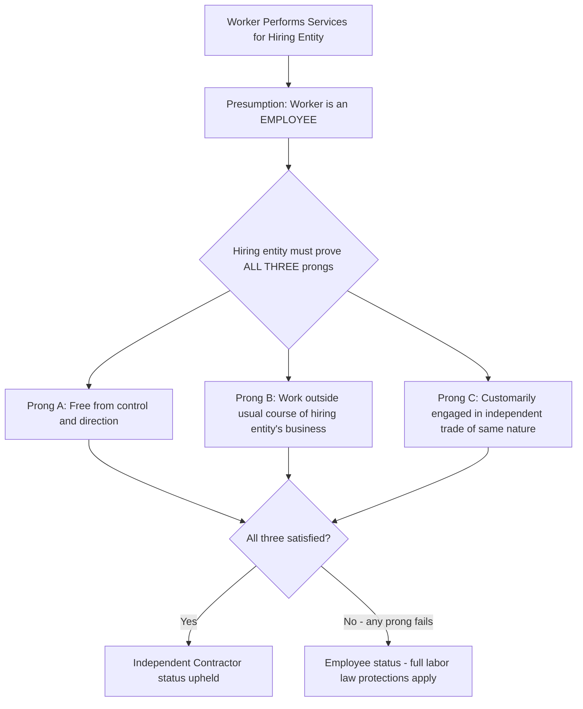

## Independent Contractor Versus Employee Classification

### Definitional Overview

Independent contractor versus employee classification is the legal and economic determination of whether a worker performing labor for a hiring entity is treated as an employee (subject to labor and employment law protections) or as an independent contractor/self-employed business (generally outside those protections). This determination has first-order consequences across nearly every dimension of labor market regulation and has become an increasingly contested area of law and policy with the growth of platform-based gig work, though the underlying legal doctrines substantially predate the platform economy.

**Key Points**

- Classification is not a single unified legal standard but varies by the specific statute or purpose at issue (tax law, wage-and-hour law, unemployment insurance, workers' compensation, collective bargaining rights), meaning the *same* worker can potentially be classified differently depending on which specific legal question is being asked
- The economic stakes of classification are substantial: employee status typically triggers minimum wage/overtime coverage, unemployment insurance eligibility, workers' compensation coverage, employer-side payroll tax contributions, and in many jurisdictions collective bargaining rights, none of which generally attach to independent contractor status
- From an economic perspective, misclassification (whether a worker is functionally an employee but classified as a contractor) has been argued to create cost advantages for firms that misclassify relative to compliant competitors, motivating both regulatory enforcement interest and a body of empirical research estimating the prevalence and effects of misclassification

### Legal Tests for Classification

**1. Common Law Control Test**

The traditional multi-factor test derived from agency law, historically the default standard in the U.S. absent a specific statutory test, examines the degree of control the hiring entity exercises, including:

- Behavioral control (instructions on how, when, and where to perform work)
- Financial control (method of payment, reimbursement of expenses, opportunity for profit or loss)
- Type of relationship (presence of a written contract, provision of benefits, permanency of the relationship, whether the work performed is a key aspect of the business)

**2. Economic Realities Test**

Used primarily under the U.S. Fair Labor Standards Act (FLSA) for wage-and-hour purposes, this test asks whether the worker is, as a matter of "economic reality," dependent on the hiring business or in business for themselves, typically considering:

- The degree of control exercised by the employer
- The worker's opportunity for profit or loss depending on managerial skill
- The worker's investment in equipment or materials
- Whether the work requires special skill
- The permanency of the working relationship
- Whether the work performed is integral to the employer's business

**3. The ABC Test**

A more restrictive, employee-presumptive test adopted for various purposes in several U.S. states (most prominently codified for broad application in California via Assembly Bill 5, following the California Supreme Court's *Dynamex Operations West, Inc. v. Superior Court* (2018) decision) and used for unemployment insurance purposes in numerous other states. Under the ABC test, a worker is presumed to be an employee unless the hiring entity establishes **all three** of the following:

$$\text{Independent Contractor Status} \iff A \land B \land C$$

- **(A)** The worker is free from the control and direction of the hiring entity in connection with the performance of the work, both under the contract and in fact
- **(B)** The worker performs work that is outside the usual course of the hiring entity's business
- **(C)** The worker is customarily engaged in an independently established trade, occupation, or business of the same nature as the work performed

**Key distinguishing feature of the ABC test**: Prong (B) is particularly consequential for platform-based gig work, since a ride-hailing platform's "usual course of business" plausibly *is* providing rides, making it structurally difficult for such platforms to satisfy prong (B) — a central legal vulnerability that motivated significant platform-industry political and legal opposition to broad ABC-test adoption, most visibly through California's Proposition 22 ballot initiative (2020), which created a specific carve-out preserving contractor status for app-based drivers while mandating certain minimum earnings and limited benefit guarantees.

### Diagram: Classification Test Decision Logic (ABC Test)

### Economic Consequences of Classification

| Dimension | Employee | Independent Contractor |
| --- | --- | --- |
| Minimum wage / overtime (FLSA-type coverage) | Covered | Not covered |
| Employer payroll tax contribution | Employer pays share (e.g., FICA employer portion in the U.S.) | Worker pays full self-employment tax |
| Unemployment insurance | Employer contributes; worker eligible upon qualifying separation | Generally ineligible absent specific state program |
| Workers' compensation | Employer-provided coverage typically mandatory | Not covered absent specific arrangement |
| Collective bargaining rights (e.g., NLRA coverage in the U.S.) | Generally covered | Generally excluded (antitrust law also complicates independent contractor collective action, since price-fixing concerns can apply to independent businesses coordinating on rates) |
| Anti-discrimination statute coverage | Generally covered | Often excluded or coverage uncertain |
| Employer cost per hour of labor, holding take-home pay constant | Higher (due to mandatory contributions, benefits, compliance costs) | Lower |

**Key Points**

- The final row is central to the economic theory of why misclassification (or lobbying for contractor-favorable classification rules) can be privately profitable for firms: shifting the same nominal take-home pay from employee to contractor status reduces the firm's total labor cost by the value of the avoided mandatory contributions and protections, creating a clear pecuniary incentive independent of any genuine change in the underlying work relationship
- This cost differential is the core economic rationale underlying **misclassification enforcement** efforts by tax and labor authorities, since correctly classifying workers who are functionally employees closes this cost-avoidance channel and is argued to also address an unfair competitive advantage over compliant firms that correctly classify comparable workers as employees

### Economic Theory: Why Classification Rules Matter Beyond Legal Formalism

From a labor economics perspective, the classification question can be analyzed as a case of **regulatory arbitrage** interacting with incomplete contracting:

- If classification were purely a matter of costless, verifiable contractual labeling with no real economic content, firms and workers would simply negotiate around any classification-contingent regulation via compensating differentials — a worker classified as a contractor and thus lacking employer-sponsored benefits would, in a frictionless market, simply demand a correspondingly higher wage to self-purchase equivalent benefits/insurance, restoring an economically equivalent outcome regardless of the legal label
- In practice, this Coasean-bargaining-style equivalence frequently fails due to: information asymmetries (workers may not accurately value or price the benefits they are foregoing), market frictions in individual insurance/benefit markets (which typically offer worse terms than group employer-sponsored plans due to adverse selection and lack of risk pooling, meaning the "compensating differential" a worker would need is often larger than what firms are willing to pay), and bargaining power asymmetries between individual workers and firms/platforms
- [Inference] This market-incompleteness argument is the standard economic justification offered by researchers and policymakers favoring stricter (more employee-presumptive) classification standards, since it implies the classification choice is not merely a costless labeling convention but has genuine welfare consequences for workers who cannot efficiently replicate employer-provided benefits and protections through the individual market — though critics of stricter standards counter that mandatory reclassification can also reduce the flexibility some workers value and may cause net job/hours losses if firms respond to higher compliance costs by reducing worker headcount or task availability, an empirical trade-off examined in several post-AB5-implementation studies with mixed findings across different industries studied

### Empirical Evidence on Misclassification Prevalence and Effects

- U.S. Department of Labor and academic studies using audit and administrative-data-matching methodologies have found non-trivial rates of worker misclassification across various industries (particularly construction, home care, and trucking, predating the platform economy), though [Unverified] precise prevalence estimates vary substantially by industry, time period, and detection methodology, and a single universal misclassification rate should not be assumed
- Studies of California's AB5 implementation and the subsequent Proposition 22 carve-out for app-based transportation and delivery workers provide a relatively well-studied natural experiment on the labor market effects of shifting classification rules for a specific, economically significant worker population, though findings on employment, hours, and pay effects across these studies are not fully uniform and depend on the specific outcome measured, time window studied, and platform/industry examined
- [Inference] The overall empirical literature on this topic remains less settled than the theoretical framework, partly because classification-rule changes are relatively recent (in the platform-work context specifically) and partly because firms' behavioral responses to classification-rule changes (exit, restructuring of the underlying work arrangement, or genuine reclassification with associated cost pass-through to consumers or reduced worker hours) are themselves endogenous margins that complicate clean before/after or diff-in-diff identification strategies

### International and Comparative Approaches

- The **European Union's 2024 Platform Work Directive** establishes a rebuttable presumption of employment status for platform workers meeting certain control-related criteria, representing one of the more comprehensive multinational regulatory responses specifically targeting platform-based classification questions
- The **United Kingdom** has developed an intermediate "worker" status (distinct from both full "employee" and pure independent-contractor "self-employed" categories) that confers some but not all employee-level protections (e.g., minimum wage and paid holiday entitlement, but not full unfair-dismissal protection), as clarified for platform drivers specifically in the UK Supreme Court's *Uber BV v. Aslam* (2021) decision, illustrating an alternative "third category" policy design distinct from the binary employee/contractor choice more common in U.S. law
- [Unverified] Given the genuinely active and fast-evolving state of platform-work classification law across multiple jurisdictions, any specific claim about current legal status in a given country or state should be checked against up-to-date legal sources, since this area has seen substantial legislative and judicial change in recent years and is likely to continue evolving

### Diagram: Classification as a Cost-Shifting Mechanism

<svg xmlns="http://www.w3.org/2000/svg" viewBox="0 0 680 380" font-family="Helvetica, Arial, sans-serif">
<text x="340" y="28" text-anchor="middle" font-size="16" font-weight="bold" fill="#1a1a1a">Classification and the Total Cost of Labor (svg_diagram)</text>
<rect x="80" y="80" width="220" height="240" fill="#e8f0fd" stroke="#3355aa" stroke-width="1.5" />
<text x="190" y="105" text-anchor="middle" font-size="13" font-weight="bold" fill="#3355aa">Employee</text>
<rect x="100" y="120" width="180" height="60" fill="#c9d9f7" stroke="#3355aa" />
<text x="190" y="155" text-anchor="middle" font-size="11" fill="#222">Take-Home Pay</text>
<rect x="100" y="180" width="180" height="50" fill="#8fa8e0" stroke="#3355aa" />
<text x="190" y="209" text-anchor="middle" font-size="11" fill="#222">Payroll Tax + Benefits</text>
<rect x="100" y="230" width="180" height="50" fill="#5c7fc9" stroke="#3355aa" />
<text x="190" y="259" text-anchor="middle" font-size="10" fill="#fff">Workers' Comp / UI</text>
<text x="190" y="340" text-anchor="middle" font-size="12" fill="#333">Higher Total Employer Cost</text>
<rect x="400" y="140" width="220" height="140" fill="#fde8e8" stroke="#aa3333" stroke-width="1.5" />
<text x="510" y="165" text-anchor="middle" font-size="13" font-weight="bold" fill="#aa3333">Independent Contractor</text>
<rect x="420" y="180" width="180" height="80" fill="#f5c2c2" stroke="#aa3333" />
<text x="510" y="225" text-anchor="middle" font-size="11" fill="#222">Take-Home Pay Only</text>
<text x="510" y="320" text-anchor="middle" font-size="12" fill="#333">Lower Total Hiring-Entity Cost</text>
<line x1="300" y1="200" x2="400" y2="200" stroke="#666" stroke-width="1.5" stroke-dasharray="4,3" />
<text x="350" y="190" text-anchor="middle" font-size="10" fill="#666">Cost gap</text>
</svg>

### Related Topics

- Platform-Based and Gig Work Economics
- Two-Sided Markets and Algorithmic Management
- Portable Benefits Policy Design
- Nonstandard Work Arrangements (Katz and Krueger)
- Unemployment Insurance Financing and Eligibility Rules
- Payroll Tax Incidence
- Compensating Wage Differentials for Benefits and Job Security
- Collective Bargaining Rights and Antitrust Constraints on Independent Contractors