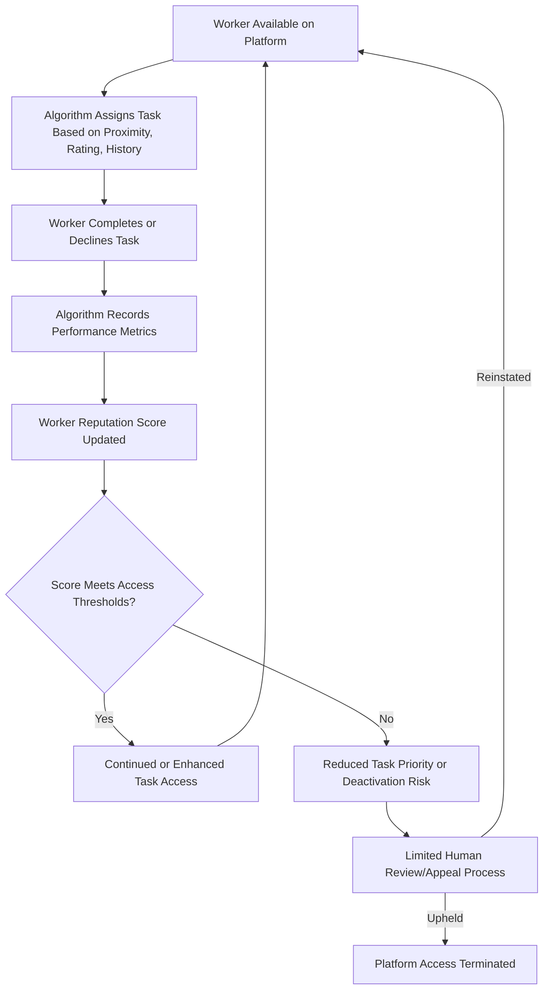

## Algorithmic Management

### Definitional Overview

Algorithmic management refers to the use of software algorithms to perform functions traditionally carried out by human supervisors and managers — task assignment, performance monitoring, pricing/pay determination, scheduling, and disciplinary decisions (including deactivation/termination) — with limited or no direct human involvement in individual case-level decisions. While algorithmic management extends beyond gig platforms into traditional workplaces (warehouse logistics, call centers, delivery services with employee-status workers), it is most extensively studied and most consequential for legal classification purposes in the context of app-based platform work.

**Key Points**

- Algorithmic management is analytically distinct from mere use of software tools in the workplace; the defining feature is that algorithmically-generated outputs (task assignments, ratings-based access decisions, dynamic pay rates) function as the primary or sole mechanism of workplace control and coordination, rather than as a decision-support tool for human managers
- This mode of management raises novel questions in labor economics regarding information asymmetry, principal-agent dynamics, and the applicability of standard efficiency-wage and monitoring-cost models developed originally for human-supervised workplaces
- The opacity of many algorithmic management systems — where workers often cannot observe or verify the criteria underlying task allocation, pay-rate determination, or deactivation decisions — has emerged as a central point of both economic research interest and regulatory concern, distinguishing it from traditional managerial opacity in degree if not always in kind

### Core Functions of Algorithmic Management

**1. Task and Work Allocation**

Algorithms determine which available worker receives which task, ride, or delivery request, typically based on some combination of:

- Geographic proximity to the task location
- Historical performance metrics (acceptance rate, completion rate, customer ratings)
- Worker-side preferences or constraints where the platform allows them to be specified
- Platform-level optimization objectives (e.g., minimizing aggregate wait time, maximizing total completed tasks, or balancing supply across a service area)

**2. Dynamic Pay-Rate and Pricing Determination**

As discussed in the broader platform-work literature, many platforms algorithmically compute both the consumer-facing price and the worker-facing pay rate in real time based on estimated supply-demand conditions, trip/task characteristics, and platform-specific proprietary formulas that are frequently not fully disclosed to workers.

**3. Performance Monitoring and Rating Systems**

Continuous, granular monitoring of worker performance metrics — acceptance rates, completion rates, on-time performance, customer-submitted ratings — aggregated into a worker-level reputation score that determines ongoing platform access, priority in task allocation, and in some cases eligibility for premium task categories or bonus pay structures.

**4. Deactivation and Access Control**

Automated or algorithm-informed decisions to suspend or permanently revoke a worker's platform access, often triggered by rating thresholds, acceptance-rate thresholds, or automated fraud/policy-violation detection, frequently with limited human review or appeal processes, at least in the initial instance.

### Diagram: The Algorithmic Management Control Loop

### Economic Analysis: Monitoring Costs and the Principal-Agent Problem

Standard labor economics models of workplace monitoring (rooted in the same principal-agent and efficiency-wage frameworks discussed elsewhere in this course, e.g., Shapiro-Stiglitz shirking models) assume monitoring is costly and imperfect, generating a trade-off between the cost of increased monitoring intensity and the value of reduced shirking/moral hazard. Algorithmic management is argued by several researchers to fundamentally shift this trade-off:

$$\text{Cost of Monitoring}_{\text{algorithmic}} \ll \text{Cost of Monitoring}_{\text{human supervisor}}$$

per unit of worker-task observed, since digital platforms can costlessly log granular data (GPS location, task timing, completion status, customer feedback) at a scale and precision infeasible for human supervisors to replicate manually. [Inference] This dramatic reduction in the marginal cost of monitoring is argued by several researchers to partially explain why platforms can sustain relatively low base pay rates while still maintaining service quality/reliability standards — the classical efficiency-wage rationale for paying wages above market-clearing to deter shirking is partially substituted by near-costless algorithmic monitoring and immediate consequence (rating impact or deactivation) rather than requiring a wage premium, though this specific causal mechanism is more commonly argued qualitatively in the literature than rigorously structurally estimated.

### Information Asymmetry and Algorithmic Opacity

A distinguishing economic feature of algorithmic management relative to traditional human supervision is the specific character of information asymmetry it generates:

- **Traditional employment relationships**: information asymmetry typically runs primarily from worker to employer (the employer cannot perfectly observe worker effort/ability — the classic moral hazard/adverse selection setup underlying efficiency wage and screening models)
- **Algorithmic management relationships**: an *additional* layer of information asymmetry runs from platform to worker — workers frequently cannot observe or verify the specific criteria, weights, or thresholds the algorithm uses to allocate tasks, set pay rates, or trigger deactivation, even though this information is, in principle, fully known to (and controlled by) the platform
- This bidirectional and asymmetric structure has been argued in several studies to itself constitute a source of the bounded-rationality-relevant frictions discussed elsewhere in this course (workers cannot form fully rational expectations about earnings or continued platform access when the underlying determination process is opaque to them), distinct from but related to the standard job-search and labor-supply bounded rationality literature

**Example**

Consider a platform delivery worker who observes that their per-task pay has declined over recent months despite no change in their own effort, acceptance rate, or working hours. Under full information, the worker could determine whether this reflects a platform-wide algorithm update (affecting all workers equally), a change specific to their local market's supply-demand balance, or a change in their own individual reputation-score-linked pay tier. Under algorithmic opacity, the worker cannot distinguish between these explanations, potentially leading to either misattributed effort responses (e.g., unnecessarily increasing acceptance of low-value tasks fearing a rating-based explanation that is not in fact the true cause) or, alternatively, platform-directed collective action/advocacy efforts premised on incomplete information about the actual underlying cause. [Unverified — this is an illustrative example constructed to demonstrate the mechanism, not a specific documented case]

### Algorithmic Wage Discrimination and Personalized Pricing

A related and more specifically contested area of research concerns whether algorithmic pay determination can constitute a form of **personalized or discriminatory pricing** applied to labor, analogous to consumer-side algorithmic price discrimination:

- If platform algorithms use individual worker-level data (acceptance-rate history, willingness to accept lower-paying tasks in the past, geographic location, or other behavioral signals) to set individually-tailored pay offers rather than a uniform posted rate, this raises the theoretical possibility of algorithmic wage discrimination that extracts worker-specific surplus in a manner analogous to third-degree price discrimination in product markets
- [Unverified] Direct empirical documentation of this specific phenomenon (as opposed to standard surge/demand-based pricing variation, which is not itself discriminatory in this narrower sense) is limited in the public academic literature, in substantial part because the underlying algorithms and worker-level data are proprietary and not generally accessible to independent researchers, making this more of a theoretically motivated concern actively under investigation than a well-quantified empirical finding at present

### Diagram: Information Asymmetry Structure Under Algorithmic Management

<svg xmlns="http://www.w3.org/2000/svg" viewBox="0 0 680 380" font-family="Helvetica, Arial, sans-serif">
<text x="340" y="28" text-anchor="middle" font-size="16" font-weight="bold" fill="#1a1a1a">Bidirectional Information Asymmetry (svg_diagram)</text>
<rect x="80" y="150" width="180" height="80" rx="8" fill="#e8f0fd" stroke="#3355aa" stroke-width="1.5" />
<text x="170" y="195" text-anchor="middle" font-size="13" font-weight="bold" fill="#3355aa">Worker</text>
<rect x="420" y="150" width="180" height="80" rx="8" fill="#fdf3e8" stroke="#aa7722" stroke-width="1.5" />
<text x="510" y="195" text-anchor="middle" font-size="13" font-weight="bold" fill="#aa7722">Platform Algorithm</text>
<line x1="260" y1="175" x2="420" y2="175" stroke="#aa2222" stroke-width="2" />
<path d="M 410 170 L 420 175 L 410 180" fill="none" stroke="#aa2222" stroke-width="2" />
<text x="340" y="160" text-anchor="middle" font-size="11" fill="#aa2222">Effort, location, availability</text>
<text x="340" y="145" text-anchor="middle" font-size="10" fill="#666">(classic worker-to-firm asymmetry)</text>
<line x1="420" y1="210" x2="260" y2="210" stroke="#228833" stroke-width="2" />
<path d="M 270 205 L 260 210 L 270 215" fill="none" stroke="#228833" stroke-width="2" />
<text x="340" y="230" text-anchor="middle" font-size="11" fill="#228833">Pay formula, rating criteria, deactivation thresholds</text>
<text x="340" y="245" text-anchor="middle" font-size="10" fill="#666">(algorithm-to-worker asymmetry - distinctive to this setting)</text>
</svg>

### Regulatory and Legal Responses

- **The EU's 2024 Platform Work Directive** includes specific provisions addressing algorithmic management transparency, requiring platforms to disclose certain information about automated monitoring and decision-making systems to workers and, in some cases, worker representatives, and restricting fully automated decisions on matters such as account suspension without human review
- Several jurisdictions (including specific U.S. state and city-level ordinances, e.g., New York City's minimum pay standard rules for app-based delivery workers) have introduced pay-rate transparency and minimum-earnings-floor requirements partly motivated by algorithmic opacity concerns, requiring platforms to disclose minimum guaranteed compensation structures even where the specific per-task algorithmic calculation remains proprietary
- [Speculation] Given the relatively early and evolving state of algorithmic management-specific regulation as of this writing, it is plausible that additional jurisdiction-specific transparency and human-review requirements will continue to develop, though the specific form and stringency of future regulation in any given jurisdiction is not established and should be verified against current sources for any applied policy question

### Implications for Labor Economics Theory

**Key Points**

- Algorithmic management complicates the standard efficiency-wage framework's clean separation between "monitoring cost" and "wage premium" as substitute mechanisms for inducing effort, since near-costless algorithmic monitoring may substitute for wage premiums in ways that traditional efficiency-wage models (calibrated to an era of costly human supervision) do not fully anticipate
- The bidirectional information asymmetry structure (worker-to-platform in the classical sense, but also platform-to-worker regarding the decision rules themselves) represents a genuinely distinct theoretical wrinkle relative to the standard principal-agent literature, and formal modeling of this bidirectional structure remains a comparatively underdeveloped area relative to the empirical and legal/policy literature on the same topic
- [Inference] As administrative and platform-internal data become more available to researchers (through data-access mandates or voluntary research partnerships), the empirical literature quantifying the precise economic effects of algorithmic management (on wages, effort, worker welfare, and labor market efficiency relative to counterfactual human-managed alternatives) is likely to expand considerably from its current relatively early stage, though this is a reasonable projection about the field's trajectory rather than a documented current finding

### Related Topics

- Platform-Based and Gig Work Economics (Two-Sided Markets and Dynamic Pricing)
- Independent Contractor Versus Employee Classification
- Efficiency Wage Theory and Monitoring Cost Trade-offs (Shapiro-Stiglitz)
- Principal-Agent Theory and Moral Hazard in Employment Relationships
- Bounded Rationality in Job Search (Related Information-Processing Frictions)
- Algorithmic Price Discrimination in Product Markets (Comparative Framework)
- Pay Transparency Regulation
- Worker Data Rights and Platform Accountability Policy