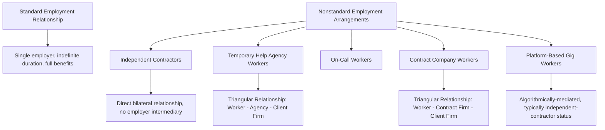

## Nonstandard Employment Arrangements

### Definitional Overview

Nonstandard employment arrangements encompass work relationships that deviate from the traditional standard employment relationship (SER) — defined as full-time, indefinite-duration employment with a single identifiable employer, typically including a standard benefits package and legal employee protections. Nonstandard arrangements include independent contracting, temporary help agency work, on-call work, contract-company work, and, more recently, platform-based gig work, and have been a subject of sustained labor economics research since well before the platform-economy era.

**Key Points**

- The measurement of nonstandard work prevalence has itself been a significant methodological and empirical challenge, since standard labor force surveys were historically designed around the assumption of a single, stable employer-employee relationship and have required supplementary survey instruments to adequately capture nonstandard arrangements
- Katz and Krueger's influential surveys (1995 and 2015, comparing the same survey methodology across two decades) provided some of the most-cited estimates of nonstandard work prevalence and trends in the U.S., though their 2015 findings — implying a substantial increase in nonstandard work share — were later partially disputed following BLS's own contingent worker supplement data showing a more modest trend, illustrating the genuine measurement difficulty in this literature
- Nonstandard work arrangements are heterogeneous along multiple dimensions (duration certainty, number of employers/intermediaries involved, degree of employer control, benefits access) that are frequently collapsed into a single "nonstandard" category in casual discussion but which behave quite differently across labor economics theory and empirical outcomes

### Taxonomy of Nonstandard Work Categories

**1. Independent Contractors / Self-Employed Contractors**

Workers who provide services to client businesses without employee status, ranging from highly-compensated professional consultants to lower-wage contracted service workers (see the classification chapter section for the legal tests governing this categorization).

**2. Temporary Help Agency Workers**

Workers formally employed by a staffing/temp agency but assigned to perform work at a separate client business (a **triangular employment relationship** involving worker, agency, and client firm simultaneously). The agency is typically the legal employer of record for wage and tax purposes, while the client firm directs the day-to-day work.

**3. On-Call Workers**

Workers who are called to work only as needed, often with limited advance notice, without a guarantee of a minimum number of hours (related to, but conceptually distinct from, the broader "just-in-time scheduling" or "unpredictable scheduling" literature examining variable and short-notice work schedules even for nominally standard employees).

**4. Contract Company Workers**

Workers employed by a company that provides them (often as an entire team) to perform services at another company's worksite under a contract between the two firms, distinguished from temp agency work primarily by scale, duration, and the nature of the contractual relationship (e.g., a facilities-management contract company providing an entire janitorial staff to a client building, typically for extended, though still formally time-limited, engagements).

**5. Platform-Based Gig Work**

As discussed extensively elsewhere in this chapter, algorithmically-mediated task/ride/delivery matching, generally structured under independent-contractor classification, representing the most recently emerged and most extensively studied nonstandard category.

### Diagram: Taxonomy of Nonstandard Work Relationships

### Measurement Challenges

The core measurement difficulty in this literature stems from the fact that standard labor force surveys (e.g., the U.S. Current Population Survey's core monthly questionnaire) are designed around a single-employer assumption and do not naturally capture:

- Workers holding a primary job that is itself nonstandard (e.g., a temp agency assignment reported simply as employment at the "employer" who happens to be the staffing agency)
- Workers combining multiple nonstandard income sources (a common pattern in platform/gig work) that do not map cleanly onto a single "job" concept
- Genuinely informal or unreported work arrangements that fall outside standard survey sampling frames

**The Katz-Krueger measurement controversy**: Katz and Krueger's 2015 RAND-American Life Panel survey, using a methodology closely mirroring the BLS's 1995 Contingent Worker Supplement, found that the share of U.S. workers in "alternative work arrangements" rose from approximately 10.1% in 2005 to approximately 15.8% in 2015 [Unverified — exact figures as originally reported by the authors; subsequent methodological scrutiny is discussed below], with the entirety of net U.S. employment growth over that decade appearing to be in nonstandard categories. However, when the BLS itself later fielded a new, more rigorously implemented Contingent Worker Supplement in 2017 using its official CPS infrastructure, the resulting estimates showed a much more modest change in nonstandard work prevalence over the same broader period, casting doubt on the magnitude (though not necessarily the qualitative direction) of the Katz-Krueger finding. [Inference] This discrepancy is widely interpreted in the literature as reflecting genuine methodological sensitivity to survey mode, sample recruitment, and question wording differences between the two data collection efforts, rather than a straightforward error in either study, and stands as a cautionary case study in the difficulty of measuring nonstandard work prevalence reliably even with careful survey design.

### Theoretical Rationale for Firms' Use of Nonstandard Arrangements

Standard labor economics offers several complementary (non-mutually-exclusive) explanations for why firms utilize nonstandard work arrangements rather than exclusively standard employment:

**1. Flexibility and Demand Uncertainty**

Firms facing volatile or seasonal demand may use temporary and on-call arrangements as a buffer stock of labor, avoiding the fixed costs (hiring, training, potential severance/layoff costs) associated with adjusting standard employee headcount up and down in response to short-run fluctuations — closely related to the labor-hoarding and adjustment-cost literature discussed in the context of firm-specific human capital and short-time work schemes elsewhere in this course.

**2. Screening and Matching**

Temporary agency work and contract arrangements can function as an extended trial/screening period, allowing firms to observe worker performance before committing to a standard employment relationship, addressing asymmetric information about worker quality that is costly to resolve through interviews alone — some empirical evidence supports a "stepping stone" function of temp work leading to subsequent standard employment for a subset of workers, though findings on the magnitude and universality of this effect vary across studies and country contexts.

**3. Avoiding Regulatory and Benefit Costs**

As discussed in the classification chapter section, nonstandard arrangements (particularly independent contracting) can substantially reduce a firm's payroll tax, benefits, and regulatory compliance costs relative to standard employment, creating a straightforward cost-minimization motive independent of any genuine flexibility or screening rationale.

**4. Specialization and Core-Periphery Firm Structure**

Firms may use contract-company arrangements to outsource non-core business functions (e.g., janitorial services, IT support, catering) to specialized firms that can achieve economies of scale or specialized expertise in that function across multiple client relationships, a rationale rooted in standard make-or-buy/vertical-integration theory from industrial organization rather than being specific to labor economics per se.

### Diagram: Firm Motivations for Nonstandard Work Arrangements

<svg xmlns="http://www.w3.org/2000/svg" viewBox="0 0 700 380" font-family="Helvetica, Arial, sans-serif">
<text x="350" y="28" text-anchor="middle" font-size="16" font-weight="bold" fill="#1a1a1a">Why Firms Use Nonstandard Work Arrangements (svg_diagram)</text>
<rect x="270" y="50" width="160" height="45" rx="6" fill="#eeeeee" stroke="#333" stroke-width="1.5" />
<text x="350" y="77" text-anchor="middle" font-size="13" fill="#111">Firm Decision</text>
<rect x="40" y="150" width="150" height="70" rx="6" fill="#e8f0fd" stroke="#3355aa" stroke-width="1.5" />
<text x="115" y="175" text-anchor="middle" font-size="12" font-weight="bold" fill="#3355aa">Demand Flexibility</text>
<text x="115" y="192" text-anchor="middle" font-size="10" fill="#333">Buffer against volatile</text>
<text x="115" y="205" text-anchor="middle" font-size="10" fill="#333">or seasonal demand</text>
<rect x="210" y="150" width="150" height="70" rx="6" fill="#e8fdec" stroke="#227733" stroke-width="1.5" />
<text x="285" y="175" text-anchor="middle" font-size="12" font-weight="bold" fill="#227733">Screening</text>
<text x="285" y="192" text-anchor="middle" font-size="10" fill="#333">Trial period before</text>
<text x="285" y="205" text-anchor="middle" font-size="10" fill="#333">standard hire</text>
<rect x="380" y="150" width="150" height="70" rx="6" fill="#fde8e8" stroke="#aa3333" stroke-width="1.5" />
<text x="455" y="175" text-anchor="middle" font-size="12" font-weight="bold" fill="#aa3333">Cost Avoidance</text>
<text x="455" y="192" text-anchor="middle" font-size="10" fill="#333">Reduced payroll tax,</text>
<text x="455" y="205" text-anchor="middle" font-size="10" fill="#333">benefits, compliance cost</text>
<rect x="550" y="150" width="140" height="70" rx="6" fill="#fdf3e8" stroke="#aa7722" stroke-width="1.5" />
<text x="620" y="175" text-anchor="middle" font-size="12" font-weight="bold" fill="#aa7722">Specialization</text>
<text x="620" y="192" text-anchor="middle" font-size="10" fill="#333">Outsource non-core</text>
<text x="620" y="205" text-anchor="middle" font-size="10" fill="#333">business functions</text>
</svg>

### Worker-Side Considerations: Voluntary vs. Involuntary Nonstandard Work

A central empirical and welfare-relevant distinction in this literature is whether workers hold nonstandard arrangements **voluntarily** (preferring the flexibility, variety, or autonomy nonstandard work offers relative to standard employment) or **involuntarily** (unable to find standard employment and accepting nonstandard work as a second-best option).

- Survey evidence on this distinction is mixed and appears to depend substantially on the specific nonstandard category examined: independent contractors and consultants report relatively high satisfaction and voluntary status in most surveys, while on-call and some temp agency workers report meaningfully higher rates of involuntary status (preferring standard employment but unable to obtain it)
- [Inference] This heterogeneity implies that policy responses calibrated to a single, undifferentiated "nonstandard work" category risk being poorly targeted, since the appropriate policy response to involuntary on-call work (e.g., predictive scheduling mandates, minimum hours guarantees) differs substantially from the appropriate response to voluntary independent contracting (where flexibility-preserving portable benefits approaches are more commonly proposed), a point increasingly emphasized in the policy-oriented literature on this topic

### Wage and Benefits Penalties Associated with Nonstandard Work

Empirical studies using a range of methodologies (cross-sectional regression with extensive controls, and where available, panel/fixed-effects approaches following the same workers across standard and nonstandard spells) generally find:

- A negative wage differential associated with temporary agency work relative to comparable standard employment, even after controlling for observable worker characteristics, though the differential's magnitude varies by country, industry, and the specific comparison group used
- Substantially reduced access to employer-sponsored benefits (health insurance, retirement plans) among nonstandard workers relative to standard employees, a gap that in most studied countries is not fully offset by higher observed wages (i.e., the wage-benefit trade-off does not appear to be a full compensating differential in practice), consistent with the market-incompleteness argument discussed in the independent-contractor classification section of this chapter
- [Unverified] The precise magnitude of these wage and benefits gaps varies considerably across the empirical literature depending on country, time period, industry composition, and econometric specification, and should not be treated as a single universal parameter

### Related Topics

- Platform-Based and Gig Work Economics
- Independent Contractor Versus Employee Classification
- Algorithmic Management
- Temporary Help Agencies as a Stepping Stone to Standard Employment
- Predictive Scheduling and Just-in-Time Scheduling Regulation
- Firm-Specific Human Capital and Labor Hoarding (Comparative Rationale to Buffer-Stock Staffing)
- Compensating Wage Differentials for Job Security and Benefits
- Katz-Krueger Contingent Worker Measurement Controversy