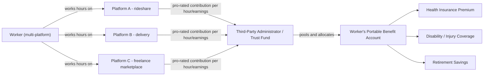

## Portable Benefits Design

### Definition and Conceptual Framework

Portable benefits are employment-linked benefits (health insurance, retirement savings, disability/injury coverage, paid leave) that are **attached to the worker rather than to a single employer or job**, accumulating on a pro-rated basis across multiple income sources and following the worker as they move between jobs, clients, or platforms. The design responds to a structural mismatch in the traditional U.S. social insurance architecture: benefits eligibility and financing were built around a stable, single-employer employment relationship (the "standard employment relationship" or SER), while gig, platform, and other nonstandard work arrangements fragment a worker's income across multiple payers, none of whom individually meets the hours or duration thresholds that trigger benefit obligations under existing law.

**Key Points:**

- The core design problem is **decoupling benefit provision from the traditional employer-employee classification** without triggering misclassification liability for platforms
- Contributions are typically **pro-rated by hours worked or income earned per platform/client**, rather than tied to full-time equivalent status with one employer
- Benefits accrue in a **portable account** (individual or pooled) that persists across job transitions
- Design must navigate **worker classification law** (employee vs. independent contractor), since offering employee-style benefits can be used as evidence of an employment relationship in misclassification suits

### Economic Rationale

**Labor Economics Framing:**

1. **Externality/Public Goods Argument**: Because no single employer captures the full return on benefits it provides to a worker who splits time across multiple platforms, each individual payer is disincentivized from providing benefits — a **free-rider problem** among employers. Portable benefits mechanisms internalize this by requiring proportional contribution from all payers.
2. **Labor Mobility and Job Lock**: Employer-sponsored benefits (especially health insurance) historically created **"job lock,"** where workers stayed in suboptimal job matches to retain benefits. Portability, in theory, improves allocative efficiency in the labor market by decoupling the benefit from the specific employer, allowing workers to move toward higher-productivity matches without benefit loss. [Inference: the magnitude of this efficiency gain in the gig context specifically is not well established empirically, since most job-lock literature predates the modern platform economy.]
3. **Human Capital and Insurance Smoothing**: Nonstandard workers face **income volatility** across multiple income streams; portable benefits (particularly unemployment-style wage insurance or paid leave) function as consumption-smoothing mechanisms analogous to conventional social insurance, but calibrated to fragmented earnings patterns rather than a single payroll.
4. **Compensating Differentials Tension**: Standard compensating-differential theory predicts that in a competitive labor market, the absence of benefits should be offset by higher observed wages. Portable benefits advocates argue this substitution is incomplete for gig workers, either due to information frictions (workers underweight the future cost of forgone benefits) or market power (platforms operating as monopsonists in setting compensation terms), so government or industry-mandated portable benefit contributions correct an under-provision equilibrium.

### The Classification Problem (Central Design Constraint)

Under U.S. law, whether portable benefits can be offered without reclassifying a worker as an employee depends critically on the applicable test:

$$\text{Classification Risk} = f(\text{Control}, \text{Economic Dependence}, \text{Benefit Structure})$$

- **Common-law control test** (used by the IRS and many states): Focuses on behavioral and financial control. Providing benefits historically was treated as one factor suggesting an employment relationship.
- **ABC test** (used in California under AB5/Prop 22, Massachusetts, New Jersey, and others): A worker is an employee unless the hiring entity satisfies **all three prongs** — (A) freedom from control, (B) work outside the usual course of the hiring entity's business, (C) the worker is customarily engaged in an independently established trade. Under strict ABC tests, most platform-based gig work fails prong (B), making the classification question largely independent of whether benefits are offered.
- **Economic realities test** (used under the FLSA in various forms across administrations): Considers the totality of factors including opportunity for profit/loss, investment, permanence of relationship, and degree of control.

The design innovation that emerged (starting with Washington State's HB 2076, 2022, and mirrored in several state proposals) is a **statutory safe harbor**: legislation explicitly states that providing portable benefits contributions to independent contractors does **not**, by itself, convert them into employees, regardless of how the underlying classification test would otherwise apply. This safe harbor is the legal linchpin that makes portable benefits feasible at scale without forcing platforms into a binary reclassification decision.

### Institutional Models

**1. Individual Portable Benefit Accounts**

Each worker has an account (often maintained by a third-party administrator, not the platform itself) into which every platform they work for contributes a **pro-rated amount per hour worked or per dollar earned**.

$$C_i = \sum_{p=1}^{n} r_p \times H_{i,p}$$

Where $C_i$ is total contributions to worker $i$'s account, $r_p$ is the contribution rate set by platform $p$ (often statutorily mandated, e.g., a flat cents-per-hour or percentage-of-earnings rate), and $H_{i,p}$ is hours worked (or earnings) by worker $i$ on platform $p$.

- **Example**: Washington State's TNC (Transportation Network Company) driver benefits law (effective 2023) requires Uber/Lyft to contribute per-minute amounts into individual driver accounts, administered by a state-approved third party, usable for health insurance premiums and other qualifying expenses, with contribution rates indexed to time actively engaged (en route to or transporting a rider).
- **Utah's Portable Benefit Plan Act (2023)**: Establishes a voluntary framework where employers of independent contractors can contribute to portable benefit accounts without those contributions being used as evidence of employment status.

**2. Sector-Based / Multi-Employer Trust Funds**

Modeled on the **Taft-Hartley multi-employer trust fund** structure historically used in construction, entertainment, and other project-based, multi-employer industries where workers routinely move between employers within a trade. A neutral trust administers pooled contributions from many employers/platforms and disburses benefits.

- **Example**: The **Black Car Fund** in New York State — a nonprofit workers' compensation trust that all for-hire vehicle bases (including Uber and Lyft) contribute to via a per-trip surcharge, providing injury/disability coverage to drivers regardless of which specific base dispatched a given trip.

**3. Ballot/Referendum-Negotiated Hybrid Models**

- **California Proposition 22 (2020)**: Classified app-based drivers as independent contractors while mandating a package of alternative benefits — a healthcare subsidy (tied to average weekly hours worked, paid if a driver works enough hours to qualify, structured as a percentage of the Covered California premium benchmark), an earnings floor (120% of minimum wage for engaged time, excluding waiting time), occupational accident insurance, and accidental death insurance. [Note: California's Supreme Court upheld Prop 22 in *Castellanos v. State of California* (July 2024), rejecting the argument that it unconstitutionally limited the legislature's workers' compensation authority.]

**4. Employer-of-Record / PEO-Style Aggregation**

Some staffing/platform intermediaries act as a **Professional Employer Organization (PEO)** or employer-of-record, formally employing workers and providing traditional benefits while contracting their labor out — sidestepping the portable benefits problem by re-consolidating the employment relationship rather than fragmenting it further. This is a substitute design path rather than a "portable" solution per se, since benefits remain employer-linked, just linked to the intermediary instead of the end client.

### Financing Mechanisms

| Mechanism | Description | Example |
| --- | --- | --- |
| Per-hour/per-minute contribution | Flat statutory rate per unit of active work time | Washington TNC law |
| Percentage-of-earnings contribution | Contribution scales with gross fares/earnings | Some proposed federal bills (e.g., Portable Benefits for Independent Workers Pilot Program Act) |
| Per-transaction surcharge passed to consumer | Small fee added to each ride/delivery, remitted to a benefits fund | NY Black Car Fund model |
| Employer/platform payroll-tax-equivalent | Modeled on FICA-style mandatory contribution, but paid into an individual or trust account instead of Social Security/Medicare | Proposed in some federal-level portable benefits legislation, not yet enacted |
| Voluntary employer opt-in matching | Employer contributes at its discretion under a safe-harbor statute, no mandate | Utah Portable Benefit Plan Act |

### Pro-Ration and Multi-Employer Coordination Problem

A central technical challenge is **coordinating contributions across payers who have no relationship with one another** and often no visibility into a worker's total hours or income across all sources.

**Design Options:**

1. **Worker self-reporting to a third-party administrator**, who reconciles contributions from all platforms into a unified account — raises verification and fraud-risk questions.
2. **Platform-side automated reporting via standardized APIs** to a state-designated or industry-designated clearinghouse — requires interoperable data standards across competing platforms (a coordination problem, since platforms may resist sharing granular worker activity data with rivals or state agencies).
3. **Flat statutory rates independent of total hours**, sidestepping the need for cross-platform reconciliation entirely (each platform pays its own rate regardless of what the worker earns elsewhere) — administratively simpler but less precisely targeted at achieving a full-time-equivalent benefit level for a worker who is only part-time on any single platform.

$$\text{Worker's Effective Benefit Level} = \sum_{p=1}^{n} B_p(H_{i,p})$$

If $B_p$ is nonlinear (e.g., only vests after a minimum-hours threshold on that single platform), a worker splitting time across many platforms may fail to reach the threshold anywhere, producing a **benefits cliff** — this is a key argument for pro-rated, threshold-free accrual over per-employer eligibility cutoffs.

### Political Economy and Stakeholder Positions

**Labor unions and worker advocacy groups** are generally split:

- Some (e.g., certain SEIU locals in specific state contexts) have negotiated for portable benefits models as a pragmatic second-best, given the difficulty of winning full employee reclassification through litigation or legislation.
- Others (e.g., the National Employment Law Project, most AFL-CIO-affiliated unions) oppose portable benefits statutes when packaged with **independent contractor safe harbors**, viewing them as a mechanism for platforms to permanently avoid minimum wage, overtime, unemployment insurance, and collective bargaining obligations in exchange for a comparatively thin benefits package. This was the central objection to Prop 22.

**Platforms (Uber, Lyft, DoorDash, Instacart)** have generally supported portable benefits legislation paired with independent contractor status, since it is typically far less costly than full employee benefits and payroll tax obligations (employer-side FICA, unemployment insurance, workers' compensation premiums), while providing a public-relations and legal-risk-mitigation benefit.

**State legislatures** have become the primary policy venue given the absence of federal action; state-level fragmentation means a worker's benefit entitlements can vary substantially depending on which state a platform assigns them to, and multi-state platforms face compliance complexity from divergent statutory designs. [Note: as of this writing, no comprehensive federal portable benefits statute has been enacted; federal proposals such as various versions of the Portable Benefits for Independent Workers Pilot Program Act have been introduced but not passed into law. Verify current status via congress.gov before citing as active law.]

### Comparative International Context

- **Nordic "flexicurity" and sectoral bargaining funds**: Some European countries achieve a portable-benefits-like effect through **sectoral collective bargaining agreements** that apply benefit obligations to an entire industry rather than individual employers, combined with strong public social insurance floors (universal healthcare, state-run unemployment insurance) that reduce the stakes of employer-benefit fragmentation in the first place.
- **France's "tiers de confiance" and platform worker charters** (post-2019 reforms) allow platforms to adopt voluntary worker charters (including some benefit-like protections) without those charters being used as sole evidence of an employment relationship, an approach structurally similar to the U.S. state safe-harbor model. [Unverified: specific current legal status should be checked against recent French labor code amendments, as this area has seen continued litigation, including EU-level rulings affecting platform work classification.]

### Illustrative Diagram: Contribution Flow Under a Multi-Platform Portable Benefits Model

### Model Limitations and Open Design Questions

- **Adequacy**: Contribution rates set by statute (e.g., cents per minute) may not scale with actual healthcare inflation or provide benefit levels comparable to traditional employer-sponsored insurance. [Inference: whether Prop 22-style healthcare subsidies achieve comparable coverage rates to employer-sponsored insurance is contested; independent evaluations have produced mixed findings and should be checked against the most recent research rather than relied on as settled.]
- **Portability across state lines**: A worker who relocates or works across state borders may lose accrued benefits if account structures are state-specific rather than federally standardized.
- **Administrative overhead and take-up**: Even where accounts exist, worker awareness and enrollment (take-up rates) can be low, particularly for episodic or short-tenure gig workers, undermining the efficiency gains the model is designed to produce.
- **Interaction with existing safety net programs**: Contributions to a portable benefits account could interact with means-tested public benefits eligibility (e.g., Medicaid, SNAP) in ways that require careful statutory drafting to avoid unintended benefit cliffs or double-counting of income.

### SVG: Portable Benefits Accrual Comparison (svg_diagram)

<svg xmlns="http://www.w3.org/2000/svg" viewBox="0 0 720 380" font-family="Helvetica, Arial, sans-serif">
<text x="360" y="28" font-size="17" font-weight="bold" text-anchor="middle" fill="#1a1a1a">Traditional vs. Portable Benefits Accrual (svg_diagram)</text>

<text x="150" y="60" font-size="13" font-weight="bold" text-anchor="middle" fill="#333">Traditional (Single Employer)</text>

<rect x="40" y="80" width="220" height="50" fill="`#cfe2f3`" stroke="`#3d85c6`" stroke-width="1.5" />

<text x="150" y="110" font-size="12" text-anchor="middle" fill="`#1a1a1a`">Full-Time Employer A</text>

<line x1="150" y1="130" x2="150" y2="160" stroke="#666" stroke-width="1.5" marker-end="url(#arrow)" />

<rect x="60" y="160" width="180" height="45" fill="`#d9ead3`" stroke="`#38761d`" stroke-width="1.5" />

<text x="150" y="187" font-size="12" text-anchor="middle" fill="`#1a1a1a`">Full Benefits Package</text>

<text x="150" y="225" font-size="11" text-anchor="middle" fill="#555">Benefits lost entirely if</text>

<text x="150" y="240" font-size="11" text-anchor="middle" fill="#555">worker leaves Employer A</text>

<text x="540" y="60" font-size="13" font-weight="bold" text-anchor="middle" fill="#333">Portable (Multi-Platform)</text>

<rect x="420" y="80" width="90" height="35" fill="#f4cccc" stroke="#cc0000" stroke-width="1.2" />
<text x="465" y="102" font-size="10" text-anchor="middle">Platform A</text>
<rect x="525" y="80" width="90" height="35" fill="#fce5cd" stroke="#e69138" stroke-width="1.2" />
<text x="570" y="102" font-size="10" text-anchor="middle">Platform B</text>
<rect x="630" y="80" width="80" height="35" fill="#fff2cc" stroke="#bf9000" stroke-width="1.2" />
<text x="670" y="102" font-size="10" text-anchor="middle">Platform C</text>
<line x1="465" y1="115" x2="540" y2="160" stroke="#666" stroke-width="1.2" marker-end="url(#arrow)" />
<line x1="570" y1="115" x2="540" y2="160" stroke="#666" stroke-width="1.2" marker-end="url(#arrow)" />
<line x1="670" y1="115" x2="540" y2="160" stroke="#666" stroke-width="1.2" marker-end="url(#arrow)" />
<rect x="450" y="160" width="180" height="45" fill="#d0e0e3" stroke="#134f5c" stroke-width="1.5" />
<text x="540" y="187" font-size="12" text-anchor="middle" fill="#1a1a1a">Pooled Benefit Account</text>
<line x1="540" y1="205" x2="540" y2="235" stroke="#666" stroke-width="1.5" marker-end="url(#arrow)" />
<rect x="460" y="235" width="160" height="40" fill="#d9ead3" stroke="#38761d" stroke-width="1.5" />
<text x="540" y="260" font-size="11" text-anchor="middle" fill="#1a1a1a">Pro-Rated Benefits</text>

<text x="540" y="300" font-size="11" text-anchor="middle" fill="#555">Benefits persist and continue accruing</text>

<text x="540" y="315" font-size="11" text-anchor="middle" fill="#555">even if worker leaves any one platform</text>

</svg>

**Next Steps:**

- Worker Classification Standards (ABC test vs. common-law control test vs. economic realities test)
- Prop 22 and *Castellanos v. State of California* case study
- Multi-Employer Trust Funds and Taft-Hartley Benefit Structures
- Unemployment Insurance Financing and Nonstandard Work
- Minimum Wage Floors for Platform Work (engaged-time vs. total-time earnings calculations)
- Monopsony Power in Platform Labor Markets
- Job Lock and Health Insurance Portability (COBRA, ACA Marketplace interactions)
- Algorithmic Wage-Setting and Its Interaction with Benefit Design