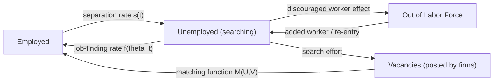

## Business Cycles and Labor Market Fluctuations

### Definition and Scope

Business cycles are recurrent, non-periodic fluctuations in aggregate economic activity — output, employment, income, and trade — characterized by alternating phases of expansion and contraction. Labor market fluctuations refer specifically to how employment, unemployment, hours worked, wages, and labor force participation co-move with these aggregate swings. The labor market is not merely a passive reflection of the business cycle; **labor market frictions and adjustment mechanisms are themselves central to why business cycles look the way they do** (persistent, with unemployment lagging output), making labor economics a core input into macroeconomic theories of the cycle.

**Key Points:**

- Business cycles are dated in the U.S. by the **National Bureau of Economic Research (NBER) Business Cycle Dating Committee**, which identifies peaks and troughs based on a broad set of indicators (real GDP, real income, employment, industrial production, wholesale-retail sales), not a mechanical rule like "two consecutive quarters of negative GDP growth"
- Labor market variables are among the most-watched **coincident and lagging indicators** of the cycle
- The relationship between output and unemployment fluctuations is empirically summarized by **Okun's Law**
- Modern macro models treat unemployment fluctuations as arising from **search and matching frictions**, not simple market clearing

### Phases of the Business Cycle and Labor Market Behavior

| Phase | Output | Employment | Unemployment | Wages | Hours |
| --- | --- | --- | --- | --- | --- |
| Expansion (recovery/growth) | Rising | Rising, typically with a lag | Falling | Rising (often with a lag; sticky) | Rising, overtime increases |
| Peak | At local maximum | Near maximum | Near cyclical trough | Growth decelerating | Near maximum |
| Contraction (recession) | Falling | Falling, often with a lag | Rising | Sticky downward; growth slows sharply | Falling; layoffs and reduced hours |
| Trough | At local minimum | Near minimum | Near cyclical peak | Stagnant or falling in real terms | Near minimum |

**Stylized Fact — Labor Market Variables Lag Output**: Employment and unemployment typically turn several months **after** output does at both peaks and troughs, because firms are slow to hire and slow to fire relative to output changes — a pattern attributed to **labor adjustment costs** (hiring, training, and firing costs that make firms treat labor as a quasi-fixed factor).

### Okun's Law

An empirical regularity, first documented by Arthur Okun (1962), relating the output gap to the unemployment gap:

$$\frac{Y_t - Y_t^*}{Y_t^*} = -\beta (u_t - u_t^*)$$

Where $Y_t$ is actual real GDP, $Y_t^*$ is potential GDP, $u_t$ is the actual unemployment rate, $u_t^*$ is the natural rate of unemployment, and $\beta$ is the Okun coefficient (historically estimated around 2 to 3 for the U.S., meaning roughly a 2-3 percentage-point output gap per 1-percentage-point unemployment gap).

An alternative "difference" (or "gap") specification relates changes:

$$\Delta u_t = -\gamma (g_t - g^*)$$

Where $g_t$ is real GDP growth and $g^*$ is trend/potential growth (often estimated near 2-3% historically for the U.S.); $\gamma$ is typically estimated around 0.3-0.5, implying growth must exceed trend by roughly 2 percentage points to reduce unemployment by 1 point.

**Key Points:**

- Okun's Law is a **statistical regularity**, not a structural behavioral relationship — the coefficient is not stable across time periods or countries [Inference: coefficient instability is well documented in the literature, but the precise current-period estimate should be checked against recent econometric work rather than treated as fixed]
- Explains why unemployment moves less than one-for-one with output: firms adjust along multiple margins (hours, labor hoarding, overtime) before adjusting headcount
- Breaks down notably during and after the 2020 COVID-19 recession, when the unemployment spike vastly exceeded what historical Okun coefficients would have predicted given the output decline, largely due to composition effects (disproportionate job losses in high-contact service sectors) and policy interventions (furlough programs, PPP)

### Sources of Business Cycle Fluctuations: Theoretical Frameworks

**1. Real Business Cycle (RBC) Theory**

Cycles are driven by **real shocks**, primarily total factor productivity (TFP) shocks, propagating through an otherwise frictionless, market-clearing economy. Labor supply fluctuations are voluntary intertemporal substitution — workers choose to work more when productivity (and thus real wages) is temporarily high.

$$Y_t = A_t K_t^{\alpha} L_t^{1-\alpha}$$

Where $A_t$ is the (stochastic) TFP term. Employment fluctuations in pure RBC models are driven by the labor supply response to wage fluctuations induced by $A_t$.

- **Critique**: RBC models struggle to generate the large, persistent employment fluctuations seen empirically without implausibly large labor supply elasticities; measured intertemporal labor supply elasticities from micro data are typically too small to explain observed employment volatility [this is a long-standing critique in the literature associated with economists such as Robert Barro and later New Keynesian responses].

**2. New Keynesian Theory**

Cycles are driven by demand shocks (and other shocks) interacting with **nominal rigidities** (sticky prices and/or sticky wages), so that shocks have real effects on output and employment rather than being fully absorbed by prices. Monetary policy has real short-run effects on employment because wages/prices adjust slowly.

**3. Search and Matching Theory (Diamond-Mortensen-Pissarides, DMP)**

The dominant modern framework for modeling **unemployment** specifically over the cycle. Unemployment arises from frictions in matching workers to jobs, not from wage rigidity alone. Central object: the **matching function**.

$$M_t = m(U_t, V_t)$$

Where $M_t$ is new hires (matches), $U_t$ is unemployment (searching workers), and $V_t$ is job vacancies. Commonly specified as Cobb-Douglas:

$$M_t = \mu U_t^{\eta} V_t^{1-\eta}$$

**Labor market tightness** is defined as:

$$\theta_t = \frac{V_t}{U_t}$$

The **job-finding rate** for an unemployed worker is $f(\theta_t) = M_t / U_t = \mu \theta_t^{1-\eta}$, and the **vacancy-filling rate** for a firm is $q(\theta_t) = M_t / V_t = \mu \theta_t^{-\eta}$.

**Beveridge Curve**: The empirical, downward-sloping relationship between the unemployment rate and the vacancy rate, reflecting matching efficiency; outward shifts of the curve (higher unemployment at any given vacancy rate) indicate deteriorating match efficiency, often observed during and after recessions (notably discussed extensively regarding the 2020-2022 U.S. labor market, where the curve shifted outward before partially normalizing).

**Shimer Puzzle (2005)**: Standard calibrations of the DMP model, using plausible productivity shock volatility, generate far less volatility in unemployment and vacancies than observed in the data — a major unresolved tension between search-and-matching theory and the data, motivating subsequent work on wage rigidity within DMP models (e.g., Hall 2005; Hagedorn and Manovskii 2008) as amplification mechanisms. [Inference: characterizing this as fully "unresolved" reflects ongoing debate in the literature; different modeling extensions claim varying degrees of success and this remains an active research area, so current consensus should be checked against recent survey literature.]

### Labor Market Adjustment Margins Over the Cycle

Firms and workers adjust along multiple margins during downturns and recoveries, not solely through headcount:

1. **Extensive margin (headcount)**: Hiring freezes, layoffs, and hiring during recovery
2. **Intensive margin (hours)**: Reduced hours, furloughs, overtime cuts during downturns; overtime expansion during recovery — often the first margin adjusted since it avoids firing/rehiring costs
3. **Labor hoarding**: Firms retain workers during a downturn beyond what current output would justify, anticipating future demand recovery and wishing to avoid the fixed costs of re-hiring and re-training — this behavior contributes to observed **procyclical labor productivity** in the short run (productivity falls in early downturns as firms hold labor "on the books" with less to do)
4. **Labor force participation (discouraged worker effect)**: In deep or prolonged downturns, some unemployed workers exit the labor force entirely rather than continuing to search, which mechanically lowers the measured unemployment rate without reflecting genuine improvement — captured by the distinction between U-3 (official unemployment rate) and broader measures like U-6 (includes marginally attached and part-time-for-economic-reasons workers)
5. **Wage adjustment**: Nominal wages are empirically **downward rigid** — firms are reluctant to cut nominal wages even in recessions (partly due to morale/efficiency-wage concerns), so real wage adjustment happens more through **wage growth deceleration** than nominal cuts, and through compositional effects (recessions disproportionately shed lower-wage/lower-tenure workers, mechanically raising average measured wages — the so-called "composition bias" in aggregate wage statistics during downturns)

### Cyclicality of Key Labor Market Variables

- **Unemployment rate**: Strongly **countercyclical** (rises in recessions, falls in expansions)
- **Vacancies**: Strongly **procyclical**
- **Labor force participation rate**: Mildly **procyclical**, with debated magnitude of the discouraged-worker effect versus an "added worker effect" (other household members entering the labor force to offset a primary earner's job loss)
- **Real wages**: Mildly procyclical in most modern estimates, though historically debated (early Keynesian models assumed countercyclical real wages via diminishing marginal product of labor along a fixed labor demand curve; this has been revised given measurement and composition issues)
- **Labor productivity (output per hour)**: Procyclical in the short run (partly due to labor hoarding effects reversing in recovery) but this relationship has weakened/become more debated in recent decades
- **Quits rate**: Strongly procyclical — workers quit more when labor markets are tight and outside options are abundant (used as a proxy for worker confidence and labor market tightness, prominently discussed during the 2021-2022 "Great Resignation" period in the U.S.)
- **Job-finding and separation rates**: Job-finding rate is strongly procyclical (falls sharply in recessions, a major driver of the unemployment rise per Shimer's (2012) decomposition); separation rate is mildly countercyclical but the fluctuations are smaller and more debated in relative importance to the job-finding margin

### Diagram: Search-and-Matching Flow Dynamics

### Monetary and Fiscal Policy Transmission to the Labor Market

- **Monetary policy**: Central banks (e.g., the Federal Reserve under its dual mandate of price stability and maximum employment) adjust policy rates to influence aggregate demand, which affects hiring and layoff decisions with a lag (commonly cited as "long and variable lags," historically discussed as roughly 12-18 months for peak effects on employment, though this is model- and period-dependent and should not be treated as a precise constant). The **Phillips Curve** describes the (empirically weakened in recent decades) tradeoff between inflation and unemployment/labor market slack that underlies much of this transmission analysis.
- **Fiscal policy**: Automatic stabilizers (unemployment insurance, progressive taxation) cushion labor income fluctuations over the cycle without new legislative action; discretionary fiscal stimulus (e.g., 2009 ARRA, 2020-2021 COVID-19 relief packages including expanded/extended UI benefits and the Paycheck Protection Program) directly targets employment preservation or demand support during downturns.

### Historical Illustrative Episodes (for context, not exhaustive)

- **1980s Volcker disinflation**: Sharp, deliberately induced recession (1981-82) via monetary tightening to break inflation, producing unemployment peaking near 10.8% — commonly cited as a textbook example of monetary-policy-induced cyclical unemployment.
- **2007-2009 Great Recession**: Financial-crisis-driven downturn with a notably slow ("jobless") labor market recovery relative to the speed of the output recovery, motivating extensive DMP-model research into matching efficiency deterioration and long-term unemployment scarring effects.
- **2020 COVID-19 recession**: Uniquely sharp and deep but short-lived contraction, with unemployment spiking from historic lows (~3.5%) to a post-WWII record (14.7% in April 2020 per BLS data) within two months, followed by an unusually rapid recovery relative to prior recessions — challenging standard Okun's Law and search-model calibrations due to its non-standard (mandated shutdown) origin. [Verify precise historical unemployment rate figures against current BLS published series before citing in formal work, as initial releases are sometimes subsequently revised.]

### Model Limitations

- Standard DMP and RBC/New Keynesian frameworks are typically **representative-agent** models and do not natively capture heterogeneity in cyclical exposure across demographic groups, industries, or geographic regions, even though empirical labor market fluctuations are highly heterogeneous (e.g., cyclical unemployment volatility is consistently higher for younger workers, non-college-educated workers, and cyclically sensitive industries such as construction and durable manufacturing)
- Behavioral claims about firm hiring/firing responses to policy shocks are model-dependent and subject to change under different structural assumptions (calibration choices, wage-setting protocol assumed within the DMP framework materially affect quantitative predictions)
- Okun coefficient and Phillips Curve slope estimates are **not structural constants**; both have exhibited apparent instability across decades and should be treated as period-specific empirical relationships rather than fixed technological parameters of the economy

**Related Topics:**

- Search and Matching Models (Diamond-Mortensen-Pissarides) in depth
- The Beveridge Curve and Matching Efficiency
- Okun's Law: Estimation and Structural Breaks
- Wage Rigidity: Nominal vs. Real, and Efficiency Wage Theory
- The Phillips Curve and Its Flattening
- Unemployment Insurance as an Automatic Stabilizer
- Labor Hoarding and Procyclical Productivity
- Jobless Recoveries: Causes and Evidence
- Hysteresis in Unemployment (long-run scarring from cyclical downturns)