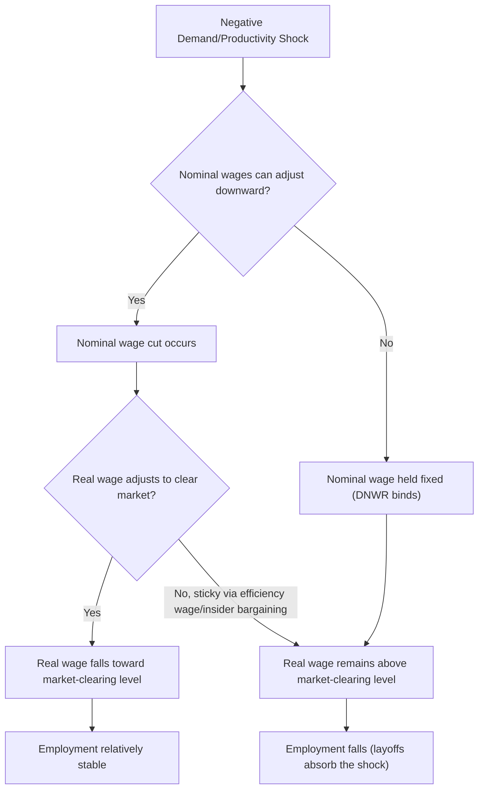

## Nominal and Real Wage Rigidity

### Definition and Conceptual Distinction

Wage rigidity refers to the failure of wages to adjust freely and instantaneously to clear the labor market in response to shocks. The distinction between nominal and real rigidity is central to macroeconomic theory because it determines **whether monetary shocks have real effects** on employment and output.

**Key Points:**

- **Nominal wage rigidity**: The nominal (money) wage $W_t$ fails to adjust — most notably, empirical evidence shows strong **downward nominal wage rigidity (DNWR)**, where nominal wage cuts are rare even when economic conditions would otherwise call for them
- **Real wage rigidity**: The real wage $w_t = W_t/P_t$ fails to adjust to clear the labor market, even if nominal wages are flexible — the real wage may be "too high" relative to the market-clearing level or may respond too sluggishly to shocks in labor demand or supply
- These are **conceptually distinct**: an economy can have flexible nominal wages but rigid real wages (if wages are indexed to prices), or rigid nominal wages that translate into real wage flexibility during inflationary periods (since inflation erodes fixed nominal wages in real terms)
- The distinction matters for policy: nominal rigidity is the standard channel through which **New Keynesian models generate real effects of monetary policy**; real rigidity (independent of nominal stickiness) is central to explaining unemployment volatility in search-and-matching models (the Shimer puzzle literature)

### Downward Nominal Wage Rigidity (DNWR)

**Empirical Pattern**: Histograms of year-over-year individual nominal wage changes typically show a sharp spike at exactly zero and very few observations of small nominal wage cuts, producing a asymmetric, notably non-smooth distribution — inconsistent with frictionless wage-setting, which would predict a smooth distribution centered near expected inflation plus productivity growth.

**Proposed Explanations:**

1. **Money illusion**: Workers evaluate wage changes in nominal terms and perceive a nominal cut as unfair even when an equivalent real cut delivered via inflation is not perceived the same way (behavioral/psychological explanation, associated with survey work by Truman Bewley and others on employer and worker attitudes toward wage cuts)
2. **Morale and effort concerns (fairness-based efficiency wages)**: Employers avoid nominal wage cuts because workers perceive them as unfair (violating a reference-dependent fairness norm), reducing effort, cooperation, or morale, even when a real-terms-equivalent outcome via low nominal raises during inflation is accepted — this connects DNWR to **fair wage-effort models** (Akerlof and Yellen)
3. **Costly renegotiation and implicit contracts**: Long-term implicit employment contracts smooth wages over the cycle, insuring risk-averse workers against income volatility in exchange for wage stability, consistent with **implicit contract theory** (Azariadis, Baily)
4. **Menu costs applied to wages**: Analogous to nominal price rigidity, there may be small fixed costs to renegotiating wage contracts, making infrequent adjustment optimal when misalignment costs are small (though this explanation has less empirical support specifically for wages than for prices, since wage cuts appear qualitatively different from mere inertia)

**Macroeconomic Consequence**: When DNWR binds during a negative demand shock, firms cannot cut nominal wages to reduce labor costs, so they instead **reduce employment** (layoffs) to achieve the necessary real cost reduction — DNWR is one mechanism by which nominal shocks produce real employment effects, and is invoked to explain why recessions generate significant unemployment even though relatively modest real wage adjustments, in principle, could clear the market.

### Modeling Nominal Wage Rigidity: The New Keynesian Approach

**Staggered (Calvo-style) Wage Setting**: Analogous to Calvo pricing, a fraction $1-\theta_w$ of workers (or unions representing them) reoptimize their wage in each period, while the remaining fraction $\theta_w$ keep their previous wage (possibly with partial indexation to lagged inflation or trend inflation).

The **New Keynesian Wage Phillips Curve** (NKWPC) that results is typically written:

$$\pi_t^w = \beta E_t[\pi_{t+1}^w] + \kappa_w (mrs_t - w_t)$$

Where $\pi_t^w$ is nominal wage inflation, $mrs_t$ is the (log) marginal rate of substitution between consumption and leisure (representing the wage workers would demand under flexible wage-setting), $w_t$ is the actual (log) real wage, and $\kappa_w$ is a slope coefficient decreasing in the degree of wage stickiness $\theta_w$.

**Key Points:**

- This mirrors the standard New Keynesian Phillips Curve for prices, but applied to wage-setting by monopolistically competitive **unions or individual workers** who each supply a differentiated variety of labor and set wages subject to a downward-sloping labor demand curve, analogous to firms setting prices under monopolistic competition
- Erceg, Henderson, and Levin (2000) is the canonical reference introducing staggered nominal wage-setting into an otherwise standard New Keynesian DSGE framework, allowing both price and wage rigidity to jointly determine output and employment dynamics
- With **both** sticky prices and sticky wages, monetary policy has richer real effects than with price stickiness alone, and the relative degree of price versus wage stickiness affects how demand shocks are split between output, employment, and the real wage

### Real Wage Rigidity

Distinct from nominal stickiness, real wage rigidity refers to the real wage responding too little to changes in labor market conditions (e.g., unemployment) relative to what a competitive spot market would predict.

**Sources of Real Wage Rigidity:**

1. **Efficiency wages**: Firms pay above-market-clearing wages to induce effort, reduce shirking (Shapiro-Stiglitz shirking model), reduce turnover, or attract higher-quality applicants (adverse selection models). Because the efficiency wage is set based on considerations largely independent of the current unemployment rate, it responds sluggishly to labor market slack.

$$w^* = \bar{w} + e(u_t)$$

Where the efficiency wage premium depends only weakly on current unemployment $u_t$ in many specifications, generating real rigidity.

2. **Insider-outsider models** (Lindbeck and Snower): Incumbent employed workers ("insiders") have bargaining power due to turnover costs (hiring, firing, training costs facing the firm), allowing them to negotiate wages above the level unemployed "outsiders" would accept, insulating wages from outsider unemployment pressure.
3. **Union wage bargaining / collective bargaining models**: Wages set via Nash bargaining between a union and firm reflect a weighted average of the union's target wage and the firm's outside option, which may respond only partially to aggregate unemployment, especially under multi-year contracts.
4. **Hall (2005) "Wage Norm" in DMP Models**: To resolve the Shimer puzzle, Hall proposes that wages are set according to a social norm that keeps them relatively rigid over the cycle (rather than through continuous Nash bargaining that would otherwise re-equate wages to the surplus-sharing rule each period), which amplifies the response of unemployment and vacancies to productivity shocks, since firms cannot pass shocks through to wages and must instead adjust employment.

**Nash Bargaining Wage Equation (standard DMP benchmark, for contrast)**:

$$w_t = \beta(p_t + \theta_t c) + (1-\beta) z$$

Where $\beta$ is worker bargaining power, $p_t$ is labor productivity, $c$ is the vacancy-posting cost, $\theta_t$ is labor market tightness, and $z$ is the value of non-work (unemployment benefit plus leisure value). Under strict period-by-period Nash bargaining, wages are quite responsive to productivity — the Hagedorn-Manovskii (2008) resolution to the Shimer puzzle instead argues for a **high value of $z$ relative to productivity**, which makes the *surplus* from a match small and highly sensitive to productivity changes, generating large unemployment/vacancy responses even under standard Nash bargaining (an alternative amplification channel to Hall's wage rigidity story).

### Comparative Table: Nominal vs. Real Rigidity Mechanisms

| Mechanism | Type | Primary Channel | Key References |
| --- | --- | --- | --- |
| Menu costs / staggered contracts | Nominal | Infrequent wage resetting | Calvo (1983, adapted); Erceg-Henderson-Levin (2000) |
| Money illusion / fairness norms | Nominal | Resistance to nominal cuts specifically | Bewley (1999); Akerlof-Yellen (1990) |
| Implicit contracts | Nominal & Real | Risk-sharing insurance smooths wages | Azariadis (1975); Baily (1974) |
| Efficiency wages (shirking) | Real | Wage set to deter shirking, weak link to $u_t$ | Shapiro-Stiglitz (1984) |
| Insider-outsider bargaining | Real | Incumbents' turnover-cost leverage | Lindbeck-Snower (1986) |
| Wage norms in search models | Real | Rigid wage amplifies unemployment volatility | Hall (2005) |
| High non-work value | Real (indirect) | Small, volatile match surplus | Hagedorn-Manovskii (2008) |

### Empirical Evidence and Measurement

- **Micro-data wage change distributions** (e.g., studies using administrative payroll or survey panel data across multiple countries) consistently document the "spike at zero, missing mass below zero" pattern associated with DNWR, though the degree varies by country, institutional wage-setting arrangement (union density, minimum wage coverage), and time period
- **Cross-country comparisons**: Countries with more centralized/coordinated wage bargaining or higher unionization sometimes show *different* rigidity patterns than decentralized labor markets — the relationship between labor market institutions and the degree of rigidity is empirically studied but not fully settled, since institutional wage floors can substitute for or reinforce individual-level DNWR depending on context [Inference: cross-country rankings on this dimension shift across studies depending on methodology and sample period; specific current comparative rankings should be checked against recent empirical papers rather than treated as fixed stylized facts]
- **Great Recession and COVID-19 evidence**: Both episodes renewed empirical interest in DNWR, since if it binds strongly, aggregate real wage measures during severe downturns should show unusually slow real wage decline given the depth of unemployment increases — findings across studies of this period are mixed and depend heavily on how "wages" are measured (aggregate compensation data suffers from composition bias, as discussed under Business Cycles and Labor Market Fluctuations)

### Diagram: Wage Rigidity and the Employment Adjustment Channel

### Policy and Macroeconomic Implications

- **Inflation as a "wage-cut facilitator"**: Because nominal wage cuts are resisted but low nominal *increases* during positive inflation are tolerated, moderate positive inflation can "grease the wheels" of the labor market by allowing real wage adjustment without requiring nominal cuts — an argument historically used (e.g., by George Akerlof, William Dickens, and George Perry, 1996) to caution against pursuing zero or negative inflation targets, since doing so would make DNWR bind more frequently and could raise the natural rate of unemployment. [Inference: the "greasing the wheels" hypothesis remains debated in the literature relative to competing views that emphasize costs of even moderate inflation; treat as one influential but contested position, not consensus.]
- **Minimum wage floors** interact with real wage rigidity discussions, since a binding minimum wage is itself a form of real wage rigidity by statute rather than by firm/worker behavior — distinct conceptually but similar in its employment-adjustment implications during adverse demand shocks for low-wage workers specifically
- **Central bank inflation targets**: The DNWR literature is one input (among several) into debates over the optimal long-run inflation target, alongside considerations of the zero lower bound on nominal interest rates and menu-cost-based price rigidity

### Model Limitations

- Most staggered-wage-setting models (Calvo-style) are a **stylized, reduced-form representation** of a plausibly much richer and more heterogeneous wage-setting process; the "average" duration between wage resets implied by calibrated $\theta_w$ values does not map cleanly onto observed heterogeneity in actual renegotiation frequency across firms, contracts, and sectors
- DNWR evidence is sensitive to **measurement issues**: distinguishing a genuine nominal wage freeze from measurement error, and separating "same job, same worker" wage changes from compositional shifts (new hires, promotions, job changes) requires high-quality longitudinal micro data not uniformly available across countries or time periods
- The relative empirical importance of nominal versus real rigidity in driving aggregate employment fluctuations remains an active research question rather than a fully resolved one; different DSGE model specifications calibrated to match different moments can attribute cyclical unemployment volatility to different combinations of these mechanisms, so specific quantitative decompositions should be treated as model-dependent rather than as settled empirical fact

**Related Topics:**

- Efficiency Wage Theory (Shapiro-Stiglitz Shirking Model)
- Insider-Outsider Models of Wage Bargaining
- The New Keynesian Wage Phillips Curve
- Search and Matching Models and the Shimer Puzzle
- Minimum Wage Policy and Employment Effects
- Inflation Targeting and the Greasing-the-Wheels Hypothesis
- Implicit Contract Theory and Wage Smoothing
- Compositional Bias in Aggregate Wage Statistics