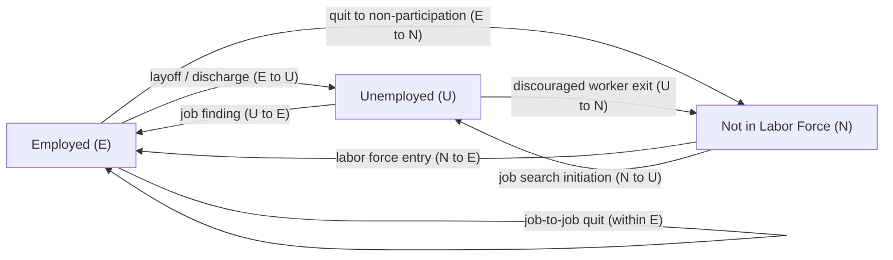

## Worker and Job Flows

### Definition and Scope

Worker and job flows analysis studies the **gross, underlying movements** of workers and jobs that occur beneath aggregate net employment change — recognizing that even when net employment change is small or zero, there is typically substantial simultaneous job creation, job destruction, hiring, and separation happening across firms. This flows-based perspective, developed primarily through the work of Steven Davis, John Haltiwanger, and Scott Schuh (and, on the worker-flow side, Robert Hall and others), transformed labor economics' understanding of labor market dynamics by shifting focus from static snapshots (the unemployment rate at a point in time) to the **flows that generate** those snapshots.

**Key Points:**

- **Job flows** are measured at the establishment/firm level: job creation and job destruction
- **Worker flows** are measured at the individual level: hires, separations (quits and layoffs), and transitions between employment, unemployment, and non-participation
- Gross flows are typically **an order of magnitude larger** than net employment change, revealing enormous underlying labor market churn even in stable aggregate periods
- This decomposition is essential for understanding **why** unemployment rises in a recession — whether via reduced hiring, increased separations, or both — which carries different policy implications

### Job Flows: Creation and Destruction

**Definitions** (following Davis-Haltiwanger-Schuh, 1996):

$$\text{Job Creation Rate} = \frac{\sum_{e: \Delta E_e > 0} \Delta E_e}{X_t}$$

$$\text{Job Destruction Rate} = \frac{\sum_{e: \Delta E_e < 0} |\Delta E_e|}{X_t}$$

Where $\Delta E_e$ is the change in employment at establishment $e$ between two periods, and $X_t$ is a size measure (typically the average of employment across the two periods, summed across all establishments, to avoid asymmetric treatment of growing versus shrinking establishments).

$$\text{Net Employment Growth} = \text{Job Creation Rate} - \text{Job Destruction Rate}$$

$$\text{Gross Job Reallocation} = \text{Job Creation Rate} + \text{Job Destruction Rate}$$

**Key Empirical Findings:**

- Gross job reallocation is large even in expansions: roughly **similar magnitudes of job creation and destruction occur simultaneously** at any point in the cycle, since some establishments are always growing and others contracting, even during aggregate expansions
- **Job destruction is more volatile over the cycle than job creation** — the well-documented DHS finding that job destruction spikes sharply during recessions while job creation falls more modestly and gradually, meaning **recessions are primarily "destruction events"** rather than periods where job creation simply stops
- Most job reallocation occurs **within narrowly defined industries**, not between industries — reallocation is not primarily industries growing and shrinking relative to each other, but individual establishments within the same industry moving in opposite directions (attributed to idiosyncratic establishment-level shocks: demand shocks, productivity shocks, management changes)
- **Establishment size and age** are strong predictors of job flow rates: young/small establishments exhibit far higher job creation *and* destruction rates than large, mature establishments — often summarized as "young firms are volatile" or connected to the (qualified) empirical finding that net job creation is disproportionately attributable to a subset of young, high-growth firms ("gazelles") rather than small firms as a size class per se [Inference: the "small firms create most jobs" claim popular in policy discourse has been substantially revised in the literature toward an emphasis on firm age rather than size; current framing should be checked against recent Census/BDS-based research]

### Worker Flows: Hires, Quits, Layoffs, and Labor Market Transitions

While job flows track net changes in establishment headcounts, **worker flows** are typically larger still, because they include **worker replacement** — an establishment with zero net job creation can still have substantial hiring and separation (replacing departing workers), which job flow measures do not capture (this gap is sometimes called **"churning"** or worker reallocation in excess of job reallocation).

**Core Worker Flow Measures (as tracked by, e.g., the U.S. BLS JOLTS — Job Openings and Labor Turnover Survey):**

- **Hires rate**: New hires as a share of employment
- **Total separations rate**, decomposed into:
  - **Quits**: Voluntary separations initiated by the worker
  - **Layoffs and discharges**: Involuntary separations initiated by the employer
  - **Other separations**: Retirements, deaths, transfers

**Labor Market Transition Matrix (Stock-Flow Framework):**

The labor force is partitioned into three mutually exclusive states — Employed (E), Unemployed (U), Not in Labor Force (N) — with flows between each pair tracked monthly (e.g., via the CPS in the U.S.):

$$\begin{pmatrix} E_{t+1} \\ U_{t+1} \\ N_{t+1} \end{pmatrix} = \begin{pmatrix} p_{EE} & p_{UE} & p_{NE} \\ p_{EU} & p_{UU} & p_{NU} \\ p_{EN} & p_{UN} & p_{NN} \end{pmatrix} \begin{pmatrix} E_t \\ U_t \\ N_t \end{pmatrix}$$

Where $p_{XY}$ denotes the transition probability from state $X$ to state $Y$ over one period.

**Key Points:**

- The **E-to-U flow (job loss)** and **U-to-E flow (job finding)** are the two flows most directly linked to unemployment rate dynamics and are central to the Shimer (2012) decomposition of unemployment fluctuations discussed under Business Cycles and Labor Market Fluctuations
- The **N-to-U and U-to-N flows** are large in absolute magnitude (much of measured "unemployment inflow/outflow" in the CPS is actually to/from non-participation, not employment), complicating simple two-state (E/U) models of the labor market
- **Direct E-to-N and N-to-E flows** (bypassing measured unemployment entirely) are also substantial — a worker can lose a job and stop actively searching (moving straight from E to N) without ever being counted as unemployed under the official job-search-based definition, a point relevant to debates over whether the unemployment rate alone adequately captures labor market slack

### Quits Rate as a Labor Market Tightness Indicator

The **quits rate** is closely watched as a real-time indicator of worker confidence and labor market tightness, since quits are overwhelmingly voluntary and workers are more willing to quit (often to take a better job) when outside options are abundant.

- Quits rate is **strongly procyclical**: rises during expansions and tight labor markets, falls sharply during recessions as workers become more risk-averse about leaving a job absent a confirmed better option
- The **"Great Resignation"** (U.S., roughly 2021-2022) is a widely discussed episode where the quits rate reached record highs in JOLTS data amid a historically tight post-pandemic labor market, though the underlying causes (pent-up job switching, reassessment of work-life balance, wage growth incentivizing switching, sectoral reallocation from in-person to remote-friendly roles) are debated across studies and not fully settled empirically. [Note: specific quits-rate figures and their subsequent normalization should be verified against current BLS JOLTS releases, as this series has continued to evolve substantially since 2022 and any specific numeric claim here would need to be checked against current data.]

### Diagram: Worker Flow Transitions Among Labor Market States

### Job-to-Job Transitions

A distinct and increasingly emphasized flow: workers moving **directly from one employer to another without an intervening unemployment spell**. This flow does not appear in the standard three-state (E/U/N) transition matrix above (both origin and destination are "E"), but is separately tracked (e.g., via CPS-based job-to-job flow measures, or JOLTS hires/separations by reason) because it is a key channel of **on-the-job search and labor reallocation toward better matches**.

- Job-to-job transition rates are **strongly procyclical** and are a major component of the quits rate discussed above
- Declining job-to-job mobility over recent decades in the U.S. has been documented and linked in some research to broader declines in measures of labor market dynamism/fluidity (falling rates of job creation, job destruction, and worker reallocation since roughly the 1980s-2000s), though the causes (rising employer concentration/monopsony power, occupational licensing, non-compete agreements, aging workforce composition, declining geographic mobility) are actively debated and no single explanation commands full consensus [Inference: this "declining dynamism" literature is an active empirical research area; specific causal attributions should be treated as competing hypotheses rather than settled findings, and current-period data should be checked given continued research since the original wave of these papers].

### Data Sources for Worker and Job Flow Analysis (U.S. Context)

| Source | Measures | Frequency | Notes |
| --- | --- | --- | --- |
| JOLTS (BLS) | Job openings, hires, quits, layoffs/discharges, other separations | Monthly | Establishment-based; national and by industry/region |
| Business Employment Dynamics (BLS, using QCEW) | Gross job gains and losses by establishment | Quarterly | Underlying data source closest to the original DHS methodology |
| Longitudinal Employer-Household Dynamics (LEHD, Census Bureau) | Worker and job flows linking employer and employee records | Quarterly | Enables job-to-job flow measures and worker-establishment matched analysis |
| Current Population Survey (CPS) | Individual-level E/U/N transitions | Monthly (with longitudinal matching across adjacent months) | Basis for standard worker flow/transition-rate literature (e.g., Shimer 2012) |
| Business Dynamics Statistics (BDS, Census Bureau) | Firm/establishment entry, exit, job creation/destruction by firm age and size | Annual | Basis for "firm age vs. size" job creation findings |

### Policy and Research Applications

- **Recession diagnosis**: Decomposing whether a given unemployment rise is driven primarily by elevated separations (layoffs) or depressed hiring (job-finding) has different policy implications — a hiring-driven downturn may call for demand-stimulus measures targeting job creation, while a separations-driven spike may call for measures cushioning displaced workers (UI extensions, wage insurance) pending recovery
- **Structural vs. cyclical unemployment debates**: Persistently elevated job destruction alongside stagnant job creation in specific sectors/regions (rather than broad-based cyclical patterns) is sometimes cited as evidence of structural change (automation, trade exposure, sectoral decline) requiring different policy responses (retraining, mobility assistance) than purely cyclical demand-side unemployment
- **Firm dynamism and productivity growth**: Job and worker reallocation are generally viewed in the literature as **productivity-enhancing** in aggregate (resources moving from less to more productive uses — "creative destruction" in the Schumpeterian sense), so a documented decline in reallocation rates has been raised as a potential (though contested) contributor to slower aggregate productivity growth in recent decades

### Model Limitations

- Job flow measures based on establishment-level net employment changes will **understate total worker churning** whenever hires and separations occur simultaneously at the same establishment (worker replacement); job flow statistics alone cannot be used to infer total hiring/firing activity
- CPS-based worker flow estimates are subject to well-documented **classification error** (workers misclassified between U and N due to survey response ambiguity), which can create spurious flows and bias standard transition-rate estimates; various statistical corrections exist in the literature but no single correction method is universally adopted
- Attribution of long-run declining-dynamism trends to specific causes (concentration, licensing, non-competes, demographics) remains contested, and quantitative decompositions vary substantially by study, dataset, and time period covered — treat specific causal shares cited in any single paper as that paper's estimate, not an economy-wide consensus figure

**Related Topics:**

- Job Creation and Destruction (Davis-Haltiwanger-Schuh methodology)
- Search and Matching Models and the Shimer Decomposition
- Firm Age, Size, and Net Job Creation (Business Dynamics Statistics)
- The Beveridge Curve and Matching Efficiency
- Declining Labor Market Dynamism and Job-to-Job Mobility
- JOLTS Data and Real-Time Labor Market Indicators
- Structural vs. Cyclical Unemployment
- Employer Concentration and Monopsony Power