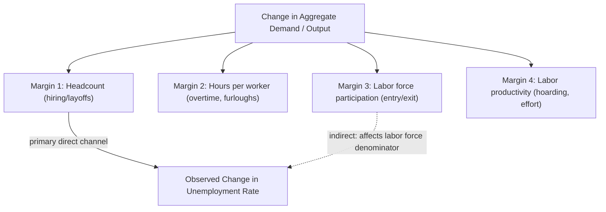

## Okun's Law

### Definition and Origin

Okun's Law is an empirical regularity, first documented by economist **Arthur Okun** in a 1962 paper for the Council of Economic Advisers, describing the relationship between fluctuations in output (real GDP) and fluctuations in the unemployment rate. It is one of the most widely cited "laws" in macroeconomics despite being a **statistical regularity derived from data**, not a structural relationship derived from optimizing behavior — a distinction with important implications for how it should be used and interpreted.

**Key Points:**

- Okun's original estimate, using U.S. data from the late 1940s through early 1960s, found that a **1 percentage point** increase in the unemployment rate was associated with roughly a **3 percentage point** shortfall in real GNP relative to potential — the so-called "Okun coefficient" or "Okun ratio"
- The relationship is **not derived from a production function or optimizing model** in its original formulation; it is a reduced-form empirical fit, making it fundamentally different in epistemic status from, e.g., a marginal-product-of-labor relationship
- Despite (or because of) its simplicity, Okun's Law remains widely used by policymakers, forecasters, and the financial press as a quick heuristic for translating GDP forecasts into unemployment forecasts and vice versa

### The Two Standard Formulations

**1. Gap (Levels) Version**

Relates the **output gap** to the **unemployment gap**:

$$\frac{Y_t - Y_t^*}{Y_t^*} = -\beta (u_t - u_t^*)$$

Where:

- $Y_t$ = actual real GDP
- $Y_t^*$ = potential (full-employment) real GDP, typically estimated via a statistical filter (e.g., HP filter, production-function approach) or via agencies such as the Congressional Budget Office (CBO)
- $u_t$ = actual unemployment rate
- $u_t^*$ = the natural rate of unemployment (NAIRU), itself an unobserved, estimated quantity
- $\beta$ = the Okun coefficient

**2. Difference (Dynamic) Version**

Relates **GDP growth** to the **change in the unemployment rate**, avoiding the need to separately estimate potential output and the natural rate:

$$\Delta u_t = -\gamma (g_t - g^*)$$

Or equivalently, expressing GDP growth as a function of the change in unemployment:

$$g_t = g^* - \frac{1}{\gamma} \Delta u_t$$

Where $g_t$ is real GDP growth over the period, $g^*$ is trend/potential GDP growth (historically often cited in the range of roughly 2-3% for the postwar U.S., though estimates of trend growth have declined in more recent research and should be checked against current CBO or Federal Reserve estimates rather than assumed fixed), and $\gamma$ is the coefficient linking growth deviations to unemployment rate changes.

**Interpretation of $\gamma$**: A commonly cited historical estimate places $\gamma$ around 0.3 to 0.5, implying that GDP growth must exceed trend growth by roughly 2 to 3 percentage points to reduce the unemployment rate by 1 percentage point over the relevant period — consistent with the "3-to-1" ratio from Okun's original work. [Inference: precise current-period coefficient estimates vary by sample window and specification; any specific numeric value should be checked against recent econometric estimates before being cited as current.]

### Why the Coefficient Is Not 1-to-1: Adjustment Margins

A 1-percentage-point change in the unemployment rate corresponds to roughly 2-3 percentage points of output change (rather than 1-to-1) because output responds to demand/productivity shocks through **multiple labor market margins simultaneously**, only one of which is headcount unemployment:

1. **Hours per worker**: Firms adjust average hours (including overtime) before adjusting headcount
2. **Labor force participation**: Discouraged workers exit the labor force during downturns (and re-enter during recoveries) without being counted as unemployed, so part of the output-employment relationship operates through participation rather than the unemployment rate directly
3. **Labor productivity (procyclical productivity / labor hoarding)**: Firms may retain "excess" labor during downturns (labor hoarding) anticipating recovery, so measured output-per-worker falls in the short run — meaning part of an output decline shows up as **reduced productivity** rather than reduced employment, and vice versa in recoveries
4. **Underemployment and involuntary part-time work**: Workers shifted from full-time to part-time status (measured in broader underutilization measures like U-6) absorb part of the output shock without appearing in the official U-3 unemployment rate at all

$$\Delta Y \approx \Delta(\text{Employment}) + \Delta(\text{Hours per worker}) + \Delta(\text{Labor force participation}) + \Delta(\text{Productivity})$$

This decomposition explains why the observed output-unemployment ratio exceeds 1-to-1: unemployment captures only one of several margins through which output shocks are absorbed.

### Diagram: Okun's Law Adjustment Channels

### Instability of the Okun Coefficient

A well-documented finding in the empirical literature is that the Okun coefficient is **not stable** over time or across countries, undermining its use as a fixed structural parameter:

- **Time variation within the U.S.**: Estimates using rolling windows or subsample splits show the coefficient has shifted across decades, with some research suggesting the relationship weakened (a smaller output response per unit of unemployment change) in certain more recent decades relative to the early postwar period, though the precise magnitude and even direction of drift is sensitive to specification and estimation window. [Inference: characterizing the direction of drift definitively would require citing a specific recent study; treat any specific numeric comparison across decades as illustrative rather than a settled fact without verification against current research.]
- **Cross-country variation**: Countries with different labor market institutions (employment protection legislation strictness, prevalence of short-time work/furlough schemes, union density, part-time work norms) show meaningfully different Okun coefficients — countries with strong employment protection or government-subsidized short-time work programs (e.g., Germany's *Kurzarbeit* scheme) tend to exhibit **smaller unemployment responses to output shocks**, since employers are incentivized or required to preserve employment relationships and adjust hours instead during downturns, consistent with the multi-margin decomposition above
- **Structural breaks around major recessions**: Both the 2007-2009 Great Recession and especially the 2020 COVID-19 recession produced notable apparent breaks from historical Okun relationships

### The COVID-19 Recession as an Okun's Law Breakdown Case Study

The 2020 recession is widely cited as a stark illustration of Okun's Law's limitations as a mechanical forecasting tool:

- The unemployment rate spiked to a post-WWII record (reported around 14.7% in April 2020 per BLS data — verify against current published series for precision) far more sharply, relative to the associated GDP decline, than historical Okun coefficients would have predicted
- Proposed explanations include: (1) the shock's unusual origin as a **mandated/voluntary shutdown of in-person economic activity** rather than a conventional demand-side recession, producing a uniquely rapid and concentrated employment response in high-contact service sectors; (2) **composition effects**, since the job losses were concentrated in low-wage, high-contact service industries (leisure/hospitality, retail) with historically higher-than-average sensitivity of employment (relative to output) to demand shocks; (3) extensive use of **temporary layoffs** (workers reporting an expectation of recall) rather than permanent separations, which behave differently in the unemployment statistics than typical recession-era job losses; and (4) the speed of the shock outpacing the normal adjustment-margin sequencing (firms went directly to layoffs rather than first cutting hours, given the abruptness of mandated closures). [Note: this is a synthesized, multi-factor explanation drawn from widely discussed features of the 2020 episode; for a rigorous quantitative decomposition, current peer-reviewed research specific to this recession should be consulted rather than relying on this summary alone.]

### Applications and Uses

**Key Points:**

- **Forecasting**: Given a GDP growth forecast, Okun's Law provides a quick heuristic translation into an implied unemployment rate path, widely used in financial-market commentary and by forecasters as a sanity check against more elaborate structural forecasts
- **Potential output and output gap estimation**: Conversely, since the unemployment rate is directly observed with less measurement/revision uncertainty than real-time GDP, some potential-output estimation approaches use the *inverse* relationship — inferring the output gap from the unemployment gap via an assumed Okun coefficient — as a cross-check against production-function-based potential output estimates (e.g., some approaches within CBO and Federal Reserve staff analysis)
- **Cyclical vs. structural policy diagnosis**: Persistent deviations from the historical Okun relationship (unemployment moving much more, or much less, than an output change would predict) can be a diagnostic signal (though not proof) of structural shifts in the labor market — e.g., changes in labor force participation behavior, sectoral composition shifts, or shifts in the natural rate of unemployment $u_t^*$ itself

### Estimation Considerations

- **Two-sided vs. asymmetric specifications**: Some research finds that the Okun relationship is **asymmetric** — unemployment may rise faster for a given output decline than it falls for an equivalent output increase (a pattern sometimes attributed to differential speed of layoffs versus hiring, consistent with search-and-matching frictions being more binding on the hiring margin) — though the robustness of this asymmetry finding varies across studies and time periods
- **Choice of potential output/NAIRU estimate materially affects gap-version estimates**: Since $Y_t^*$ and $u_t^*$ are both unobserved and must be estimated (via statistical filters or structural models), the estimated Okun coefficient in the gap-version specification is sensitive to this choice, whereas the difference-version specification avoids this issue by using only observed growth rates and unemployment rate changes
- **Lag structure**: Because unemployment lags output changes empirically (a stylized fact discussed under Business Cycles and Labor Market Fluctuations), some specifications include lagged GDP growth terms rather than assuming strictly contemporaneous adjustment, which can materially change coefficient estimates and fit quality

### Model Limitations

- Okun's Law is a **reduced-form empirical correlation**, not a behavioral or structural equation; it should not be interpreted as identifying a causal mechanism on its own, and using it to simulate the effects of a specific policy intervention (as opposed to forecasting a plausible near-term path) risks the **Lucas critique** concern that the estimated relationship may shift under a sufficiently large policy or structural change
- The coefficient's instability across time periods, countries, and specifications means point estimates cited in any single study or textbook edition should be treated as **period- and sample-specific**, not universal constants — current values should be verified against up-to-date econometric work rather than assumed static
- Because both $Y_t^*$ (potential output) and $u_t^*$ (the natural rate) are unobserved and estimated with substantial real-time uncertainty (and are subject to significant *ex post* revision as more data becomes available), gap-version Okun's Law estimates in real time are subject to meaningfully more uncertainty than the underlying concept might suggest, a point relevant to policymakers using real-time output gap estimates for decisions

**Related Topics:**

- Business Cycles and Labor Market Fluctuations
- Potential Output and Output Gap Estimation Methods
- The Natural Rate of Unemployment (NAIRU) and Its Estimation
- Labor Hoarding and Procyclical Productivity
- Short-Time Work Schemes (e.g., Germany's Kurzarbeit) as Labor Market Stabilizers
- The Phillips Curve and Its Relationship to Okun's Law
- The 2020 COVID-19 Labor Market Shock: Empirical Anomalies