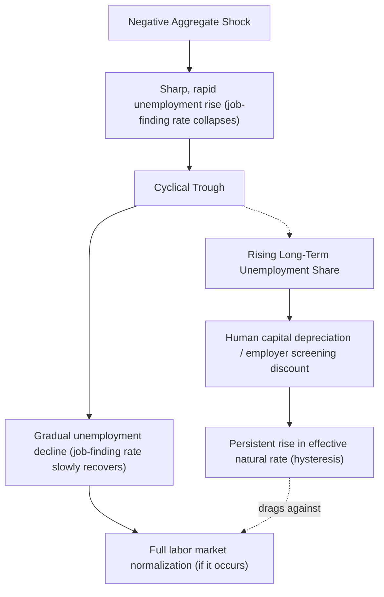

## Labor Market Dynamics Over the Business Cycle

### Scope and Relation to Adjacent Topics

This topic synthesizes the **dynamic, flow-based, and structural** perspective on how labor markets evolve through business cycle phases, integrating concepts from Business Cycles and Labor Market Fluctuations, Worker and Job Flows, and Nominal/Real Wage Rigidity into a unified framework emphasizing **propagation mechanisms, timing, and asymmetries** across the cycle. Where prior topics established individual building blocks (Okun's Law, the matching function, wage-setting frictions), this topic focuses on **how these interact dynamically** — the sequencing of adjustment, persistence/hysteresis effects, and the asymmetric character of expansions versus contractions.

**Key Points:**

- Labor market dynamics are not a simple mirror of output dynamics; they involve **distinct propagation lags, asymmetric adjustment speeds, and path-dependent (hysteresis) effects** not fully captured by contemporaneous correlations like Okun's Law
- A central organizing fact: **recessions are sharp and short; recoveries in the labor market are gradual and prolonged** — an asymmetry with important implications for both theory and policy
- Modern analysis increasingly emphasizes **heterogeneity** — dynamics differ substantially across demographic groups, industries, firm sizes, and geographic regions, even when aggregate patterns look uniform

### The Sequencing of Adjustment: A Dynamic Timeline

Labor markets do not adjust to shocks instantaneously or uniformly across margins; adjustment follows a rough sequence, most pronounced in demand-driven downturns:

1. **Immediate**: Hours reductions (cutting overtime, reducing shifts), hiring freezes (vacancies withdrawn or left unfilled)
2. **Short-run (weeks to a few months)**: Temporary layoffs, especially in sectors/firms accustomed to demand seasonality or where recall is anticipated
3. **Medium-run (months into a downturn)**: Permanent layoffs and establishment closures as firms revise expectations about the shock's persistence; labor hoarding unwinds as firms conclude reduced demand is not transitory
4. **Recovery phase**: Rehiring begins cautiously (often first via existing employees' hours, then temporary/contract workers, then permanent hires) — the sequence tends to **reverse but lag**, producing the empirically documented **"jobless recovery"** pattern where output growth resumes well before employment growth catches up

This sequencing is consistent with **labor as a quasi-fixed factor**: hiring and firing carry search, screening, training, and severance costs that make firms cautious about adjusting headcount quickly in either direction, favoring the "wait and see" behavior evident in labor hoarding during downturns and cautious rehiring during recoveries.

### Asymmetry: Sharp Downturns, Gradual Recoveries

**Key Empirical Pattern:**

$$\text{Speed of unemployment increase (recession)} \gg \text{Speed of unemployment decrease (recovery)}$$

This asymmetry is visible in essentially every postwar U.S. recession and is attributed to several combined mechanisms:

- **Search-and-matching frictions bind more tightly on the hiring margin than the separation margin**: A firm can lay off a worker essentially immediately, but hiring requires posting a vacancy, screening applicants, and successfully matching — a process with an inherent minimum duration governed by the matching function $M_t = m(U_t, V_t)$ (see Business Cycles and Labor Market Fluctuations)
- **The Shimer (2012) worker-flow decomposition** finds that most of the *cyclical rise* in unemployment is attributable to a **falling job-finding rate** (the U-to-E transition probability collapses in recessions) rather than a rising separation rate alone, and the *recovery* of unemployment is similarly dominated by the job-finding rate's slow normalization — placing the hiring-side friction, not just layoffs, at the center of the asymmetry
- **"Jobless recovery" phenomenon**: Documented especially in the recoveries following the 1990-91, 2001, and 2007-2009 U.S. recessions, where GDP resumed growth well ahead of payroll employment, a pattern less pronounced in earlier postwar recoveries — motivating research into whether structural change (increased use of restructuring/permanent layoffs rather than temporary layoffs during recessions, increased automation, offshoring) has altered the traditional cyclical rehiring pattern [Inference: causal explanations for the specific historical shift toward jobless recoveries remain debated across studies; treat as an active research question rather than a single settled explanation]

### Hysteresis: Path Dependence in Labor Market Outcomes

**Hysteresis** refers to the phenomenon where **temporary shocks produce persistent (potentially permanent) effects** on labor market outcomes, particularly the natural rate of unemployment itself — a challenge to the traditional view that cyclical unemployment is purely transitory around a fixed structural natural rate.

**Proposed Mechanisms:**

1. **Human capital depreciation**: Extended unemployment spells erode skills, reducing re-employment prospects and potentially productivity in a new job, creating a self-reinforcing cycle where the longer someone is unemployed, the harder re-employment becomes
2. **Employer statistical discrimination against the long-term unemployed**: Employers may use unemployment duration as a screening signal (rightly or wrongly inferring lower quality), independently reducing job-finding probability as duration lengthens — documented in résumé audit-style field experiments in the labor economics literature (associated with work by Kroft, Lange, and Notowidigdo, among others)
3. **Insider-outsider dynamics** (Blanchard and Summers, 1986): Employed "insiders" who survive a downturn negotiate wages with limited regard for unemployed "outsiders," preventing wages from adjusting to re-absorb the unemployed even after the original shock dissipates, effectively raising the natural rate persistently
4. **Discouraged worker exit from the labor force**: Extended unemployment leads some workers to exit the labor force entirely (particularly those nearing retirement age or with reduced attachment), permanently reducing labor supply and productive capacity even after aggregate demand recovers

**Implication**: Hysteresis implies the natural rate of unemployment $u_t^*$ is **not a fixed structural constant** but can itself be shifted by the history of cyclical unemployment — a "unit root in unemployment" view associated with European unemployment persistence debates in the 1980s-1990s, and revisited in discussions of long-term unemployment following the Great Recession and, to a lesser and more contested degree, following the COVID-19 recession. [Inference: the degree to which hysteresis materially affected the U.S. natural rate following either the Great Recession or the COVID-19 recession is empirically contested and estimates vary by study and estimation method; current-consensus positioning should be checked against recent research rather than assumed.]

### Diagram: Asymmetric Cycle Dynamics and Hysteresis Channel

### Heterogeneity in Cyclical Exposure

Aggregate labor market statistics mask substantial heterogeneity in how different groups experience the cycle:

- **By demographic group**: Younger workers, non-college-educated workers, and racial/ethnic minority workers in the U.S. consistently exhibit **higher cyclical unemployment volatility** — their unemployment rates rise disproportionately in downturns and (typically) fall disproportionately in strong recoveries, a pattern often summarized as these groups being "last hired, first fired," though the precise mechanisms (occupational/industry sorting, lower average tenure/seniority, differential access to informal hiring networks, potential discrimination) are studied individually and their relative contributions are not fully settled in a single decomposition
- **By industry**: Cyclically sensitive industries (construction, durable goods manufacturing, business/professional services affected by discretionary corporate spending) show far larger employment swings than acyclical or countercyclical industries (healthcare, education, government employment, which are typically far more stable or even mildly countercyclical in the government case)
- **By firm size and age**: As discussed under Worker and Job Flows, young firms exhibit higher job creation and destruction rates across the cycle; some research finds young/small firms are also disproportionately credit-constrained, making them more vulnerable to financial-crisis-driven downturns specifically (relevant to why the 2007-2009 recession's labor market effects had a distinct credit-channel component beyond a standard demand-shock recession)
- **By geography**: Regional/local labor markets can experience meaningfully different cyclical timing and depth depending on local industry composition (e.g., oil-price-shock-sensitive regions, manufacturing-dependent regions), motivating place-based rather than purely national analysis in some policy contexts

### Cyclical Dynamics of Long-Term Unemployment and Duration

The **distribution of unemployment duration** is itself highly cyclical, not just the aggregate rate:

- During and immediately following severe recessions, the **share of unemployed workers who are long-term unemployed (typically defined as 27+ weeks)** rises sharply and durably, since the collapse in the job-finding rate disproportionately extends the duration of existing unemployment spells rather than solely creating new short spells
- The Great Recession produced the highest sustained long-term unemployment share in the postwar U.S. record at the time, motivating substantial research (and policy debate over extended UI benefits) specifically focused on long-term unemployment as a distinct phenomenon from short-term cyclical unemployment, given its closer connection to hysteresis mechanisms
- [Verify current comparative figures against up-to-date BLS long-term unemployment series before citing specific numbers, since duration composition continues to evolve with each subsequent business cycle episode.]

### Interaction with Monetary Policy and the Sahm Rule

Given the lagged, asymmetric nature of labor market cyclical dynamics, several **real-time recession-signaling rules** have been developed using labor market data specifically because of its informativeness about turning points:

**The Sahm Rule** (developed by economist Claudia Sahm): Signals the early stages of a recession when the three-month moving average of the national unemployment rate rises by **0.50 percentage points or more** relative to its low over the previous 12 months.

$$\text{Sahm Indicator}_t = \overline{u}_{3mo,t} - \min(\overline{u}_{3mo}, \text{trailing 12 months})$$

Recession signaled when this value $\geq 0.50$.

**Key Points:**

- Designed as a **fast, real-time recession-dating heuristic**, in contrast to the NBER's official dating (which often occurs with a substantial lag, sometimes a year or more after a recession has begun, since it relies on a broad retrospective review of multiple indicators)
- Historically has had a strong track record identifying past recessions with minimal lag, but is explicitly **not** designed as a leading indicator (it signals a recession is likely already underway, not that one is approaching) and its reliability for the 2020 COVID-19 recession and subsequent periods has been separately discussed given the recession's unusual (non-standard, mandated shutdown) character [Inference: any specific claim about the rule's performance in identifying or "false-signaling" around most recent labor market data points should be checked against current commentary, as this indicator receives ongoing real-time scrutiny in financial media and among economists]
- Illustrates the broader point that **labor market data, particularly unemployment rate changes, are treated as unusually reliable real-time cyclical signals** relative to other macro indicators (e.g., GDP, which is subject to significant revision and is only available quarterly with a lag), precisely because of the well-documented asymmetric dynamics discussed above

### Model Limitations

- Much of the theoretical apparatus for these dynamics (search-and-matching, hysteresis models) is calibrated to and best validated against **historically "standard" demand-driven recessions**; atypical shocks (pandemic-driven mandated shutdowns, supply-chain-driven inflation episodes) have repeatedly revealed gaps between model predictions and observed dynamics, as seen in both the Okun's Law and Beveridge Curve anomalies during 2020-2022
- Heterogeneity findings (by demographic group, industry, firm size, geography) are drawn from a large but non-unified literature using varying datasets, time periods, and methodologies; specific quantitative comparisons (e.g., "X group's unemployment rate rises Y times faster") should be sourced to specific studies rather than treated as fixed universal ratios, since these relationships can themselves evolve across business cycles
- Hysteresis as a phenomenon is easier to document qualitatively (rising long-term unemployment shares, persistent regional unemployment differentials) than to precisely quantify in terms of its effect on the natural rate; competing empirical approaches (structural VAR, reduced-form persistence tests, DSGE model-based estimates) do not converge on a single agreed magnitude, and the degree of hysteresis appears to vary meaningfully by episode and by country/labor-market-institution context

**Related Topics:**

- Business Cycles and Labor Market Fluctuations
- Search and Matching Models and the Shimer Decomposition
- Worker and Job Flows
- Okun's Law
- Hysteresis and the Natural Rate of Unemployment
- Long-Term Unemployment and Scarring Effects
- The Sahm Rule and Real-Time Recession Indicators
- Jobless Recoveries: Structural vs. Cyclical Explanations
- Regional and Demographic Heterogeneity in Cyclical Unemployment