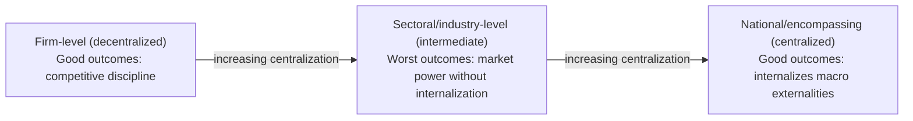

## Cross Country Labor Market Institutions

### Definition and Scope

Cross-country labor market institutions refers to the comparative study of the **formal rules, regulations, and organizational structures** that shape wage-setting, hiring, firing, and worker protection across different national labor markets, and how these institutional differences explain observed cross-national variation in unemployment levels, unemployment persistence, wage inequality, and labor market dynamics. This field sits at the intersection of labor economics, comparative political economy, and macroeconomics.

**Key Points:**

- The central empirical puzzle motivating this literature: **similar economic shocks produce very different labor market outcomes across countries** with different institutional configurations — most famously the divergence between U.S. and Continental European unemployment experiences from the 1970s-1990s
- Major institutional categories studied: employment protection legislation (EPL), unemployment insurance generosity and duration, collective bargaining coverage and centralization, minimum wage policy, active labor market policies (ALMPs), and tax wedges on labor
- The field has evolved from early "institutions cause rigidity, rigidity causes unemployment" narratives toward more nuanced views emphasizing **institutional complementarities** and interaction effects, since individual institutions in isolation often show weak or inconsistent correlations with unemployment across countries

### Employment Protection Legislation (EPL)

**Definition**: Rules governing the procedures, costs, and notice requirements for dismissing workers (individual and collective/mass layoffs), and rules governing the use of fixed-term and temporary employment contracts.

**Measurement**: The **OECD EPL Index** is the standard comparative metric, scoring countries (roughly 0-6 scale, low to high strictness) across sub-indicators including notice periods, severance pay requirements, procedural requirements for dismissal, and restrictions on temporary contracts.

**Theoretical Effects (Ambiguous Sign on Unemployment Level):**

$$\text{EPL effect on unemployment} = \underbrace{(-)\text{Reduced layoffs}}_{\text{lower separation rate}} + \underbrace{(+)\text{Reduced hiring}}_{\text{lower job-finding rate}}$$

**Key Points:**

- Standard search-and-matching theoretic results (e.g., in models building on Mortensen-Pissarides) predict that stricter EPL **reduces both job destruction and job creation** — firms are more cautious about hiring precisely because dismissal is costly, offsetting the reduced-layoff effect
- Consensus in the empirical literature (notably surveyed by Blanchard and others) is that EPL's effect on the **average unemployment level is theoretically ambiguous and empirically weak/inconsistent**, but its effect on the **composition and dynamics** of unemployment is more robust: stricter EPL is associated with **lower job/worker flow rates (reduced dynamism), longer unemployment durations, and a higher share of long-term unemployment** among the unemployed, even without necessarily raising the overall unemployment rate
- Stricter EPL is also consistently associated with a **two-tier labor market outcome** in many countries: since EPL typically applies most stringently to permanent contracts, employers respond by expanding use of fixed-term/temporary contracts for new hires (especially youth), creating a "insider" workforce with strong permanent-contract protections and an "outsider" workforce cycling through temporary contracts — well documented in Southern European labor markets (Spain, Italy, France) prior to various 2010s-era labor market reforms [Inference: describing this pattern in present tense for any specific country requires checking against that country's most recent labor law reforms, several of which have specifically targeted this dualism]

### Unemployment Insurance (UI) Generosity and Duration

**Key Comparative Metric**: The **net replacement rate** (UI benefit as a percentage of prior earnings) and **maximum benefit duration**, both of which vary enormously across OECD countries — from relatively low replacement rates and short durations (historically the U.S. pattern, with standard UI duration of 26 weeks absent extensions) to high replacement rates over extended durations (several Continental European systems).

**Theoretical Mechanism**: Standard job-search theory predicts that more generous UI (higher replacement rate, longer duration) **raises the reservation wage** and reduces search intensity, thereby **lengthening unemployment duration and potentially raising the equilibrium/natural rate of unemployment** — captured in the canonical McCall (1970) sequential search model framework.

$$w^R = \text{Reservation wage}, \quad \text{Search intensity} = s(b, D)$$

Where $b$ is the UI replacement rate and $D$ is potential duration, with $\partial w^R / \partial b > 0$ and $\partial s / \partial b < 0$ predicted by standard theory.

**Key Points:**

- Empirical estimates of UI's disincentive effect on search/duration are **generally found to be real but often modest in magnitude** relative to what simple theory might suggest, and the effect appears to vary by country and by the broader institutional context in which UI is embedded (e.g., whether generous benefits are paired with strict job-search monitoring and mandatory activation requirements, as in the Nordic "flexicurity" model)
- The interaction with **active labor market policies (ALMPs)** — job placement services, retraining programs, monitoring/sanctions for insufficient search — is central to modern comparative analysis; countries pairing generous UI with strong ALMP enforcement (Denmark, Sweden, historically cited as "flexicurity" exemplars) are argued in much of the literature to achieve more favorable unemployment outcomes than would be predicted from UI generosity alone, though this claim has itself been subject to ongoing empirical scrutiny and should not be treated as definitively settled across all specifications and time periods [Inference: the flexicurity literature contains both strongly supportive and more skeptical strands; a single confident causal claim here would overstate the consensus]

### Collective Bargaining Structure

**Two Key Dimensions**: (1) **Coverage** — the share of workers whose wages are set (or influenced) by collective agreements, which can substantially exceed union *membership* rates in countries with extension mechanisms (agreements automatically applied to non-union workers in a sector); (2) **Centralization/coordination** — whether bargaining occurs at the firm level, sectoral/industry level, or national level, and whether otherwise-decentralized bargaining is coordinated across sectors via peak-level employer/union coordination.

**The Calmfors-Driffill (1988) Hump-Shaped Hypothesis**: A highly influential (though contested) theoretical proposal that the relationship between bargaining centralization and macroeconomic (wage/employment) outcomes is **non-monotonic — hump-shaped**, with the *most decentralized* systems (firm-level, competitive) and the *most centralized* systems (national-level, encompassing) both producing relatively favorable outcomes, while **intermediate (sectoral-level) bargaining** produces the worst outcomes.

**Theoretical Logic:**

- **Fully decentralized bargaining**: Individual firms/unions internalize the full employment cost of excessive wage demands (a firm-level union that prices its members out of jobs bears that cost directly), disciplining wage demands via ordinary competitive pressure
- **Fully centralized/encompassing bargaining**: A single national union (or coordinated peak-level bargaining) internalizes economy-wide externalities of wage-push behavior (inflation, aggregate unemployment), since the union effectively represents the whole workforce and bears the macroeconomic consequences of excessive wage demands
- **Intermediate (sectoral) bargaining**: A sectoral union has market power to push up wages within its sector (since it doesn't face full competitive discipline) but is **too small to internalize the economy-wide unemployment/inflation consequences** of its wage demands, producing the worst incentive structure

**Diagram: The Hump-Shaped Relationship (Calmfors-Driffill)**

**Key Points:**

- This hypothesis generated substantial subsequent empirical testing; results are **mixed** — some cross-country studies find support for the hump shape, others find a more monotonic relationship or no robust relationship once controlling for other institutional factors, and the appropriate way to measure "centralization" versus "coordination" (which can diverge — e.g., formally decentralized bargaining that is nonetheless informally coordinated across sectors) has been a persistent methodological complication [Inference: given three decades of mixed subsequent findings, this should be presented as an influential but empirically contested hypothesis, not an established law]

### Minimum Wage Policy (Comparative Dimension)

Minimum wage institutions vary along several dimensions relevant to cross-country comparison: statutory minimum wage versus collectively-bargained sectoral minimums (some countries, e.g., historically Germany prior to 2015 and several Nordic countries, rely primarily or entirely on sectoral bargaining rather than a national statutory minimum), the **Kaitz index** (minimum wage as a ratio to median or average wage, used for cross-country comparability given different wage levels and currencies), and indexation mechanisms (automatic adjustment to inflation or average wage growth versus discretionary legislative adjustment).

- Cross-country minimum-wage-to-median-wage ratios vary substantially across OECD countries, and this variation is used in comparative studies examining how minimum wage bite (the share of the wage distribution affected) relates to employment effects — connecting to the broader minimum wage employment-effects debate covered separately in monopsony/competitive labor market theory
- [Verify current Kaitz index rankings against current OECD data before citing specific country comparisons, since minimum wage levels and median wages both change over time, shifting relative rankings.]

### Tax Wedge on Labor

The **tax wedge** measures the gap between what an employer pays for labor and what a worker receives in take-home pay, comprising income tax, employee social security contributions, and employer social security contributions, as a share of total labor cost — a standard OECD comparative metric.

$$\text{Tax Wedge} = \frac{\text{Income Tax} + \text{Employee SSC} + \text{Employer SSC}}{\text{Total Labor Cost}}$$

Higher tax wedges are theorized to reduce equilibrium employment (by driving a larger gap between labor's marginal product, which determines employer willingness to hire, and the worker's after-tax consumption wage, which determines labor supply), though the empirical magnitude of this effect and how it interacts with wage-bargaining institutions (whether the tax incidence falls more on employers or workers depends partly on bargaining structure) is a continued subject of comparative research.

### The "Eurosclerosis" Debate and Its Evolution

**Historical Context**: The term "Eurosclerosis" emerged in the 1980s to describe persistently high and seemingly structural unemployment in several Continental European economies relative to the U.S., attributed by an influential strand of the literature (associated with economists including Olivier Blanchard, Lawrence Summers, and others working on European unemployment persistence and hysteresis) to labor market institutions — generous UI, strict EPL, centralized-but-not-encompassing bargaining, high tax wedges — that collectively raised the natural rate of unemployment and slowed labor market adjustment to shocks.

**Subsequent Evolution of the Debate:**

- Several European countries undertook significant labor market reforms from the 1990s through the 2010s (notably Germany's Hartz reforms in the early-to-mid 2000s, and various Southern European reforms in the wake of the Eurozone sovereign debt crisis) explicitly targeting these institutional features, motivated substantially by this literature
- The subsequent divergence in outcomes — with Germany's unemployment rate falling substantially in the years following its reforms, while some Southern European countries continued to experience persistently elevated unemployment even after reform efforts — has generated continued debate over how much of the original Eurosclerosis diagnosis was correct, how much credit specific reforms deserve versus other contemporaneous macroeconomic factors (demand conditions, the Eurozone crisis itself, exchange rate/monetary union constraints), and how much country-specific historical, political, and institutional context matters beyond a generic "institutions vs. outcomes" framework [Inference: attributing specific country outcomes to specific reforms versus other contemporaneous macro factors remains actively debated in the literature; this is presented as an ongoing scholarly discussion, not a resolved causal finding]

### Comparative Summary Table (Illustrative Institutional Archetypes)

| Institutional Model | Representative Character | EPL | UI Generosity | Bargaining | ALMP Emphasis |
| --- | --- | --- | --- | --- | --- |
| "Liberal market economy" | Historically associated with U.S., UK (stylized) | Low | Low-moderate, shorter duration | Decentralized, low coverage | Low-moderate |
| "Coordinated/corporatist" | Historically associated with Germany, Austria | Moderate-high | Moderate-high | Sectoral, coordinated | Moderate |
| "Flexicurity" | Historically associated with Denmark | Low-moderate | High | Moderate coverage, coordinated | High |
| "Southern European/dual" | Historically associated with pre-reform Spain, Italy | High (permanent contracts) | Moderate, variable | Sectoral, moderate coverage | Historically lower, evolving |

[Note: this table reflects stylized historical archetypes commonly used for teaching comparative labor economics; specific country classifications shift over time as reforms are enacted, and any current-year comparative positioning should be verified against up-to-date OECD/ILO institutional databases rather than treated as static.]

### Institutional Complementarities: The Modern Synthesis

A key development in the field's more recent theoretical and empirical work is the emphasis on **complementarities between institutions** rather than evaluating each institution in isolation — the effect of any single institution (e.g., UI generosity) on unemployment outcomes appears to depend substantially on the surrounding institutional configuration (e.g., whether it is paired with strong ALMPs and monitoring, as in flexicurity systems, versus weaker activation requirements). This helps explain why single-institution cross-country regressions in the literature often produce weak, inconsistent, or non-robust coefficients — the "correct" specification may require interaction terms or a typological/configurational approach rather than additive linear institutional indices. [Inference: this "institutional complementarity" framing represents a widely-cited synthesis position in the comparative political economy and labor economics literatures, but the field has not converged on a single preferred empirical methodology for testing complementarity claims, and this should be understood as an active and evolving research area.]

### Model Limitations

- Cross-country institutional comparisons face significant **measurement challenges**: indices like the OECD EPL Index necessarily compress complex, multi-dimensional legal and de facto practices into single or composite scores, and de jure regulations may diverge substantially from de facto enforcement and practice across countries
- Much of the foundational empirical literature relies on **cross-sectional or panel regressions across a relatively small number of OECD countries**, raising standard concerns about statistical power, omitted variable bias (unobserved country-specific factors correlated with both institutions and outcomes), and reverse causality (labor market outcomes may themselves influence subsequent institutional choices via political economy channels)
- Given the ongoing pace of labor market reform across many economies, **any specific current-year institutional classification or comparative ranking should be independently verified** against current OECD, ILO, or national government sources rather than relied upon from this synthesis, which reflects general patterns and historically influential findings rather than a current-dated institutional snapshot

**Related Topics:**

- Employment Protection Legislation and Labor Market Dualism
- Flexicurity: The Danish Model and Its Applicability Elsewhere
- The Calmfors-Driffill Hypothesis and Bargaining Centralization
- Active Labor Market Policies: Design and Effectiveness
- The Hartz Reforms and German Labor Market Outcomes
- Hysteresis and the Natural Rate of Unemployment (cross-country dimension)
- Minimum Wage Institutions: Statutory vs. Collectively Bargained Systems
- Tax Wedges and Labor Market Outcomes