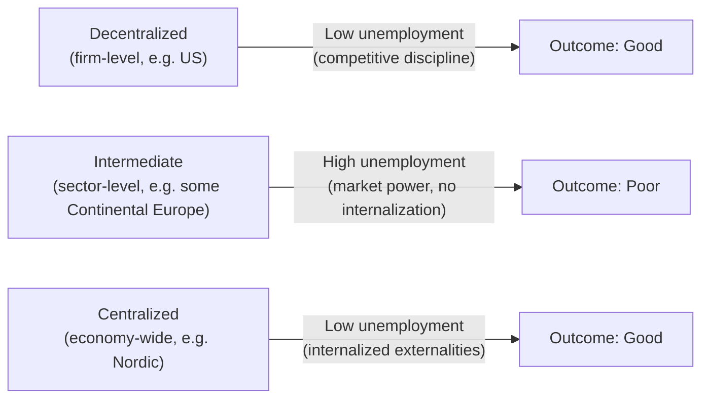
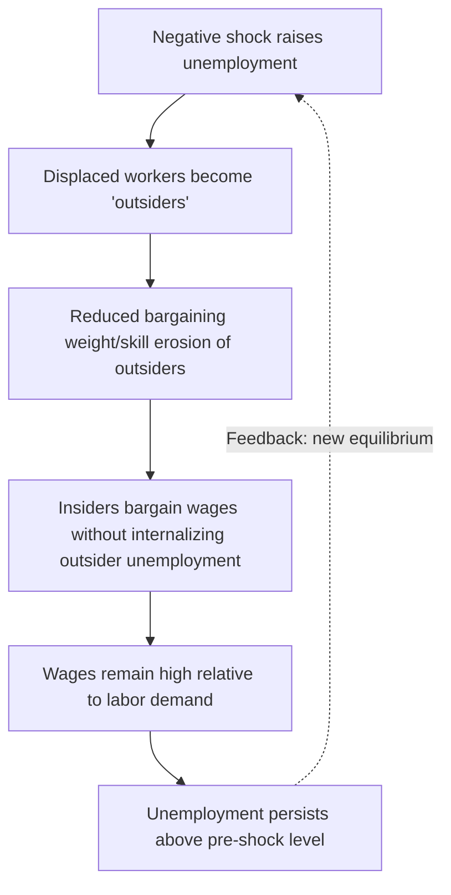

## European Versus United States Labor Market Models

### Overview and Framing

Comparative labor economics contrasts two archetypal institutional systems: the **US model**, characterized by decentralized wage-setting, weak employment protection, and low unionization, and the **European model** (itself heterogeneous across Continental, Nordic, and Mediterranean variants), characterized by coordinated wage bargaining, stronger employment protection legislation (EPL), and higher union density or bargaining coverage. The comparison is a central case study for testing theories of unemployment, wage rigidity, and labor market institutions.

The canonical empirical puzzle motivating this literature: from the 1970s through the 1990s, European unemployment rose persistently above US unemployment and remained elevated ("Eurosclerosis"), despite similar exposure to common shocks (oil price shocks, disinflation, technological change). This divergence became the empirical battleground for institutional theories of unemployment.

---

### Key Dimensions of Comparison

#### 1. Employment Protection Legislation (EPL)

EPL encompasses rules governing dismissal costs, notice periods, severance pay, and procedural requirements for layoffs.

- **US**: Employment-at-will doctrine dominates; dismissal is largely unrestricted absent discrimination or contract violation. OECD EPL index for the US is among the lowest of advanced economies.
- **Europe**: Substantially higher EPL, particularly in Southern Europe (Spain, Italy, France historically) and parts of Continental Europe (Germany). Requires "just cause," notice, severance, and often labor court or works council involvement.

**Theoretical effect**: EPL raises firing costs, which theoretically reduces both hiring and firing rates — dampening job flows but with an ambiguous net effect on the unemployment level. The Mortensen-Pissarides search framework formalizes this: higher firing taxes reduce job creation and job destruction margins simultaneously.

$$\frac{\partial u^*}{\partial F} = \frac{\partial JC}{\partial F} - \frac{\partial JD}{\partial F}$$

where $u^*$ is steady-state unemployment and $F$ is the firing cost — the sign is theoretically ambiguous and depends on which margin (creation vs. destruction) responds more strongly.

#### 2. Wage-Setting Institutions

- **US**: Decentralized, firm-level bargaining; union density under 10% in the private sector (as of the most recent BLS data); wages are highly responsive to firm and local labor market conditions.
- **Europe**: Union density varies widely, but **bargaining coverage** (workers covered by collective agreements, including non-members via extension mechanisms) is far higher than density suggests — often 80%+ in France, Germany covers a large share of manufacturing via sectoral agreements, and Nordic countries combine high density with centralized/coordinated bargaining.

The **Calmfors-Driffill hypothesis** is central here: it predicts a **hump-shaped** relationship between bargaining centralization and unemployment/real wage outcomes. Highly decentralized systems (like the US) internalize competitive pressure at the firm level; highly centralized systems (like Nordic countries) internalize economy-wide externalities of wage claims (unions "see" the inflationary/employment consequences of their demands). Intermediate, sector-level bargaining (common in parts of Continental Europe) is theorized to produce the *worst* outcomes, because sectoral unions have market power without bearing the full macroeconomic cost of high wage demands.

#### 3. Unemployment Insurance (UI) Generosity

- **US**: Relatively low replacement rates (typically 40–50% of prior wage), short duration (26 weeks standard, with occasional extensions during recessions).
- **Europe**: Higher replacement rates and substantially longer potential durations — in some countries (historically Belgium, Denmark before reform) benefits could extend multiple years or be effectively indefinite.

**Theoretical mechanism**: In job search models, UI generosity raises the reservation wage and reduces search intensity, lengthening unemployment duration.

$$w_r = b + \frac{\theta}{r+\delta}\left[E(w) - w_r\right]$$

where $w_r$ is the reservation wage, $b$ is the benefit level, $\theta$ is labor market tightness, $r$ is the discount rate, and $\delta$ is the job separation rate. Higher $b$ mechanically raises $w_r$, holding other parameters fixed.

- **[Inference]** The empirical elasticity of unemployment duration with respect to benefit generosity is well-documented in microeconometric studies (e.g., using benefit exhaustion discontinuities), but the aggregate employment effect depends on general equilibrium feedback (e.g., benefit financing through taxes) that is harder to pin down and varies by study design and country.

#### 4. Tax Wedge and Labor Costs

The **tax wedge** — the gap between what employers pay and what workers receive net of taxes — is systematically higher in Europe, driven by payroll taxes financing social insurance (pensions, health, unemployment).

- **Prescott's (2004) hypothesis**: Differences in labor supply (hours worked) between the US and Europe are substantially explained by differences in marginal tax rates on labor income, operating through a standard labor-leisure margin in a neoclassical growth framework.
- **[Inference]** This account is contested; alternative explanations emphasize preferences, non-tax institutions (e.g., mandated vacation, union bargaining over hours), and general equilibrium effects not fully captured in Prescott's calibration — this remains an active empirical debate rather than a settled fact.

#### 5. Minimum Wage and Wage Floors

- **US**: Federal minimum wage is low relative to median wage (historically around 25–35% of median, a low "Kaitz index"), with state-level variation now producing much higher effective floors in many states/cities.
- **Europe**: Statutory minimum wages where they exist (France, UK, Germany since 2015) tend to be higher relative to median wages; several countries (Germany historically, Nordic countries) rely on sectoral collective agreements rather than a statutory floor, achieving similar or higher effective wage floors through bargaining.

---

### The Blanchard-Wolfers Synthesis

A landmark contribution (Blanchard and Wolfers, 2000) argues that **neither institutions alone nor shocks alone explain the US-Europe divergence** — instead, the interaction between common shocks (disinflation, oil shocks, TFP slowdown) and pre-existing labor market institutions explains the pattern.

**Core claim**: Countries with rigid institutions (high EPL, generous and long-duration UI, centralized-but-not-coordinated bargaining) converted the same shocks that hit the US into persistently higher unemployment, because rigid institutions slow the reallocation and wage adjustment needed to absorb shocks. The US, with flexible institutions, absorbed the same shocks with smaller and more transient unemployment responses.

$$u_{it} = \alpha_i + \beta X_{it} + \gamma (Z_i \times S_t) + \varepsilon_{it}$$

where $u_{it}$ is unemployment for country $i$ at time $t$, $X_{it}$ are country-specific institutions, $S_t$ is a common shock, $Z_i$ is a time-invariant institutional variable, and the interaction term $\gamma$ captures how institutions amplify or dampen shock transmission.

- **[Inference]** This shocks-times-institutions framework has become influential but is not universally accepted as the definitive explanation; some researchers emphasize institutional change over time (e.g., Nordic reforms in the 1990s) or hysteresis mechanisms as competing or complementary accounts.

---

### Hysteresis and the Insider-Outsider Model

The **hysteresis hypothesis** (Blanchard and Summers, 1986) proposes that unemployment has no unique natural rate that the economy reverts to; instead, past unemployment affects current equilibrium unemployment — $u_t^* = f(u_{t-1})$.

**Mechanism (insider-outsider model)**: Incumbent workers ("insiders") who retain jobs bargain wages to protect their own interests, with limited regard for unemployed "outsiders" seeking work. As a recession raises unemployment, more workers become outsiders with declining bargaining relevance (skill depreciation, reduced union voting weight), so insiders continue bargaining high wages even as aggregate unemployment stays elevated — the shock becomes "locked in."

This framework was proposed partly to explain why European unemployment failed to revert to pre-shock levels after the 1970s–80s oil shocks, unlike in more flexible labor markets.

---

### Job Flows and Labor Market Dynamism

A key distinction often obscured by aggregate unemployment rates: the US has historically exhibited much higher **gross job flows** (hiring and separation rates) than Europe, even when net unemployment rates were similar.

| Dimension | United States | Continental Europe (typical) |
| --- | --- | --- |
| Job creation/destruction rates | High | Lower |
| Average job tenure | Shorter | Longer |
| Unemployment duration | Shorter (historically) | Longer |
| Incidence of long-term unemployment | Lower | Higher |
| Employment protection stringency | Low | Moderate-to-high |
| Union bargaining coverage | Low (~10-12%) | High (often 60-98%) |
| UI replacement rate/duration | Lower/shorter | Higher/longer |

**Key Points**:

- US unemployment is characterized by high turnover but short spells — a "high-churn, low-duration" regime.
- European unemployment (particularly Southern Europe) is characterized by lower turnover but longer spells — a "low-churn, high-duration" regime, with long-term unemployment (12+ months) comprising a much larger share of the unemployed stock.
- **[Inference]** This distinction matters for policy: interventions targeting job-finding rates (active labor market policy, job search assistance) may be more effective in high-duration regimes, whereas interventions targeting job destruction/creation margins may matter more in high-churn regimes — though the optimal policy mix is model-dependent and debated.

---

### Nordic Model as a Counter-Case

The Nordic countries (Denmark, Sweden) complicate the simple "flexible-US-good, rigid-Europe-bad" narrative, since they combine **high UI generosity and high union coverage with low structural unemployment** — achieved via:

- **Flexicurity** (notably Denmark): combines low EPL (flexible hiring/firing, similar to liberal market economies) with generous UI and *active* labor market policy — a "golden triangle" requiring job search/training participation as a condition of continued benefits.
- **Active Labor Market Policies (ALMPs)**: substantial public spending (as a share of GDP) on job training, placement services, and wage subsidies, which are theorized to offset the disincentive effects of generous UI by maintaining job-search intensity and human capital.

**Example**: Denmark's model is frequently cited as evidence that the EPL-UI-unemployment relationship is not mechanical — institutional *complementarities* matter more than any single lever in isolation.

---

### Southern European Divergence: Dual Labor Markets

Spain, Italy, and (to a lesser extent) France illustrate a distinct pathology: **labor market dualism**, where strict EPL for permanent contracts coexists with liberalized fixed-term/temporary contracts (introduced via reforms since the 1980s–90s to increase flexibility "at the margin").

**Consequence**: Firms adjust employment via temporary contract non-renewal rather than layoffs of permanent workers, concentrating job insecurity and unemployment risk on younger workers and labor market entrants — producing very high youth unemployment rates (frequently 25–40%+ during downturns in Spain) alongside strong protection for incumbent permanent workers.

$$\text{Dualism Index} \approx \frac{\text{EPL}_{\text{permanent}} - \text{EPL}_{\text{temporary}}}{\text{EPL}_{\text{permanent}}}$$

A larger gap correlates with a higher share of temporary employment and more volatile youth unemployment.

---

### US-Specific Institutional Features

- **Right-to-work laws**: State-level laws (mostly in the South and parts of the Midwest/Mountain West) prohibiting union security agreements, correlating with lower union density and, in some studies, lower wages net of cost-of-living differences.
- **Employment-at-will with exceptions**: Public policy, implied contract, and covenant-of-good-faith exceptions vary substantially by state, meaning "the US model" is itself not fully homogeneous.
- **Health insurance tied to employment**: A distinctive US feature (employer-sponsored health insurance as the dominant coverage mode) creates "job lock" — workers may remain in jobs suboptimal for productivity/matching reasons to retain coverage, a friction largely absent in Europe's universal healthcare systems that are decoupled from employment status.

---

### Convergence and Divergence Since the 2000s

- Many Continental European countries undertook labor market reforms in the 2000s–2010s (Germany's Hartz reforms of 2003–2005 being the most cited), reducing UI generosity, liberalizing part-time/temporary work (mini-jobs), and increasing activation requirements — associated with a substantial subsequent decline in German unemployment.
- The **Great Recession (2008–09) and Eurozone crisis** produced sharply divergent outcomes *within* Europe: Germany and Nordic countries maintained relatively low unemployment (aided by short-time work/Kurzarbeit schemes subsidizing reduced hours over layoffs), while peripheral Eurozone countries (Spain, Greece) saw unemployment exceeding 25%.
- **[Unverified]** Whether post-2010s trends represent durable convergence toward a hybrid model or a temporary cyclical pattern remains actively debated among labor economists, and views differ by country and time horizon.

---

### Short-Time Work / Work-Sharing Schemes

**Kurzarbeit** (Germany) and analogous schemes (chômage partiel in France, Cassa Integrazione in Italy) allow firms to reduce hours rather than lay off workers, with the government subsidizing the wage shortfall.

**Mechanism**: Preserves firm-specific human capital and match quality during temporary demand shocks, avoiding costly rehiring/rematching once demand recovers.

$$w_{\text{subsidy}} = \beta \cdot (h_{\text{normal}} - h_{\text{reduced}}) \cdot w$$

where $\beta$ is the government replacement rate for lost hours.

- **Example**: During the 2008–09 recession, Germany's unemployment rate barely rose despite an output contraction comparable to the US, widely attributed in part to extensive short-time work uptake — while US unemployment rose sharply, consistent with the US's reliance on layoffs (the extensive margin) rather than hours adjustment (the intensive margin) to absorb demand shocks.
- The US has a smaller, less-utilized analog (Short-Time Compensation programs at the state level), historically with much lower take-up than European counterparts.

---

### Illustrative Diagram: Institutional Configuration Space

svg_diagram

<svg xmlns="http://www.w3.org/2000/svg" viewBox="0 0 640 420" font-family="sans-serif">

<text x="320" y="24" text-anchor="middle" font-size="16" font-weight="bold">Labor Market Institutional Configurations (svg_diagram)</text>

<line x1="80" y1="360" x2="580" y2="360" stroke="#333" stroke-width="2" />
<line x1="80" y1="360" x2="80" y2="50" stroke="#333" stroke-width="2" />
<text x="330" y="395" text-anchor="middle" font-size="13">Bargaining Centralization / Coordination →</text>
<text x="30" y="205" text-anchor="middle" font-size="13" transform="rotate(-90 30 205)">Employment Protection (EPL) →</text>
<circle cx="140" cy="330" r="10" fill="#2b6cb0" />
<text x="150" y="335" font-size="12">US (low EPL, decentralized)</text>
<circle cx="500" cy="100" r="10" fill="#2f855a" />
<text x="360" y="90" font-size="12">Nordic (coordinated, flexicurity)</text>
<circle cx="330" cy="140" r="10" fill="#c05621" />
<text x="345" y="140" font-size="12">Germany (sectoral, moderate EPL)</text>
<circle cx="300" cy="300" r="10" fill="#9b2c2c" />
<text x="315" y="300" font-size="12">Spain/Italy (dual, high EPL-permanent)</text>
<circle cx="220" cy="230" r="10" fill="#6b46c1" />
<text x="235" y="230" font-size="12">France (sectoral extension, high EPL)</text>
</svg>

---

### Worked Numerical Example: Search Model Comparison

Consider a simplified Mortensen-Pissarides steady state where job finding rate $f(\theta)$ and separation rate $\delta$ jointly determine unemployment:

$$u^* = \frac{\delta}{\delta + f(\theta)}$$

**Stylized US parameterization**: $\delta = 0.03$ (monthly), $f(\theta) = 0.45$ (high job-finding rate reflecting low EPL/high churn) →

$$u^*_{US} = \frac{0.03}{0.03+0.45} = 0.0625 \approx 6.25\%$$

**Stylized Continental European parameterization**: $\delta = 0.015$ (lower separation, reflecting high EPL), $f(\theta) = 0.10$ (lower job-finding rate, reflecting hiring caution and search frictions) →

$$u^*_{EU} = \frac{0.015}{0.015+0.10} = 0.1304 \approx 13.04\%$$

**Example**: Despite the European case having a *lower* separation rate (fewer people entering unemployment per month, consistent with strong EPL protecting incumbents), it produces *higher* steady-state unemployment because the job-finding rate falls by proportionally more — illustrating that EPL's effect on hiring caution can dominate its effect on reduced separations, an outcome the theoretical model above flagged as ambiguous but which this calibration resolves toward a higher-unemployment equilibrium. These parameter values are illustrative for pedagogical purposes, not calibrated to a specific country-year.

---

### Conclusion

The US-Europe comparison functions as the primary natural experiment in labor economics for isolating the effects of institutions (EPL, UI, bargaining structure, tax wedges) on unemployment, wage dynamics, and labor market flows. No single institution fully explains the historical divergence; the modern consensus (post-Blanchard-Wolfers) emphasizes **interactions between institutions and shocks**, institutional **complementarities** (as the Nordic flexicurity case demonstrates), and the importance of **within-Europe heterogeneity** that a simple "Europe vs. US" binary obscures. Contemporary research increasingly treats "the European model" as a family of distinct configurations (Nordic, Continental, Southern, Liberal-UK) rather than a monolith.

---

**Related Topics**

- Mortensen-Pissarides search and matching model (formal derivation)
- Calmfors-Driffill hypothesis and bargaining centralization
- Hartz reforms and German labor market transformation (2003–2005)
- Flexicurity model (Denmark) in depth
- Hysteresis and the natural rate of unemployment
- Insider-outsider wage bargaining models
- Dual labor markets and temporary contract proliferation (Spain/France)
- Short-time work schemes (Kurzarbeit) and recession dynamics
- Tax wedge and labor supply: the Prescott debate
- Active labor market policies: design and evaluation evidence
- Job polarization and skill-biased technological change across OECD countries
- Minimum wage policy design: statutory vs. collectively bargained floors