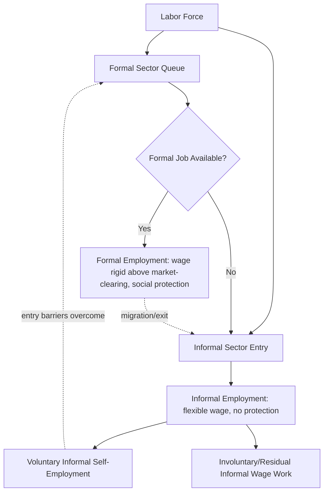

## Informal Labor Markets in Developing Countries

### Definition and Scope

Informal labor markets encompass economic activities and employment relationships that operate outside formal legal and regulatory frameworks — unregistered enterprises, unwritten employment contracts, and transactions not subject to labor law, taxation, or social protection systems. The International Labour Organization (ILO) defines informal employment as jobs lacking basic legal or social protections, whether occurring in informal enterprises, formal enterprises, or households.

Two overlapping concepts require distinction:

- **Informal sector**: defined by enterprise characteristics (unregistered, small-scale, often household-based production units)
- **Informal employment**: defined by job characteristics (lack of social security, written contracts, paid leave, or severance protections), which can occur even within formally registered firms

A worker can therefore be formally employed in an informal enterprise, or informally employed within a formal enterprise (e.g., an undeclared cash-paid worker at a registered firm).

### Measurement and Scale

Informality is measured primarily through labor force surveys, establishment censuses, and mixed household-enterprise surveys. Common metrics include:

- **Share of non-agricultural employment that is informal**
- **Informal employment as % of total employment** (including agriculture)
- **Value added generated by informal enterprises as % of GDP**

[Unverified] Precise cross-country figures fluctuate by survey methodology and year, but ILO estimates have consistently placed informal employment at roughly 60% of global employment, with substantially higher shares in Sub-Saharan Africa and South Asia (often exceeding 80%) compared to Latin America and Eastern Europe (30–60%). Readers should consult the ILO's *Women and Men in the Informal Economy* statistical database for current figures rather than relying on any single cited number.

### Theoretical Frameworks

#### Dualist View

Treats the informal sector as a residual, low-productivity segment absorbing labor that formal sectors cannot employ, per the Lewis (1954) dual-economy model and its labor-surplus tradition. Informality here is a survival strategy, not a choice.

#### Structuralist View

Sees informality as functionally linked to formal capitalism: formal firms subcontract to informal producers to reduce labor costs, evade regulation, and gain flexibility. Informality is not separate from but subordinate to and shaped by formal-sector dynamics (Portes, Castells, and Benton, 1989).

#### Legalist View

Associated with de Soto (1989), argues informality results from excessive regulatory and bureaucratic costs of formalization (registration fees, licensing delays, tax compliance burdens). Workers and firms rationally opt out of a costly formal system; informality is an entrepreneurial response to a bad institutional environment.

#### Voluntarist / Exit View

Extends the legalist view with a labor-market lens: some workers voluntarily choose informal self-employment over formal wage work because it offers higher net returns, autonomy, or flexibility — informality as an exit option rather than a queue of the excluded (Maloney, 2004). This challenged the earlier consensus that informality was purely involuntary.

**Key Points**

- No single theory fully explains informality; empirical heterogeneity across countries and sectors typically requires blending frameworks
- The dualist/structuralist views emphasize exclusion; legalist/voluntarist views emphasize choice
- Segmentation and choice are not mutually exclusive — labor markets can exhibit rationed formal jobs alongside voluntary informal self-employment simultaneously

### Determinants of Informality

$$I = f(\tau, R, E, H, \Pi_f - \Pi_i)$$

where $\tau$ is the tax burden, $R$ is regulatory/compliance cost, $E$ is enforcement intensity, $H$ is human capital endowment, and $\Pi_f - \Pi_i$ is the profitability differential between formal and informal operation.

Principal determinants documented in the literature:

- **Regulatory and tax burden**: Higher minimum wages, payroll taxes, and firing costs raise the relative cost of formal labor, particularly for small firms operating near subsistence margins
- **Enforcement capacity**: Weak labor inspectorates and judicial systems reduce the expected cost of noncompliance
- **Human capital**: Workers with low education face limited formal-sector job opportunities; formal employment correlates strongly with schooling attainment
- **Firm size and productivity**: Small, low-productivity firms are disproportionately informal since fixed compliance costs are non-trivial relative to their revenue
- **Development stage**: Informality shares generally, though not universally, decline as GDP per capita rises — the pattern is not strictly monotonic and can be interrupted by demographic pressure or policy shocks
- **Urbanization and rural-urban migration**: Rapid urban population growth without corresponding formal job creation channels labor into urban informal activities (street vending, informal transport, domestic work)
- **Social norms and trust in institutions**: Perceived legitimacy of the state and tax system affects voluntary compliance independent of pure cost-benefit calculation

### Labor Market Segmentation Models

A standard two-sector segmented labor market can be represented:

In the Harris-Todaro (1970) extension applied to informality, workers migrate to urban areas and queue for formal jobs while accepting informal work as a waiting strategy, provided:

$$w_f \cdot p > w_i$$

where $w_f$ is the formal wage, $p$ is the probability of obtaining a formal job, and $w_i$ is the informal wage — migration and informal-sector entry continue until this expected-wage equality holds at the margin.

### Wage Determination and the Formal-Informal Wage Gap

Empirical labor economics has extensively studied whether a wage penalty exists for informal work after controlling for observables. Using a standard Mincerian framework augmented with a formality indicator:

$$\ln(w_i) = \beta_0 + \beta_1 S_i + \beta_2 X_i + \beta_3 F_i + \varepsilon_i$$

where $S_i$ is schooling, $X_i$ is experience and other controls, and $F_i$ is a formal-sector dummy. $\beta_3$ captures the raw formal-informal wage gap.

Decomposition techniques (Oaxaca-Blinder, and quantile variants such as Machado-Mata or RIF regressions) are used to separate the gap into:

- **Endowment effects**: differences in observable characteristics (education, experience, sector)
- **Structural/return effects**: differences in returns to the same characteristics across sectors (unexplained residual, often interpreted as segmentation)

[Inference] Findings across country studies are mixed: many Latin American studies (e.g., Mexico, Brazil) find a wage penalty concentrated in the lower part of the wage distribution but a wage *premium* for informal self-employment at upper quantiles, consistent with a mixed voluntary/involuntary informal workforce rather than a single homogeneous segment. This pattern should be treated as a stylized finding subject to country and period variation rather than a universal law.

### Social Protection and the Informality Trap

Informal workers systematically lack:

- Employer-sponsored health insurance and pension contributions
- Unemployment insurance eligibility
- Legal recourse for unpaid wages, unsafe conditions, or wrongful dismissal
- Access to formal credit markets (since informal income is unverifiable to lenders)

This generates a **contributory social insurance trap**: financing pensions and health insurance through payroll taxes on formal wages creates an incentive to remain informal, especially where noncontributory (tax-financed) social programs — such as Mexico's *Seguro Popular* or various Latin American noncontributory pension schemes — provide partial benefits without formal-sector contribution, effectively subsidizing informality at the margin. [Inference] This has been documented as a policy-design tension in several Latin American health-financing reforms, though the magnitude of the disincentive effect is debated across studies.

### Firm-Level Dynamics and Productivity

Informal firms typically exhibit:

- Lower capital intensity and limited access to formal credit, constraining investment in productivity-enhancing technology
- Smaller average scale, since staying below regulatory size thresholds (e.g., labor law applicability cutoffs) is often deliberate
- Limited contract enforcement capacity, restricting transactions to networks with strong personal trust (family, ethnic, or community ties) rather than arm's-length exchange
- A persistent formal-informal productivity gap; [Inference] cross-country firm census data generally show informal firms operating at a fraction of formal-sector value added per worker, though comparisons are sensitive to sector composition and self-selection into informality by inherently lower-productivity operators

### Policy Instruments and Formalization Strategies

**Key Points**

- **Simplification regimes**: Single-window business registration, simplified tax regimes (e.g., Brazil's *Simples Nacional*, Peru's *RUS*) reduce compliance costs to encourage voluntary formalization
- **Graduated/threshold-based taxation**: Progressive compliance requirements tied to firm size reduce the "cliff effect" at formalization thresholds
- **Enforcement and inspection reform**: Risk-based labor inspection targeting, rather than blanket enforcement, balances compliance incentives against administrative capacity constraints
- **Noncontributory-to-contributory bridging**: Portable benefits and matching-contribution schemes (e.g., Colombia's *BEPS* individual savings accounts) aim to reduce the contributory trap described above
- **Demand-side formalization**: Requiring formal registration for participation in public procurement or value-chain contracts with large formal firms
- **Digital payment and e-registration infrastructure**: Mobile money and digital tax platforms (e.g., Kenya's iTax, India's GST/Aadhaar-linked systems) lower transaction costs of formal participation, though [Unverified] their net effect on informality rates depends heavily on complementary enforcement and remains an active area of empirical study

### Case Illustration: India's Employment Structure

India presents a widely studied case given the scale of its informal workforce (both non-agricultural and agricultural). The bulk of India's Gross Value Added still originates substantially from informal enterprises despite large-scale formal-sector growth. **Example**: Government initiatives such as GST implementation (2017) and pushes toward digital wage payment aimed partly at formalization measurement and tax base expansion, alongside labor-code consolidation reforms (2019–2020) intended to simplify the previously fragmented labor law structure covering formal establishments. [Unverified] The net formalization impact of these reforms is still debated in the empirical literature and sensitive to measurement definitions used across survey rounds.

### Diagrammatic Summary: Formal-Informal Wage Distribution Overlap

<svg xmlns="http://www.w3.org/2000/svg" viewBox="0 0 640 340">
<text x="320" y="24" text-anchor="middle" font-size="15" font-weight="bold" fill="#1a1a1a">Formal vs. Informal Wage Distributions (svg_diagram)</text>
<line x1="60" y1="280" x2="600" y2="280" stroke="#333" stroke-width="1.5" />
<line x1="60" y1="280" x2="60" y2="50" stroke="#333" stroke-width="1.5" />
<text x="320" y="315" text-anchor="middle" font-size="12" fill="#333">Log Wage</text>
<text x="25" y="165" text-anchor="middle" font-size="12" fill="#333" transform="rotate(-90 25 165)">Density</text>
<path d="M 90 280 C 130 280, 150 100, 190 100 C 230 100, 250 280, 290 280" fill="none" stroke="#2166ac" stroke-width="2.5" />
<path d="M 210 280 C 260 280, 290 60, 340 60 C 390 60, 420 280, 470 280" fill="none" stroke="#b2182b" stroke-width="2.5" />
<rect x="480" y="60" width="14" height="14" fill="#2166ac" />
<text x="500" y="72" font-size="12" fill="#333">Informal</text>
<rect x="480" y="82" width="14" height="14" fill="#b2182b" />
<text x="500" y="94" font-size="12" fill="#333">Formal</text>
<line x1="190" y1="280" x2="190" y2="100" stroke="#2166ac" stroke-dasharray="3,3" stroke-width="1" />
<line x1="340" y1="280" x2="340" y2="60" stroke="#b2182b" stroke-dasharray="3,3" stroke-width="1" />
<text x="190" y="295" text-anchor="middle" font-size="10" fill="#2166ac">median (I)</text>
<text x="340" y="295" text-anchor="middle" font-size="10" fill="#b2182b">median (F)</text>
</svg>

The overlapping tails illustrate why the formal-informal wage gap is heterogeneous across the distribution rather than a uniform shift, motivating quantile-based rather than mean-based empirical approaches.

### Data Sources for Further Study

- ILO ILOSTAT and *Women and Men in the Informal Economy* database
- World Bank Informal Sector Enterprise Surveys
- National labor force surveys with informality modules (e.g., Mexico's ENOE, Brazil's PNAD Contínua, India's PLFS)

**Related Topics**

- Dual Labor Market Theory and Segmentation
- Minimum Wage Effects in Developing Economies
- Social Protection Financing and Contributory Traps
- Rural-Urban Migration and the Harris-Todaro Model
- Microfinance and Informal Credit Markets
- Labor Regulation and Firm Size Distribution
- Tax Morale and Voluntary Compliance
- Gig Economy and Platform Work as Emerging Informality