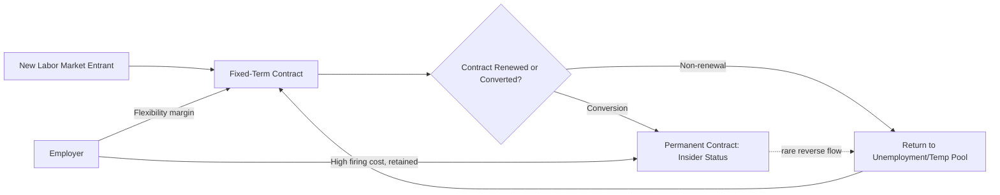

## Labor Market Dualism

### Definition and Core Concept

Labor market dualism refers to the persistent division of a labor market into two (or more) segments characterized by systematically different employment conditions, wage-setting mechanisms, job stability, and mobility barriers between them, such that similarly productive workers can face different outcomes purely as a function of which segment they occupy. Unlike frictional or compensating wage differentials that equilibrate over time, dualism implies structural, persistent segmentation not fully arbitraged away by worker mobility.

The concept is distinct from, but closely related to, informality (see prior item): dualism is the broader labor-economics framework describing segmented markets generally, of which formal/informal segmentation in developing economies is one prominent application. Dualism also appears in advanced-economy contexts — most notably in contract-type segmentation (permanent vs. temporary employment) in continental European labor markets.

### Historical Origins: Development Economics Roots

The dualist framework originates in development economics with the Lewis (1954) model of "economic development with unlimited supplies of labor," positing a traditional/subsistence sector (agriculture, informal activity) coexisting with a modern capitalist sector, with labor migrating from the former to the latter as capital accumulates. Lewis's model was primarily about *sectoral* dualism (traditional vs. modern), which later scholarship extended into *labor market* dualism proper — segmentation within the modern, formal wage-labor market itself.

### Segmented Labor Market Theory

Developed principally by Doeringer and Piore (1971), segmented labor market (SLM) theory identifies two contract-based segments within formal wage employment:

#### Primary Segment

- Stable employment relationships, often with internal labor markets and firm-specific promotion ladders
- Higher wages, greater job security, employer-provided training
- Governed by administrative rules and customary practice rather than pure spot-market wage-setting

#### Secondary Segment

- High turnover, low wages, minimal training investment
- Employment governed largely by external spot-market conditions
- Limited or no internal promotion mechanism

**Key Points**

- Mobility between segments is theorized to be restricted — not by worker choice, but by employer hiring practices, credentialing barriers, discrimination, or the structure of internal labor markets themselves
- This contrasts with neoclassical human capital theory, which predicts wage differences arise from differences in worker-embodied productivity rather than job-specific institutional structure
- SLM theory was partly motivated by observed persistent wage and unemployment differentials across race and gender in the U.S. labor market that human capital models struggled to fully explain

### Insider-Outsider Theory

A complementary formalization, developed by Lindbeck and Snower (1988), explains dualism through labor turnover costs. Firms face hiring, firing, and training costs $C$ that create rents for incumbent "insiders." Insiders can extract wages above the market-clearing level because:

$$w_{insider} \le w_{competitive} + C$$

Firms tolerate this wage premium up to the point where replacing an insider (paying $C$) plus hiring an outsider at a lower wage is no longer profitable. Outsiders — the unemployed or those in precarious/temporary contracts — cannot underbid insiders because turnover costs insulate incumbents from wage competition, even though outsiders may be equally productive.

This theory is frequently invoked to explain **contract-type dualism** in OECD labor markets: strict employment protection legislation (EPL) on permanent contracts raises $C$, which paradoxically increases reliance on temporary contracts at the margin, since firms use fixed-term hiring to retain flexibility without incurring the full firing-cost liability of permanent hires.

### Contract-Type Dualism in OECD Economies

A distinct strand of dualism research, prominent in Southern European labor economics (Spain, Italy, France), examines the coexistence of:

- **Permanent (open-ended) contracts**: high dismissal costs, strong protection
- **Fixed-term/temporary contracts**: minimal protection, often capped duration, easily terminated

[Inference] Empirical labor economics research on Spain's 1984 reform, which liberalized fixed-term contracting while leaving permanent-contract protection largely intact, is widely cited as having produced a sharp rise in temporary employment shares without a correspondingly large net employment gain — commonly interpreted as evidence that partial deregulation at the margin generates dualism rather than resolving rigidity. Exact estimated magnitudes vary across studies and should be checked against the specific paper (e.g., Bentolila and Dolado, 1994; Dolado, García-Serrano, and Jimeno, 2002) rather than treated as a single fixed figure.

### Formal Modeling: A Two-Sector Wage Equation

A canonical dualist wage model can be represented as two separate wage-setting equations:

$$w_p = \alpha_0 + \alpha_1 X + \alpha_2 T + u_p$$

$$w_s = \beta_0 + \beta_1 X + u_s$$

where $w_p$ and $w_s$ denote primary- and secondary-segment wages respectively, $X$ is a vector of observable worker characteristics, $T$ captures firm-specific tenure/internal labor market effects present only in the primary sector, and $u_p, u_s$ are segment-specific error terms. The key testable prediction of dualism is $\alpha_1 \ne \beta_1$ — i.e., **differential returns to identical observable characteristics across segments** — rather than merely different intercepts, which could instead reflect compensating differentials.

Econometric identification of dualism typically proceeds via:

- **Switching regression models** with endogenous segment selection (Dickens and Lang, 1985), explicitly modeling the probability of primary-segment placement as a function of both worker and structural variables
- **Quantile decomposition** to detect whether wage-return differentials are concentrated at particular points in the distribution
- **Job-to-job transition matrices**, testing whether transitions between segments occur less frequently than a null model of random mobility would predict

### Empirical Tests and Evidence Debates

**Key Points**

- Early tests (Dickens and Lang, 1985) using U.S. data found statistical support for a two-sector switching model outperforming a single-equation human capital model
- Critics (Cain, 1976) argued observed wage segmentation may instead reflect unobserved heterogeneity in worker ability or unmeasured job characteristics (compensating differentials), not true structural segmentation — an identification problem that remains unresolved in a fully general sense
- [Unverified] The debate over whether dualism reflects genuine structural rigidity versus statistical artifacts of unobserved heterogeneity has not been definitively settled in the literature and continues to depend on the specific institutional context and identification strategy used
- More recent European contract-dualism literature tends to rely on administrative panel data with worker fixed effects, which partially addresses (though does not fully eliminate) the unobserved-ability critique

### Distributional and Macroeconomic Consequences

- **Wage inequality**: Dualism is frequently cited as a contributor to within-education-group wage dispersion, since two workers with identical schooling can receive systematically different wages depending on segment placement
- **Unemployment dynamics**: Insider-outsider dynamics can generate wage-setting behavior insensitive to outsider unemployment levels, contributing to persistently high "hysteresis"-type unemployment, per Blanchard and Summers (1986)
- **Business cycle amplification**: In contract-dual economies, temporary workers bear a disproportionate share of employment adjustment during downturns, since firing costs make permanent-contract adjustment far more expensive — this has been empirically documented in Spain's employment volatility during the 2008–2013 recession, where job destruction was heavily concentrated among temporary contract holders
- **Human capital underinvestment**: Firms have reduced incentive to invest in training for secondary/temporary-segment workers given expected short tenure, potentially generating a self-reinforcing productivity gap between segments

### Policy Responses

**Key Points**

- **Single/unified contract proposals**: Replace the sharp permanent/temporary distinction with one contract type featuring firing costs that increase gradually (smoothly) with tenure, reducing the discontinuity firms exploit — proposed in various forms for Spain, France, and Italy
- **Convergence reforms**: Simultaneously reducing permanent-contract protection and tightening temporary-contract restrictions to narrow the protection gap (e.g., Italy's *Jobs Act*, 2015, introducing tenure-graduated protections)
- **Training mandates for temporary workers**: Requiring employer or public investment in portable skills certification independent of contract type, to counteract the human-capital underinvestment channel
- **Active labor market policy (ALMP) targeting**: Directing job-search assistance and retraining disproportionately toward secondary-segment/outsider workers to improve transition rates into primary employment

### Diagrammatic Summary: Dualist Segmentation Structure

<svg xmlns="http://www.w3.org/2000/svg" viewBox="0 0 640 320">
<text x="320" y="24" text-anchor="middle" font-size="15" font-weight="bold" fill="#1a1a1a">Primary vs. Secondary Segment Structure (svg_diagram)</text>
<rect x="60" y="60" width="220" height="200" rx="8" fill="#e8f0fb" stroke="#2166ac" stroke-width="2" />
<text x="170" y="90" text-anchor="middle" font-size="13" font-weight="bold" fill="#2166ac">Primary Segment</text>
<text x="170" y="115" text-anchor="middle" font-size="11" fill="#333">Internal labor markets</text>
<text x="170" y="135" text-anchor="middle" font-size="11" fill="#333">Job security</text>
<text x="170" y="155" text-anchor="middle" font-size="11" fill="#333">Training investment</text>
<text x="170" y="175" text-anchor="middle" font-size="11" fill="#333">Administrative wage rules</text>
<text x="170" y="195" text-anchor="middle" font-size="11" fill="#333">Promotion ladders</text>
<rect x="360" y="60" width="220" height="200" rx="8" fill="#fbe9e7" stroke="#b2182b" stroke-width="2" />
<text x="470" y="90" text-anchor="middle" font-size="13" font-weight="bold" fill="#b2182b">Secondary Segment</text>
<text x="470" y="115" text-anchor="middle" font-size="11" fill="#333">Spot-market wage-setting</text>
<text x="470" y="135" text-anchor="middle" font-size="11" fill="#333">High turnover</text>
<text x="470" y="155" text-anchor="middle" font-size="11" fill="#333">Minimal training</text>
<text x="470" y="175" text-anchor="middle" font-size="11" fill="#333">Low job security</text>
<text x="470" y="195" text-anchor="middle" font-size="11" fill="#333">Limited promotion path</text>
<line x1="280" y1="160" x2="360" y2="160" stroke="#555" stroke-width="1.5" stroke-dasharray="5,4" marker-end="url(#arrow)" />
<text x="320" y="150" text-anchor="middle" font-size="10" fill="#555">restricted mobility</text>
</svg>

**Related Topics**

- Insider-Outsider Wage Theory (Lindbeck-Snower Formalization)
- Employment Protection Legislation and Labor Market Rigidity
- Informal Labor Markets in Developing Countries
- Internal Labor Markets and Firm-Specific Human Capital
- Hysteresis in Unemployment
- Compensating Wage Differentials vs. Structural Segmentation
- Active Labor Market Policies and Outsider Reintegration
- Temporary Agency Work and the Gig Economy as Emerging Dualism