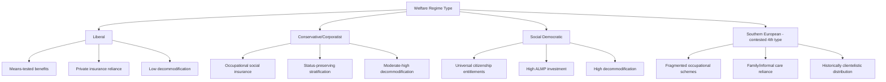

## Comparative Welfare State Regimes

### Definition and Scope

Comparative welfare state regime theory analyzes how developed economies organize the provision of social protection, income redistribution, and labor market risk-sharing into distinct institutional clusters, rather than treating welfare states as varying along a single spending-level continuum. The field's foundational contribution is Gøsta Esping-Andersen's *The Three Worlds of Welfare Capitalism* (1990), which argued that welfare states differ qualitatively — in the *logic* of social provision, not merely its *magnitude* — with direct consequences for labor supply incentives, wage-setting institutions, and employment structure.

### Esping-Andersen's Typology

#### Core Analytical Concept: Decommodification

The organizing concept is **decommodification** — the degree to which an individual's standard of living is rendered independent of market participation, i.e., the extent to which social entitlements (pensions, unemployment benefits, sick pay) are available as a matter of citizenship right rather than contingent on continued labor market attachment or means-testing.

$$D = f(\text{eligibility criteria}, \text{replacement rate}, \text{benefit duration}, \text{means-testing intensity})$$

Higher decommodification implies workers can withdraw from or refuse employment without severe income loss, altering reservation wages and labor supply elasticity.

#### Liberal Regime

- Examples: United States, United Kingdom, Canada, Australia
- Characterized by means-tested assistance, modest universal transfers, and reliance on private/market-based insurance (private pensions, employer health coverage)
- Low decommodification: benefits typically low, stigmatized, and short-duration, preserving strong work incentives
- Labor market correlate: greater wage flexibility and dispersion, weaker unionization, lower employment protection

#### Conservative/Corporatist Regime

- Examples: Germany, France, Austria, Italy (with variants)
- Rooted in Bismarckian social insurance traditions, benefits linked to employment status and occupational category rather than universal citizenship
- Moderate-to-high decommodification, but stratified by occupational/status group rather than equalized across the population
- Preserves traditional family structures via limited support for female labor force participation historically (e.g., joint taxation, limited public childcare) — [Inference] though this has weakened materially in several conservative-regime countries since the 1990s and should not be assumed to hold at current-day intensity
- Labor market correlate: strong employment protection legislation, coordinated wage bargaining, insider-oriented social insurance financing (contributions tied to formal payroll)

#### Social Democratic Regime

- Examples: Sweden, Denmark, Norway, Finland
- Universal, high-benefit-level entitlements delivered as citizenship rights rather than means-tested transfers
- Highest decommodification: strong income replacement combined with extensive active labor market policy (ALMP) investment
- Explicit policy goal of enabling full labor force participation (including women) via public childcare and elder care provision, reducing reliance on family-based care labor
- Labor market correlate: high public-sector employment share, compressed wage structure via centralized bargaining, heavy ALMP spending funded through general taxation

**Key Points**

- The typology is analytically distinct from a simple "big government vs. small government" spectrum — conservative regimes can have high total social spending while remaining minimally redistributive across income classes, since benefits mirror prior contributions
- Esping-Andersen's original three-regime typology has faced extensive critique for insufficiently capturing non-European cases

### Extensions and Critiques of the Typology

#### The "Fourth World": Southern European / Mediterranean Regime

Proposed by Ferrera (1996) and others to capture Spain, Italy, Greece, and Portugal, characterized by fragmented, occupation-specific insurance (similar to conservative regimes) but with weaker universal safety nets, heavier reliance on family/informal care provision, and historically clientelistic benefit distribution.

#### Gender-Critical Extensions

Feminist welfare state scholars (notably Orloff, 1993; Lewis, 1992) argued the original typology, built around decommodification of the (implicitly male) wage earner, neglected the **defamilialization** dimension — the degree to which welfare states reduce individuals' (particularly women's) dependence on family/household relations for welfare provision, via public childcare, eldercare, and individualized (rather than household-based) benefit entitlement.

#### East Asian and Post-Socialist Regimes

[Unverified] Comparative scholars (e.g., Holliday's 2000 "productivist" welfare regime concept for East Asia) have proposed additional clusters for East Asian economies (Japan, South Korea, Taiwan) emphasizing welfare provision subordinated to economic growth objectives, and separately for post-socialist Central/Eastern European states transitioning from state-socialist universal provision toward hybrid liberal-conservative models — but there is no single consensus taxonomy comparable in acceptance to the original three-regime framework, and classification of these cases remains actively debated.

### Comparative Institutional Structure

### Labor Market Consequences of Regime Type

#### Wage-Setting Institutions

Welfare regime type correlates strongly, though not perfectly deterministically, with collective bargaining coordination:

- Social democratic regimes: highly centralized/coordinated bargaining, compressed wage distributions (low Gini within-country)
- Liberal regimes: decentralized, firm-level bargaining, higher wage dispersion
- Conservative regimes: sectoral/industry-level coordination, moderate compression

#### Unemployment Benefit Generosity and Labor Supply

A standard labor supply model under unemployment insurance predicts reservation wage $w^*$ rises with benefit replacement rate $b$ and expected benefit duration $D$:

$$w^* = f(b, D, \text{search costs}, \text{discount rate})$$

[Inference] Empirical labor economics has generally found unemployment duration is positively associated with benefit generosity and duration (a moral hazard effect long documented in the job-search literature), though the magnitude of this elasticity varies substantially across studies, time periods, and whether job-search monitoring/activation requirements are simultaneously present — the effect is not a fixed universal parameter and should not be cited as a specific number without checking the underlying study.

#### Active Labor Market Policy Intensity

Social democratic regimes historically pair generous passive benefits with mandatory activation (job search requirements, training program participation, wage subsidies for hard-to-employ groups) — the so-called "flexicurity" model most associated with Denmark, combining:

- Low employment protection legislation (easy hiring/firing)
- Generous unemployment benefits (high decommodification)
- Heavy ALMP investment and activation conditionality

This combination is theorized to deliver labor market flexibility for firms while maintaining income security for workers, substituting job security with employment security (security of remaining employable, not of remaining in a specific job).

### Empirical Measurement Approaches

**Key Points**

- **Decommodification indices**: Esping-Andersen's original index scored countries across pension, sickness, and unemployment programs on eligibility rules, replacement rates, and qualifying conditions — later refined by Scruggs' Comparative Welfare Entitlements Dataset (CWED), which provides updated, methodologically transparent decommodification scores over time
- **Social expenditure ratios**: OECD Social Expenditure Database (SOCX) tracks gross and net public/private social spending as % of GDP, though raw spending levels can be misleading proxies for regime type given tax-benefit interactions (e.g., taxed benefits in Nordic countries vs. untaxed benefits elsewhere)
- **Redistribution metrics**: Comparing market-income Gini coefficients to disposable-income (post-tax-and-transfer) Gini coefficients isolates the redistributive effect of the welfare system independent of pre-market wage inequality

### Fiscal Sustainability and Reform Pressures

**Key Points**

- **Demographic aging**: Rising old-age dependency ratios strain pay-as-you-go pension financing across all regime types, though conservative regimes with strong contribution-benefit linkage face particularly acute financing pressure as workforce-to-retiree ratios decline
- **Globalization and tax competition**: [Inference] Increased capital mobility has been argued by some scholars to constrain high-tax social democratic financing models via competitive pressure on capital taxation, though the empirical "race to the bottom" thesis remains contested in the comparative political economy literature, with some studies finding social democratic welfare states have proven more institutionally resilient than early globalization-pressure theories predicted
- **Post-industrial employment shift**: Deindustrialization and rising service-sector employment (often lower-wage, more precarious) has strained conservative-regime financing models built around stable, long-tenure industrial employment contribution bases
- **Retrenchment vs. recalibration debates**: Pierson (1996) argued welfare states exhibit strong institutional path dependency and resistance to outright retrenchment due to program constituencies, with reform typically taking the form of gradual recalibration (adjusting eligibility, benefit formulas) rather than wholesale dismantling

### Diagrammatic Summary: Decommodification and ALMP Positioning

<svg xmlns="http://www.w3.org/2000/svg" viewBox="0 0 640 380">
<text x="320" y="24" text-anchor="middle" font-size="15" font-weight="bold" fill="#1a1a1a">Regime Positioning: Decommodification vs. ALMP Intensity (svg_diagram)</text>
<line x1="80" y1="320" x2="580" y2="320" stroke="#333" stroke-width="1.5" />
<line x1="80" y1="320" x2="80" y2="60" stroke="#333" stroke-width="1.5" />
<text x="330" y="355" text-anchor="middle" font-size="12" fill="#333">Decommodification →</text>
<text x="35" y="190" text-anchor="middle" font-size="12" fill="#333" transform="rotate(-90 35 190)">ALMP Intensity →</text>
<circle cx="150" cy="290" r="10" fill="#2166ac" />
<text x="150" y="270" text-anchor="middle" font-size="11" fill="#2166ac">Liberal</text>
<circle cx="340" cy="180" r="10" fill="#e08214" />
<text x="340" y="160" text-anchor="middle" font-size="11" fill="#e08214">Conservative</text>
<circle cx="500" cy="90" r="10" fill="#1b7837" />
<text x="500" y="70" text-anchor="middle" font-size="11" fill="#1b7837">Social Democratic</text>
<circle cx="280" cy="270" r="10" fill="#762a83" />
<text x="280" y="290" text-anchor="middle" font-size="11" fill="#762a83">Southern European</text>
</svg>

**Related Topics**

- Active Labor Market Policy and the Flexicurity Model
- Collective Bargaining Coordination and Wage Compression
- Unemployment Insurance Design and Moral Hazard
- Labor Market Dualism (contract-type segmentation link to conservative regimes)
- Pension System Design: PAYG vs. Funded Models
- Gender and Defamilialization in Welfare Policy
- Comparative Political Economy of the Welfare State (Varieties of Capitalism)
- Fiscal Federalism and Social Insurance Financing