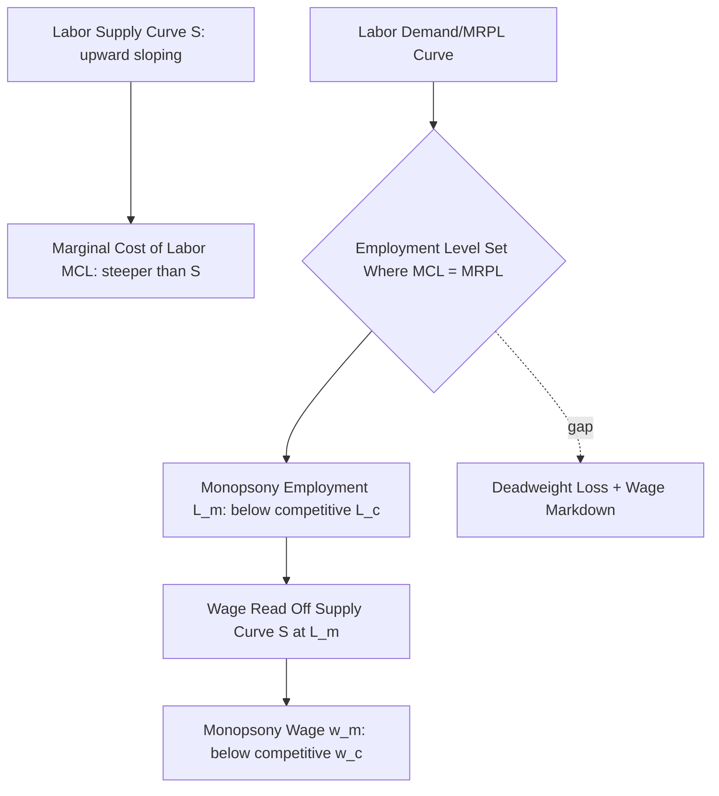

## Labor Market Concentration and Monopsony Power

### Definition and Conceptual Foundation

Monopsony power in labor markets refers to a situation in which employers face an upward-sloping labor supply curve — meaning a firm must raise wages to attract additional workers, rather than facing a perfectly elastic supply at the prevailing market wage as assumed under perfect competition. This gives firms wage-setting power (the ability to pay below the competitive marginal revenue product of labor) rather than treating the wage as parametrically given.

Classical monopsony (Robinson, 1933) described a single dominant employer in a local labor market (the canonical "company town" case). Modern labor economics has generalized this into the concept of **monopsony power** or **oligopsony**, which can arise even with multiple employers present, whenever labor supply to any individual firm is imperfectly elastic due to search frictions, worker preferences over non-wage job characteristics, mobility costs, or information frictions — not requiring literal single-buyer market structure.

### The Canonical Monopsony Model

Under monopsony, the firm's marginal cost of labor exceeds the wage, because hiring an additional worker requires raising the wage paid to *all* existing workers (assuming a single wage policy):

$$MCL = w + L\frac{dw}{dL}$$

The profit-maximizing firm sets employment where marginal cost of labor equals marginal revenue product of labor:

$$MRPL = MCL = w + L\frac{dw}{dL}$$

Since $\frac{dw}{dL} > 0$ under an upward-sloping supply curve, $MCL > w$, meaning the monopsonist restricts employment below the competitive level and pays a wage below $MRPL$ — the wedge $MRPL - w$ constitutes monopsonistic exploitation in the classical Pigouvian/Robinsonian sense.

### The Modern Elasticity-Based Framework

Contemporary labor economics, following Manning (2003) and the "new monopsony" literature, formalizes wage-setting power via the **firm-level labor supply elasticity** $\varepsilon_{LS}$:

$$\frac{w - MRPL}{w} = \frac{1}{\varepsilon_{LS}}$$

This markdown formula is directly analogous to the Lerner Index in product-market monopoly power. As $\varepsilon_{LS} \to \infty$ (perfectly elastic supply, i.e., perfect competition), the wage markdown converges to zero. Low estimated firm-level labor supply elasticities imply substantial wage-setting power.

**Key Points**

- This framework does not require literal single-employer market structure — search frictions, switching costs, and idiosyncratic worker preferences over employers (commuting distance, workplace amenities, firm-specific human capital) generate finite supply elasticities even in labor markets with numerous employers
- Manning's key insight was reframing monopsony from a market-structure classification (one buyer) to a continuous *degree* of wage-setting power present to varying extents in essentially all real-world labor markets

### Sources of Monopsony Power

- **Search frictions**: Costly and time-consuming job search means workers cannot instantaneously relocate to the highest-paying employer, giving incumbent employers some wage-setting latitude even absent formal market concentration
- **Geographic concentration**: Local labor markets with few employers in a given occupation/industry (e.g., a single hospital system in a rural area, a dominant manufacturing employer in a company town)
- **Firm-specific human capital and switching costs**: Skills or credentials with limited portability across employers reduce a worker's outside option value
- **Non-compete and no-poach agreements**: Contractual restrictions on worker mobility directly reduce effective labor supply elasticity to competing employers by legal fiat rather than pure market friction
- **Employer collusion/coordination**: Explicit wage-fixing or information-sharing agreements among employers (documented in several antitrust enforcement actions, e.g., the Silicon Valley "no-poach" litigation covering technology firms)
- **Occupational licensing and credential specificity**: Licensing requirements tied to a narrow set of employers or jurisdictions can constrain effective outside options

### Measuring Labor Market Concentration

The standard structural proxy for potential monopsony power is the **Herfindahl-Hirschman Index (HHI)** computed over employment shares within a defined labor market (typically a commuting zone × occupation or commuting zone × industry cell):

$$HHI = \sum_{i=1}^{n} s_i^2 \times 10000$$

where $s_i$ is employer $i$'s share of employment in that market cell. U.S. antitrust guidelines conventionally classify markets with $HHI > 2500$ as "highly concentrated" in product-market contexts; labor economics research has adapted comparable thresholds, though [Unverified] there is no single universally agreed labor-market-specific HHI threshold analogous to product-market merger guidelines, and researchers vary in threshold choice across studies.

**Key Points**

- Azar, Marinescu, and Steinbaum (2020) constructed commuting-zone-by-occupation HHI measures using online vacancy data (Burning Glass Technologies/CareerBuilder), finding a substantial share of U.S. local labor markets classified as highly concentrated by these HHI thresholds
- [Inference] A key methodological limitation of HHI-based approaches is that they capture *potential* concentration-based monopsony power but do not directly measure realized wage-setting behavior — the relationship between measured concentration and actual wage outcomes is itself an empirical question addressed by separate elasticity-estimation approaches described below

### Estimating Labor Supply Elasticities Empirically

Two principal empirical strategies dominate the literature:

#### 1. Structural/Cross-Sectional Approach

Estimates firm-level labor supply elasticity using variation in wages and employment across firms, often instrumenting for wage endogeneity using firm-specific labor demand shifters. Studies applying this approach across multiple countries have generally found relatively low estimated elasticities, consistent with meaningful wage-setting power, though [Unverified] point estimates vary considerably by country, sector, and estimation method, and should not be treated as a single settled parameter value.

#### 2. Quasi-Experimental/Event-Study Approach

Uses natural experiments — minimum wage increases, hospital mergers, or plant closures — to observe how employment and wages respond, inferring supply elasticity from the response pattern. Under perfect competition, a binding minimum wage above the competitive wage should reduce employment; under monopsony, a minimum wage increase up to a threshold can *increase* employment by compressing the wage-markdown wedge without requiring the firm to raise wages for inframarginal workers via the upward-sloping supply mechanism.

$$\Delta L = \begin{cases} > 0 & \text{if } w_{min} \in (w_m, MRPL) \text{ under monopsony} \\ < 0 & \text{under perfect competition, for any binding } w_{min} \end{cases}$$

This theoretical prediction is a central reason the Card-Krueger (1994) minimum wage employment findings (see the minimum wage employment effects literature) have been reinterpreted through a monopsony lens by subsequent research, since a small positive or null employment effect of minimum wage increases is difficult to reconcile with a purely competitive labor market model but is consistent with monopsonistic wage-setting.

### Merger-Based Evidence: Hospital Labor Markets

Hospital and nursing labor markets are among the most extensively studied applied settings, given detailed merger data and relatively well-defined local geographic markets for healthcare labor.

**Example**: Studies examining hospital merger events have generally found that mergers increasing local labor market concentration for nurses are associated with measurable reductions in nurse wage growth relative to non-merging comparison markets. [Inference] The direction of this finding (concentration-driven mergers dampening wage growth) is broadly consistent across several U.S. hospital merger studies, though the precise magnitude of wage suppression varies by study, time period, and market definition, and should be verified against the specific paper being cited rather than treated as a fixed universal estimate.

### Monopsony and Wage Discrimination

Robinson's original monopsony framework also explains **third-degree wage discrimination** across worker groups with different labor supply elasticities to the firm. If group $A$ has lower outside-option elasticity than group $B$ (e.g., due to greater mobility constraints — caregiving responsibilities, visa sponsorship dependency, or geographic immobility), profit maximization implies:

$$\frac{w_A}{w_B} = \frac{1 + 1/\varepsilon_B}{1 + 1/\varepsilon_A} < 1 \quad \text{when } \varepsilon_A < \varepsilon_B$$

This has been proposed as a partial explanation for persistent gender wage gaps: [Inference] if women exhibit systematically lower labor supply elasticity to firms — for instance due to disproportionate caregiving-related mobility constraints — profit-maximizing monopsonistic wage-setting could generate gender wage differentials even absent direct taste-based discrimination, a hypothesis explored by Barth and Dale-Olsen (2009) and Hirsch, Schank, and Schnabel (2010) among others, though this remains one contributing channel among several proposed explanations for the gender wage gap rather than a fully settled singular explanation.

### Policy Implications and Antitrust Applications

**Key Points**

- **Labor market merger review**: U.S. antitrust agencies (DOJ/FTC) have increasingly incorporated labor market concentration effects into merger review analysis, expanding beyond the traditional exclusive focus on product-market competition effects
- **Non-compete restriction**: The monopsony framework provides direct theoretical support for regulatory restriction of non-compete agreements, since these directly reduce $\varepsilon_{LS}$ by contractually limiting worker outside options — the U.S. FTC's 2024 proposed non-compete ban (subsequently subject to ongoing litigation) was explicitly grounded partly in this economic rationale
- **Minimum wage as a monopsony-correcting instrument**: The theoretical possibility of employment-neutral or employment-increasing minimum wage effects under monopsony has informed policy arguments for minimum wage increases in concentrated local labor markets specifically, rather than as a uniform national policy tool
- **No-poach agreement enforcement**: Antitrust enforcement actions against explicit no-poach and wage-fixing agreements between employers (e.g., DOJ enforcement actions against franchise no-poach clauses) directly target the collusion channel of monopsony power

### Diagrammatic Summary: Monopsony Wage-Employment Determination

<svg xmlns="http://www.w3.org/2000/svg" viewBox="0 0 640 400">
<text x="320" y="24" text-anchor="middle" font-size="15" font-weight="bold" fill="#1a1a1a">Monopsony Equilibrium vs. Competitive Equilibrium (svg_diagram)</text>
<line x1="70" y1="340" x2="600" y2="340" stroke="#333" stroke-width="1.5" />
<line x1="70" y1="340" x2="70" y2="50" stroke="#333" stroke-width="1.5" />
<text x="335" y="375" text-anchor="middle" font-size="12" fill="#333">Employment (L)</text>
<text x="30" y="195" text-anchor="middle" font-size="12" fill="#333" transform="rotate(-90 30 195)">Wage (w)</text>
<line x1="90" y1="330" x2="560" y2="90" stroke="#2166ac" stroke-width="2" />
<text x="565" y="88" font-size="11" fill="#2166ac">S (Labor Supply)</text>
<line x1="90" y1="330" x2="560" y2="50" stroke="#762a83" stroke-width="2" stroke-dasharray="6,3" />
<text x="565" y="50" font-size="11" fill="#762a83">MCL</text>
<line x1="90" y1="90" x2="560" y2="300" stroke="#b2182b" stroke-width="2" />
<text x="565" y="300" font-size="11" fill="#b2182b">MRPL (Demand)</text>
<circle cx="330" cy="175" r="5" fill="#000" />
<text x="345" y="170" font-size="10" fill="#000">Monopsony (L_m, w_m)</text>
<line x1="330" y1="175" x2="330" y2="340" stroke="#555" stroke-dasharray="2,2" />
<line x1="70" y1="175" x2="330" y2="175" stroke="#555" stroke-dasharray="2,2" />
<circle cx="410" cy="140" r="5" fill="#1b7837" />
<text x="425" y="135" font-size="10" fill="#1b7837">Competitive (L_c, w_c)</text>
<line x1="410" y1="140" x2="410" y2="340" stroke="#1b7837" stroke-dasharray="2,2" />
<line x1="70" y1="140" x2="410" y2="140" stroke="#1b7837" stroke-dasharray="2,2" />
</svg>

**Related Topics**

- Minimum Wage Employment Effects and the Monopsony Reinterpretation
- Non-Compete Agreements and Labor Mobility Restrictions
- Antitrust Enforcement in Labor Markets
- Gender Wage Gap Decomposition Approaches
- Search and Matching Models of the Labor Market
- Occupational Licensing and Labor Market Frictions
- Hospital and Healthcare Labor Market Structure
- Firm-Specific Human Capital and Wage-Setting Power