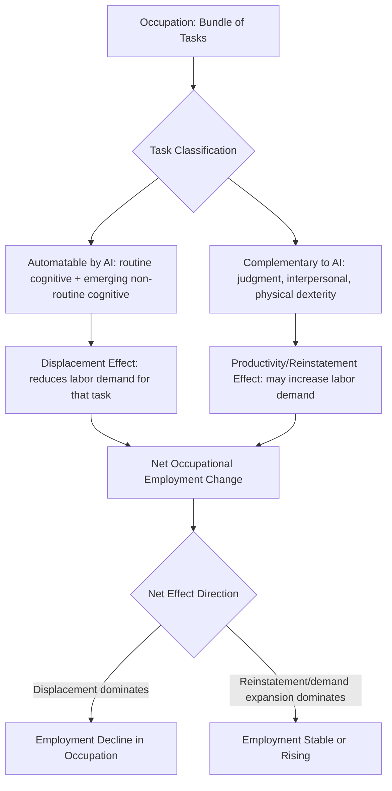

## Artificial Intelligence and the Future of Work

### Scope and Analytical Framing

This topic examines how advances in artificial intelligence — particularly large language models and generative AI systems emerging prominently since roughly 2020 — affect labor demand, wage structure, task composition, and employment dynamics. Because empirical evidence on generative AI's labor market effects is still accumulating relative to the technology's short deployment history, this content distinguishes established labor economics frameworks (task-based models, skill-biased technical change) from emerging, less-settled empirical findings specific to recent AI systems.

### Foundational Framework: The Task-Based Approach

Modern labor economics analyzes automation not through a crude "jobs vs. no jobs" lens but via the **task-based framework** developed by Acemoglu and Autor (2011) and Autor, Levy, and Murnane (2003). This framework decomposes occupations into constituent tasks rather than treating them as monolithic units, and classifies tasks along two dimensions:

- **Routine vs. non-routine**: whether the task follows explicit, codifiable procedural rules
- **Cognitive vs. manual**: whether the task is primarily information-processing or physical

$$Y = \int_{0}^{N} y(i)\, di, \quad y(i) = \begin{cases} A_K \cdot k(i) & \text{if capital-performed} \\ A_L \cdot l(i) & \text{if labor-performed} \end{cases}$$

Technology determines which tasks $i$ are performed by capital versus labor at any given point, with the assignment threshold shifting as automation technology's relative productivity $A_K$ improves for specific task types.

**Key Points**

- The 20th-century wave of computerization primarily automated *routine* tasks (both cognitive — bookkeeping, data entry — and manual — assembly line work), a pattern well-documented as contributing to labor market **polarization**: simultaneous growth in high-skill/high-wage and low-skill/low-wage employment with a hollowing-out of middle-skill routine occupations (Autor, Katz, and Kearney, 2006; Goos and Manning, 2007)
- Generative AI represents a potentially distinct automation wave because large language models exhibit capability on *non-routine cognitive* tasks (writing, synthesis, coding, analysis) that were previously considered resistant to automation under the routine/non-routine framework — this is the central departure motivating renewed research attention

### Distinguishing AI Exposure from Automation Risk

Recent literature explicitly distinguishes **exposure** (the degree to which an occupation's tasks could technically be performed or augmented by AI) from **automation** (net employment displacement), since exposure does not mechanically imply job loss — it can instead imply augmentation, task reallocation within the occupation, or productivity-driven demand expansion.

Felten, Raj, and Seamans (2021) and subsequent occupational-exposure studies constructed AI Occupational Exposure (AIOE) measures by mapping AI capabilities (from AI benchmark task categories) onto O*NET occupational task/ability data:

$$AIOE_j = \sum_{a} w_{a,j} \cdot AI_{a}$$

where $w_{a,j}$ is the importance of ability $a$ to occupation $j$ (from O*NET) and $AI_a$ is a measure of AI system performance on tasks requiring ability $a$.

[Unverified] Early exposure-mapping studies (e.g., Eloundou, Manning, Mishkin, and Rock, 2023, examining GPT-class model exposure) estimated a substantial share of the U.S. workforce has at least some portion of their tasks exposed to large language model capabilities, with exposure notably concentrated in higher-wage, higher-education occupations — a reversal of the routine-task automation pattern documented for earlier computerization waves. Specific percentage figures from these studies should be verified directly, as methodologies and estimates have been revised across successive papers and are sensitive to the exposure-scoring methodology used.

### Augmentation vs. Substitution: Emerging Empirical Evidence

**Key Points**

- **Task augmentation studies**: Field experiments examining generative AI assistance in specific occupations (customer support, software development, business writing) have generally found productivity gains concentrated among *lower-performing* or less-experienced workers, narrowing within-occupation performance dispersion — a pattern documented in Brynjolfsson, Li, and Raymond (2023) for customer support agents and Noy and Zhang (2023) for writing tasks
- [Inference] This "leveling" pattern — where AI assistance disproportionately benefits below-median performers — has been replicated across several early studies but the underlying mechanism (whether AI substitutes for tacit experience-based knowledge specifically) remains an active research question rather than a fully established causal mechanism
- **Coding and software engineering**: Studies of AI coding-assistant adoption (e.g., GitHub Copilot) have found measurable task-completion speed increases among software developers, though [Unverified] the net effect on aggregate software engineering employment levels, as opposed to individual task productivity, remains unresolved given the short post-deployment observation window available to researchers as of this writing
- **Distinguishing productivity effects from employment effects**: A recurring methodological caution in this literature is that individual- or firm-level productivity gains from AI tool adoption do not mechanically translate into economy-wide employment predictions, since aggregate outcomes depend on elasticities of product demand, competitive market structure, and reallocation dynamics not captured in micro-level productivity studies

### Wage and Skill-Premium Implications

The skill-biased technical change (SBTC) framework, historically used to explain rising education wage premia during the computerization era, is being reassessed for generative AI given its apparent capability concentration among cognitively demanding, historically high-education tasks.

$$\frac{w_H}{w_L} = f\left(\frac{A_H}{A_L}, \frac{S_H}{S_L}\right)$$

where $w_H/w_L$ is the skilled-to-unskilled wage ratio, $A_H/A_L$ is relative technology-driven productivity for skilled vs. unskilled labor, and $S_H/S_L$ is relative labor supply.

[Speculation] Some economists have hypothesized that if generative AI substitutes most directly for tasks currently performed by highly educated, high-wage workers (in contrast to the skill-biased pattern of the computer era), this could compress rather than widen the college wage premium over time — but this remains a theoretical hypothesis without settled empirical confirmation given the technology's short deployment history, and should be clearly flagged as speculative rather than an established finding when discussed.

### Firm-Level and Market Structure Considerations

**Key Points**

- **Complementary capital investment**: Task-based models predict that AI adoption's net employment effect within a firm depends on whether the automated tasks are complements or substitutes to the remaining human-performed tasks — automation of a subset of tasks can increase demand for labor in complementary tasks if it lowers overall production costs and expands output (the "productivity effect" partially offsetting the "displacement effect," per Acemoglu and Restrepo, 2019)
- **Market concentration in AI infrastructure**: The compute-intensive nature of frontier AI model development has concentrated foundational model capability among a small number of firms, raising questions (analogous to labor market monopsony concerns, see prior item) about whether downstream labor market effects will be shaped disproportionately by a small number of technology providers' deployment choices
- **Firm heterogeneity in adoption speed**: Early adoption-diffusion studies suggest generative AI tool uptake varies substantially by firm size and sector, implying labor market effects are likely to emerge unevenly across the economy rather than as a uniform simultaneous shock

### Policy and Institutional Responses

**Key Points**

- **Portable benefits and worker transition support**: Given task-based rather than whole-occupation disruption, policy discussions increasingly emphasize within-occupation reskilling and task-reallocation support rather than the occupation-to-occupation retraining models designed for prior automation waves
- **Wage insurance proposals**: Programs providing partial wage replacement for workers displaced into lower-paying roles (distinct from standard unemployment insurance, which assumes eventual reemployment at comparable wages) have been proposed as a response to task-level rather than job-level displacement
- **Labor market monitoring infrastructure**: Statistical agencies (e.g., the U.S. Bureau of Labor Statistics) face a documented measurement lag in tracking AI-exposed occupational change, since standard occupational classification systems (SOC, O*NET) update on multi-year cycles that may lag rapidly evolving task content within existing job titles
- **Sectoral bargaining and AI deployment clauses**: Some recent labor negotiations (e.g., provisions in entertainment-industry collective bargaining agreements) have explicitly incorporated AI usage restrictions or consultation requirements, representing a direct institutional labor-market response distinct from broader public policy

### Key Measurement and Research Challenges

- **Short observation window**: Because widely deployed generative AI systems are recent, longitudinal labor market data capturing full adjustment dynamics (including general-equilibrium reallocation effects) is not yet available at the same maturity as computerization-era research
- **Distinguishing AI-specific effects from concurrent shocks**: Isolating AI-attributable labor market changes from other contemporaneous shocks (post-pandemic labor market restructuring, monetary policy shifts, other technology adoption) presents an ongoing identification challenge
- **Rapid capability evolution**: Occupational exposure measures calibrated to a specific AI model generation may become outdated as model capabilities continue to evolve, complicating the construction of stable long-run exposure metrics

### Diagrammatic Summary: Historical vs. Emerging Automation Task Profile

<svg xmlns="http://www.w3.org/2000/svg" viewBox="0 0 640 360">
<text x="320" y="24" text-anchor="middle" font-size="14" font-weight="bold" fill="#1a1a1a">Task Exposure Profile: Computerization Era vs. Generative AI Era (svg_diagram)</text>
<line x1="70" y1="60" x2="70" y2="300" stroke="#333" stroke-width="1" />
<line x1="70" y1="300" x2="600" y2="300" stroke="#333" stroke-width="1" />
<text x="180" y="330" text-anchor="middle" font-size="11" fill="#333">Routine Manual</text>
<text x="330" y="330" text-anchor="middle" font-size="11" fill="#333">Routine Cognitive</text>
<text x="480" y="330" text-anchor="middle" font-size="11" fill="#333">Non-Routine Cognitive</text>
<rect x="140" y="250" width="40" height="50" fill="#2166ac" />
<rect x="290" y="230" width="40" height="70" fill="#2166ac" />
<rect x="440" y="285" width="40" height="15" fill="#2166ac" />
<rect x="190" y="270" width="40" height="30" fill="#b2182b" />
<rect x="340" y="260" width="40" height="40" fill="#b2182b" />
<rect x="490" y="120" width="40" height="180" fill="#b2182b" />
<rect x="500" y="70" width="14" height="14" fill="#2166ac" />
<text x="520" y="82" font-size="11" fill="#333">Computerization Era Exposure</text>
<rect x="500" y="90" width="14" height="14" fill="#b2182b" />
<text x="520" y="102" font-size="11" fill="#333">Generative AI Era Exposure</text>
</svg>

**Related Topics**

- Task-Based Models of Automation (Acemoglu-Restrepo Framework)
- Skill-Biased Technical Change and the College Wage Premium
- Labor Market Polarization
- Labor Market Concentration and Monopsony Power
- Reskilling Policy and Active Labor Market Programs
- Occupational Classification Systems (O*NET/SOC) and Measurement Lag
- Gig Economy and Platform-Mediated Work
- General Equilibrium Effects of Technological Change on Employment