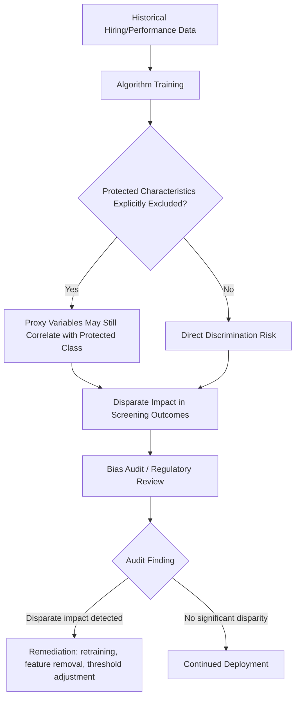

## Algorithmic Hiring and Management

### Definition and Scope

Algorithmic hiring and management refers to the use of automated decision systems — resume-screening algorithms, applicant-ranking models, gig-platform dispatch and scheduling systems, and worker-performance monitoring software — to perform functions historically handled by human managers and HR personnel: screening candidates, allocating tasks, setting schedules, evaluating performance, and, in some implementations, executing termination decisions. This is a rapidly evolving applied subfield of labor economics that intersects with information economics, discrimination economics, and the economics of workplace surveillance.

### Taxonomy of Algorithmic Systems in Employment

**Key Points**

- **Pre-hire screening algorithms**: Automated resume parsing, applicant ranking, and video-interview scoring systems used to reduce a large applicant pool to a manageable shortlist before human review
- **Algorithmic task allocation and dispatch**: Systems that assign work in real time based on worker location, availability, and performance history — most extensively documented on gig/platform work applications (ride-hailing, delivery platforms)
- **Dynamic/algorithmic scheduling**: Software that generates shift schedules for hourly workers based on predicted demand, sometimes with limited advance notice ("just-in-time scheduling")
- **Algorithmic performance management**: Continuous monitoring systems tracking productivity metrics (keystrokes, call-handling time, delivery speed, warehouse picking rates) that feed into automated performance scoring, warnings, or termination triggers
- **Algorithmic wage-setting**: Dynamic or personalized pay-rate determination, most visible in gig-platform "surge" or incentive-pricing mechanisms, and increasingly studied for potential individualized wage discrimination applications

### Economic Rationale: Search and Matching Efficiency

From a search-and-matching theoretic perspective, algorithmic hiring can be modeled as reducing employer-side search costs $c_e$ in a standard matching function:

$$M = A \cdot U^{\alpha} V^{1-\alpha}$$

where $M$ is the matching rate, $U$ is unemployed job seekers, $V$ vacancies, and $A$ is matching efficiency. Algorithmic screening is theorized to raise $A$ by processing larger applicant pools at lower marginal cost per candidate than human reviewers, potentially reducing vacancy duration and time-to-fill.

[Inference] Whether this theoretical matching-efficiency gain translates into improved *match quality* (as opposed to merely faster processing of a given applicant pool) is an empirically distinct question that has produced mixed findings across studies, since algorithmic ranking criteria may not fully capture the same signal content human reviewers use, particularly for less codifiable job-fit dimensions.

### Discrimination and Bias Concerns

#### Mechanism: Historical Data Bias Propagation

A central concern documented extensively in the algorithmic fairness and labor economics literature is that hiring algorithms trained on historical hiring/performance data can encode and perpetuate pre-existing discriminatory patterns present in that training data, even when protected characteristics (race, gender) are explicitly excluded as input features, via **proxy discrimination** — correlated features (zip code, school attended, gaps in employment history, even word-choice patterns in resumes) that indirectly encode protected-class membership.

$$\hat{y} = f(X), \quad X \perp \text{race explicitly}, \quad \text{but } \text{Cov}(X, \text{race}) \ne 0$$

**Example**: A widely cited case is Amazon's internal resume-screening tool (reported publicly in 2018), which was found during internal testing to systematically downgrade resumes containing terms associated with women's colleges or women's sports participation, reportedly because the training data reflected historically male-dominated hiring patterns in the technical roles the tool was built to screen; the tool was reportedly discontinued rather than fully deployed once the pattern was identified.

#### Legal and Regulatory Framework

- **U.S. disparate impact doctrine**: Under Title VII of the Civil Rights Act, employment practices — including algorithmic tools — that produce statistically disproportionate adverse outcomes across protected groups can constitute unlawful discrimination even absent discriminatory intent, if the practice is not job-related and consistent with business necessity
- **EEOC guidance on AI-based hiring tools**: The U.S. Equal Employment Opportunity Commission has issued technical guidance addressing algorithmic hiring tools under existing disparate-impact frameworks, treating vendors and employers as potentially jointly liable for discriminatory outcomes
- **New York City Local Law 144 (2023)**: Requires employers using "automated employment decision tools" for hiring or promotion within New York City to conduct independent bias audits and publicly disclose audit results, representing one of the first jurisdiction-specific mandatory audit regimes for algorithmic hiring tools
- **EU AI Act**: Classifies employment-related AI systems (recruitment, worker evaluation, task allocation, termination decisions) as "high-risk" under its risk-tiered regulatory framework, imposing conformity assessment, documentation, and human-oversight requirements

### Algorithmic Management in Gig and Platform Work

#### Dispatch and Rating Systems as Wage-Setting Mechanisms

Platform labor economics (Uber, DoorDash, and comparable ride-hailing/delivery platforms) has generated a distinct body of research on algorithmic management because these platforms combine task allocation, performance evaluation (customer ratings), and dynamic pricing within a single automated system, with limited direct human managerial oversight of individual workers.

**Key Points**

- **Customer rating systems as performance proxies**: Worker access to future task allocation is often contingent on maintaining rating thresholds, effectively delegating performance evaluation to unstructured, potentially bias-prone customer assessments rather than standardized employer evaluation
- **Dynamic/surge pricing algorithmic wage-setting**: Real-time price adjustment based on predicted supply-demand imbalances functions as an algorithmically determined piece-rate wage, raising questions about worker ability to anticipate and plan around earnings given limited transparency into the pricing algorithm's inputs
- **Information asymmetry regarding algorithm logic**: Platform workers frequently report limited visibility into precisely how dispatch, rating aggregation, or deactivation decisions are computed — described in the sociology and labor-relations literature as "algorithmic opacity" — which complicates worker ability to optimize effort allocation or contest adverse decisions
- [Unverified] The degree to which this opacity constitutes a meaningful information-cost burden with measurable earnings effects, versus a manageable friction workers adapt to over time, remains contested across empirical platform-labor studies and is sensitive to platform-specific design choices

#### Algorithmic Deactivation and Due Process

A distinguishing feature of platform algorithmic management relative to traditional employment is the frequent absence of human-mediated termination review: automated deactivation for rating drops, cancellation-rate thresholds, or flagged behavior can occur without the grievance and appeal mechanisms characteristic of standard at-will or unionized termination processes. This has motivated policy proposals (e.g., aspects of the EU Platform Work Directive, adopted 2024) mandating human review rights before automated deactivation decisions affecting platform workers' livelihoods.

### Just-in-Time Scheduling and Labor Supply Effects

Algorithmic demand-forecasting scheduling systems used extensively in retail and food service generate schedules with limited advance notice, optimizing labor cost against predicted demand fluctuations at high temporal granularity.

**Key Points**

- **Income and hours volatility**: Workers subject to algorithmically generated variable schedules face week-to-week hours and earnings volatility, which several U.S. municipal "fair workweek" or "predictive scheduling" ordinances (San Francisco, Seattle, New York City, Oregon statewide) have attempted to address by mandating advance notice periods and predictability pay for last-minute schedule changes
- **Secondary employment and childcare coordination costs**: [Inference] Unpredictable algorithmic scheduling has been argued in the labor economics and sociology literature to impose particular difficulty for workers coordinating childcare or secondary jobs, though rigorously isolating the causal earnings/welfare effect of scheduling unpredictability specifically (separate from low wage levels generally) remains methodologically challenging given the populations affected typically face multiple concurrent labor market disadvantages

### Worker Surveillance and Performance Monitoring

**Key Points**

- **Continuous productivity metrics**: Warehouse and logistics employers have implemented granular tracking (items scanned per hour, idle-time flags, bathroom-break duration monitoring in some documented cases) feeding into automated performance scoring and disciplinary action triggers
- **Remote work monitoring software**: Post-2020 growth in remote work has coincided with expanded adoption of "bossware" — software tracking keystroke activity, screen time, and application usage for remote employees — raising distinct privacy and worker-autonomy considerations
- **Potential productivity vs. well-being trade-off**: [Inference] While employer-side rationale for monitoring is typically framed around productivity verification and loss prevention, a growing body of organizational-behavior and labor-relations research examines whether intensive algorithmic monitoring generates offsetting costs via reduced worker autonomy, increased stress-related turnover, or gaming behavior directed at monitored metrics rather than genuine underlying task performance — the net productivity effect of monitoring intensity is not uniformly positive across the studies examining this trade-off

### Collective Bargaining and Institutional Responses

**Key Points**

- **Algorithmic transparency clauses in collective agreements**: Some recent labor union contracts have incorporated provisions requiring employer disclosure of algorithmic scheduling or performance-evaluation criteria, and consultation rights before deploying new algorithmic management systems
- **Platform worker classification litigation**: Disputes over whether platform workers subject to algorithmic management constitute employees (entitled to standard labor protections) or independent contractors (largely excluded from such protections) have been central to major litigation and ballot-initiative activity (e.g., California's Proposition 22, 2020) directly shaped by the degree of algorithmic behavioral control exercised over workers, since the traditional common-law employment test weighs the degree of employer control over work methods — algorithmic direction complicates this classification test's application
- **Sectoral algorithmic-management legislation**: Beyond hiring-specific rules (NYC Local Law 144), some jurisdictions have proposed or enacted broader "algorithmic management" regulation covering ongoing employment monitoring and task-allocation systems, not merely pre-hire screening

### Diagrammatic Summary: Algorithmic Management Across the Employment Lifecycle

<svg xmlns="http://www.w3.org/2000/svg" viewBox="0 0 640 300">
<text x="320" y="24" text-anchor="middle" font-size="14" font-weight="bold" fill="#1a1a1a">Algorithmic Systems Across the Employment Lifecycle (svg_diagram)</text>
<rect x="40" y="70" width="130" height="90" rx="6" fill="#e8f0fb" stroke="#2166ac" stroke-width="2" />
<text x="105" y="100" text-anchor="middle" font-size="12" font-weight="bold" fill="#2166ac">Pre-Hire</text>
<text x="105" y="120" text-anchor="middle" font-size="10" fill="#333">Resume screening</text>
<text x="105" y="136" text-anchor="middle" font-size="10" fill="#333">Video interview scoring</text>
<rect x="195" y="70" width="130" height="90" rx="6" fill="#fbf3e0" stroke="#e08214" stroke-width="2" />
<text x="260" y="100" text-anchor="middle" font-size="12" font-weight="bold" fill="#e08214">Allocation</text>
<text x="260" y="120" text-anchor="middle" font-size="10" fill="#333">Dispatch/scheduling</text>
<text x="260" y="136" text-anchor="middle" font-size="10" fill="#333">Dynamic wage-setting</text>
<rect x="350" y="70" width="130" height="90" rx="6" fill="#e6f5e0" stroke="#1b7837" stroke-width="2" />
<text x="415" y="100" text-anchor="middle" font-size="12" font-weight="bold" fill="#1b7837">Monitoring</text>
<text x="415" y="120" text-anchor="middle" font-size="10" fill="#333">Productivity tracking</text>
<text x="415" y="136" text-anchor="middle" font-size="10" fill="#333">Rating aggregation</text>
<rect x="505" y="70" width="110" height="90" rx="6" fill="#fbe9e7" stroke="#b2182b" stroke-width="2" />
<text x="560" y="100" text-anchor="middle" font-size="12" font-weight="bold" fill="#b2182b">Termination</text>
<text x="560" y="120" text-anchor="middle" font-size="10" fill="#333">Auto-deactivation</text>
<text x="560" y="136" text-anchor="middle" font-size="10" fill="#333">Performance triggers</text>
<line x1="170" y1="115" x2="195" y2="115" stroke="#555" stroke-width="1.5" />
<line x1="325" y1="115" x2="350" y2="115" stroke="#555" stroke-width="1.5" />
<line x1="480" y1="115" x2="505" y2="115" stroke="#555" stroke-width="1.5" />
</svg>

**Related Topics**

- Artificial Intelligence and the Future of Work
- Gig Economy Worker Classification (Employee vs. Independent Contractor)
- Statistical and Taste-Based Discrimination Theory
- Fair Workweek / Predictive Scheduling Legislation
- Labor Market Concentration and Monopsony Power (platform dispatch as wage-setting parallel)
- Workplace Surveillance and Worker Well-Being
- Collective Bargaining in the Platform Economy
- Regulatory Approaches to AI Risk Classification (EU AI Act)