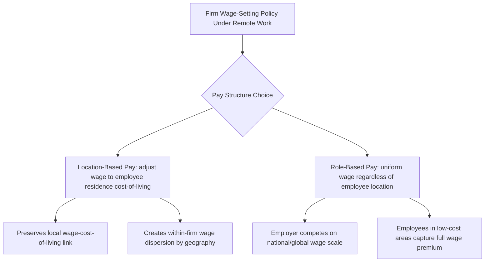

## Remote Work and Geographic Labor Markets

### Definition and Scope

This topic examines how the large-scale shift toward remote and hybrid work — substantially accelerated by the 2020 pandemic and, per available evidence, persisting well above pre-pandemic levels afterward — has altered the geographic structure of labor markets: the link between where workers live and where firms are located, spatial wage-setting patterns, local labor market composition, and the economic geography of cities and regions.

### Measuring the Scale of the Shift

The primary academic data source for measuring remote work prevalence is the **Survey of Working Arrangements and Attitudes (SWAA)**, developed by Barrero, Bloom, and Davis, which has tracked U.S. paid full days worked from home since May 2020. [Unverified] SWAA-based estimates have consistently shown work-from-home rates for the U.S. workforce settling at a level well above pre-pandemic norms (which were in the low single digits of paid full workdays) after an initial pandemic peak and subsequent partial decline — exact current percentages should be checked directly against the latest SWAA release rather than cited from memory, since the series continues to be updated and the equilibrium level has been described by the survey's own authors as still gradually evolving.

**Key Points**

- Remote work capacity is highly occupation-dependent: Dingel and Neiman (2020) constructed an influential occupation-level "teleworkability" index based on O*NET task content, finding a substantial share of U.S. jobs are classifiable as feasibly performed remotely, concentrated heavily in higher-wage, higher-education occupations
- This concentration pattern means remote work's geographic effects are not uniform across the workforce — the phenomenon primarily concerns a subset of predominantly white-collar, college-educated occupations rather than the workforce as a whole

### Theoretical Framework: Spatial Equilibrium and Wage-Setting

Standard urban/spatial economics models (Rosen-Roback spatial equilibrium framework) assume workers are compensated for cost-of-living and amenity differences across locations such that, in equilibrium, utility is equalized across space:

$$U(w_i, r_i, A_i) = \bar{U} \quad \text{for all locations } i$$

where $w_i$ is the local wage, $r_i$ is local housing cost, and $A_i$ is local amenities. Remote work weakens the traditional link requiring $w_i$ to be tied to the *employer's* location, since a worker's labor can now be geographically decoupled from the physical worksite, introducing a new margin: **wage-setting policy with respect to worker location** (pay based on job role and employer location vs. pay adjusted to employee residential location).

**Key Points**

- Firms have adopted heterogeneous approaches: some (frequently technology-sector employers) have implemented geographically differentiated pay scales tied to employee metro-area cost of living, while others maintain a single national (or role-based) pay scale regardless of employee location — the choice has direct distributional consequences for which party (employer or relocating employee) captures the cost-of-living arbitrage gain
- [Inference] The prevalence and design of location-based pay adjustment policies varies substantially across firms and has been the subject of ongoing compensation-policy debate rather than converging toward a single dominant industry practice as of available evidence

### Migration and Population Redistribution Effects

**Key Points**

- **Urban-to-suburban and urban-to-exurban migration**: Multiple U.S. metropolitan-level studies using postal change-of-address and mobile-location data found measurable net outmigration from high-cost, dense urban cores (particularly San Francisco and, to a lesser extent, New York) toward lower-density suburban and exurban areas during 2020–2022, with remote-work-eligible, higher-income households overrepresented among movers
- **"Zoom towns" and secondary/tertiary city growth**: Smaller cities and recreation-oriented areas with lower costs of living and desirable amenities (documented cases include various Mountain West and Sun Belt locations) experienced disproportionate in-migration from remote-capable, typically higher-income workers relocating from expensive coastal metros
- **Housing market transmission**: Local housing price and rent growth in receiving areas has been empirically linked to the magnitude of remote-work-driven in-migration in several metro-level studies, representing a documented channel through which remote work reallocates not just workers but housing demand pressure across the urban hierarchy
- [Unverified] The degree to which this migration pattern represents a temporary pandemic-era adjustment versus a durable structural reallocation of the urban population hierarchy remains an open empirical question requiring longer post-pandemic observation windows than are currently available

### Effects on Local Labor Market Composition and Agglomeration Economies

#### Agglomeration Economy Considerations

Urban economics has long emphasized **agglomeration economies** — productivity benefits from spatial concentration via knowledge spillovers, thick labor markets (better worker-firm matching), and input-sharing — as a core rationale for the persistent existence of dense employment centers (Duranton and Puga, 2004; Glaeser, 2011). Remote work's potential to substitute for in-person proximity raises a theoretically important question: whether widespread remote work erodes these agglomeration benefits over time, since knowledge spillovers in particular are frequently modeled as depending on incidental in-person interaction not easily replicated in fully remote settings.

$$Y_i = A \cdot L_i^{\gamma} \cdot \prod_j D_{ij}^{-\delta}$$

A stylized representation where local productivity $Y_i$ depends on local employment density $L_i$ (agglomeration effect, $\gamma > 0$) and $D_{ij}$ is distance-weighted access to other economic centers. Remote work is theorized to reduce the effective weight of $\gamma$ by substituting virtual for physical proximity, though [Speculation] the magnitude of this effect on long-run innovation and productivity growth specifically remains genuinely uncertain and contested among urban economists, given the difficulty of measuring knowledge-spillover effects with the short post-pandemic time series currently available — this should be flagged explicitly as an unresolved theoretical question rather than an established empirical finding.

#### Thick Labor Market Effects

**Key Points**

- Remote work potentially extends the effective "thickness" of a worker's accessible labor market beyond commuting-distance boundaries, since a remote-eligible worker can search across employers nationally (or internationally) rather than being constrained to employers within reasonable commuting distance
- This has implications for local labor market monopsony power (see prior monopsony item): to the extent remote work increases workers' effective outside-option set beyond geographically proximate employers, it may reduce employer wage-setting power in geographically concentrated local labor markets, an emerging research question at the intersection of these two literatures
- Conversely, remote-eligible workers competing in a now-national or global applicant pool for remote positions may face increased *competitive* pressure from geographically distant candidates, an offsetting effect on individual worker bargaining position that has received comparatively less empirical attention to date

### Effects on Regional and National Wage Convergence

**Key Points**

- Historically, U.S. regional wage convergence (the tendency for wages in poorer regions to catch up to wages in richer regions) slowed markedly after roughly 1980, a pattern documented by Ganong and Shoag (2017) and attributed partly to land-use regulation constraining migration-driven convergence in high-productivity coastal metros
- [Inference] Some researchers have hypothesized that remote work could partially substitute for physical migration as a convergence mechanism — allowing workers in lower-cost regions to access high-productivity-metro wage scales without relocating — though whether this produces genuine regional wage convergence (raising overall regional income) or primarily redistributes remote-eligible high-wage workers' *location* while wage-setting remains tied to role/employer characteristics is an active and unresolved empirical question
- This distinction matters materially for local economic development policy: convergence via remote work "wage importation" has different local fiscal and business-formation implications than convergence via traditional in-person relocation and re-employment

### Effects on Commercial Real Estate and Local Fiscal Structure

**Key Points**

- Reduced in-office attendance has been linked in multiple studies to declining commercial office real estate valuations in central business districts of major U.S. metros, with documented effects on municipal property tax revenue given the concentration of commercial property tax bases in downtown cores
- Reduced weekday downtown foot traffic has been associated with documented revenue declines for complementary local businesses (restaurants, retail) historically dependent on office-worker commuter spending, sometimes termed the "urban doom loop" concern in local economic policy discussions — though [Unverified] the severity and persistence of this effect varies substantially by city and remains a subject of ongoing municipal fiscal policy analysis rather than a uniformly documented outcome across all major metros

### Distributional and Inequality Considerations

**Key Points**

- Because remote work eligibility concentrates heavily among higher-education, higher-wage occupations (per the Dingel-Neiman teleworkability measure), the benefits of remote-work flexibility — commute time savings, residential location choice, potential cost-of-living arbitrage — accrue disproportionately to already higher-earning workers, a pattern several labor economists have flagged as a potential channel widening rather than narrowing overall earnings and wealth inequality
- In-person-dependent occupations (healthcare delivery, retail, hospitality, manufacturing, construction) by definition cannot access these geographic flexibility benefits, creating a a bifurcation in workplace flexibility along existing occupational skill/wage lines rather than a broadly shared labor market transformation
- [Inference] Gender-differentiated effects have been examined in several studies, with some evidence suggesting increased remote/hybrid availability has been associated with modestly higher labor force attachment among parents of young children (particularly mothers) in remote-eligible occupations, though the magnitude and mechanism (childcare cost savings vs. commute time savings vs. scheduling flexibility) remain areas of active empirical investigation rather than settled quantification

### Diagrammatic Summary: Remote Work's Geographic Transmission Channels

<svg xmlns="http://www.w3.org/2000/svg" viewBox="0 0 640 340">
<text x="320" y="24" text-anchor="middle" font-size="14" font-weight="bold" fill="#1a1a1a">Geographic Transmission Channels of Remote Work (svg_diagram)</text>
<rect x="250" y="50" width="140" height="50" rx="6" fill="#e8f0fb" stroke="#2166ac" stroke-width="2" />
<text x="320" y="80" text-anchor="middle" font-size="12" font-weight="bold" fill="#2166ac">Remote Work Adoption</text>
<line x1="320" y1="100" x2="130" y2="150" stroke="#555" stroke-width="1.5" />
<line x1="320" y1="100" x2="320" y2="150" stroke="#555" stroke-width="1.5" />
<line x1="320" y1="100" x2="510" y2="150" stroke="#555" stroke-width="1.5" />
<rect x="50" y="150" width="160" height="60" rx="6" fill="#fbf3e0" stroke="#e08214" stroke-width="2" />
<text x="130" y="175" text-anchor="middle" font-size="11" font-weight="bold" fill="#e08214">Migration</text>
<text x="130" y="192" text-anchor="middle" font-size="10" fill="#333">Urban → suburban/exurban</text>
<rect x="240" y="150" width="160" height="60" rx="6" fill="#e6f5e0" stroke="#1b7837" stroke-width="2" />
<text x="320" y="175" text-anchor="middle" font-size="11" font-weight="bold" fill="#1b7837">Wage-Setting</text>
<text x="320" y="192" text-anchor="middle" font-size="10" fill="#333">Location vs. role-based pay</text>
<rect x="430" y="150" width="160" height="60" rx="6" fill="#fbe9e7" stroke="#b2182b" stroke-width="2" />
<text x="510" y="175" text-anchor="middle" font-size="11" font-weight="bold" fill="#b2182b">Agglomeration</text>
<text x="510" y="192" text-anchor="middle" font-size="10" fill="#333">Spillover erosion (contested)</text>
<line x1="130" y1="210" x2="130" y2="250" stroke="#555" stroke-width="1" />
<line x1="320" y1="210" x2="320" y2="250" stroke="#555" stroke-width="1" />
<line x1="510" y1="210" x2="510" y2="250" stroke="#555" stroke-width="1" />
<text x="130" y="270" text-anchor="middle" font-size="10" fill="#333">Housing/fiscal effects</text>
<text x="320" y="270" text-anchor="middle" font-size="10" fill="#333">Regional convergence question</text>
<text x="510" y="270" text-anchor="middle" font-size="10" fill="#333">Innovation/productivity uncertainty</text>
</svg>

**Related Topics**

- Labor Market Concentration and Monopsony Power (thick-market effects of remote search)
- Comparative Welfare State Regimes (childcare/family policy interaction with remote flexibility)
- Regional Wage Convergence and Land-Use Regulation
- Agglomeration Economies and Urban Economic Geography
- Gender Labor Force Participation and Flexible Work Arrangements
- Artificial Intelligence and the Future of Work
- Occupational Teleworkability Measurement (Dingel-Neiman Index)
- Local Fiscal Policy and Commercial Real Estate Transition