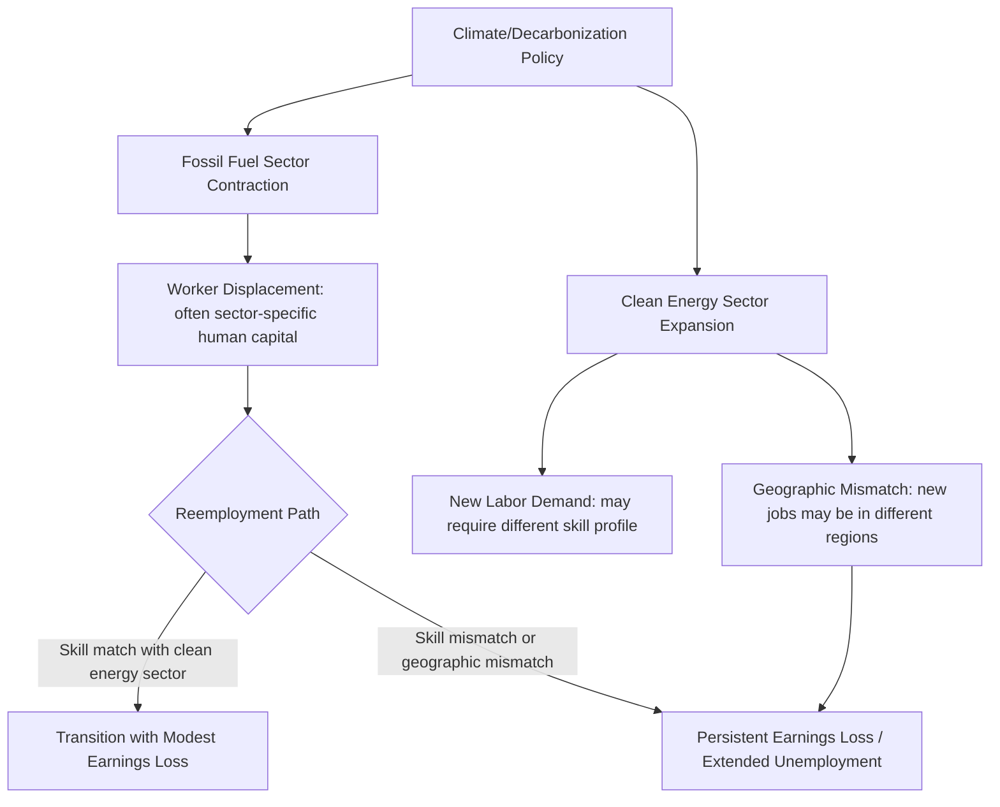

## Climate Change and Labor Market Transitions

### Scope and Analytical Framing

This topic examines two distinct but related labor economics literatures: (1) the direct physical effects of climate change (temperature, extreme weather, changing agricultural conditions) on labor supply, productivity, and employment, and (2) the labor market transition effects of climate *policy* and the shift toward decarbonized economic activity — commonly termed the "just transition" literature. Both draw on established labor economics frameworks (compensating differentials, sectoral reallocation, human capital specificity) applied to a comparatively recent empirical domain.

### Direct Physical Effects: Climate on Labor Productivity and Supply

#### Thermal Stress and Physical Labor Productivity

A well-established occupational health and labor economics finding is that heat exposure reduces physical labor productivity and increases workplace injury risk, particularly in outdoor and non-climate-controlled occupations (agriculture, construction, outdoor manufacturing).

$$P(T) = P_{max} \quad \text{for } T \le T^*, \quad P(T) < P_{max} \quad \text{declining for } T > T^*$$

where $P(T)$ is labor productivity as a function of ambient temperature $T$ and $T^*$ is an occupation- and task-specific threshold above which physiological thermal stress begins degrading task performance.

**Key Points**

- Studies using historical weather variation and administrative payroll/output data (e.g., Zivin and Neidell, 2014, examining U.S. time-use data) have found labor supply in outdoor and climate-exposed indoor industries declines measurably on very hot days relative to moderate-temperature days, while labor supply in climate-controlled indoor occupations shows comparatively little temperature sensitivity
- [Unverified] Specific quantitative estimates of the labor-hours or output elasticity with respect to extreme heat vary considerably by country, sector, and study methodology, and should be verified against the specific paper cited rather than treated as a single universal parameter, since baseline climate, occupational mix, and adaptation infrastructure (air conditioning prevalence) all shape the estimated sensitivity
- Occupational safety data have documented elevated heat-related injury and fatality rates in outdoor occupations during extreme heat events, motivating regulatory responses discussed below

#### Agricultural Labor Market Effects

Agricultural labor economics has extensively documented that changing temperature and precipitation patterns affect both agricultural labor demand (via crop yield effects) and the physical conditions of agricultural work itself. [Inference] Climate-driven yield volatility has been linked in several studies to increased seasonal labor demand volatility in affected agricultural regions, with downstream effects on migrant and seasonal agricultural worker income stability — though the specific magnitude and regional pattern of these effects depends heavily on local crop mix, irrigation infrastructure, and adaptation investment, and should not be generalized as a uniform global pattern.

#### Extreme Weather Events and Local Labor Market Disruption

**Key Points**

- Natural disaster economics research (drawing on hurricane, flood, and wildfire event studies) has documented short-run local labor market disruption following major extreme weather events — displaced employment, temporary business closures, and localized unemployment spikes — with recovery trajectories that vary substantially by disaster severity, local economic diversification, and availability of disaster relief/insurance mechanisms
- [Inference] Longer-run population and employment effects of major disaster events are more contested in the literature: some studies find persistent negative local economic effects in severely affected areas, while others find substantial recovery or even net positive reconstruction-driven employment effects over multi-year horizons, suggesting the long-run outcome is highly context-dependent rather than following a single established pattern
- Migration responses to climate-related disasters and slow-onset changes (sea-level rise, prolonged drought) are studied under the broader "climate migration" literature, which examines whether affected populations relocate permanently, temporarily, or remain in place due to financial or social constraints on mobility (the "trapped populations" phenomenon documented in some migration-economics research)

### Labor Market Effects of Climate Policy: The "Just Transition" Framework

#### Conceptual Framework

The "just transition" concept, originating in labor union and environmental-justice advocacy before being incorporated into mainstream labor and environmental economics, refers to policy design intended to manage the labor market disruption caused by decarbonization — particularly the decline of fossil-fuel-dependent industries — in a manner that distributes transition costs equitably rather than concentrating job losses in specific regions or worker populations without corresponding support.

This maps directly onto standard sectoral-reallocation labor economics: climate policy (carbon pricing, emissions regulation, renewable energy mandates) functions as a demand shock reducing labor demand in carbon-intensive sectors while potentially increasing labor demand in clean-energy and related sectors.

$$\Delta E_{fossil} < 0, \quad \Delta E_{clean} > 0, \quad \text{Net effect} = \Delta E_{fossil} + \Delta E_{clean} + \Delta E_{indirect}$$

**Key Points**

- The central labor economics question is not merely the *net* aggregate employment effect (which several studies suggest can be neutral or modestly positive at the national level under various renewable-investment scenarios) but the **distributional and geographic mismatch** between where jobs are lost (concentrated fossil-fuel-extraction and fossil-fuel-power-generation regions) and where new clean-energy jobs are created, which may not align spatially or in required skill profile
- Worker mobility frictions relevant here mirror the broader displaced-worker literature (Jacobson, LaLonde, and Sullivan, 1993): displaced workers with substantial firm- or sector-specific human capital (e.g., coal mining expertise) often experience persistent post-displacement earnings losses even when reemployed, since skills do not transfer costlessly across sectors

#### Geographic Concentration of Transition Risk

**Key Points**

- Fossil-fuel extraction and processing employment is highly geographically concentrated (specific coal-producing regions, oil and gas basins), meaning decarbonization-driven job loss is spatially concentrated in a manner that can severely affect specific local labor markets even when the national aggregate employment effect is modest — a pattern well-documented in regional economics studies of Appalachian coal country and similar fossil-fuel-dependent regions internationally
- This spatial concentration interacts with the agglomeration and monopsony considerations discussed in prior topics: single-industry-dependent local labor markets by definition have limited employer diversity, meaning displaced workers in these regions often face genuinely limited local reemployment options rather than a diversified local labor market able to absorb the shock

#### Policy Instruments for Transition Management

**Key Points**

- **Targeted regional transition funding**: Public investment programs directing infrastructure and economic diversification funding specifically toward fossil-fuel-dependent regions (e.g., provisions within the U.S. Inflation Reduction Act, 2022, directing certain clean-energy tax credit bonuses toward "energy communities" with historical fossil-fuel employment)
- **Wage insurance and extended transition benefits**: Given the displaced-worker earnings-loss literature described above, some policy proposals extend beyond standard unemployment insurance duration/generosity to include wage-loss insurance specifically for sector-displaced workers reemployed at lower wages
- **Retraining and credential-transfer programs**: Programs aimed at facilitating skill transfer from fossil-fuel-sector occupations to adjacent clean-energy occupations (e.g., certain electrical, mechanical, and heavy-equipment operation skills have documented partial transferability between oil/gas and renewable energy infrastructure roles), though [Unverified] the empirical success rate of large-scale retraining program placement into comparable-wage employment has historically been mixed across the broader displaced-worker retraining literature, and climate-specific retraining program outcomes are still being evaluated given the recency of most such programs
- **Early retirement and bridge-to-retirement provisions**: For older displaced fossil-fuel-sector workers close to retirement age, some transition programs have incorporated bridge pension or early-retirement support rather than retraining, recognizing that retraining return-on-investment diminishes with shorter remaining working-career horizon

### Occupational Safety Regulation and Heat Exposure

**Key Points**

- In direct response to the productivity and safety findings described above, some jurisdictions have begun implementing or proposing mandatory workplace heat-exposure standards (e.g., a U.S. OSHA proposed heat-injury-and-illness-prevention rule for outdoor and indoor workers, and various U.S. state-level heat-standard regulations) requiring mandated rest breaks, hydration provisions, or work-hour restrictions above specified heat-index thresholds
- [Inference] The labor economics literature on such regulations generally frames them within a standard workplace-safety-regulation cost-benefit framework (reduced injury/productivity-loss costs vs. compliance costs to employers), analogous to other occupational safety standard evaluations, though climate-specific heat-standard evaluations are a comparatively recent addition to this literature given the regulations' recency

### Emerging "Green Jobs" Measurement Challenges

**Key Points**

- A persistent methodological challenge in this literature is the absence of a single, universally agreed statistical definition of "green jobs" or clean-energy employment comparable to standard occupational classification systems, complicating both academic measurement and policy program design/evaluation
- Various measurement approaches (task-based green-skill intensity scores, industry-classification-based approaches counting employment in designated clean-energy industries, and occupation-specific green-task mapping similar in spirit to the AI-exposure measures discussed in the prior AI topic) produce meaningfully different employment estimates, and researchers and policymakers should be attentive to which definitional approach underlies any cited "green jobs" figure

### Diagrammatic Summary: Physical vs. Transition-Policy Labor Channels

<svg xmlns="http://www.w3.org/2000/svg" viewBox="0 0 640 320">
<text x="320" y="24" text-anchor="middle" font-size="14" font-weight="bold" fill="#1a1a1a">Two Channels: Physical Climate Effects vs. Transition Policy Effects (svg_diagram)</text>
<rect x="60" y="60" width="240" height="220" rx="8" fill="#fbe9e7" stroke="#b2182b" stroke-width="2" />
<text x="180" y="90" text-anchor="middle" font-size="13" font-weight="bold" fill="#b2182b">Physical Climate Effects</text>
<text x="180" y="120" text-anchor="middle" font-size="11" fill="#333">Heat stress → productivity loss</text>
<text x="180" y="145" text-anchor="middle" font-size="11" fill="#333">Extreme weather → local disruption</text>
<text x="180" y="170" text-anchor="middle" font-size="11" fill="#333">Agricultural yield volatility</text>
<text x="180" y="195" text-anchor="middle" font-size="11" fill="#333">Climate migration pressure</text>
<text x="180" y="220" text-anchor="middle" font-size="11" fill="#333">Occupational safety regulation</text>
<rect x="340" y="60" width="240" height="220" rx="8" fill="#e8f0fb" stroke="#2166ac" stroke-width="2" />
<text x="460" y="90" text-anchor="middle" font-size="13" font-weight="bold" fill="#2166ac">Transition Policy Effects</text>
<text x="460" y="120" text-anchor="middle" font-size="11" fill="#333">Fossil sector contraction</text>
<text x="460" y="145" text-anchor="middle" font-size="11" fill="#333">Clean energy expansion</text>
<text x="460" y="170" text-anchor="middle" font-size="11" fill="#333">Geographic/skill mismatch</text>
<text x="460" y="195" text-anchor="middle" font-size="11" fill="#333">Displaced-worker earnings loss</text>
<text x="460" y="220" text-anchor="middle" font-size="11" fill="#333">Regional transition funding</text>
</svg>

**Related Topics**

- Displaced Worker Earnings Losses and Sector-Specific Human Capital
- Regional Economics of Single-Industry-Dependent Labor Markets
- Occupational Safety Regulation and Cost-Benefit Analysis
- Labor Market Concentration and Monopsony Power (single-employer fossil-fuel regions)
- Active Labor Market Policy and Retraining Program Effectiveness
- Climate Migration and Population Mobility Constraints
- Artificial Intelligence and the Future of Work (parallel task/skill measurement challenges)
- Green Jobs Measurement and Classification Methodology