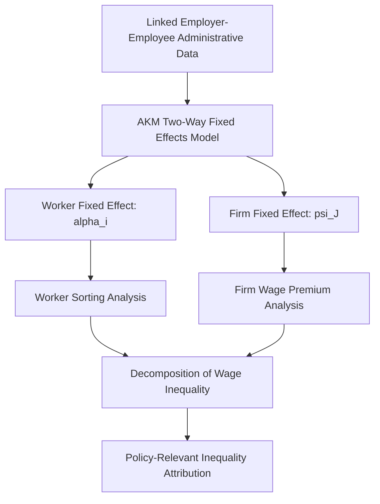

## Administrative Big Data in Labor Research

### Definition and Scope

This topic covers the methodological transformation in empirical labor economics driven by increasing researcher access to large-scale administrative and transaction-level datasets — tax records, unemployment insurance wage records, payroll processor data, and online job posting/vacancy data — as distinct from the survey-based data (household labor force surveys, establishment surveys) that historically dominated the field. This shift has materially changed both the questions labor economists can answer and the identification strategies available to them.

### Categories of Administrative Big Data

#### Tax and Social Insurance Records

- **Matched employer-employee administrative datasets**: Constructed from unemployment insurance (UI) wage records or social security earnings records, linking individual workers to specific employers over time via administrative filing requirements rather than survey self-report
- **Full-population tax record data**: Datasets such as those underlying the U.S.-based work of Chetty, Saez, and collaborators, drawing on de-identified IRS tax records to study intergenerational mobility, earnings dynamics, and tax-policy effects at population scale rather than survey-sample scale
- **Cross-country administrative registers**: Scandinavian countries (Norway, Denmark, Sweden) maintain particularly extensive linked administrative registers covering earnings, education, family structure, and health records for their full populations, making Nordic register data a distinctively rich resource in comparative labor economics research

#### Private-Sector Transaction and Payroll Data

- **Payroll processor microdata**: Datasets derived from payroll processing companies (e.g., ADP Research Institute data, Gusto data used in some academic studies) providing high-frequency, granular wage and employment data often available with much shorter reporting lag than official government statistics
- **Online job vacancy/posting data**: Datasets scraping or licensing online job posting content (historically Burning Glass Technologies, now Lightcast, among others) providing granular, real-time information on job titles, required skills, and posted wage ranges at a level of detail not available in traditional vacancy survey instruments
- **Bank and financial transaction data**: Datasets derived from bank account transaction records (e.g., JPMorgan Chase Institute data) used to study household income volatility and consumption-smoothing responses to labor market shocks at a granularity survey data cannot match

#### Platform and Digital Trace Data

- **Gig/platform administrative data**: Direct data-sharing partnerships or researcher access agreements with ride-hailing, delivery, and freelance platforms, providing task-level records of platform work supply decisions
- **Resume and professional-network data**: Datasets derived from professional networking platforms or resume databases used to study career trajectories and skill transitions at an individual level over time

### Methodological Advantages Over Survey Data

**Key Points**

- **Elimination of survey measurement error**: Self-reported survey earnings and hours suffer from well-documented recall bias, rounding, and non-response patterns; administrative records reflect actual reported/filed values, though [Inference] administrative data is not measurement-error-free either — it can suffer from misclassification (e.g., independent contractor vs. employee coding), reporting lags, and coverage gaps for informal or undeclared work not captured in formal tax/UI filing systems
- **Population coverage and statistical power**: Administrative datasets frequently cover the full universe of covered workers/employers rather than a survey sample, enabling precise estimation of effects for narrow subpopulations (specific occupations, small geographic areas, rare events) that survey sample sizes cannot support
- **Panel/longitudinal linkage**: Administrative records can typically be linked across years for the same individual using stable identifiers (social security number equivalents), enabling long-panel analysis of earnings trajectories, job mobility, and displacement effects with much lower attrition than panel survey data, which suffers from survey non-response and tracking loss over time
- **Employer-employee matching**: Linked employer-employee datasets enable decomposition of wage variation into firm effects and worker effects (following the AKM — Abowd, Kramarz, and Margolis, 1999 — variance decomposition framework), a methodological approach not feasible with unlinked survey data

### The AKM Framework: A Canonical Application

The Abowd-Kramarz-Margolis (AKM) two-way fixed effects model, enabled specifically by linked employer-employee administrative data, decomposes log wages as:

$$\ln(w_{it}) = \alpha_i + \psi_{J(i,t)} + X_{it}\beta + \varepsilon_{it}$$

where $\alpha_i$ is a worker fixed effect (time-invariant worker-specific pay component), $\psi_{J(i,t)}$ is a firm fixed effect for the firm employing worker $i$ at time $t$, $X_{it}$ are time-varying observable characteristics, and $\varepsilon_{it}$ is the residual.

**Key Points**

- This decomposition allows researchers to separate how much of overall wage inequality is attributable to *worker* characteristics (sorting into higher- or lower-paying jobs based on ability) versus *firm* characteristics (some firms simply pay more for observably identical workers), a question that cannot be answered without matched employer-employee panel data
- Card, Heining, and Kline (2013), applying AKM to German social security records, found firm-specific pay premiums and increasing worker-firm sorting (higher-ability workers increasingly matched to higher-paying firms) were significant contributors to rising German wage inequality — a finding directly enabled by administrative data access unavailable in comparable survey datasets
- [Unverified] The AKM framework has also generated a distinct methodological literature on limited-mobility bias — the tendency for worker and firm fixed effects to be imprecisely estimated when workers move between firms infrequently — and various bias-correction estimators (e.g., Kline, Saggio, and Sølvsten, 2020) have been developed to address this; researchers applying AKM should be aware this remains an active area of econometric methodology development rather than a fully settled estimation procedure

### Applications to Quasi-Experimental Identification

**Key Points**

- **Event-study designs around job displacement**: Administrative UI records enable precise identification of mass layoff and plant closure events, supporting the displaced-worker earnings-loss literature (Jacobson, LaLonde, and Sullivan, 1993, and its many extensions) with far larger and more precisely dated samples than survey-based displacement studies could achieve
- **Bunching estimator applications**: Tax record data with fine earnings granularity has enabled "bunching" estimation approaches — studying how the earnings distribution clusters around policy discontinuities (e.g., a tax bracket kink or minimum wage threshold) to recover structural behavioral elasticity parameters, a method (Saez, 2010) that requires the fine-grained earnings data administrative records provide
- **High-frequency real-time policy evaluation**: Payroll processor data (e.g., ADP or Homebase data) has been used for near-real-time labor market monitoring during rapidly evolving policy episodes (e.g., COVID-19 unemployment insurance expansion effects), providing evidence available months before official government statistics would permit comparable analysis

### Vacancy and Online Job Posting Data Applications

**Key Points**

- Job vacancy text data has enabled construction of granular skill-requirement and task-content measures at the individual job-posting level, supporting applications including the AI occupational exposure measures and labor market concentration (HHI) measures discussed in prior topics
- [Inference] A recognized limitation of online job-posting data is representativeness: postings scraped from online job boards may systematically over- or under-represent certain industries, firm sizes, or occupations relative to the true universe of hiring activity (e.g., informal hiring, direct referral hiring, or sectors with lower online posting propensity), and researchers using this data source generally need to apply some form of reweighting or validation against official vacancy statistics (e.g., the U.S. JOLTS survey) to assess representativeness for a given application

### Data Access, Privacy, and Methodological Challenges

**Key Points**

- **Restricted/secure data enclave access**: Much of this administrative data (particularly tax records and social security earnings data) is accessible to researchers only through restricted secure facilities (e.g., U.S. Census Bureau Federal Statistical Research Data Centers) with disclosure review requirements, creating access barriers that can limit reproducibility and broaden inequality in which researchers can pursue certain lines of inquiry
- **Private data-sharing agreement dependency**: Access to proprietary private-sector datasets (payroll processor, platform, banking transaction data) typically depends on individual researcher partnerships or institutional data-sharing agreements with the data-holding company, raising questions about selection in which research questions get pursued and potential conflicts given some data providers' commercial interests in particular findings
- **De-identification and re-identification risk**: Even de-identified administrative microdata carries re-identification risk given the richness of individual-level records, requiring careful statistical disclosure limitation techniques (noise injection, cell suppression, synthetic data generation) that themselves can introduce measurement considerations for downstream analysis
- **Coverage gaps for informal/undeclared work**: As referenced in the informal labor markets topic, administrative tax and UI records by construction do not capture informal, undeclared, or off-the-books employment, meaning administrative-data-based labor market analysis can understate total labor market activity, particularly in contexts or population subgroups with higher informality rates

### Complementarity with Traditional Survey Data

**Key Points**

- Administrative and survey data are increasingly used as *complements* rather than substitutes: administrative data provides precision and scale for outcomes it captures well (formal-sector earnings, tenure, employer identity), while survey data retains unique value for capturing attitudes, informal-sector activity, household context, and characteristics (race, disability status in some administrative systems) not always present in administrative records
- **Data linkage projects**: A growing methodological trend links survey respondents to their administrative records (with respondent consent) to combine survey-based attitudinal and demographic richness with administrative-record earnings precision — an approach used in some U.S. Census Bureau and academic research partnerships

### Diagrammatic Summary: Administrative Data Sources Across the Research Pipeline

<svg xmlns="http://www.w3.org/2000/svg" viewBox="0 0 640 320">
<text x="320" y="24" text-anchor="middle" font-size="14" font-weight="bold" fill="#1a1a1a">Administrative Data Sources in Labor Research (svg_diagram)</text>
<rect x="40" y="60" width="150" height="80" rx="6" fill="#e8f0fb" stroke="#2166ac" stroke-width="2" />
<text x="115" y="90" text-anchor="middle" font-size="12" font-weight="bold" fill="#2166ac">Tax/UI Records</text>
<text x="115" y="110" text-anchor="middle" font-size="10" fill="#333">Matched employer-employee</text>
<text x="115" y="126" text-anchor="middle" font-size="10" fill="#333">panel construction</text>
<rect x="245" y="60" width="150" height="80" rx="6" fill="#fbf3e0" stroke="#e08214" stroke-width="2" />
<text x="320" y="90" text-anchor="middle" font-size="12" font-weight="bold" fill="#e08214">Payroll/Platform Data</text>
<text x="320" y="110" text-anchor="middle" font-size="10" fill="#333">High-frequency, real-time</text>
<text x="320" y="126" text-anchor="middle" font-size="10" fill="#333">policy evaluation</text>
<rect x="450" y="60" width="150" height="80" rx="6" fill="#e6f5e0" stroke="#1b7837" stroke-width="2" />
<text x="525" y="90" text-anchor="middle" font-size="12" font-weight="bold" fill="#1b7837">Vacancy/Posting Data</text>
<text x="525" y="110" text-anchor="middle" font-size="10" fill="#333">Skill/task content and</text>
<text x="525" y="126" text-anchor="middle" font-size="10" fill="#333">concentration measures</text>
<line x1="115" y1="140" x2="115" y2="190" stroke="#555" stroke-width="1" />
<line x1="320" y1="140" x2="320" y2="190" stroke="#555" stroke-width="1" />
<line x1="525" y1="140" x2="525" y2="190" stroke="#555" stroke-width="1" />
<rect x="130" y="200" width="380" height="80" rx="6" fill="#f5f5f5" stroke="#555" stroke-width="1.5" />
<text x="320" y="230" text-anchor="middle" font-size="12" font-weight="bold" fill="#333">Empirical Labor Economics Applications</text>
<text x="320" y="250" text-anchor="middle" font-size="10" fill="#333">AKM decomposition • Displacement event studies</text>
<text x="320" y="266" text-anchor="middle" font-size="10" fill="#333">Bunching estimators • Concentration/HHI measures</text>
</svg>

**Related Topics**

- AKM Wage Decomposition and Firm Pay Premiums
- Displaced Worker Earnings Losses and Sector-Specific Human Capital
- Labor Market Concentration and Monopsony Power (vacancy-data HHI construction)
- Bunching Estimators and Structural Elasticity Identification
- Informal Labor Markets in Developing Countries (administrative coverage gaps)
- Nordic Register Data and Comparative Welfare State Research
- Statistical Disclosure Limitation and Data Privacy Methodology
- Artificial Intelligence and the Future of Work (shared occupational exposure data methods)