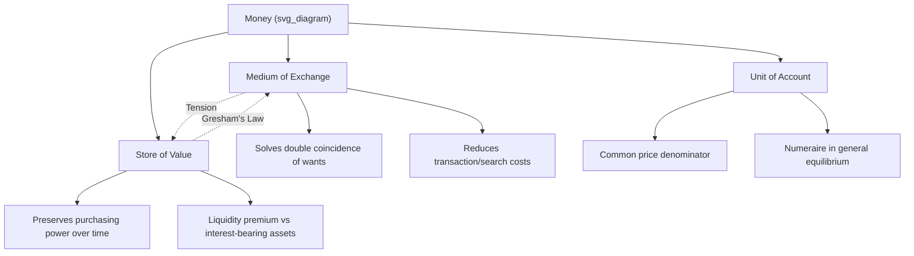

## Functions of Money: Medium of Exchange, Unit of Account, Store of Value

### Overview

Money is conventionally defined not by its physical form but by the functions it performs in an economy. The canonical taxonomy, traceable to classical and neoclassical monetary theory (Jevons, 1875; Mill), identifies three primary functions: **medium of exchange**, **unit of account**, and **store of value**. A fourth function, **standard of deferred payment**, is sometimes listed separately but is generally treated as a corollary of the unit-of-account and store-of-value functions. Any asset that performs these functions well tends to be adopted as money by convention, network effect, or legal fiat.

### Medium of Exchange

**Definition**

An asset functions as a medium of exchange when it is widely accepted in transactions for goods, services, or settlement of debt, eliminating the need for a **double coincidence of wants** inherent to barter systems.

**The Barter Problem**

In a pure barter economy, trade requires two parties to each want what the other offers, at the same time and place. The number of exchange rates needed for $n$ goods without money is:

$$\binom{n}{2} = \frac{n(n-1)}{2}$$

For $n = 1{,}000$ goods, this implies 499,500 distinct bilateral exchange rates. Introducing a single medium of exchange reduces this to $n-1$ prices (each good priced in terms of money), collapsing the combinatorial search-and-matching problem.

**Key Points**

- Reduces transaction costs and search costs associated with locating a trading partner with reciprocal wants
- Requires broad acceptability, which can arise from legal tender laws, convention, or intrinsic usefulness
- Historically evolved from commodity money (cattle, salt, shells) to metallic coinage, to representative money (banknotes backed by specie), to fiat money, to electronic/digital balances
- The medium-of-exchange function is often treated as the *defining* function of money in search-theoretic models (e.g., Kiyotaki-Wright, 1989), where money emerges endogenously as the good with the lowest storage cost and highest liquidity/marketability

**Formal Treatment: Kiyotaki-Wright Search Model** [Inference: simplified exposition]

In search-theoretic monetary models, agents meet randomly and decide whether to trade. A good's acceptability as a medium of exchange depends on its **storage cost** $c_i$ and its **marketability** — the probability that a random trading partner will accept it. Money emerges as an equilibrium outcome when agents rationally accept a good not for direct consumption but because they anticipate others will accept it in a future trade — a **self-fulfilling liquidity equilibrium**.

**Example**

A farmer with wheat wants a hammer but the blacksmith wants shoes, not wheat. Without a medium of exchange, the farmer must first trade wheat for shoes (with a third party), then trade shoes for a hammer. With money, the farmer sells wheat for currency, then uses currency to buy the hammer directly — two transactions instead of a contingent multi-party search.

### Unit of Account

**Definition**

Money serves as a **unit of account** when it is used as the common denominator for expressing prices, debts, and the relative value of goods and services, independent of whether it is physically exchanged in a given transaction.

**Key Points**

- Provides a common measuring stick, analogous to how meters measure length or kilograms measure mass
- Enables **economic calculation**: comparing the relative value of heterogeneous goods (e.g., is a car worth more than 50 bicycles?) without needing a direct barter rate between every pair of goods
- Reduces menu costs and information costs since sellers only need to track and update one price per good (in the unit of account) rather than a full matrix of bilateral exchange ratios
- A unit of account need not be a physical medium of exchange — historical examples include the medieval "ghost money" or *livre tournois* in France, which existed as an accounting unit while actual payments were made in various coexisting coins
- In economies with **hyperinflation**, the domestic currency can fail as a store of value while still nominally serving as legal unit of account, prompting informal **dollarization** or indexation, where a more stable foreign currency becomes the de facto unit of account

**Numeraire Concept**

In general equilibrium theory, the unit-of-account function corresponds to the **numeraire** good, whose price is normalized to 1, and all other prices $p_i$ are expressed relative to it:

$$p_i = \frac{P_i}{P_{\text{numeraire}}}$$

This is a purely accounting relationship and does not require the numeraire to change hands in trade.

**Example**

A used-car listing priced at $15,000 uses the national currency as the unit of account. The transaction might ultimately be settled by bank transfer, financing, or even barter-in-kind (trade-in), but the *value comparison* between the car, a competing car, and the buyer's budget is made in the common currency unit.

### Store of Value

**Definition**

Money functions as a **store of value** when it retains purchasing power over time, allowing holders to defer consumption from the present to the future without significant loss of value.

**Key Points**

- Money is not the *only* store of value — real estate, equities, bonds, and commodities also store value — but money is distinguished by its **liquidity**: the ease and speed of converting it into other goods without loss of value
- The store-of-value function is directly undermined by **inflation**, which erodes the real purchasing power of a nominal money balance over time
- The real value of money holdings evolves per:

$$\frac{M}{P} = \text{real money balances}$$

where $M$ is the nominal money stock and $P$ is the price level. Under inflation rate $\pi$, real balances decline at approximately rate $\pi$ absent nominal money growth

- **Liquidity premium**: money is held despite typically offering zero or low nominal return because of its superior liquidity relative to less-liquid stores of value (Keynes' liquidity preference theory)
- Severe failure of the store-of-value function (hyperinflation, currency collapse) typically triggers **currency substitution**, where economic agents shift store-of-value function to foreign currency or physical assets while sometimes still using the domestic currency for daily transactions (a functional separation of the three roles)

**Fisher Equation Link**

The trade-off between holding money and interest-bearing assets is central to store-of-value analysis. The (approximate) Fisher equation:

$$i \approx r + \pi^e$$

relates the nominal interest rate $i$ to the real interest rate $r$ and expected inflation $\pi^e$. Rising $\pi^e$ increases the opportunity cost of holding non-interest-bearing money, weakening its relative attractiveness as a store of value versus interest-bearing assets.

**Example**

Holding $1,000 in cash for one year under 8% annual inflation leaves the holder with real purchasing power equivalent to approximately $926 in today's terms — a discrete erosion despite the nominal amount being unchanged. This illustrates why money is often a poor long-run store of value relative to inflation-linked or productive assets, even though it remains the best available medium of exchange.

### Interaction and Tension Between the Three Functions

The three functions do not always coexist perfectly in a single asset, and historical and contemporary monetary systems reveal recurring tensions:

| Function | Primary Requirement | Failure Mode |
| --- | --- | --- |
| Medium of Exchange | Broad acceptability, low transaction friction | Illiquidity, lack of trust, legal restriction |
| Unit of Account | Stability and simplicity as a pricing reference | Menu costs from frequent repricing, indexation |
| Store of Value | Stable purchasing power over time | Inflation, hyperinflation, confiscation risk |

**Key Points**

- **Gresham's Law** ("bad money drives out good") illustrates a medium-of-exchange/store-of-value conflict: when two currencies with the same face value but different intrinsic (store-of-value) worth circulate together, people spend the debased currency and hoard the sound one, removing it from active circulation
- During hyperinflation (e.g., Weimar Germany 1923, Zimbabwe 2008), a currency can catastrophically fail as a store of value within days while still being nominally required as legal tender and unit of account, producing severe distortions (velocity spikes, barter reversion, dollarization)
- Cryptocurrencies such as Bitcoin are frequently analyzed through this tripartite lens: proponents argue for store-of-value properties (fixed supply, scarcity) while critics note weak performance as a medium of exchange (volatility, throughput limits) and as a unit of account (few goods priced natively in BTC) [Inference: characterization of an actively debated, evolving asset class]

### Diagram: The Three Functions and Their Relationships

### SVG Illustration: Functions of Money Triangle

<svg viewBox="0 0 600 520" xmlns="http://www.w3.org/2000/svg">
<text x="300" y="30" font-size="20" font-weight="bold" text-anchor="middle" fill="#1a1a1a">Functions of Money (svg_diagram)</text>
<polygon points="300,80 100,420 500,420" fill="none" stroke="#2c3e50" stroke-width="2"/>
<circle cx="300" cy="80" r="55" fill="#3498db" opacity="0.85"/>
<text x="300" y="75" font-size="14" font-weight="bold" text-anchor="middle" fill="#ffffff">Medium of</text>
<text x="300" y="93" font-size="14" font-weight="bold" text-anchor="middle" fill="#ffffff">Exchange</text>
<circle cx="100" cy="420" r="55" fill="#27ae60" opacity="0.85"/>
<text x="100" y="415" font-size="14" font-weight="bold" text-anchor="middle" fill="#ffffff">Unit of</text>
<text x="100" y="433" font-size="14" font-weight="bold" text-anchor="middle" fill="#ffffff">Account</text>
<circle cx="500" cy="420" r="55" fill="#e67e22" opacity="0.85"/>
<text x="500" y="415" font-size="14" font-weight="bold" text-anchor="middle" fill="#ffffff">Store of</text>
<text x="500" y="433" font-size="14" font-weight="bold" text-anchor="middle" fill="#ffffff">Value</text>
<circle cx="300" cy="300" r="60" fill="#8e44ad" opacity="0.9"/>
<text x="300" y="295" font-size="16" font-weight="bold" text-anchor="middle" fill="#ffffff">MONEY</text>
<text x="300" y="313" font-size="11" text-anchor="middle" fill="#ffffff">(all three functions)</text>

<text x="300" y="145" font-size="11" text-anchor="middle" fill="`#333333`">reduces search &</text>

<text x="300" y="158" font-size="11" text-anchor="middle" fill="`#333333`">transaction costs</text>

<text x="150" y="480" font-size="11" text-anchor="middle" fill="`#333333`">common price</text>

<text x="150" y="493" font-size="11" text-anchor="middle" fill="`#333333`">denominator</text>

<text x="450" y="480" font-size="11" text-anchor="middle" fill="`#333333`">preserves purchasing</text>

<text x="450" y="493" font-size="11" text-anchor="middle" fill="`#333333`">power over time</text>

</svg>

### Empirical and Historical Illustrations

- **Commodity money (gold/silver)**: strong store of value and unit of account historically, but poor divisibility and portability limited medium-of-exchange efficiency at scale
- **Fiat currency (post-1971 Bretton Woods collapse)**: excellent medium of exchange and unit of account under central bank credibility, but store-of-value performance is contingent entirely on monetary policy discipline and inflation control
- **Cigarettes in POW camps** (Radford, 1945, *Economic Organisation of a P.O.W. Camp*): a widely cited case study in monetary economics where cigarettes spontaneously emerged as money among prisoners, satisfying all three functions in a constrained economy lacking official currency — used to price goods (unit of account), settle trades (medium of exchange), and hold wealth (store of value) despite being a consumable, non-durable commodity [Unverified: specific quantitative details vary by camp and account]

### Related Topics

- Standard of deferred payment (the fourth function)
- Liquidity and the spectrum of monetary aggregates (M0, M1, M2, M3)
- Gresham's Law and bimetallism
- Quantity Theory of Money and the Fisher equation
- Hyperinflation case studies (Weimar Germany, Zimbabwe, Venezuela)
- Search-theoretic models of money (Kiyotaki-Wright)
- Dollarization and currency substitution
- Cryptocurrency as money: functional analysis debates
- Keynesian liquidity preference theory
- Commodity money vs. fiat money vs. representative money