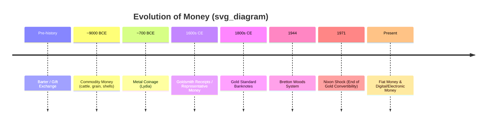

## Origins and Evolution of Money

### Overview

Money is a social and economic technology that emerged to solve coordination problems inherent in exchange. Its historical development reflects a progression of institutional and technological solutions to the same underlying frictions: the need for a widely accepted medium to facilitate trade, store value across time, and provide a common unit for measuring economic worth. Monetary economics traces this evolution not as a single linear path but as a series of overlapping and coexisting systems, each responding to the limitations of what preceded it.

### The Barter Economy and Its Limitations

Before money, economies are theorized to have relied on **barter**: the direct exchange of goods and services without an intermediary asset.

**Key Points**

- Barter requires a **double coincidence of wants**: each party must simultaneously desire what the other offers.
- Search and matching costs are high, since finding a suitable trading partner is time-consuming.
- There is no common unit of account, making relative value comparisons across many goods complex ($n$ goods require $\binom{n}{2}$ distinct exchange rates).
- Indivisibility of goods creates problems: a cattle owner cannot easily purchase a small quantity of grain without "making change."

[Inference] The historical universality of a pure barter stage preceding money is disputed among economic anthropologists; many argue that credit and gift-exchange systems, rather than spot barter, were the dominant pre-monetary arrangements in most societies. This is treated in economics textbooks as a stylized theoretical baseline rather than a confirmed historical stage.

### Commodity Money

**Commodity money** refers to an object that has value both as a medium of exchange and as a good in its own right (intrinsic use value).

**Examples**

- Cattle (etymological root of "pecuniary," from Latin *pecus*)
- Salt (root of "salary")
- Cowrie shells (used across Africa, Asia, and Oceania)
- Grain, tobacco, and tea (used in various colonial economies)
- Precious metals: gold and silver, eventually dominant due to superior monetary properties

**Why metals prevailed:** Precious metals satisfy the classical desiderata of good money better than most alternatives:

1. **Durability** — does not decay or degrade
2. **Divisibility** — can be split into smaller units without losing proportional value
3. **Portability** — high value-to-weight ratio
4. **Uniformity** — one unit is functionally identical to another (fungibility)
5. **Scarcity** — limited natural supply preserves value
6. **Recognizability** — easily identified and verified

### Coinage and Standardization

The transition from raw commodity money (weighed metal) to **coinage** marked a major institutional innovation: standardized, government- or authority-stamped units of metal with certified weight and purity.

- Early coinage is generally attributed to the Kingdom of Lydia (Asia Minor), circa 7th century BCE, using electrum (a naturally occurring gold-silver alloy).
- Coinage reduced transaction costs by eliminating the need to weigh and assay metal at each exchange.
- It introduced **seigniorage**: the profit earned by an authority from issuing currency, equal to the difference between the face value of money and its cost of production.
- Debasement — reducing the precious metal content of coins while maintaining face value — became a recurring fiscal tool (and source of inflation) throughout history, from the Roman denarius to medieval European currencies.

$$\text{Seigniorage} = \text{Face Value} - \text{Production Cost}$$

### Representative Money

**Representative money** refers to a monetary instrument that has no significant intrinsic value itself but represents a claim on a commodity (typically gold or silver) held elsewhere.

- Goldsmiths' receipts in 17th-century Europe are a canonical origin story: depositors left gold with goldsmiths for safekeeping and received paper receipts, which began circulating as a substitute for the gold itself.
- This laid the institutional groundwork for banknotes and the **gold standard**, in which national currencies were formally convertible into a fixed quantity of gold.
- Representative money requires trust in the issuing institution's ability and willingness to honor redemption.

### Fiat Money

**Fiat money** has value not because it is backed by or convertible into a commodity, but because a government declares it **legal tender** and economic agents accept it based on trust in the issuing authority and its general acceptance in exchange.

**Key Points**

- The term derives from Latin *fiat* ("let it be done").
- Fiat money's value rests on a self-reinforcing social convention: it is accepted because others are expected to accept it.
- Most modern national currencies (USD, EUR, JPY, PHP, etc.) are fiat money, having formally abandoned gold convertibility (the U.S. ended dollar-gold convertibility in 1971, an event referred to as the "Nixon Shock").
- Fiat systems grant central banks and monetary authorities discretionary control over money supply, enabling active monetary policy but also introducing inflation risk if issuance is poorly managed.

[Unverified] The specific inflationary or deflationary consequences of any historical fiat regime depend heavily on the fiscal and institutional context of the issuing country and are subject to ongoing empirical debate among economic historians.

### Timeline of Monetary Evolution (svg_diagram)

### Electronic and Digital Money

The most recent phase of monetary evolution involves the dematerialization of money into electronic records and, more recently, cryptographically secured digital assets.

- **Electronic money (e-money)**: fiat currency represented digitally in bank accounts, transferred via electronic payment systems (wire transfers, card networks, mobile wallets). Still a liability of a regulated financial institution and denominated in a sovereign currency.
- **Cryptocurrencies** (e.g., Bitcoin): decentralized digital assets using blockchain/distributed ledger technology, not issued by a central authority, and not classified as legal tender in most jurisdictions. [Inference] Whether cryptocurrencies satisfy the classical functions of money (see below) as effectively as fiat currency remains a subject of active debate, given their price volatility and limited use as a unit of account.
- **Central Bank Digital Currencies (CBDCs)**: a digital form of fiat currency, issued and backed directly by a central bank, distinct from commercial bank deposits. Numerous central banks (e.g., the People's Bank of China with the e-CNY, and pilot programs by the ECB and others) have researched or piloted CBDCs as of the mid-2020s. [Unverified] The specific design, rollout timeline, and adoption status of any given CBDC project should be checked against current central bank publications, as these programs evolve rapidly.

### Diagram: Money's Evolving Backing (svg_diagram)

<svg xmlns="http://www.w3.org/2000/svg" viewBox="0 0 760 260">
\<style\>
.box { fill: #f4f4f4; stroke: #333; stroke-width: 1.5; }
.txt { font-family: Georgia, serif; font-size: 13px; fill: #222; }
.lbl { font-family: Georgia, serif; font-size: 11px; fill: #555; }
.arrow { stroke: #333; stroke-width: 1.5; marker-end: url(#arrow); }
\</style\>
<text x="10" y="20" class="lbl">Money's Evolving Basis of Value (svg_diagram)</text>
<rect x="10" y="50" width="150" height="70" rx="6" class="box" />
<text x="30" y="80" class="txt">Commodity</text>
<text x="25" y="98" class="lbl">intrinsic value</text>
<line x1="160" y1="85" x2="210" y2="85" class="arrow" />
<rect x="210" y="50" width="150" height="70" rx="6" class="box" />
<text x="230" y="80" class="txt">Representative</text>
<text x="222" y="98" class="lbl">claim on commodity</text>
<line x1="360" y1="85" x2="410" y2="85" class="arrow" />
<rect x="410" y="50" width="150" height="70" rx="6" class="box" />
<text x="440" y="80" class="txt">Fiat</text>
<text x="422" y="98" class="lbl">legal tender / trust</text>
<line x1="560" y1="85" x2="610" y2="85" class="arrow" />
<rect x="610" y="50" width="140" height="70" rx="6" class="box" />
<text x="625" y="75" class="txt">Electronic /</text>
<text x="625" y="92" class="txt">Digital</text>
<text x="618" y="108" class="lbl">ledger-based</text>

<text x="10" y="170" class="lbl">Common thread: acceptance is driven by trust — in intrinsic value, in redeemability,</text>

<text x="10" y="188" class="lbl">in state authority, or in institutional/cryptographic guarantees, respectively.</text>

</svg>

### Why This Progression Occurred: Economic Drivers

1. **Reducing transaction costs**: Each stage lowered the cost of verifying, transporting, or exchanging value relative to the prior stage.
2. **Trust substitution**: Over time, trust shifted from trust in a physical commodity's inherent value to trust in institutions (banks, governments, central banks) and, most recently, trust in cryptographic protocols.
3. **Scalability of trade**: As economies grew more complex and geographically dispersed, physically transporting commodity money became impractical, driving demand for abstracted, transferable claims.
4. **State formation and taxation**: Some monetary theories (notably **Chartalism** and its modern variant, Modern Monetary Theory) argue that money's acceptance is fundamentally driven by the state's power to levy taxes payable only in its issued currency, rather than by voluntary market convention alone. This is a contested theoretical framework relative to the more conventional "market-origin" (Mengerian) view.

### Two Competing Theoretical Narratives

**Example**

- **Menger's "Market Origin" theory**: Money emerges spontaneously from decentralized market activity as traders converge on the most saleable (liquid) commodity to minimize transaction costs — an unplanned, evolutionary outcome.
- **Chartalist / State theory**: Money's value and acceptance derive from the state's authority to define the unit of account and to demand tax payments in that unit, effectively creating monetary demand by fiat.

[Speculation] Neither narrative is fully sufficient on its own to explain the entire empirical record of monetary history; most modern treatments in monetary economics regard the two as complementary rather than mutually exclusive explanations, with market and state forces reinforcing each other at different historical junctures.

### Conclusion

The evolution of money — from barter to commodity money, coinage, representative money, fiat currency, and now electronic/digital instruments — reflects a continuous effort to reduce the frictions of exchange while preserving the core functions money must serve: acting as a medium of exchange, unit of account, and store of value. Each transition substituted one basis of trust for another, progressively decoupling money's value from any physical commodity and vesting it instead in institutional credibility and, more recently, cryptographic or ledger-based verification.

**Related Topics**

- Functions of money (medium of exchange, unit of account, store of value, standard of deferred payment)
- Gresham's Law ("bad money drives out good")
- The gold standard and its historical collapse
- Chartalism and Modern Monetary Theory (MMT)
- Menger's theory of the spontaneous origin of money
- Central Bank Digital Currencies (CBDCs) and their macroeconomic implications
- Cryptocurrency as a monetary asset: medium of exchange vs. speculative store of value
- Seigniorage and currency debasement in historical context
- Liquidity and the concept of "moneyness"