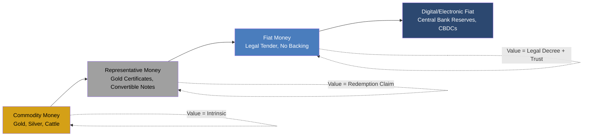

## Commodity Money, Representative Money, and Fiat Money

### Overview

The evolution from commodity money to representative money to fiat money represents the progressive separation of a currency's exchange value from any intrinsic or backing value. This progression is central to understanding modern monetary systems, central bank credibility, and the theoretical foundations of monetary policy.

### Commodity Money

**Definition**

Commodity money is a medium of exchange whose value derives from the intrinsic value of the material composing it. The item functions as money while simultaneously possessing independent use-value as a commodity.

**Key Points**

- The monetary value and the commodity value are approximately equal; there is no significant premium for the item's role as money
- Examples: gold and silver coins, salt (historically used in parts of Africa and Rome), cattle, cowrie shells, tobacco (colonial Virginia), cocoa beans (Aztec economy)
- Satisfies the classical functions of money (medium of exchange, store of value, unit of account, standard of deferred payment) but imperfectly, depending on the commodity's physical properties

**Properties Required for Effective Commodity Money**

| Property | Description |
| --- | --- |
| Durability | Must not degrade quickly (gold satisfies this; perishables like grain do not) |
| Divisibility | Must be splittable into smaller units without loss of proportional value |
| Portability | High value-to-weight ratio for ease of transport |
| Fungibility | Units must be interchangeable (one ounce of gold equals another) |
| Scarcity | Supply must be limited enough to preserve value |
| Recognizability | Must be easily verified as genuine |

**Economic Implications**

The money supply under a pure commodity standard is constrained by the physical extraction/production rate of the commodity. This has direct macroeconomic consequences:

$$M_s = f(\text{extraction rate, discovery rate, existing stock})$$

Because the money supply cannot expand independent of physical discovery (e.g., new gold mines), commodity money regimes are prone to:

- **Deflationary bias** in periods of economic growth outpacing commodity supply growth
- **Inflationary shocks** from sudden supply increases (e.g., Spanish silver influx from the Americas in the 16th century, which contributed to the "Price Revolution" in Europe)

**[Inference]** Many economic historians attribute a meaningful share of long-run price stability under classical commodity standards to this supply constraint, though the magnitude of the effect relative to other factors (population growth, velocity changes) remains debated among economic historians.

### Representative Money

**Definition**

Representative money is a claim or certificate that entitles the holder to a fixed quantity of an underlying commodity (typically gold or silver) held in reserve by an issuing institution. The paper or token itself has negligible intrinsic value; its value derives entirely from the redemption guarantee.

**Key Points**

- Functions as a technological improvement over commodity money: solves portability and divisibility problems while retaining a nominal anchor to a scarce asset
- Requires institutional trust: the issuer (bank, government, mint) must maintain adequate reserves and honor redemption
- Historical examples: gold certificates issued by the U.S. Treasury (1863–1933), silver certificates, banknotes under classical gold standard regimes (e.g., Bank of England notes pre-1931, Bretton Woods system 1944–1971 at the international level)

**Mechanics of Convertibility**

Under a representative money system, the issuing authority sets a fixed conversion rate:

$$P_{gold} = \frac{\text{Currency Units}}{\text{Unit of Gold}}$$

For example, under the U.S. gold standard (1900–1933), the dollar was fixed at $20.67 per troy ounce of gold. Anyone holding representative currency could, in principle, present it to the issuing bank and receive the equivalent commodity.

**Reserve Ratios and Fractional Backing**

In practice, most representative money systems evolved into **fractional reserve** systems, where the issuer holds reserves equal to only a fraction of outstanding notes, betting that not all holders will redeem simultaneously.

$$\text{Reserve Ratio} = \frac{\text{Commodity Reserves}}{\text{Notes Issued}}$$

This introduces **bank run risk**: if depositors/note-holders lose confidence and redeem en masse, the issuer can become insolvent even though the underlying institution was otherwise sound. This dynamic is foundational to later banking panic theory and deposit insurance policy (e.g., FDIC, est. 1933).

**Transition Dynamics**

Representative money systems tend to face two structural pressures:

1. **Gresham's Law** dynamics — if the market value of the backing commodity rises above the face value of the note, holders redeem notes for the commodity and hoard or melt it, causing note substitution problems
2. **Suspension of convertibility** during crises (war finance, banking panics) — governments frequently suspended redemption (e.g., UK 1797–1821, U.S. 1861–1879), a precedent that normalized the eventual full transition to fiat money

### Fiat Money

**Definition**

Fiat money is currency that has value because a government declares it legal tender and the public accepts it in exchange, not because it is backed by or convertible into a physical commodity. Its value rests on trust, legal enforcement, and the issuing authority's control over supply.

**Key Points**

- Derives value from **legal tender laws**, tax obligations payable only in that currency, and network effects of widespread acceptance
- Enables independent monetary policy: central banks can expand or contract the money supply without regard to commodity reserves
- The modern global monetary system has operated almost entirely on fiat currency since the collapse of the Bretton Woods system in 1971 (the "Nixon Shock")

**Chartalist and State Theory Framing**

Fiat money's acceptance is often explained through Chartalism (State Theory of Money), which holds that money derives its value primarily from the state's willingness to accept it in payment of taxes:

$$\text{Demand for Currency} \supseteq \text{Tax Liabilities Denominated in that Currency}$$

This is contrasted with the Metallist view (associated with commodity/representative money) that money's value originates from its link to a scarce, valuable good.

**Money Supply Determination**

Under fiat regimes, the money supply is a policy variable, not a geological or extraction constraint:

$$M_s = \text{Monetary Base} \times \text{Money Multiplier}$$

where the monetary base is set through central bank operations (open market operations, reserve requirements, discount rate, and — in contemporary practice — interest on reserves and quantitative easing).

**Trade-offs Introduced by Fiat Money**

| Advantage | Risk |
| --- | --- |
| Flexible response to recessions/liquidity crises | Potential for excessive money creation and inflation |
| No dependence on physical commodity discovery | Value depends entirely on institutional credibility |
| Enables countercyclical monetary policy | Time-inconsistency problem: governments may be tempted to inflate away debt |
| Facilitates modern payment systems and digital money | Vulnerable to hyperinflation if institutional trust collapses (e.g., Weimar Germany 1923, Zimbabwe 2007–2009, Venezuela 2016–present) |

**[Inference]** The empirical link between fiat money regimes and higher average inflation relative to commodity-backed regimes is well documented in cross-country studies, though whether this reflects an inherent property of fiat systems versus differences in central bank institutional design (independence, mandates, credibility) remains an active area of research.

### Comparative Summary

| Feature | Commodity Money | Representative Money | Fiat Money |
| --- | --- | --- | --- |
| Intrinsic value | Equal to face value | Minimal (paper/token) | None |
| Backing | Is the commodity | Redeemable for commodity | None; legal decree |
| Supply elasticity | Constrained by extraction | Constrained by reserves | Discretionary (policy-set) |
| Trust basis | Physical scarcity | Issuer solvency + redemption promise | Government/central bank credibility |
| Inflation risk | Low (supply-constrained) | Moderate (fractional reserve risk) | Variable (policy-dependent) |
| Historical era | Ancient – 19th century | ~1800s – 1971 (phased out) | 1971 – present |

### Diagram: Evolution of Money Forms

### Example

A stylized numeric illustration of the supply-side contrast:

- **Commodity money**: Global gold stock grows roughly 1.5–2% per year via mining output, which mechanically caps long-run money supply growth near that rate absent velocity changes.
- **Representative money**: A bank holds $100 in gold reserves and issues $400 in redeemable notes (25% reserve ratio) — a fourfold expansion of the money supply relative to the physical anchor, illustrating fractional reserve leverage.
- **Fiat money**: A central bank expands the monetary base by any amount via open market purchases; the constraint becomes policy-determined (e.g., an inflation target) rather than physically determined.

### Conclusion

The commodity → representative → fiat progression traces a shift from money whose value is physically constrained to money whose value is institutionally constrained. This shift is the theoretical precondition for modern central banking: it is only under fiat regimes that central banks can conduct discretionary monetary policy, target inflation, and act as lenders of last resort without being bound by a fixed physical reserve. It also shifts the primary macroeconomic risk from *supply scarcity* (commodity era) to *credibility and governance* (fiat era).

### Related Topics

- Gold standard mechanics and the classical price-specie-flow mechanism
- Bretton Woods system and its 1971 collapse (Nixon Shock)
- Fractional reserve banking and bank run theory
- Chartalism vs. Metallism as competing theories of money's origin
- Money supply measures (M0, M1, M2, M3) under fiat regimes
- Central bank independence and time-inconsistency (Kydland-Prescott)
- Hyperinflation case studies (Weimar Germany, Zimbabwe, Venezuela)
- Central Bank Digital Currencies (CBDCs) as a potential new monetary form