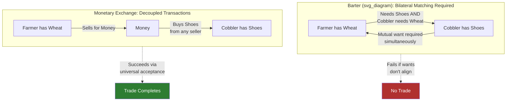

## The Coincidence of Wants and the Case Against Barter

### Overview

The concept of the "double coincidence of wants" is the foundational theoretical justification for why money emerges in economic systems. It identifies the specific inefficiency in barter exchange that money resolves, and forms the starting point for most textbook treatments of the origin and functions of money.

### The Barter System

**Definition**

Barter is the direct exchange of goods or services for other goods or services without the use of a medium of exchange. Each transaction requires two parties to simultaneously want what the other has.

**Key Points**

- Historically presented (notably by Adam Smith and Carl Menger) as the "primitive" precursor to monetary exchange, though modern economic anthropology disputes that barter was ever the dominant organizing system of any society (see Graeber-style critiques below)
- Functions adequately only in extremely small, low-complexity economies with few traded goods
- Transaction costs scale sharply with the number of distinct goods in the economy

### The Double Coincidence of Wants

**Definition**

The double coincidence of wants is the requirement that, for a barter trade to occur, Party A must want what Party B is offering **and** Party B must simultaneously want what Party A is offering, at the same time and place.

**Formal Statement**

For a bilateral barter trade between agent $i$ holding good $x$ and agent $j$ holding good $y$ to occur:

$$\text{Trade occurs} \iff (U_i(y) > U_i(x)) \land (U_j(x) > U_j(y))$$

where $U$ denotes the utility each agent derives from a given good. Both inequalities must hold simultaneously — a single-sided preference is insufficient.

**Why This Is Restrictive**

Consider an economy with $n$ distinct goods. Under barter, every possible pair of goods requires its own exchange ratio (relative price). The number of bilateral exchange rates needed is:

$$\binom{n}{2} = \frac{n(n-1)}{2}$$

| Number of Goods ($n$) | Number of Exchange Ratios Required |
| --- | --- |
| 3 | 3 |
| 10 | 45 |
| 100 | 4,950 |
| 1,000 | 499,500 |

This combinatorial explosion means that as an economy diversifies (more goods and specialization), the informational and search burden of barter grows quadratically, making it increasingly impractical without a common denominator of value.

### The Search Cost Problem

Beyond the double coincidence itself, barter imposes several compounding frictions:

**Key Points**

- **Search costs**: An agent must locate a trading partner who both holds the desired good and wants the agent's good — a joint-matching problem, not a single search problem
- **Timing mismatch**: Even if a suitable counterparty exists, the two parties' desires must be co-present in time (a farmer's grain surplus at harvest may not align with a blacksmith's need for grain at that moment)
- **Divisibility problem**: Many goods are not easily divisible to match the value of the desired trade (e.g., trading a cow for a small quantity of bread requires either overpayment or an inability to transact at all)
- **Storability/perishability problem**: Goods used to "carry" value into a future transaction may spoil or degrade, undermining their function as a store of value while search continues
- **Lack of a common unit of account**: Without a shared numeraire, comparing the relative value of dissimilar goods (e.g., how many chickens equal one plow) requires constant, unstandardized renegotiation

### How Money Resolves the Problem

Money functions as a **universally accepted intermediate good**, converting a joint bilateral matching problem into two independent unilateral transactions.

$$\text{Barter: } x \leftrightarrow y \quad (\text{requires mutual want})$$

$$\text{Monetary exchange: } x \rightarrow M \rightarrow y \quad (\text{requires only that } M \text{ be universally accepted})$$

This decomposition means Party A only needs to find *someone* willing to buy good $x$ for money $M$, and separately, *someone* willing to sell good $y$ for money $M$ — these can be different people, at different times, in different places. This is the core efficiency gain formalized in monetary theory as the reduction of the transaction from a bilateral search problem to two independent unilateral ones.

**[Inference]** Standard monetary theory treats this efficiency gain as the primary economic rationale for the spontaneous emergence of money in a market economy (per Menger's theory of the origin of money), though this is a theoretical reconstruction rather than a directly observed historical process in most cases.

### Historiographical Note: The Barter Myth Critique

**[Unverified/Contested]** Economic anthropologists, most notably David Graeber (*Debt: The First 5,000 Years*, 2011), have argued that anthropological and historical evidence does not support the existence of large-scale barter economies preceding money; instead, pre-monetary societies are argued to have relied predominantly on credit, gift exchange, and social obligation systems. This is a genuinely disputed claim within economics and anthropology — mainstream economic textbooks generally continue to use the barter-to-money narrative as a pedagogical model of the *logical* problem money solves, independent of whether it is a literal historical account of monetary origins. This distinction (logical/functional justification vs. literal historical sequence) is important for graduate-level treatment of the topic.

### Diagram: Barter vs. Monetary Exchange

### Example

Consider a three-agent barter economy:

- Agent A has fish, wants grain
- Agent B has grain, wants tools
- Agent C has tools, wants fish

No bilateral trade can occur directly: A cannot trade with B (B doesn't want fish), B cannot trade with C (C doesn't want grain), and A cannot trade with C (C doesn't want fish reciprocated with what A wants). This is a classic **triangular non-coincidence**. Under barter, this requires a three-way simultaneous multilateral trade (a coordination problem that grows combinatorially harder as more agents are added). Under a monetary system, each agent independently sells their good for money and buys their desired good, resolving the deadlock without any need for multilateral coordination.

### Conclusion

The double coincidence of wants identifies a precise structural inefficiency in barter: the requirement for mutual, simultaneous, co-located want-satisfaction between trading partners. Money's core function as a **medium of exchange** directly targets this inefficiency by serving as a universally accepted intermediate asset, transforming a hard bilateral matching problem into two easier unilateral ones. This is the standard theoretical starting point from which the other functions of money (unit of account, store of value, standard of deferred payment) are typically derived in monetary economics coursework.

### Related Topics

- Menger's theory of the spontaneous emergence of money (network/convergence models)
- The four functions of money (medium of exchange, unit of account, store of value, standard of deferred payment)
- Search and matching theory in monetary economics (Kiyotaki-Wright models)
- Credit and gift-exchange theories of pre-monetary economies (Graeber critique)
- Commodity money, representative money, and fiat money
- Liquidity and the spectrum of moneyness