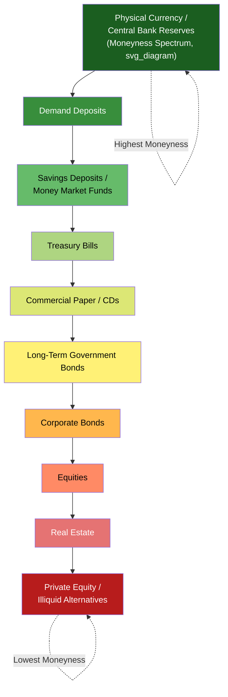

## Liquidity and the Moneyness Spectrum

### Overview

Liquidity is the ease and speed with which an asset can be converted into a widely accepted medium of exchange without significant loss of value. "Moneyness" is the theoretical concept describing the degree to which any given asset functions *as* money along a continuum, rather than money being a strictly binary category. Together these concepts extend the classical definition of money beyond currency and demand deposits into a broader analytical framework used throughout monetary economics.

### Defining Liquidity

**Definition**

An asset's liquidity is determined by three interacting dimensions:

| Dimension | Description |
| --- | --- |
| Speed | How quickly the asset can be converted to cash/spendable form |
| Cost | The transaction costs, spreads, or discounts incurred in conversion |
| Price stability | Whether conversion can occur without a significant markdown from the asset's "true" or expected value |

**Key Points**

- A perfectly liquid asset can be converted instantly, at zero cost, at its full market value — currency and central bank reserves approximate this ideal
- Illiquidity is not the same as low value; an asset (e.g., real estate) can be highly valuable but difficult to convert to cash quickly without a price concession
- Liquidity is asset-specific but also **market-condition-specific**: the same asset can be highly liquid in normal markets and effectively illiquid during a liquidity crisis (e.g., mortgage-backed securities in 2008)

### The Moneyness Spectrum

**Definition**

Moneyness (a term closely associated with the work of monetary theorists including John Hicks and later "market-based" and "shadow banking" literature, e.g., Perry Mehrling) describes the idea that all financial assets can be ranked on a continuum from "most money-like" to "least money-like" based on their liquidity, price stability, and universal acceptability as a means of settlement.

**Conceptual Ordering**

$$\text{Moneyness}(A) = f(\text{liquidity}, \text{price certainty}, \text{universality of acceptance})$$

A stylized ranking, from highest to lowest moneyness:

1. Physical currency and central bank reserves
2. Demand deposits (checking accounts)
3. Savings deposits and money market mutual fund shares
4. Short-term Treasury bills
5. Certificates of deposit (CDs), commercial paper
6. Longer-term government bonds
7. Corporate bonds
8. Publicly traded equities
9. Real estate
10. Private equity, unlisted collectibles, illiquid alternative assets

**[Inference]** This ordering is a widely used pedagogical approximation; the precise ranking of adjacent categories (e.g., money market funds vs. T-bills) can shift depending on market conditions, regulatory treatment, and the specific liquidity crisis in question, so it should be treated as illustrative rather than fixed.

### Relationship to Monetary Aggregates

The moneyness spectrum is the conceptual basis for how central banks define layered **monetary aggregates** (M0 through M3-type measures), each successively including less liquid asset classes:

| Aggregate | Typical Composition | Moneyness |
| --- | --- | --- |
| M0 (Monetary Base) | Physical currency + central bank reserves | Highest |
| M1 | M0 (currency in circulation) + demand deposits + other checkable deposits | Very high |
| M2 | M1 + savings deposits + small time deposits + retail money market funds | High |
| M3 (where still tracked) | M2 + large time deposits + institutional money market funds + repurchase agreements | Moderate-high |

**Key Points**

- Each successive aggregate is a progressively broader (and less liquid, on average) definition of "money," reflecting the fact that the boundary of what counts as money is a matter of degree, not a sharp line
- Central banks choose which aggregate to target or monitor based on which best predicts nominal spending and inflation in their specific institutional context; this choice has varied historically (e.g., the Federal Reserve de-emphasized M3 reporting in 2006)
- The existence of multiple aggregates is a direct practical consequence of the moneyness spectrum: there is no single, uncontroversial cutoff for "what counts as money"

### Liquidity Premium

Assets lower on the moneyness spectrum typically must offer a **liquidity premium** — additional expected return — to compensate holders for the reduced ease of conversion and greater price uncertainty upon sale.

$$r_{illiquid} = r_{liquid} + \text{liquidity premium} + \text{risk premium}$$

This is a core building block of asset pricing theory (related to the liquidity preference theory of interest, originating with Keynes) and helps explain the term structure of interest rates: longer-dated, less liquid instruments generally command higher yields, partly as compensation for reduced moneyness.

### Liquidity Preference Theory

**Definition**

Keynes's liquidity preference theory holds that money demand arises from the desire to hold the most liquid asset for three motives:

1. **Transactions motive** — holding money to fund routine expenditures
2. **Precautionary motive** — holding money as a buffer against unforeseen needs
3. **Speculative motive** — holding money rather than bonds when the expected return from bonds (accounting for interest rate risk) is unattractive relative to cash

$$M^d = L(Y, i)$$

where money demand $M^d$ is a function of income $Y$ (transactions/precautionary motives, positively related) and the interest rate $i$ (speculative motive, negatively related — higher rates raise the opportunity cost of holding low-moneyness-adjacent liquid balances instead of interest-bearing assets).

### Liquidity Risk and Systemic Implications

**Key Points**

- **Liquidity spirals**: In stressed markets, asset sales to raise cash can depress prices, which in turn triggers further forced sales (margin calls, mark-to-market losses) — a self-reinforcing illiquidity dynamic documented extensively in the 2008 financial crisis literature
- **Maturity/liquidity transformation**: Banks and shadow banks structurally borrow short (highly money-like liabilities, e.g., deposits) and lend long (illiquid assets, e.g., mortgages), which is profitable in normal times but creates run risk if depositors simultaneously seek to move up the moneyness spectrum
- **Flight to liquidity**: During crises, investors systematically rebalance portfolios toward the top of the moneyness spectrum (cash, T-bills), depressing yields on the safest, most liquid assets even as spreads widen elsewhere

**[Inference]** The shadow banking literature (e.g., Mehrling's "money view") extends the moneyness spectrum concept to argue that modern financial instability often originates in the boundary zones of moneyness — instruments treated as money-like in normal times (e.g., repo, asset-backed commercial paper) that lose that status abruptly during stress, this remains an active and somewhat contested area of macro-finance research rather than settled consensus.

### Diagram: The Moneyness Spectrum

### Example

During the March 2020 COVID-19 market stress, even short-term U.S. Treasury securities — normally considered near-cash-equivalent — experienced unusual bid-ask spread widening and settlement difficulties, prompting emergency Federal Reserve interventions. This is a commonly cited illustration of how moneyness is not a fixed asset attribute but a market-condition-dependent property: an asset's position on the spectrum can shift abruptly during systemic stress, even for instruments conventionally treated as top-tier liquid holdings.

### Conclusion

Liquidity and moneyness reframe "money" from a fixed legal category into a continuous spectrum of asset characteristics. This framework explains why central banks track multiple monetary aggregates, why less liquid assets command a liquidity premium, why liquidity preference drives money demand and interest rate determination, and why financial crises are frequently characterized by sudden reclassification of assets along the moneyness spectrum. It is a foundational lens connecting the classical functions-of-money framework to modern asset pricing and financial stability analysis.

### Related Topics

- Monetary aggregates in depth (M0, M1, M2, M3) and their measurement methodologies
- Keynesian liquidity preference theory and the LM curve
- Shadow banking and market-based finance (Mehrling's "money view")
- Term structure of interest rates and the liquidity premium hypothesis
- Bank runs, maturity transformation, and financial fragility
- Commodity money, representative money, and fiat money