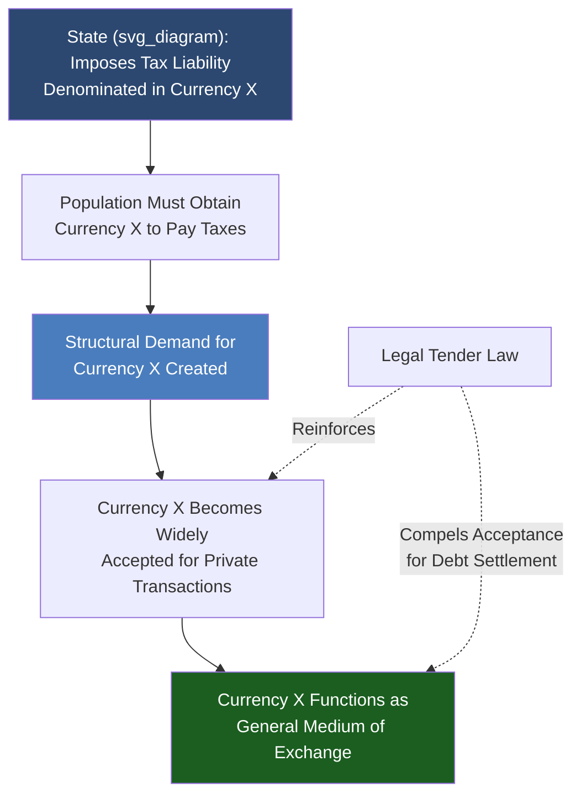

## Legal Tender Laws and the State Theory of Money

### Overview

Legal tender laws and the State Theory of Money (Chartalism) provide the institutional and theoretical explanation for why fiat currency is accepted and used despite lacking intrinsic or commodity backing. This topic connects the legal mechanics of currency enforcement to the broader theoretical debate over the origin and source of money's value, contrasting sharply with Metallist and Mengerian market-emergence accounts.

### Legal Tender Laws

**Definition**

Legal tender laws are statutory provisions that designate a specific currency as the officially recognized medium that must be accepted for the settlement of debts, public and private, within a jurisdiction, unless otherwise agreed by contract.

**Key Points**

- Legal tender status is a **debt-settlement** guarantee, not a universal purchase mandate — a private business may lawfully refuse cash for a proposed transaction (e.g., "we do not accept bills over $20") because no debt yet exists at the point of a voluntary sale
- Once a debt is legally established (e.g., a loan, a court judgment, a bill already incurred), the debtor's tender of legal tender currency **must** be accepted in satisfaction of that debt, at face value
- Legal tender designation does not, by itself, create value; it creates a legal enforcement mechanism that reinforces already-existing acceptance

**Illustrative Legal Structure (U.S. Example)**

Under 31 U.S.C. § 5103, U.S. coins and currency (including Federal Reserve notes) are declared legal tender for all debts, public charges, taxes, and dues. Analogous statutes exist in essentially all sovereign currency-issuing jurisdictions, typically specifying:

| Element | Typical Provision |
| --- | --- |
| Scope | Applies to debts, taxes, and public charges |
| Enforceability | Creditor cannot refuse tendered legal currency to discharge an existing debt |
| Private contract override | Parties may contractually agree to settle in another medium (e.g., foreign currency, barter, cryptocurrency) |
| Denominational limits | Some jurisdictions cap legal tender obligations for coins at certain transaction sizes |

### The State Theory of Money (Chartalism)

**Definition**

The State Theory of Money, most closely associated with German economist Georg Friedrich Knapp (*The State Theory of Money*, 1905) and later revived by post-Keynesian and Modern Monetary Theory (MMT) economists, holds that money's value and acceptance derive fundamentally from the state's authority — specifically, from the state's power to impose and enforce tax obligations denominated in that currency.

**Core Proposition**

$$\text{Currency Demand} \propto \text{Tax Liability Denominated in that Currency}$$

The chain of reasoning is typically summarized as:

1. The state imposes a tax liability on its population, denominated in a specific unit of account (e.g., the dollar)
2. The state declares that only that currency will be accepted in payment of the tax
3. To avoid legal penalties for non-payment of taxes, the population must obtain that currency
4. This creates baseline, structurally guaranteed demand for the currency, independent of any commodity backing
5. Because the currency is now widely demanded (to pay taxes), it becomes usable as a general medium of exchange for other transactions as well

This is often summarized with the aphorism (attributed to various MMT-associated economists, e.g., Warren Mosler): "taxes drive money" — the tax obligation is the mechanism that creates initial, non-voluntary demand for an otherwise unbacked currency.

### Chartalism vs. Metallism: A Comparative Framework

| Dimension | Metallism (Commodity/Market View) | Chartalism (State Theory) |
| --- | --- | --- |
| Origin of money | Spontaneous market emergence to solve the double coincidence of wants (Menger) | State decree and tax enforcement |
| Source of value | Intrinsic/commodity value or convertibility | Legal obligation and enforced tax demand |
| Role of the state | Optional; state may adopt an already-existing market money | Central and constitutive; state creates the demand for its currency |
| Historical view | Barter → commodity money → representative money → fiat (evolutionary) | Money is fundamentally a "creature of law" (Knapp's term) from the outset |
| Modern proponents | Austrian School, classical/neoclassical monetary theory | Post-Keynesians, Modern Monetary Theory (MMT) |

**[Inference]** These two frameworks are frequently presented as mutually exclusive origin stories, but many contemporary monetary economists treat them as complementary rather than strictly competing: market-based acceptance (Metallist logic) and state enforcement via taxation (Chartalist logic) can both contribute to a currency's stability and demand simultaneously, and the relative weight of each is genuinely debated rather than settled.

### Chartalism's Implications for Modern Monetary Theory (MMT)

**Key Points**

- Because a currency-issuing sovereign government (issuing its own non-convertible floating-rate currency) can create the very currency in which its tax liabilities and debts are denominated, MMT proponents argue the government faces no *purely financial* solvency constraint in the way a currency-user (household, firm, or a government borrowing in a foreign currency) does
- MMT argues the practical constraint on government spending is **real resource availability and inflation risk**, not the ability to "afford" spending in nominal terms
- This is a **contested claim within mainstream economics**; many economists accept the Chartalist description of how fiat currency demand is created but reject or heavily qualify the MMT policy conclusions drawn from it (e.g., regarding the sustainability of large-scale deficit spending, the interest rate/inflation transmission channel, and central bank independence)

**[Unverified/Contested]** The broader MMT policy framework remains a minority position within mainstream academic macroeconomics and is the subject of active, unresolved debate; this content note is included specifically because MMT policy claims (as opposed to the narrower, more widely accepted Chartalist description of legal tender and tax-driven currency demand) should not be presented as settled consensus.

### Enforcement Mechanisms Beyond Taxation

**Key Points**

- **Capital controls and currency monopolies**: Many states reinforce currency demand by restricting or taxing the use of foreign currencies or alternative monies domestically
- **Public sector wage and procurement payments**: States typically pay employees and contractors in the domestic legal tender currency, further embedding it into the economy's payment infrastructure
- **Regulation of the banking system**: Reserve requirements and settlement rules generally compel commercial banks to hold and settle in central bank-issued currency, reinforcing its role as the ultimate settlement asset within the domestic payments hierarchy

### Diagram: The Tax-Driven Currency Demand Mechanism

### Example

A stylized illustration of Chartalist logic: Consider a newly formed government that issues a new currency, the "Nuvo," with no gold backing and no prior market history. If the government declares that the Nuvo is the *only* currency accepted for payment of income and property taxes, citizens who owe those taxes must acquire Nuvos — even if they initially have no other use for them. This creates baseline transactional demand. Merchants, observing that their customers now hold and need Nuvos (and that they themselves owe taxes in Nuvos), begin accepting Nuvos in ordinary commerce, and the currency's use expands outward from the tax relationship into general exchange — illustrating the chartalist claim that state fiscal enforcement, not spontaneous market convergence, is a key driver of currency adoption.

### Conclusion

Legal tender laws provide the legal enforcement layer that guarantees currency acceptance in debt settlement, while the State Theory of Money offers a deeper theoretical account of *why* an unbacked fiat currency acquires and sustains value in the first place — namely, through the state's power to impose and enforce tax obligations denominated in that currency. This stands as the principal theoretical counterpoint to Metallist and market-emergence theories of money (e.g., Menger's account of money arising to solve the double coincidence of wants), and its modern policy extension — Modern Monetary Theory — remains one of the more actively contested frameworks in contemporary macroeconomic debate.

### Related Topics

- Modern Monetary Theory (MMT): core claims, functional finance, and critiques
- Menger's market-emergence theory of money (Metallism) as a contrasting framework
- Sovereign currency issuance, fiscal-monetary coordination, and central bank independence
- Commodity money, representative money, and fiat money
- Inflation as the binding constraint on currency-issuing governments (MMT framing) vs. crowding-out/debt-sustainability views
- Knapp's *The State Theory of Money* and its historical reception