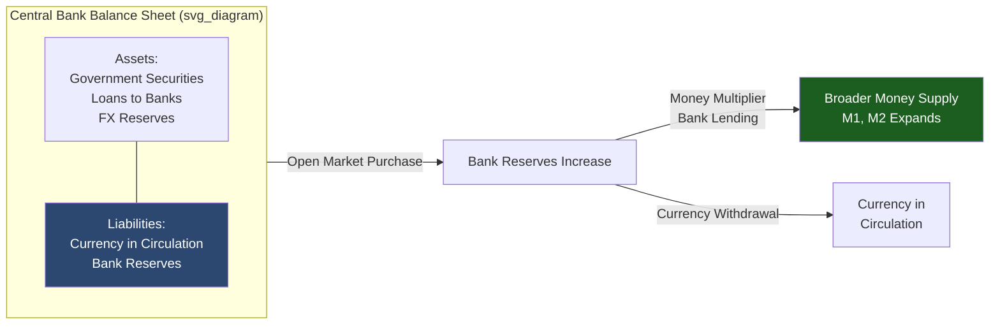

## Narrow Money: M0 and the Monetary Base

### Overview

M0 and the monetary base represent the narrowest, most liquid definition of money in an economy — the foundation upon which the entire monetary system and the broader monetary aggregates (M1, M2, M3) are built. Understanding this aggregate is essential for analyzing central bank operations, the money multiplier, and the mechanics of monetary policy transmission.

### Definition

**Monetary Base (M0)**

The monetary base, often denoted M0 or "high-powered money" (a term originating with Karl Brunner and Allan Meltzer), consists of the liabilities of the central bank that function as the ultimate settlement asset in the economy.

$$M0 = \text{Currency in Circulation} + \text{Bank Reserves Held at the Central Bank}$$

**Key Points**

- M0 is composed entirely of **central bank liabilities** — it is the only monetary aggregate that the central bank directly controls through its balance sheet operations
- "High-powered" reflects the fact that each unit of base money can support a multiple of that amount in broader money supply (M1, M2) through the fractional reserve banking mechanism
- Terminology varies by jurisdiction: some central banks use "M0" to mean currency in circulation *only* (excluding reserves), while "monetary base" or "reserve money" is used for the broader currency-plus-reserves definition — this terminological inconsistency is a common source of confusion across country-specific data series

### Components in Detail

| Component | Description |
| --- | --- |
| Currency in circulation | Physical banknotes and coins held by the public and by banks outside the central bank (vault cash) |
| Reserves (required) | Central bank deposits commercial banks must hold, typically as a percentage of deposit liabilities |
| Reserves (excess) | Central bank deposits held by commercial banks beyond the statutory requirement, voluntarily or as a buffer |
| Central bank deposits (non-bank) | In some jurisdictions, certain non-bank financial institutions or government entities may also hold settlement balances at the central bank |

**[Inference]** The precise institutional composition of "reserves" (e.g., whether it includes vault cash, which entities are eligible to hold central bank accounts) varies by country and can shift with regulatory reform, so the general definition above should be checked against the specific central bank's published methodology when working with real data.

### The Central Bank Balance Sheet Origin of M0

The monetary base is created and destroyed through central bank balance sheet operations — it is definitionally the liability side of the central bank's balance sheet counterpart to its asset holdings.

$$\text{Central Bank Assets} = \text{Central Bank Liabilities}$$

$$(\text{Securities Holdings} + \text{Loans to Banks} + \text{FX Reserves}) = (\text{Currency in Circulation} + \text{Bank Reserves} + \text{Other Liabilities})$$

**Key Points**

- When a central bank conducts an **open market purchase** (buying government securities), it credits the seller's bank with reserves, expanding M0
- When a central bank conducts an **open market sale**, it debits reserves from the buyer's bank, contracting M0
- **Quantitative easing (QE)** operates through large-scale asset purchases that mechanically expand the monetary base, though the pass-through from base expansion to broader money supply growth depends on bank lending behavior and is not automatic or one-to-one

### M0 vs. Broader Aggregates: The Money Multiplier

The relationship between the monetary base and broader money supply (M1, M2) is traditionally described by the money multiplier framework:

$$M1 = m \times M0$$

where the multiplier $m$ is a function of the currency-to-deposit ratio held by the public and the reserve ratio held by banks:

$$m = \frac{1 + c}{c + r}$$

where $c$ = currency-to-deposit ratio (public's cash-holding behavior) and $r$ = reserve-to-deposit ratio (bank reserve-holding behavior, including any regulatory minimum plus voluntary excess reserves).

| Variable | Effect of Increase on Multiplier |
| --- | --- |
| $c$ (currency-to-deposit ratio) | Ambiguous algebraically but generally reduces $m$ toward 1 as $c$ rises, since more base money is held as non-multiplying currency |
| $r$ (reserve-to-deposit ratio) | Decreases $m$ — higher reserve holding per dollar of deposits means less balance sheet capacity to expand deposits from a given base |

**[Inference]** The textbook money multiplier model is a useful pedagogical simplification, but its empirical reliability as a real-time predictor of money supply changes is limited, particularly in modern banking systems with abundant excess reserves (post-2008 in many advanced economies), where the multiplier has behaved as unstable or structurally lower than pre-crisis norms; many central banks and monetary economists now describe deposit creation as driven primarily by bank lending decisions rather than a mechanical reserve-multiplier process (the "money creation" literature associated with, e.g., Bank of England research from 2014 onward).

### M0's Role in Monetary Policy Implementation

**Key Points**

- **Reserve requirements**: Central banks historically used changes in required reserve ratios as a policy lever, though this tool has become less prominent in many advanced economies in favor of interest-rate-based policy
- **Interest on reserves (IOR/IORB)**: Modern central banks (e.g., the Federal Reserve since 2008) pay interest on reserve balances, using this rate as a primary tool to influence short-term interest rates directly, somewhat decoupling reserve *quantity* management from short-term rate control
- **Floor vs. corridor systems**: Central banks operate under different operational frameworks for using the monetary base to implement policy — a "corridor" system uses the base narrowly with active liquidity management to hit a rate target, while a "floor" system (common post-QE) maintains abundant reserves and relies on the interest rate paid on those reserves to set the policy rate floor

### Diagram: Central Bank Balance Sheet and M0 Creation

### Example

Suppose a central bank purchases $10 million in government bonds from a commercial bank via open market operations. This directly credits the bank's reserve account at the central bank with $10 million, expanding M0 by $10 million. If the reserve ratio $r$ is 10% and the currency-to-deposit ratio $c$ is held constant, the theoretical money multiplier framework would suggest this could support up to $100 million in new deposit-based money (M1) if banks fully lend out excess reserves and the funds are redeposited in the banking system repeatedly — though in practice, the actual expansion depends heavily on loan demand, bank risk appetite, and capital constraints, and may fall well short of the textbook multiplier prediction, especially in periods of weak credit demand.

### Conclusion

The monetary base (M0) is the foundational layer of the money supply — the only monetary aggregate directly created and controlled by the central bank through its balance sheet. It underlies the traditional money multiplier framework linking base money to broader aggregates, though the empirical strength of that mechanical linkage has been increasingly questioned in modern banking systems characterized by abundant reserves and demand-driven bank lending. Understanding M0 is a prerequisite for analyzing central bank policy tools, from open market operations and reserve requirements to interest-on-reserves-based rate control and quantitative easing.

### Related Topics

- Broad money: M1, M2, and M3 definitions and cross-country differences
- The money multiplier model and its post-2008 empirical critiques
- Open market operations and central bank balance sheet mechanics
- Quantitative easing (QE) and unconventional monetary policy
- Reserve requirements vs. interest-on-reserves as policy tools
- Endogenous money theory and bank-lending-driven money creation