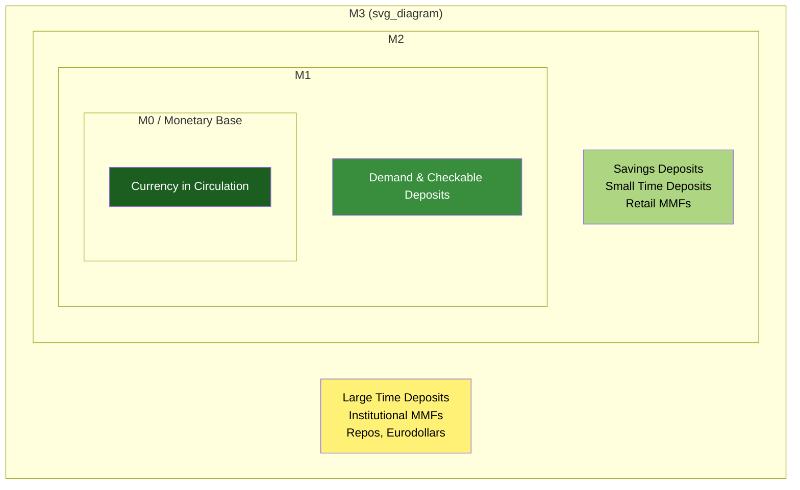

## Broad Money Aggregates: M1, M2, M3

### Overview

M1, M2, and M3 are progressively broader statistical measures of the money supply, each extending the boundary of "what counts as money" further along the liquidity/moneyness spectrum. These aggregates are the primary empirical tools central banks, economists, and policymakers use to monitor monetary conditions, though their precise definitions and policy relevance vary significantly across countries and have evolved substantially over recent decades.

### M1: Narrow Transactions Money

**Definition**

M1 comprises the most liquid, immediately spendable forms of money — assets that function directly as a medium of exchange without conversion.

$$M1 = \text{Currency in Circulation} + \text{Demand Deposits} + \text{Other Checkable Deposits}$$

**Key Points**

- Represents money that can be spent essentially instantly, without any withdrawal delay, penalty, or conversion step
- **Currency in circulation** excludes cash held in bank vaults and central bank reserves (which belong to M0, not M1)
- **Demand deposits** are non-interest-bearing (or minimally interest-bearing) checking accounts payable on demand
- **Other checkable deposits** include interest-bearing checking accounts, NOW accounts, and similar instruments, depending on jurisdiction
- **[Inference]** In 2020, the U.S. Federal Reserve redefined M1 to include savings deposits (previously classified under M2), following a regulatory change (Regulation D) that removed transfer limits on savings accounts, making them functionally similar to checking accounts. This is a documented methodological change, but readers using long-run U.S. M1 time series should be aware that pre- and post-2020 M1 are not directly comparable without adjustment.

### M2: Near Money Included

**Definition**

M2 extends M1 to include "near money" — assets that are highly liquid and easily convertible to spendable form but are not directly used as a medium of exchange without an intermediate conversion step.

$$M2 = M1 + \text{Savings Deposits} + \text{Small-Denomination Time Deposits} + \text{Retail Money Market Mutual Funds}$$

**Key Points**

- **Savings deposits**: Interest-bearing deposit accounts not directly spendable via check/card but readily transferable to checking
- **Small-denomination time deposits**: Certificates of deposit (CDs) below a jurisdiction-specific threshold (e.g., historically $100,000 in the U.S.), which impose an early-withdrawal penalty, reducing but not eliminating liquidity
- **Retail money market mutual funds**: Fund shares held by individuals, offering check-writing or easy redemption, functioning as a close substitute for bank deposits
- M2 is the most widely watched monetary aggregate in many economies because it has historically shown a more stable, if imperfect, relationship with nominal GDP and inflation than M1 or M0 alone, making it a common (though not universal or fully reliable) input to monetary policy analysis

### M3: Broadest Traditional Aggregate

**Definition**

M3 extends M2 to include larger, less retail-oriented, and institutional forms of near-money.

$$M3 = M2 + \text{Large-Denomination Time Deposits} + \text{Institutional Money Market Funds} + \text{Repurchase Agreements} + \text{Eurodollar Deposits}$$

**Key Points**

- **Large time deposits**: CDs above the retail threshold, typically held by institutions and large investors
- **Institutional money market funds**: Money market fund shares held by corporations, pension funds, and other institutional investors rather than retail depositors
- **Repurchase agreements (repos)**: Short-term collateralized borrowing/lending instruments that function as a close money substitute within wholesale funding markets
- **Eurodollar deposits**: Dollar-denominated deposits held at banks outside the United States, included in some countries' broader aggregates due to their liquidity role in international dollar funding markets

**[Unverified/Contested]** The U.S. Federal Reserve discontinued official publication of M3 in March 2006, citing that it did not appear to convey significant additional information about economic activity beyond M2 relative to the cost of collecting the underlying data; this decision remains debated among economists, with some (particularly those emphasizing shadow banking and repo market dynamics) arguing M3-type broad aggregates would have provided earlier warning signals ahead of the 2008 financial crisis. Other major central banks (e.g., the European Central Bank) continue to publish M3 as a policy-relevant aggregate.

### Comparative Structure

| Aggregate | Includes | Typical Liquidity | Primary Holders |
| --- | --- | --- | --- |
| M0 | Currency + central bank reserves | Highest | Public + banking system |
| M1 | Currency + demand/checkable deposits (+ savings, post-2020 in the U.S.) | Very high | Households, firms |
| M2 | M1 + savings deposits + small time deposits + retail MMFs | High | Households, small investors |
| M3 | M2 + large time deposits + institutional MMFs + repos + Eurodollars | Moderate-high | Institutions, corporations |

### Cross-Country Variation

**Key Points**

- Aggregate definitions are **not standardized internationally**; the European Central Bank, Bank of England, Bank of Japan, and Federal Reserve each define M1/M2/M3 with jurisdiction-specific component inclusion rules
- The ECB's M3 definition, for example, differs in composition from the discontinued U.S. Federal Reserve M3, particularly regarding the treatment of repos and money market fund shares
- **[Inference]** Because of this non-standardization, cross-country comparisons of "M2-to-GDP" or similar ratios should be treated cautiously, as apparent differences may partly reflect definitional variation rather than genuinely different monetary conditions.

### Empirical Relationship to Inflation and Output

The quantity theory of money provides the traditional theoretical link between broad money aggregates and macroeconomic outcomes:

$$M \times V = P \times Y$$

where $M$ is a chosen monetary aggregate, $V$ is velocity (how frequently a unit of money turns over in transactions), $P$ is the price level, and $Y$ is real output.

**Key Points**

- If velocity $V$ is assumed stable, growth in $M$ should map predictably to growth in nominal spending $P \times Y$
- **[Inference]** In practice, velocity has proven historically unstable, particularly for M1 and M2 in advanced economies since the 1980s (partly due to financial innovation, the 2008 crisis, and post-2020 pandemic-era distortions), substantially weakening the real-time predictive reliability of simple money-growth-to-inflation relationships; this is a genuinely contested empirical question rather than a settled mechanical relationship, and monetarist-style money-targeting frameworks have been largely superseded by interest-rate-based (Taylor rule-style) frameworks at most major central banks since the 1990s.

### Diagram: Nested Structure of Monetary Aggregates

### Example

Consider a simplified national money supply snapshot:

- Currency in circulation: $2 trillion
- Demand and checkable deposits: $3 trillion → **M1 = $5 trillion**
- Savings deposits, small time deposits, retail MMFs: $8 trillion → **M2 = $13 trillion**
- Large time deposits, institutional MMFs, repos: $4 trillion → **M3 = $17 trillion**

This illustrates the nested, cumulative structure: each broader aggregate contains all narrower ones plus additional, progressively less liquid instruments — a direct empirical application of the moneyness spectrum concept to standardized monetary statistics.

### Conclusion

M1, M2, and M3 operationalize the abstract concept of the moneyness spectrum into standardized, trackable statistical measures, each capturing a progressively wider (and less liquid) set of financial instruments. While these aggregates remain central to monetary data reporting and historical monetary analysis, their use as direct policy targets has diminished since the 1990s in favor of interest-rate-based frameworks, reflecting well-documented empirical instability in the velocity and money-growth-to-inflation relationships that originally motivated monetarist money-targeting approaches.

### Related Topics

- Narrow money: M0 and the monetary base
- Quantity theory of money and the equation of exchange
- Velocity of money: measurement, instability, and historical trends
- Monetarism and the Friedman-era money-targeting framework
- Liquidity and the moneyness spectrum
- Shadow banking and the case for broader money measures (repo, MMFs)