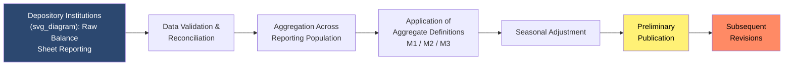

## Constructing and Revising Monetary Statistics

### Overview

Monetary statistics are not simple, error-free readings of an observable quantity — they are constructed measures built from underlying banking and financial system data, subject to definitional choices, seasonal adjustment procedures, sampling methodologies, and periodic revision. Understanding how these statistics are built and why they get revised is essential for correctly interpreting central bank data releases and avoiding overconfidence in real-time monetary figures.

### The Data Construction Process

**Key Points**

- Monetary aggregates are compiled primarily from **regulatory reporting** by depository institutions (commercial banks, savings institutions, credit unions), which submit periodic balance sheet data to the central bank or a designated statistical agency
- Compilation typically follows a multi-stage pipeline: raw institutional reporting → aggregation across reporting entities → application of aggregate definitions (M1, M2, etc.) → seasonal adjustment → publication

**Typical Construction Pipeline**

### Reporting Population and Sampling

**Key Points**

- Not every depository institution reports data at the same frequency or level of granularity; central banks typically use a **tiered reporting system**, requiring large institutions to report frequently (e.g., weekly) and smaller institutions less frequently (e.g., quarterly), with sampling and extrapolation used to estimate the full population's aggregate position
- Changes in the **reporting panel** (banks entering, exiting, merging, or crossing reporting-size thresholds) can introduce discontinuities in aggregate time series that do not reflect genuine changes in the money supply
- **[Inference]** Analysts working with long-run monetary time series generally need to consult accompanying methodological notes to distinguish genuine economic movements from breaks caused by reporting population changes, though the specific magnitude of such effects varies by episode and is not always fully quantifiable from published data alone

### Seasonal Adjustment

**Definition**

Seasonal adjustment is the statistical process of removing predictable, recurring within-year patterns (e.g., holiday cash demand spikes, tax-season deposit fluctuations) from raw data so that underlying trends and cyclical movements can be more clearly observed.

**Key Points**

- Most published headline monetary aggregate figures (e.g., "seasonally adjusted M2") have already had these patterns statistically removed using methods such as X-13ARIMA-SEATS (used by the U.S. Census Bureau and adapted by the Federal Reserve) or similar procedures used by other central banks
- Seasonal factors are typically **re-estimated periodically** (e.g., annually) as new data becomes available, which can cause **historical revisions** to previously published seasonally adjusted figures even when the underlying raw (not-seasonally-adjusted) data has not changed
- Non-seasonally-adjusted (NSA) series are also typically published alongside SA series, allowing analysts to distinguish genuine seasonal patterns from adjustment-driven artifacts

### Why Monetary Statistics Get Revised

**Key Points**

| Revision Source | Description |
| --- | --- |
| Late or corrected institutional reporting | Banks submit corrections to previously filed regulatory data after initial publication |
| Seasonal factor re-estimation | Updated seasonal adjustment models applied retroactively to historical data |
| Definitional/methodological changes | Central bank redefines an aggregate's components (e.g., the U.S. Federal Reserve's 2020 M1 redefinition to include savings deposits) |
| Benchmark revisions | Periodic realignment of estimated aggregate levels against more comprehensive, less frequent data sources (e.g., annual/quinquennial surveys) |
| Reporting panel changes | Entry, exit, or reclassification of reporting institutions altering the sampled population |

**[Inference]** Because of these multiple revision channels, initial ("real-time") monetary aggregate releases should generally be treated as provisional estimates rather than final figures; the magnitude of typical revisions varies by aggregate and by country and is not something that can be stated as a fixed universal percentage without consulting the specific statistical agency's published revision analysis.

### Real-Time Data vs. Vintage Data

**Definition**

"Real-time data" refers to the specific vintage of a statistic as it was published at a given point in time, before any subsequent revisions. "Vintage" or "revised" data refers to the same statistical series as later restated.

**Key Points**

- Economic research increasingly distinguishes between real-time and fully revised data because policymakers at the time of a decision only had access to the real-time vintage — using fully revised data to evaluate historical policy decisions can create a misleading picture of what was actually knowable at the time (a methodological issue extensively documented in the real-time data literature, e.g., work associated with the Federal Reserve Bank of Philadelphia's Real-Time Data Research Center)
- Some central banks and statistical agencies maintain **real-time databases** specifically to allow researchers to reconstruct the data as it appeared at each historical publication date, rather than only the current, fully revised series

### International Reporting Standards

**Key Points**

- The International Monetary Fund (IMF) publishes methodological guidance (notably the *Monetary and Financial Statistics Manual and Compilation Guide*) intended to promote cross-country comparability in how monetary aggregates and related financial statistics are constructed
- Despite this guidance, meaningful **cross-country definitional differences** persist (as covered under broad money aggregates), meaning statistical harmonization is a continuing, incomplete process rather than a fully achieved standard
- **[Inference]** Users conducting cross-country monetary comparisons should verify whether figures have been harmonized to a common methodology (e.g., IMF standardized presentations) or represent each country's own national-definition series, as mixing the two without adjustment can produce misleading comparisons

### Practical Implications for Analysis

**Key Points**

- Analysts and researchers using monetary aggregate data for empirical work should generally: (1) check the publication vintage/revision status of the data used, (2) review methodological notes for any definitional changes within the sample period, (3) prefer seasonally adjusted series for trend analysis unless the specific seasonal pattern itself is the object of study, and (4) be cautious drawing strong conclusions from the most recent (least-revised, most provisional) data points in a series
- Central bank communications (e.g., Federal Reserve H.6 statistical release, ECB Monetary Developments release) typically include footnotes explicitly documenting known discontinuities and definitional changes — these footnotes are an essential, frequently underused input for correct interpretation

### Example

A stylized illustration: A central bank's preliminary M2 estimate for a given month, published two weeks after month-end, is based on partial reporting from its largest depository institutions (representing, say, 90% of the sector by assets) with the remainder estimated via extrapolation from historical reporting patterns. One month later, as smaller institutions' actual filings are incorporated and validation checks are completed, the central bank publishes a revised figure — often only marginally different, but occasionally materially different if extrapolation assumptions proved inaccurate (e.g., during periods of unusual deposit flow volatility, such as in March 2023 during U.S. regional banking stress). Additionally, once annual seasonal factors are re-estimated the following year, the entire prior year's seasonally adjusted series may be quietly restated, even though no new raw reporting data was involved.

### Conclusion

Monetary statistics such as M0, M1, M2, and M3 are constructed, estimated, and periodically revised outputs of a complex reporting and statistical adjustment pipeline — not directly observed facts. Recognizing the sources of revision (late reporting, seasonal re-estimation, definitional changes, benchmark realignments, and reporting panel shifts) is essential for correctly interpreting real-time monetary data, avoiding overreaction to preliminary figures, and conducting methodologically sound historical or cross-country monetary analysis.

### Related Topics

- Narrow money: M0 and the monetary base
- Broad money aggregates: M1, M2, M3
- Real-time data analysis in macroeconomics
- Seasonal adjustment methodologies (X-13ARIMA-SEATS and alternatives)
- IMF Monetary and Financial Statistics Manual and cross-country harmonization
- Central bank statistical releases and data transparency practices