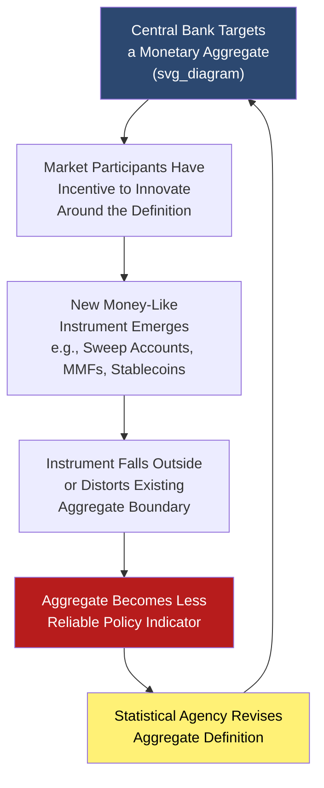

## Financial Innovation and Aggregate Measurement Problems

### Overview

Financial innovation — the ongoing creation of new financial instruments, payment technologies, and institutional arrangements — systematically challenges the stability and interpretability of traditional monetary aggregates. As new "money-like" instruments emerge outside the boundaries of existing M0/M1/M2/M3 definitions, aggregates can drift out of alignment with the true underlying quantity of liquid, spendable purchasing power in the economy, undermining their reliability as policy indicators.

### The Core Measurement Problem

**Definition**

Financial innovation creates measurement problems for monetary aggregates because the boundary of "what counts as money" is a discrete statistical classification imposed on an inherently continuous moneyness spectrum. New instruments frequently emerge with money-like properties that do not fit cleanly into existing aggregate definitions, causing aggregates to either **undercount** true liquid purchasing power (if the new instrument is excluded) or **become definitionally unstable** (if categories must be repeatedly redefined to capture it).

**Key Points**

- This problem is not new — it recurs historically each time a genuinely novel liquid instrument becomes widespread: traveler's checks, money market mutual funds in the 1970s, NOW/ATS accounts in the 1970s–80s, sweep accounts in the 1990s, and more recently stablecoins and fintech payment balances
- **Goodhart's Law** ("when a measure becomes a target, it ceases to be a good measure") is frequently invoked in this context: once a central bank targets a specific monetary aggregate for policy purposes, financial institutions and markets have an incentive to innovate around that definition, creating substitute instruments that evade the targeted measure while providing equivalent underlying liquidity services

### Historical Case Studies in Aggregate Disruption

**Sweep Accounts (1990s, United States)**

**Key Points**

- Banks developed "retail deposit sweep" programs that automatically transferred funds from reservable checking (transaction) accounts into non-reservable savings-classified accounts overnight, then swept them back the next business day
- This was driven by regulatory arbitrage: reducing reported transaction deposits lowered the bank's required reserves under Regulation D, without changing the customer's actual functional access to their funds
- **[Inference]** This practice is widely credited by monetary economists with significantly distorting reported M1 growth during the mid-to-late 1990s, as funds were reclassified from M1 to M2 components despite no genuine change in the underlying liquidity or spendability of the funds from the depositor's perspective, contributing to a well-documented breakdown in the previously observed M1-velocity relationship

**Money Market Mutual Funds (1970s onward)**

**Key Points**

- Emerged partly as a regulatory workaround to interest rate ceilings on bank deposits (Regulation Q in the U.S.), offering money-market-linked returns with check-writing/redemption features that closely mimicked bank deposits
- Their rapid growth required explicit incorporation into M2 (retail funds) and eventually M3 (institutional funds) definitions, illustrating how aggregate definitions must be periodically expanded to keep pace with genuinely new money-like instruments

**Shadow Banking and Repo Markets (2000s)**

**Key Points**

- The growth of the wholesale repurchase agreement (repo) market and asset-backed commercial paper as functionally money-like, highly liquid short-term instruments used extensively by institutional cash managers was, for a period, only partially captured in traditional M3-type aggregates
- **[Inference]** A substantial body of post-2008 research (associated with economists such as Gary Gorton and Perry Mehrling) argues that this "shadow money" was a significant, under-measured component of effective liquidity in the pre-crisis financial system, and that its sudden contraction during the 2007–2009 crisis (a "run on repo") was comparable in economic effect to a traditional bank deposit run, despite falling largely outside conventional monetary aggregate boundaries; this remains an active area of ongoing macro-finance research

### Contemporary Challenges: Digital and Fintech Instruments

**Key Points**

- **Stablecoins**: Digital tokens pegged to fiat currency (e.g., USD-pegged stablecoins) function as highly liquid, near-instantly transferable value, raising the question of whether and how they should be incorporated into monetary aggregate measurement
- **Fintech payment balances**: Prepaid balances held with payment platforms and digital wallets represent stored purchasing power that may not be captured by traditional bank-deposit-based reporting frameworks
- **Central Bank Digital Currencies (CBDCs)**: As central banks in various jurisdictions explore or pilot CBDCs, their eventual classification (as M0-equivalent, or a new category) will itself require methodological decisions with measurement implications

**[Unverified/Contested]** How stablecoins and similar instruments should be integrated into national monetary aggregate statistics is an unresolved methodological question actively being studied by central banks and international statistical bodies (e.g., the IMF's ongoing work on digital money measurement); no fully settled international standard exists as of the current knowledge base, and practices likely continue to evolve, so current developments should be verified against up-to-date central bank and IMF publications.

### Consequences for Monetary Policy

**Key Points**

- **Velocity instability**: When financial innovation shifts funds between aggregate categories without changing underlying liquidity, the measured velocity ($V = \frac{P \times Y}{M}$) of the affected aggregate becomes unstable, undermining quantity-theory-based policy frameworks
- **Erosion of monetarist targeting**: The instability induced by financial innovation is frequently cited as a central reason why most major central banks largely abandoned strict monetary aggregate targeting (prominent in the Friedman-monetarist era of the late 1970s–1980s) in favor of interest-rate-based frameworks (e.g., Taylor-rule-style approaches) from the 1990s onward
- **Need for supplementary indicators**: Central banks increasingly monitor a broader dashboard of liquidity indicators — including credit growth, repo market volumes, and financial conditions indices — alongside or instead of traditional monetary aggregates, partly in response to these measurement challenges

### Diagram: The Innovation-Measurement Feedback Loop

### Example

A stylized illustration using the sweep account episode: Suppose a bank customer holds $50,000 in a checking account. Under a sweep program, the bank automatically transfers $40,000 each night into a linked savings-classified account (reducing the bank's reported reservable transaction deposits and required reserves), then sweeps it back into checking the next morning before the customer might need it. From the customer's perspective, their funds remain fully accessible and spendable at all times — no meaningful change in liquidity has occurred. But from the statistical aggregate's perspective, $40,000 has been reclassified out of M1 and into M2, even though the underlying economic reality (fully liquid, instantly spendable balances) is unchanged. Aggregated across the entire banking system, this kind of behavior can materially distort reported M1 growth rates without reflecting any genuine change in transactions money.

### Conclusion

Financial innovation persistently challenges the boundaries of monetary aggregate measurement by creating new money-like instruments that either evade existing definitions or require those definitions to be repeatedly revised. This dynamic — encapsulated by Goodhart's Law — has been a recurring feature of monetary economics since at least the 1970s and is a primary reason why major central banks shifted away from strict monetary aggregate targeting toward interest-rate-based policy frameworks. Contemporary developments in stablecoins, fintech payment instruments, and CBDCs represent the latest iteration of this long-running measurement challenge, with the appropriate statistical treatment still actively evolving.

### Related Topics

- Broad money aggregates: M1, M2, M3
- Constructing and revising monetary statistics
- Goodhart's Law and its applications in monetary policy
- Shadow banking, repo markets, and the 2007–2009 financial crisis
- Monetarism and the decline of money-supply targeting
- Stablecoins and Central Bank Digital Currencies (CBDCs) as emerging monetary instruments