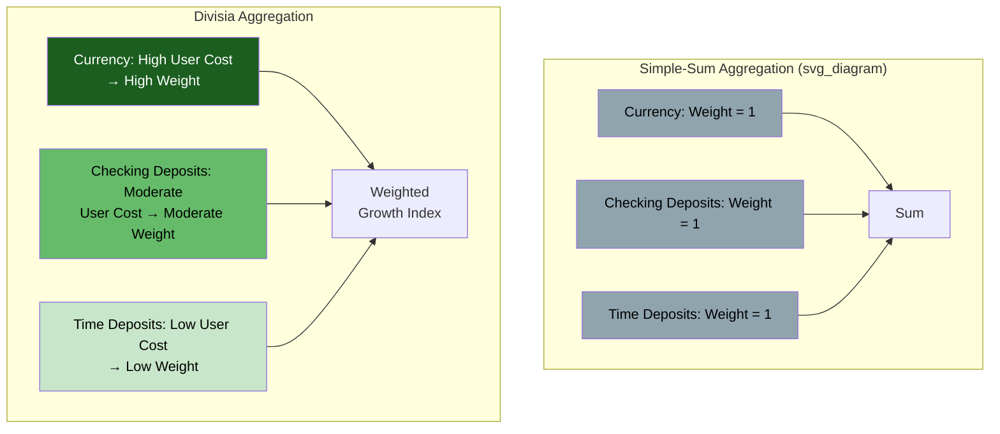

## Divisia Monetary Aggregates

### Overview

Divisia monetary aggregates are an alternative to conventional "simple-sum" monetary aggregates (M1, M2, M3) that weight each component by its degree of "moneyness" rather than adding all components together at equal weight. Developed by applying Divisia index theory (originating from French economist François Divisia's 1925 work on economic index numbers) to monetary economics — primarily through the work of William Barnett beginning in the late 1970s and early 1980s — this approach attempts to directly resolve several of the aggregation and measurement problems inherent in simple-sum aggregates.

### The Problem with Simple-Sum Aggregation

**Definition**

Conventional monetary aggregates (M1, M2, M3) are constructed as **simple-sum indices**: every included component (currency, checking deposits, savings deposits, small time deposits, etc.) is added together with an implicit weight of exactly 1, regardless of how liquid or "money-like" that particular asset actually is.

$$M_{simple-sum} = \sum_{i=1}^{n} x_i$$

where $x_i$ represents the dollar quantity of the $i$-th monetary component.

**Key Points**

- This treats a dollar of physical currency (perfectly liquid, zero opportunity cost of holding) as economically equivalent to a dollar in a small time deposit (illiquid, interest-bearing, penalty for early withdrawal) — an assumption widely regarded as economically implausible given that these assets provide different levels of monetary/transaction services
- **[Inference]** This equal-weighting assumption is generally considered the central conceptual flaw motivating the development of Divisia monetary aggregates, since it implicitly assumes perfect substitutability between highly liquid and relatively illiquid components, which contradicts the observed behavior of economic agents holding a mix of asset types precisely because they are *not* perfect substitutes

### The Divisia Index Approach

**Definition**

Divisia monetary aggregates instead construct a weighted growth-rate index, where each component's contribution to the aggregate's growth is weighted by its **expenditure share**, which itself is derived from the component's estimated "user cost" — an implicit measure of the opportunity cost of holding that particular asset instead of the most illiquid, highest-yielding benchmark asset.

**User Cost Formula**

The user cost of holding monetary asset $i$ is typically defined as:

$$\pi_i = \frac{R - r_i}{1 + R}$$

where $R$ is the yield on a benchmark illiquid "non-monetary" asset (representing the pure opportunity cost of holding no liquidity services at all) and $r_i$ is the own-rate of return on monetary asset $i$. Assets offering a return close to $R$ (e.g., a high-yield time deposit) have low user cost and thus low "moneyness" weight in the index; assets offering little or no return (e.g., physical currency) have high user cost and thus high moneyness weight.

**Divisia Growth Rate Formula**

$$\Delta \log M_{Divisia} = \sum_{i=1}^{n} s_i \, \Delta \log x_i$$

where $s_i$ is the expenditure share (weight) of component $i$, calculated from its user cost relative to the total user cost across all included components:

$$s_i = \frac{\pi_i x_i}{\sum_{j=1}^{n} \pi_j x_j}$$

**Key Points**

- Components that provide *more* monetary services (higher user cost, meaning the holder sacrifices more potential yield to hold them, implying they are held primarily for liquidity/transaction purposes) receive proportionally *greater* weight in the Divisia aggregate's growth calculation
- This directly addresses the equal-weighting problem: a shift of funds from currency into a high-yielding time deposit would show up as a much smaller increase (or even a decrease) in the Divisia aggregate compared to the simple-sum aggregate, because the shift represents a move toward assets providing fewer transaction/liquidity services

### Comparative Summary: Simple-Sum vs. Divisia

| Feature | Simple-Sum Aggregates (M1, M2, M3) | Divisia Aggregates |
| --- | --- | --- |
| Component weighting | Equal (weight = 1 for all included assets) | Weighted by user cost / expenditure share |
| Underlying assumption | Perfect substitutability among components | Imperfect substitutability, reflecting differing liquidity services |
| Theoretical foundation | Accounting/statistical convention | Index number theory, microeconomic aggregation theory (Barnett) |
| Sensitivity to financial innovation | High — component reclassification can distort growth rates | Lower — designed to be more robust to substitution between money-like assets |
| Adoption | Standard practice at most central banks (Fed, ECB, BoE, etc.) | Constructed and published by some central banks and research institutions (e.g., Federal Reserve Bank of St. Louis "MSI" series, Bank of England historical Divisia series) but not a primary policy target anywhere |

### Empirical Performance Claims

**Key Points**

- Proponents (notably William Barnett and researchers associated with the Center for Financial Stability's "Divisia Monetary and Financial Aggregates" (formerly the "Divisia M4" project)) argue that Divisia aggregates exhibit a more stable relationship with nominal income and inflation than simple-sum aggregates, particularly during periods of significant financial innovation (e.g., the 1980s deregulation era, and around the 2008 financial crisis)
- **[Unverified/Contested]** Empirical claims regarding Divisia aggregates' superior predictive power for inflation and output relative to simple-sum aggregates are actively debated in the monetary economics literature; results are sensitive to sample period, country, and specific Divisia construction methodology, and Divisia measures have not displaced simple-sum aggregates as the standard reported or policy-referenced statistic at major central banks, so claims of clear superiority should be treated as a research position rather than an established consensus

### Practical and Institutional Limitations

**Key Points**

- **Data requirements**: Constructing Divisia aggregates requires reliable, disaggregated own-rate-of-return data for every included monetary component, which is more data-intensive and methodologically complex than simple summation
- **Benchmark rate sensitivity**: The choice of the benchmark illiquid rate $R$ materially affects the resulting user cost weights and thus the aggregate's behavior, introducing a methodological choice point that can be contested or vary across implementations
- **Institutional inertia**: Because simple-sum aggregates are deeply embedded in existing central bank reporting infrastructure, historical data series, and public communication practices, transitioning to Divisia-based official reporting would involve substantial institutional and continuity costs, which is frequently cited as a practical (rather than purely theoretical) reason for continued simple-sum dominance

### Diagram: Simple-Sum vs. Divisia Weighting Logic

### Example

Suppose an economy has two monetary components: currency (yielding 0% interest) and a time deposit (yielding 4% interest), with a benchmark illiquid asset yielding 5%. The user costs are:

$$\pi_{currency} = \frac{0.05 - 0}{1.05} \approx 0.0476, \quad \pi_{deposit} = \frac{0.05 - 0.04}{1.05} \approx 0.0095$$

Currency's user cost is roughly five times higher than the time deposit's, meaning currency is weighted far more heavily in the Divisia index's growth calculation because it provides substantially more liquidity/transaction service per dollar held. If $1,000 shifts from currency into the time deposit, the simple-sum M2 aggregate shows **zero net change** (both are M2 components), while the Divisia aggregate shows a **decrease**, correctly reflecting that the shift represents a move away from transaction-ready balances toward a savings-oriented, less liquidity-providing asset.

### Conclusion

Divisia monetary aggregates represent a theoretically grounded alternative to conventional simple-sum aggregates, directly addressing the implicit and economically implausible assumption that all included monetary components are perfect substitutes. By weighting components according to their user cost (opportunity cost of holding), Divisia aggregates aim to more accurately track the true quantity of monetary/liquidity services in an economy and to be more robust to compositional shifts driven by financial innovation. Despite continued academic interest and some institutional publication (e.g., the Center for Financial Stability, Federal Reserve Bank of St. Louis), Divisia aggregates have not replaced simple-sum M1/M2/M3 as the standard central bank policy reference, and their empirical superiority remains an actively contested research question.

### Related Topics

- Broad money aggregates: M1, M2, M3
- Financial innovation and aggregate measurement problems
- Index number theory and its applications in economics
- User cost of money and the theory of monetary services
- William Barnett's contributions to monetary aggregation theory
- Velocity of money and its empirical stability debates