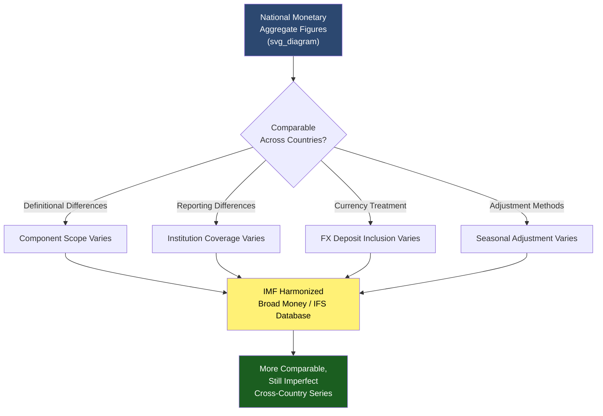

## Cross-Country Comparison of Monetary Aggregates

### Overview

Comparing monetary aggregates across countries is analytically valuable for assessing relative monetary conditions, financial deepening, and policy stances, but it is methodologically hazardous due to definitional inconsistencies, differing financial system structures, and varying statistical practices across national central banks and statistical agencies. This topic surveys the major sources of cross-country incomparability and the frameworks used to make comparisons more meaningful.

### Sources of Cross-Country Incomparability

**Key Points**

| Source of Divergence | Description |
| --- | --- |
| Component definitions | What counts as "M1" or "M2" differs by country (e.g., inclusion of savings deposits, foreign currency deposits, or repos) |
| Reporting institution scope | Which institutions are included in the reporting population (commercial banks only vs. broader deposit-taking institutions) varies |
| Currency denomination treatment | Some countries include foreign-currency-denominated deposits held domestically in their aggregates; others exclude them |
| Seasonal adjustment methodology | Different statistical agencies use different seasonal adjustment procedures, affecting comparability of adjusted series |
| Publication frequency and lag | Aggregates are published at different frequencies (weekly, monthly, quarterly) and with different reporting lags across countries |
| Financial system structure | Bank-based systems (e.g., much of continental Europe historically) vs. market-based systems (e.g., the U.S.) produce structurally different relationships between monetary aggregates and economic activity |

### The IMF Standardized Framework

**Definition**

The International Monetary Fund's *Monetary and Financial Statistics Manual and Compilation Guide* (MFSM) provides a standardized methodological framework intended to improve cross-country comparability of monetary and financial statistics, including guidance on the compilation of "broad money" using a harmonized definition distinct from individual countries' own national M1/M2/M3 conventions.

**Key Points**

- The IMF's *International Financial Statistics (IFS)* database publishes broad money figures using this harmonized methodology for a large number of member countries, offering a more directly comparable cross-country series than national aggregates alone
- Despite this harmonization effort, **[Inference]** national central banks continue to publish and primarily use their own domestically defined aggregates for policy purposes, meaning the IMF-harmonized series and the domestically reported series for the same country can differ, and researchers should be explicit about which series (national or IMF-standardized) they are using in any comparative analysis

### Financial Deepening and the M2/GDP Ratio

**Definition**

A commonly used cross-country comparative metric is the ratio of a broad monetary aggregate (typically M2 or IMF-standardized broad money) to nominal GDP, often used as a rough proxy for "financial deepening" — the degree to which an economy's financial system has developed relative to its overall economic size.

$$\text{Financial Deepening Ratio} = \frac{M2}{\text{Nominal GDP}}$$

**Key Points**

- Higher-income, more financially developed economies (e.g., Japan, the Eurozone, China in recent decades) tend to exhibit substantially higher M2/GDP ratios than many developing economies, reflecting deeper banking penetration, higher savings rates channeled through the banking system, and, in some cases, structural factors such as high household savings preferences
- **[Inference]** While M2/GDP is a widely used indicator in comparative macroeconomics and development economics literature, it should be interpreted cautiously as a *proxy* rather than a precise measure, since it conflates genuine financial development with country-specific definitional scope, banking structure (e.g., degree of disintermediation toward capital markets), and monetary policy history (e.g., legacy effects of past high-inflation or high-savings periods)

### Case Illustration: Structural Divergence

**Key Points**

- **United States**: Historically more market-based financial system; M2/GDP ratio has been comparatively moderate relative to bank-centric economies, though this has shifted over time with quantitative easing episodes substantially expanding aggregate levels post-2008 and post-2020
- **Japan**: Very high M2/GDP ratio, commonly attributed to a bank-centric financial system, historically high household savings rates, and an extended period of near-zero interest rates reducing the opportunity cost of holding monetary assets
- **Eurozone**: ECB-published M3 reflects a harmonized definition across member states, itself a notable methodological achievement given the currency union spans multiple national banking systems with historically differing conventions
- **China**: Has exhibited one of the world's highest M2/GDP ratios in recent decades; **[Inference]** commonly attributed by economists to a combination of high domestic savings rates, a bank-dominated (rather than capital-market-dominated) financial intermediation structure, and rapid credit expansion, though the relative weight of these factors is debated and country-specific structural features make direct comparison to other economies' M2/GDP ratios of limited standalone interpretive value

**[Unverified]** Specific current M2/GDP figures for individual countries change over time with economic and policy conditions; any numeric comparison should be verified against current IMF, World Bank, or national central bank data rather than relied upon as a static fact.

### Currency Substitution and Dollarization

**Definition**

In some economies, particularly those with a history of high inflation or currency instability, residents hold a significant share of their liquid monetary balances in a foreign currency (commonly the U.S. dollar or euro) rather than the domestic currency — a phenomenon known as currency substitution or "dollarization."

**Key Points**

- This complicates cross-country monetary aggregate comparison because a domestically reported M2 figure may substantially understate the true quantity of liquid purchasing power held by residents if significant foreign-currency deposits or cash holdings are excluded or only partially captured
- Some countries explicitly publish a "broad money including foreign currency deposits" measure alongside a domestic-currency-only measure specifically to address this comparability issue
- **[Inference]** Analysts examining monetary conditions in historically high-inflation or dollarized economies (e.g., several Latin American and some post-Soviet economies at various historical periods) generally need to consult foreign-currency-inclusive aggregate measures to obtain an economically meaningful picture, rather than relying solely on domestic-currency M2 figures

### Practical Guidance for Cross-Country Comparison

**Key Points**

- Prefer IMF-standardized *International Financial Statistics* broad money series over raw national aggregate comparisons when conducting formal cross-country empirical work, while being aware this still involves methodological compromises
- Always check whether foreign-currency-denominated deposits are included or excluded, particularly for economies with known currency substitution
- Normalize by GDP or another scale variable (e.g., population, per-capita income) to enable meaningful comparison of relative monetary conditions rather than comparing raw nominal aggregate levels across countries of different economic size
- Cross-reference central bank definitional footnotes for each country under study, since definitional scope frequently changes over time even within a single country's own historical series (compounding the cross-country comparability challenge with a within-country comparability challenge)

### Diagram: Sources of Cross-Country Incomparability

### Example

Consider comparing "M2" between Country A and Country B for a study on financial deepening. Country A's national M2 definition includes small time deposits up to a $100,000 threshold; Country B's national "M2"-labeled aggregate includes time deposits up to a much higher threshold and also includes certain foreign-currency retail deposits. A naive comparison of the two raw M2/GDP ratios would partly reflect this definitional difference rather than genuine differences in financial deepening or monetary conditions. Using the IMF's harmonized broad money series for both countries, which applies a consistent compilation methodology, would substantially reduce (though not necessarily eliminate) this source of distortion, providing a more economically meaningful basis for comparison.

### Conclusion

Cross-country comparison of monetary aggregates requires careful attention to definitional, institutional, and currency-treatment differences that can otherwise produce misleading conclusions about relative monetary conditions or financial development. While standardized frameworks such as the IMF's Monetary and Financial Statistics Manual improve comparability, national aggregates remain the primary policy-relevant measure within each country, and researchers conducting comparative work should explicitly document which methodology (national or harmonized) underlies their analysis, remaining especially cautious in contexts involving currency substitution or dollarization.

### Related Topics

- Broad money aggregates: M1, M2, M3
- Constructing and revising monetary statistics
- IMF Monetary and Financial Statistics Manual and International Financial Statistics database
- Currency substitution and dollarization in emerging economies
- Financial deepening and economic development
- Divisia monetary aggregates as an alternative comparative framework