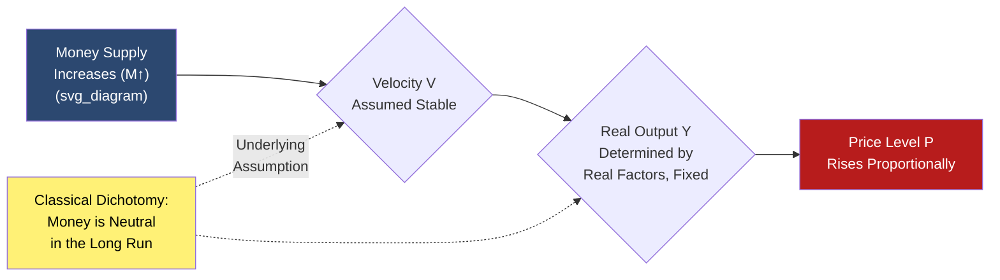

## Classical Quantity-Theoretic Demand for Money

### Overview

The classical quantity-theoretic approach to money demand, rooted in the quantity theory of money, treats the demand for money primarily as a mechanical function of the transactions needs of the economy, largely independent of the interest rate. This framework, developed through the work of economists including Irving Fisher and later refined by the Cambridge School (Marshall, Pigou), forms the theoretical starting point from which later, more behaviorally rich theories of money demand (Keynesian liquidity preference, Baumol-Tobin, monetarist reformulations) developed as extensions or critiques.

### The Fisher Equation of Exchange

**Definition**

Irving Fisher's transactions version of the quantity theory (formalized in *The Purchasing Power of Money*, 1911) expresses the relationship between the money supply and nominal transactions in an economy as an accounting identity.

$$MV = PT$$

where:

- $M$ = the quantity of money in circulation
- $V$ = the transactions velocity of money (the average number of times a unit of money is used in transactions over a given period)
- $P$ = the general price level
- $T$ = the real volume of transactions conducted in the economy

**Key Points**

- This is fundamentally an **accounting identity**, not by itself a behavioral theory — it must hold true by construction, since total spending (the left-hand side) must equal total nominal transactions value (the right-hand side)
- Fisher's theoretical contribution was to argue that $V$ and $T$ are determined by structural, largely institutional factors (payment habits, banking system efficiency, the pace of the physical production/distribution process) that change only slowly over time, making them approximately constant in the short run
- Given approximately constant $V$ and $T$, the equation implies a direct, proportional relationship between changes in the money supply $M$ and changes in the price level $P$ — the core classical quantity theory conclusion

### Modern (Income) Version of the Equation of Exchange

**Definition**

A commonly used modern restatement replaces the transactions volume $T$ (difficult to measure directly, as it includes all transactions, not just final-goods transactions) with real output/income $Y$, and correspondingly redefines velocity as **income velocity**.

$$MV = PY$$

where $V$ now represents the number of times the money stock turns over in generating a year's worth of nominal income (nominal GDP), rather than all transactions in the economy.

**Key Points**

- This version is more empirically tractable since $P \times Y$ (nominal GDP) is a standard, regularly published macroeconomic statistic, unlike Fisher's broader transactions concept
- The equation remains an identity by construction ($V \equiv \frac{PY}{M}$, i.e., velocity is *defined* residually from observed $M$, $P$, and $Y$) unless additional behavioral assumptions are imposed regarding the stability or determinants of $V$

### From Identity to Theory: The Classical Behavioral Assumption

**Key Points**

- The equation of exchange becomes a genuine **theory of money demand and price determination** only once economists impose the assumption that $V$ is stable (constant or slowly and predictably varying) and that $Y$ is determined independently by the real economy's productive capacity (consistent with classical assumptions of full employment / output at its natural rate in the long run)
- Under these assumptions, causality is assumed to run from $M$ to $P$: an exogenous increase in the money supply, with $V$ and $Y$ held fixed, translates directly and proportionally into a higher price level — the foundational **classical dichotomy** and **monetary neutrality** result, in which money supply changes affect only nominal variables (prices) and not real variables (output, employment) in the long run

$$\%\Delta M + \%\Delta V = \%\Delta P + \%\Delta Y$$

If $\%\Delta V \approx 0$ and $\%\Delta Y$ is determined independently by real factors, then $\%\Delta P \approx \%\Delta M - \%\Delta Y$, giving a direct quantitative link between money growth and inflation.

### The Cambridge Cash-Balance Approach

**Definition**

The Cambridge School (notably Alfred Marshall and Arthur Cecil Pigou, early 20th century) reformulated the quantity theory by asking a subtly different question: not how many times money changes hands (velocity), but how much money individuals *choose to hold* as a fraction of their income, given their transaction needs.

$$M^d = k \times P \times Y$$

where $k$ (the "Cambridge k") represents the fraction of nominal income that the public desires to hold as money balances — conceptually the inverse of income velocity, $k = \frac{1}{V}$.

**Key Points**

- This reformulation is often credited with shifting the framing from a purely mechanical, transactions-flow-based description (Fisher) toward a genuine **demand-for-money** framework that treats money as an asset individuals actively choose to hold, foreshadowing later portfolio-based approaches to money demand (Keynesian liquidity preference, Baumol-Tobin, Friedman's restatement)
- The Cambridge $k$ is treated as determined by institutional factors similar to Fisher's velocity determinants: payment system conventions, the frequency of income receipt, and the degree of synchronization between income and expenditure — again assumed relatively stable in the short-to-medium run under classical assumptions

### Determinants of Velocity (and $k$) in the Classical Framework

**Key Points**

| Determinant | Effect on Velocity ($V$) / Cambridge $k$ |
| --- | --- |
| Payment system efficiency | More efficient, faster payment/clearing systems → higher velocity (lower $k$) |
| Frequency of income payment | More frequent income receipt (e.g., weekly vs. monthly pay) → generally higher velocity (lower average money holding needed) |
| Degree of income-expenditure synchronization | Closer synchronization between receiving and spending income → higher velocity |
| Financial development / credit availability | Greater availability of short-term credit reduces the precautionary need to hold money → generally associated with higher velocity |

**[Inference]** The classical assumption that these institutional determinants change only slowly is a simplifying assumption appropriate to the relatively static financial systems of the late 19th/early 20th century in which Fisher and the Cambridge economists were writing; this assumption became increasingly strained as 20th-century financial innovation accelerated, motivating later refinements to money demand theory (covered separately under Keynesian liquidity preference and monetarist/Friedman approaches).

### Classical Money Demand and the Quantity Theory Policy Conclusion

**Key Points**

- The central classical policy implication is that **inflation is fundamentally a monetary phenomenon** in the long run: sustained increases in the price level require, and are caused by, sustained growth in the money supply in excess of real output growth
- This is often summarized by the aphorism (associated with, though not exclusively originated by, Milton Friedman in his later 20th-century monetarist restatement): "inflation is always and everywhere a monetary phenomenon" — while Friedman's specific formulation postdates the classical period, it directly descends from and popularizes the classical quantity-theoretic logic
- **[Inference]** This proportionality result — that a given percentage increase in $M$ produces an equivalent percentage increase in $P$ in the long run, holding $V$ and $Y$ fixed — is generally treated in modern macroeconomics as a reasonable long-run approximation under certain conditions (particularly for high-inflation or hyperinflation episodes, where money growth is empirically the dominant driver of price level movements), but is not treated as a precise short-run predictive relationship, given well-documented short-run velocity instability and non-neutrality of money

### Diagram: The Classical Money-Price Transmission Chain

### Example

Suppose an economy has nominal GDP ($PY$) of $20 trillion and a money supply ($M$) of $4 trillion. Income velocity is:

$$V = \frac{PY}{M} = \frac{20}{4} = 5$$

Equivalently, the Cambridge $k = \frac{1}{5} = 0.20$, meaning the public holds money balances equal to approximately 20% of nominal annual income. If the central bank increases the money supply by 10% (to $4.4 trillion) and classical assumptions hold — $V$ remains at 5 and real output $Y$ is unchanged at its full-employment level — the equation of exchange implies nominal GDP must rise to $22 trillion, and since real output is unchanged, this entire $2 trillion increase must manifest as a roughly 10% rise in the price level $P$, illustrating the classical proportionality result between money growth and inflation.

### Conclusion

The classical quantity-theoretic approach to money demand, expressed through Fisher's equation of exchange and refined by the Cambridge cash-balance approach, establishes money demand as fundamentally proportional to nominal income, governed by a relatively stable velocity (or equivalently, a stable Cambridge $k$) determined by slow-moving institutional and payment-system factors. Under classical assumptions of monetary neutrality and full-employment output, this framework yields the foundational quantity-theory result that sustained money supply growth translates proportionally into inflation in the long run — a conclusion that remains influential in modern macroeconomics, particularly for understanding high-inflation episodes, even as later theories (Keynesian liquidity preference, Baumol-Tobin, Friedman's modern quantity theory restatement) introduced interest-rate sensitivity and more sophisticated portfolio behavior into money demand modeling.

### Related Topics

- Keynesian liquidity preference theory of money demand
- Baumol-Tobin inventory-theoretic model of transactions demand
- Friedman's modern restatement of the quantity theory of money
- Velocity of money: measurement, instability, and historical trends
- The classical dichotomy and monetary neutrality
- Legal tender laws and the state theory of money