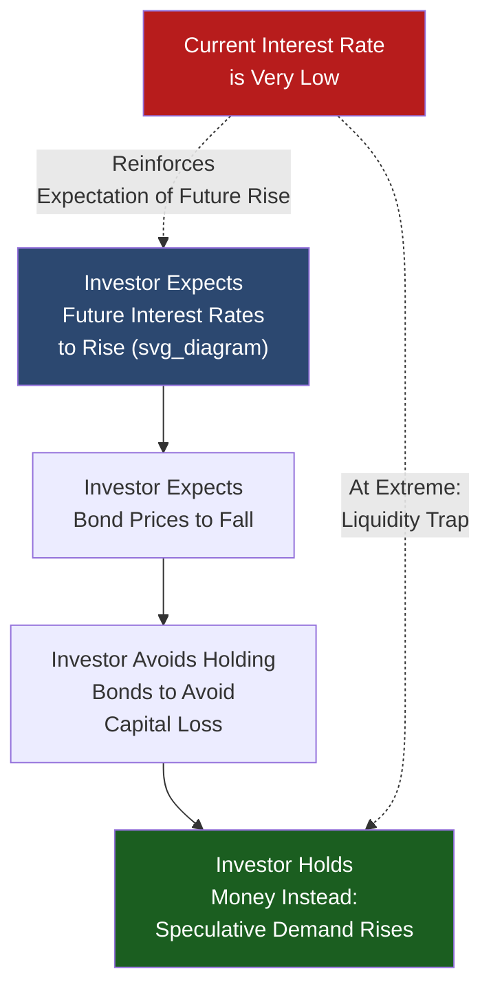

## Keynesian Liquidity Preference Theory

### Overview

Keynesian liquidity preference theory, introduced by John Maynard Keynes in *The General Theory of Employment, Interest and Money* (1936), represents a fundamental departure from the classical quantity-theoretic view of money demand. Rather than treating money demand as a stable, mechanical function of income alone, Keynes reframes money as one asset among several in an individual's portfolio, whose demand depends critically on the interest rate as well as income — introducing interest-rate sensitivity into money demand theory for the first time in a rigorous, widely influential way.

### The Three Motives for Holding Money

**Definition**

Keynes decomposes the demand for money into three distinct behavioral motives, each responding to different economic variables.

**1. Transactions Motive**

**Key Points**

- Reflects the need to hold money to bridge the gap between the receipt of income and the timing of planned expenditures
- Positively related to the level of income/output $Y$: higher income generally implies a higher volume of planned transactions, requiring larger average money balances
- Conceptually similar to the classical transactions-based framework (Fisher, Cambridge $k$), representing continuity with earlier theory rather than a full break

**2. Precautionary Motive**

**Key Points**

- Reflects the desire to hold money as a buffer against unforeseen expenditures or income shortfalls — an insurance-like holding of liquidity against uncertainty
- Also positively related to income $Y$, since higher-income individuals and larger economies generally have proportionally larger unforeseen contingencies to buffer against
- **[Inference]** Keynes's original treatment groups this closely with the transactions motive as both being primarily income-driven; later literature (e.g., inventory-theoretic extensions) has explored precautionary demand as also sensitive to income *uncertainty* specifically, not just income *level*, though this refinement is a later development rather than part of Keynes's original formulation

**3. Speculative Motive**

**Key Points**

- This is Keynes's genuinely novel theoretical contribution: the idea that individuals hold money not only for transactions purposes but also as a **store of value alternative to bonds**, based on expectations about future interest rate movements
- Negatively related to the current interest rate $i$: as interest rates rise, the opportunity cost of holding non-interest-bearing money (rather than bonds) increases, reducing speculative money demand
- The mechanism operates through **capital gain/loss expectations** on bonds: if an investor expects interest rates to rise in the future, they anticipate a corresponding fall in bond prices (since bond prices and yields move inversely), and therefore prefers to hold money now rather than risk a capital loss on bonds — this expectation-driven behavior is the theoretical core of the speculative motive

### Formal Representation

**Definition**

Combining the three motives, aggregate money demand is expressed as a function of both income and the interest rate:

$$M^d = L(Y, i)$$

More specifically, decomposed into transactions-plus-precautionary demand (a function of income) and speculative demand (a function of the interest rate):

$$M^d = L_1(Y) + L_2(i)$$

where $\frac{\partial L_1}{\partial Y} > 0$ (transactions/precautionary demand rises with income) and $\frac{\partial L_2}{\partial i} < 0$ (speculative demand falls as the interest rate rises).

**Key Points**

- This formulation is the direct theoretical ancestor of the **LM curve** in the IS-LM macroeconomic model (developed by John Hicks, 1937, formalizing Keynes's verbal argument), which plots combinations of income and interest rates consistent with money market equilibrium
- The negative relationship between money demand and the interest rate is the crucial departure from the classical framework, in which money demand depends on income alone (with velocity/Cambridge $k$ treated as approximately constant, independent of $i$)

### The Liquidity Trap

**Definition**

A liquidity trap is a theoretical (and, in some historical episodes, empirically observed) situation in which the interest rate falls to a level so low that speculative money demand becomes effectively infinite — investors uniformly expect interest rates can only rise from that point, anticipating certain capital losses on bonds, and therefore prefer to hold money entirely rather than any bonds at all.

**Key Points**

- Graphically, this corresponds to the money demand curve (and the LM curve) becoming **perfectly horizontal (flat)** at very low interest rates — the interest rate cannot be pushed lower through further increases in the money supply, because any additional money is simply absorbed into speculative balances rather than lowering rates further
- **Policy implication**: in a liquidity trap, conventional monetary policy (expanding the money supply to lower interest rates and stimulate investment) becomes ineffective, since the interest rate is already at its practical floor and further money creation does not lower it further — this is a key theoretical justification within Keynesian economics for preferring fiscal policy over monetary policy as a stabilization tool during severe downturns
- **[Inference]** The liquidity trap concept is often discussed in connection with historical episodes such as the Great Depression-era United States and, more prominently in modern discussion, Japan's prolonged near-zero-interest-rate period from the 1990s onward and various advanced economies' near-zero/negative rate environments following the 2008 financial crisis; whether these episodes represent a "true" liquidity trap in Keynes's strict theoretical sense, versus simply very low but still operative monetary policy effectiveness, remains a genuinely debated question in macroeconomics rather than a settled empirical classification

### Comparison to the Classical Framework

| Feature | Classical Quantity Theory | Keynesian Liquidity Preference |
| --- | --- | --- |
| Primary determinant of money demand | Income (via velocity/Cambridge $k$) | Income AND the interest rate |
| Interest rate sensitivity | None (or minimal, implicit) | Central and explicit (speculative motive) |
| Velocity treatment | Assumed stable | Implicitly variable, since money demand responds to $i$, which itself fluctuates |
| View of money's role | Primarily a transactions medium | An asset held as an alternative to bonds within a portfolio choice framework |
| Policy implication | Money supply changes primarily affect prices (in the long run, under neutrality) | Money supply changes affect interest rates and, through investment, real output (short-run non-neutrality) |

### Diagram: The Speculative Motive Mechanism

### Example

Consider an investor holding a long-term bond currently yielding 2%. If the investor believes the central bank is likely to raise rates substantially in the near future (say, to 5%), they anticipate that newly issued bonds will offer a more attractive yield, causing the market price of their existing lower-yielding bond to fall (since bond prices and yields move inversely) — the investor would incur a capital loss if they needed to sell before maturity. Rather than risk this loss, the investor sells the bond now and holds the proceeds as money, waiting for interest rates to rise before re-entering the bond market at more favorable terms. This is the speculative motive in action: money is held not for transactions, but as a temporary parking place for wealth based on an interest rate forecast. Aggregated across many investors holding similar expectations, this behavior produces the negative relationship between aggregate money demand and the interest rate central to Keynesian liquidity preference theory.

### Conclusion

Keynesian liquidity preference theory fundamentally expanded the theory of money demand beyond the classical transactions-based framework by introducing the speculative motive and, with it, explicit interest-rate sensitivity. This reframing of money as a portfolio asset competing with bonds — rather than merely a transactions medium — provided the theoretical foundation for the LM curve, for understanding the liquidity trap phenomenon, and for the broader Keynesian case that monetary policy transmission operates through interest rates and investment, with potential limits to its effectiveness at very low rates. It remains a foundational building block of intermediate and advanced macroeconomic theory, distinct from but historically in dialogue with classical and later monetarist approaches to money demand.

### Related Topics

- Classical quantity-theoretic demand for money
- The IS-LM model and money market equilibrium
- The liquidity trap: historical episodes and modern zero-lower-bound policy debates
- Baumol-Tobin inventory-theoretic model of transactions demand
- Friedman's modern restatement of the quantity theory of money
- Unconventional monetary policy at the zero lower bound (QE, forward guidance)