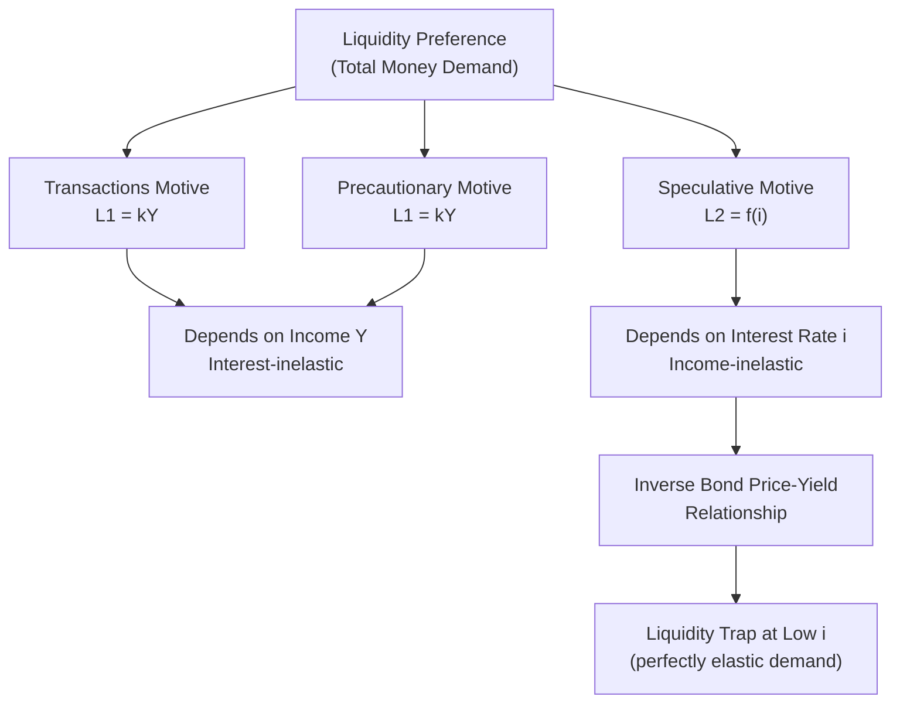

## Transactions, Precautionary, and Speculative Motives

### Overview

Keynes's *General Theory* (1936) identifies three distinct motives for holding money rather than interest-bearing assets, collectively determining liquidity preference. These motives explain why economic agents hold non-interest-bearing money instead of fully investing in bonds or other assets, forming the foundation for the money demand function $M^d = L(Y, i)$.

### The Three Motives

#### 1. Transactions Motive

**Key Points**

- Arises from the need to bridge the time gap between receipt of income and expenditure
- Money is held to finance planned, routine purchases of goods and services
- Depends primarily on the volume of transactions, which is proxied by income or output level

Keynes subdivided this into:

- **Income motive**: bridging the interval between receiving income and spending it (relevant to individuals/households)
- **Business motive**: bridging the interval between incurring business costs and receiving sale proceeds (relevant to firms)

The transactions demand for money is typically modeled as proportional to nominal income:

$$M_t^d = kY$$

where $k$ is the fraction of income held as money (related to the inverse of velocity), and $Y$ is nominal national income.

**Example**

A worker earning $4,000 monthly, paid at the start of the month, must hold money throughout the month to cover daily expenses (rent, groceries, transport) until the next paycheck arrives. The average cash balance held depends on the payment interval and spending pattern.

#### 2. Precautionary Motive

**Key Points**

- Money held to meet unforeseen or unplanned expenditures (medical emergencies, sudden repairs, unexpected opportunities)
- Serves as a buffer against uncertainty in the timing and magnitude of receipts and payments
- Also depends primarily on income level, similar to the transactions motive
- Higher income and greater uncertainty about future cash flows increase precautionary balances

Keynes originally treated precautionary demand as relatively insensitive to the interest rate, though later theorists (notably Whalen, 1966) incorporated interest-rate sensitivity, arguing that higher interest rates raise the opportunity cost of holding precautionary balances, encouraging agents to economize on them.

**Example**

A household maintains an emergency fund equivalent to three months' expenses in a checking account, foregoing higher returns available in bonds or fixed deposits, to remain liquid in case of a job loss or medical emergency.

#### 3. Speculative Motive

**Key Points**

- Money held to take advantage of expected future changes in bond prices (or asset prices generally)
- Introduces the interest rate as the key determinant of money demand — this is Keynes's major innovation
- Based on the inverse relationship between bond prices and interest rates
- Agents form expectations about a "normal" or "critical" interest rate; if the current rate is below what they expect it to return to, they anticipate bond prices will fall (since bond prices and rates move inversely) and hence prefer holding money over bonds

The bond price relationship:

$$P_B = \frac{C}{i}$$

where $P_B$ is the bond price, $C$ is the fixed coupon payment, and $i$ is the current interest rate. As $i$ rises, $P_B$ falls, and vice versa.

**Individual speculative demand** is typically discontinuous ("all-or-nothing"): each individual holds either all money or all bonds depending on whether their expected future rate exceeds or falls short of the current rate.

**Aggregate speculative demand**, however, becomes a smooth, downward-sloping function of the interest rate once individuals with heterogeneous expectations about the critical rate are aggregated (the "asset demand for money"):

$$M_{sp}^d = f(i), \quad \frac{\partial f}{\partial i} < 0$$

At very low interest rates, this generates the **liquidity trap**: if $i$ falls to a floor level $i_{min}$ that everyone expects to rise, expected capital losses on bonds become certain, so all agents prefer money — speculative demand becomes perfectly elastic (horizontal) with respect to income, and monetary policy loses traction.

**Example**

If the interest rate is 2% and investors widely believe the "normal" long-run rate is 5%, most investors expect rates to rise and bond prices to fall. They will hold money now (avoiding capital losses) rather than bonds, anticipating they can buy bonds later at lower prices (higher yields).

### Combined Money Demand Function

Aggregating all three motives yields the total Keynesian money demand (liquidity preference) function:

$$\frac{M^d}{P} = L_1(Y) + L_2(i) = kY - hi$$

where:

- $L_1(Y)$ = transactions + precautionary demand (income-dependent, interest-inelastic in the simplest formulation)
- $L_2(i)$ = speculative demand (interest-dependent, income-inelastic)
- $k$ = sensitivity of money demand to income
- $h$ = sensitivity of money demand to the interest rate

### Diagrammatic Representation

### Speculative Demand for Money Curve (SVG)

<svg xmlns="http://www.w3.org/2000/svg" viewBox="0 0 600 400">
<text x="300" y="25" font-size="16" font-weight="bold" text-anchor="middle" fill="#1a1a1a">Speculative Demand for Money (svg_diagram)</text>

<line x1="80" y1="350" x2="550" y2="350" stroke="#333" stroke-width="2" />
<line x1="80" y1="350" x2="80" y2="50" stroke="#333" stroke-width="2" />

<text x="315" y="385" font-size="14" text-anchor="middle" fill="`#1a1a1a`">Speculative Money Demand (M_sp)</text>

<text x="30" y="200" font-size="14" text-anchor="middle" fill="`#1a1a1a`" transform="rotate(-90 30 200)">Interest Rate (i)</text>

<path d="M 100 70 C 200 100, 300 160, 380 250 C 430 300, 470 330, 540 335" fill="none" stroke="`#2563eb`" stroke-width="3" />

<line x1="380" y1="335" x2="540" y2="335" stroke="#dc2626" stroke-width="3" stroke-dasharray="6,4" />

<line x1="80" y1="335" x2="540" y2="335" stroke="#999" stroke-width="1" stroke-dasharray="3,3" />
<text x="60" y="339" font-size="12" text-anchor="end" fill="#dc2626">i_min</text>

<text x="460" y="315" font-size="12" fill="`#dc2626`" font-style="italic">Liquidity Trap</text>

<text x="180" y="120" font-size="12" fill="`#2563eb`" font-style="italic">L2 = f(i)</text>

</svg>

### Policy Implications

- **Transactions + Precautionary demand**: implies money demand shifts with income/output changes, relevant for the LM curve's positive slope
- **Speculative demand**: implies monetary policy operates through interest rates affecting asset allocation, forming the transmission channel from money supply to investment via $i$
- **Liquidity trap**: at very low rates, expansionary monetary policy (increasing $M^s$) fails to lower $i$ further, since the public simply absorbs the new money into idle balances — a key argument for fiscal policy dominance in deep recessions (relevant to IS-LM analysis)

### Criticisms and Extensions

- [Inference] Empirical studies have generally found the transactions and precautionary demand for money to be more interest-elastic than Keynes's original formulation suggested, as later work (e.g., Baumol-Tobin inventory-theoretic models) demonstrated
- Tobin's (1958) portfolio-choice theory replaced Keynes's "all-or-nothing" speculative behavior with a risk-diversification rationale, generating smooth aggregate speculative demand even for identical-expectation agents
- Friedman's restatement of the quantity theory treats money demand as a function of permanent income and the returns on alternative assets, sidelining the discrete precautionary/speculative distinction in favor of a unified asset-demand framework

**Related Topics**

- Baumol-Tobin inventory-theoretic model of transactions demand
- Tobin's portfolio selection theory of liquidity preference
- The liquidity trap and its implications for monetary policy effectiveness
- Friedman's restatement of the quantity theory of money
- The LM curve derivation from liquidity preference theory
- Interest rate elasticity of money demand: empirical evidence
- Keynes's *General Theory*, Chapter 15: "The Psychological and Business Incentives to Liquidity"