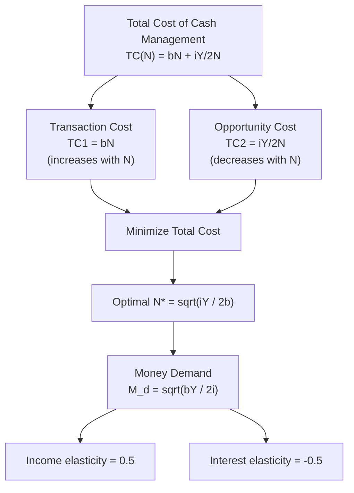

## Baumol-Tobin Inventory-Theoretic Model

### Overview

Developed independently by William Baumol (1952) and James Tobin (1956), this model derives transactions demand for money from explicit cost-minimization behavior rather than treating it as a fixed proportion of income. It applies inventory theory (originally used for physical stock management) to cash holdings, showing that money demand depends on both income *and* the interest rate — a key departure from the simple Keynesian $M_1 = kY$ formulation.

### Core Setup

**Key Points**

- An individual receives income $Y$ (nominal) as a lump sum at the start of a period and spends it steadily (uniformly) over that period
- The individual chooses how to split holdings between money (non-interest-bearing but liquid) and an interest-bearing asset (bonds, savings account), which is illiquid in the sense that converting it to cash requires a fixed transaction/brokerage cost
- The decision variable is $N$ — the number of equal withdrawals (trips to the bank/broker) made during the period
- Each withdrawal is of size $Y/N$, converted into cash and spent down until the next withdrawal

### The Cost-Minimization Problem

Two costs are traded off:

**1. Brokerage/Transaction Costs**

Each withdrawal incurs a fixed cost $b$ (broker's fee, time cost, transportation). Total transaction cost over the period:

$$TC_{transaction} = bN$$

**2. Opportunity Cost of Holding Money**

Money held as cash earns no interest, whereas it could have earned interest rate $i$ in bonds. Since cash balances are drawn down linearly from $Y/N$ to 0 between withdrawals, **average cash holding** is:

$$\bar{M} = \frac{Y}{2N}$$

Opportunity cost over the period:

$$TC_{opportunity} = i \cdot \frac{Y}{2N}$$

**Total Cost Function**

$$TC(N) = bN + \frac{iY}{2N}$$

### Deriving Optimal Money Demand

Minimize $TC(N)$ with respect to $N$:

$$\frac{d(TC)}{dN} = b - \frac{iY}{2N^2} = 0$$

Solving for the optimal number of withdrawals $N^*$:

$$N^* = \sqrt{\frac{iY}{2b}}$$

Substituting back into average money holding $\bar{M} = Y/(2N)$:

$$M^d = \frac{Y}{2N^*} = \sqrt{\frac{bY}{2i}}$$

This is the **square-root formula** — the central result of the model:

$$\boxed{M^d = \sqrt{\frac{bY}{2i}}}$$

### Key Theoretical Implications

**Key Points**

- **Income elasticity of money demand = 0.5**: money demand rises less than proportionally with income (economies of scale in cash management), contradicting the simple quantity-theory assumption of unit elasticity ($M^d = kY$)
- **Interest elasticity = −0.5**: money demand is negatively related to the interest rate, providing microeconomic foundations for the interest-sensitivity of the LM curve
- **Economies of scale in money holding**: as income doubles, optimal cash balances rise by only $\sqrt{2} \approx 1.41$ times, meaning richer individuals/economies economize proportionally more on money holdings
- Doubling the brokerage cost $b$ increases money demand (less frequent trips justified when withdrawals are costly)

### Worked Example

**Example**

Suppose an individual has monthly income $Y = \$3{,}000$, faces a brokerage cost per withdrawal $b = \$5$, and the monthly interest rate is $i = 0.01$ (1%).

$$N^* = \sqrt{\frac{(0.01)(3000)}{2(5)}} = \sqrt{\frac{30}{10}} = \sqrt{3} \approx 1.73 \text{ withdrawals}$$

$$M^d = \sqrt{\frac{(5)(3000)}{2(0.01)}} = \sqrt{\frac{15000}{0.02}} = \sqrt{750{,}000} \approx \$866$$

If the interest rate rises to $i = 0.04$ (4%), holding $Y$ and $b$ constant:

$$M^d = \sqrt{\frac{(5)(3000)}{2(0.04)}} = \sqrt{\frac{15000}{0.08}} = \sqrt{187{,}500} \approx \$433$$

This illustrates the negative interest elasticity: quadrupling $i$ halves money demand.

### Diagrammatic Representation

### Sawtooth Pattern of Cash Balances (SVG)

<svg xmlns="http://www.w3.org/2000/svg" viewBox="0 0 600 350">
<text x="300" y="25" font-size="16" font-weight="bold" text-anchor="middle" fill="#1a1a1a">Cash Balance Over Time, N=3 Withdrawals (svg_diagram)</text>

<line x1="70" y1="300" x2="550" y2="300" stroke="#333" stroke-width="2" />
<line x1="70" y1="300" x2="70" y2="50" stroke="#333" stroke-width="2" />

<text x="310" y="330" font-size="14" text-anchor="middle" fill="`#1a1a1a`">Time</text>

<text x="30" y="175" font-size="14" text-anchor="middle" fill="`#1a1a1a`" transform="rotate(-90 30 175)">Cash Holding</text>

<path d="M 70 80 L 230 300 L 230 80 L 390 300 L 390 80 L 550 300" fill="none" stroke="`#2563eb`" stroke-width="3" />

<line x1="70" y1="80" x2="70" y2="300" stroke="#999" stroke-width="1" stroke-dasharray="3,3" />
<text x="55" y="80" font-size="12" text-anchor="end" fill="#1a1a1a">Y/N</text>

<line x1="70" y1="190" x2="550" y2="190" stroke="#dc2626" stroke-width="2" stroke-dasharray="6,4" />
<text x="500" y="205" font-size="12" fill="#dc2626" font-style="italic">Average = Y/2N</text>

<text x="70" y="315" font-size="11" text-anchor="middle" fill="`#1a1a1a`">t0</text>

<text x="230" y="315" font-size="11" text-anchor="middle" fill="`#1a1a1a`">t1</text>

<text x="390" y="315" font-size="11" text-anchor="middle" fill="`#1a1a1a`">t2</text>

<text x="550" y="315" font-size="11" text-anchor="middle" fill="`#1a1a1a`">t3</text>

</svg>

### Comparison with Simple Keynesian Transactions Demand

| Feature | Simple Keynesian ($M = kY$) | Baumol-Tobin |
| --- | --- | --- |
| Income elasticity | 1 (unit elastic) | 0.5 |
| Interest elasticity | 0 (interest-inelastic) | −0.5 |
| Microfoundation | None (behavioral assumption) | Explicit cost minimization |
| Economies of scale | Not captured | Captured |

### Extensions and Criticisms

- [Inference] The model assumes income arrives as a lump sum and is spent at a perfectly constant rate — a stylization that abstracts from real-world irregular payment/spending patterns, and empirical income elasticities estimated from aggregate data have often been found closer to 0.5, lending some support to the model, though results vary by dataset and specification
- The fixed brokerage cost $b$ is treated as exogenous; in reality it may vary with financial technology (e.g., ATMs, digital banking reduce $b$, which the model predicts should reduce money demand — consistent with observed declines in cash-to-income ratios as financial technology has advanced)
- Tobin's version emphasizes the discrete "lumpiness" of withdrawal decisions more explicitly through integer-constrained $N$, whereas Baumol's treats $N$ as continuous
- The model does not address precautionary or speculative motives — it is strictly a transactions-demand model
- Later work (e.g., Miller-Orr model) extends this to stochastic cash flows rather than assuming a known, constant spending rate

**Related Topics**

- Miller-Orr model of cash management under uncertainty
- Tobin's portfolio selection theory of liquidity preference
- Interest elasticity of money demand: empirical estimation methods
- Financial innovation and the decline of transactions demand for money
- Derivation of the LM curve from microfounded money demand
- Income velocity of money and its cyclical behavior