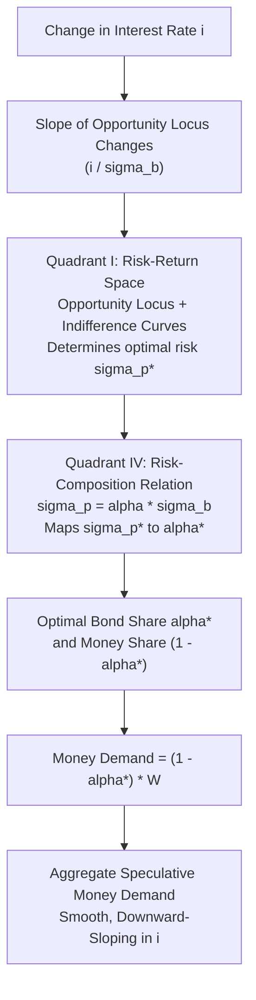

## Tobin's Portfolio Balance Approach

### Overview

James Tobin (1958), in "Liquidity Preference as Behavior Towards Risk," reformulated the speculative demand for money by replacing Keynes's "all-or-nothing" individual behavior with a **risk-diversification** rationale. Rather than each individual holding *either* all money *or* all bonds based on a single expected future interest rate, Tobin showed that risk-averse investors rationally hold a **diversified portfolio** of both money and bonds simultaneously, even when everyone shares identical expectations. This provides a smooth, downward-sloping aggregate speculative money demand curve without needing to assume heterogeneous expectations across individuals — resolving a key weakness in Keynes's original formulation.

### Motivation: The Problem with Keynes's Formulation

**Key Points**

- In Keynes's model, individual speculative demand is discontinuous: each investor holds 100% money or 100% bonds depending on whether the current interest rate is above or below their individually expected "normal" rate
- Aggregate smoothness in Keynes's model relies entirely on investors having *different* expectations about the future interest rate
- Tobin asked: can a smooth aggregate demand curve arise even if *all* investors share the *same* expectations? His answer: yes, via risk aversion and portfolio diversification

### Core Assumptions

- Investors are **risk-averse**, meaning they care not only about expected return but also about the variability (risk) of that return
- Bonds offer an expected return (interest yield) but also carry **capital risk** — the possibility of capital gains or losses if interest rates change before maturity/sale
- Money is riskless (in nominal terms) but yields zero return
- Investors choose the *proportion* of their portfolio allocated to bonds versus money to maximize utility, which depends positively on expected portfolio return and negatively on portfolio risk

### The Model Structure

**1. Expected Portfolio Return**

If a fraction $\alpha$ of wealth $W$ is held in bonds (yielding expected return $i$) and $(1-\alpha)$ in money (yielding 0), expected portfolio return is:

$$E(R) = \alpha \cdot i$$

**2. Portfolio Risk**

The risk (variance) of the portfolio depends on the variance of bond returns, $\sigma_b^2$ (arising from uncertain future capital gains/losses on bonds):

$$\sigma_p^2 = \alpha^2 \sigma_b^2$$

Portfolio standard deviation (risk):

$$\sigma_p = \alpha \sigma_b$$

**3. The Risk-Return Trade-off (Opportunity Locus)**

Combining the two equations by eliminating $\alpha$:

$$E(R) = \frac{i}{\sigma_b} \sigma_p$$

This is a straight line through the origin in $(\sigma_p, E(R))$ space, with slope $i/\sigma_b$ — the investor's **opportunity locus**, showing the menu of feasible risk-return combinations achievable by varying $\alpha$ between 0 (all money) and 1 (all bonds).

**4. Investor Indifference Curves**

A risk-averse investor's utility depends positively on expected return and negatively on risk:

$$U = U(E(R), \sigma_p), \quad U_1 > 0, \, U_2 < 0$$

This generates indifference curves that are upward-sloping and convex in $(\sigma_p, E(R))$ space (more risk requires more expected return to maintain the same utility).

**5. Optimal Portfolio Choice**

The investor chooses $\alpha^*$ where the opportunity locus is tangent to the highest attainable indifference curve.

### Diagrammatic Representation: Tobin's Two-Quadrant Diagram

### Tobin's Risk-Return Diagram (SVG)

<svg xmlns="http://www.w3.org/2000/svg" viewBox="0 0 650 450">
<text x="325" y="25" font-size="16" font-weight="bold" text-anchor="middle" fill="#1a1a1a">Tobin's Portfolio Choice Diagram (svg_diagram)</text>

<line x1="325" y1="220" x2="325" y2="60" stroke="#333" stroke-width="2" />
<line x1="325" y1="220" x2="600" y2="220" stroke="#333" stroke-width="2" />
<text x="605" y="224" font-size="12" fill="#1a1a1a">sigma_p (risk)</text>
<text x="330" y="55" font-size="12" fill="#1a1a1a">E(R)</text>

<line x1="325" y1="220" x2="560" y2="90" stroke="#2563eb" stroke-width="2.5" />
<text x="500" y="95" font-size="11" fill="#2563eb" font-style="italic">Opportunity Locus</text>

<path d="M 380 210 Q 450 160, 520 140" fill="none" stroke="#dc2626" stroke-width="2" />
<text x="470" y="130" font-size="11" fill="#dc2626" font-style="italic">Indifference Curve</text>

<circle cx="452" cy="163" r="4" fill="#1a1a1a" />
<text x="460" y="175" font-size="11" fill="#1a1a1a">Optimum</text>
<line x1="452" y1="163" x2="452" y2="220" stroke="#999" stroke-width="1" stroke-dasharray="3,3" />
<text x="452" y="235" font-size="11" text-anchor="middle" fill="#1a1a1a">sigma_p*</text>

<line x1="325" y1="220" x2="325" y2="400" stroke="#333" stroke-width="2" />
<line x1="325" y1="400" x2="600" y2="400" stroke="none" />
<line x1="325" y1="220" x2="452" y2="400" stroke="#059669" stroke-width="2.5" />
<text x="380" y="330" font-size="11" fill="#059669" font-style="italic">sigma_p = alpha*sigma_b</text>

<line x1="452" y1="163" x2="452" y2="400" stroke="#999" stroke-width="1" stroke-dasharray="3,3" />
<text x="330" y="415" font-size="12" fill="#1a1a1a">alpha (bond share)</text>
<text x="452" y="420" font-size="11" text-anchor="middle" fill="#1a1a1a">alpha*</text>

<line x1="325" y1="60" x2="60" y2="60" stroke="none" />
<text x="120" y="140" font-size="12" fill="#1a1a1a">Money Demand</text>
<text x="120" y="160" font-size="12" fill="#1a1a1a">= (1 - alpha*) W</text>
</svg>

### The Effect of a Change in the Interest Rate

**Key Points**

- A **rise in $i$** steepens the opportunity locus (higher expected return for any given risk level)
- This has two effects on the demand for bonds (and inversely, money):
  - **Substitution effect**: higher return makes bonds more attractive relative to money at any given risk level → increases $\alpha$ (more bonds, less money)
  - **Income/wealth effect**: higher $i$ means the investor can achieve the same expected return with a smaller $\alpha$, freeing up capacity to reduce risk → decreases $\alpha$ (more money, fewer bonds)
- [Inference] In Tobin's original formulation, the substitution effect is generally assumed to dominate, so a rise in $i$ increases $\alpha$ (bond share) and reduces money demand — but the net effect is theoretically ambiguous depending on the specific utility function and degree of risk aversion, meaning the money demand curve is not guaranteed to be downward-sloping in all cases without further restrictions on preferences

### Worked Example

**Example**

Suppose bond return variance $\sigma_b^2 = 0.04$ (so $\sigma_b = 0.2$), and the current interest rate is $i = 0.06$. The opportunity locus slope is:

$$\frac{i}{\sigma_b} = \frac{0.06}{0.2} = 0.3$$

If the investor's optimal risk-taking (from indifference curve tangency) is $\sigma_p^* = 0.10$, then from $\sigma_p = \alpha \sigma_b$:

$$\alpha^* = \frac{\sigma_p^*}{\sigma_b} = \frac{0.10}{0.2} = 0.5$$

The investor holds 50% of wealth in bonds and 50% in money. If wealth $W = \$100{,}000$, money demand $= \$50{,}000$.

If $i$ rises to $0.09$, the locus steepens to slope $0.45$; assuming the substitution effect dominates, the investor now tolerates more risk for higher expected return, raising $\alpha^*$ above 0.5 and reducing money holdings below $50,000.

### Aggregate Implications

**Key Points**

- Summing across investors (who may differ in wealth and risk aversion, but need not differ in expectations) produces a smooth, continuous, downward-sloping aggregate speculative demand curve $M_{sp}^d = f(i)$, $f' < 0$ (under the standard substitution-dominates assumption)
- This provides microfoundations for the interest-elastic component of the LM curve without relying on Keynes's assumption of heterogeneous "normal rate" expectations
- Both money and bonds are held simultaneously in equilibrium by each investor — consistent with observed real-world portfolio diversification, unlike Keynes's corner-solution prediction

### Comparison: Keynes vs. Tobin

| Feature | Keynes (Speculative Motive) | Tobin (Portfolio Balance) |
| --- | --- | --- |
| Individual behavior | All-or-nothing (money OR bonds) | Diversified (money AND bonds) |
| Source of aggregate smoothness | Heterogeneous expectations across individuals | Risk aversion within each individual |
| Risk treatment | Not explicitly modeled | Central: risk-return trade-off |
| Realism of portfolio composition | Corner solutions (unrealistic) | Interior solutions (realistic diversification) |

### Criticisms and Extensions

- [Inference] The model assumes bonds are risky only due to capital-value uncertainty and ignores inflation risk on money holdings, which if incorporated could alter the risk comparison between the two assets, though the direction of this effect depends on the specific inflation-uncertainty process assumed
- The ambiguous sign of the interest-rate effect on money demand (substitution vs. income/wealth effects) is often glossed over in textbook treatments, which typically assume a downward-sloping outcome
- Later portfolio theory (Markowitz mean-variance framework, Capital Asset Pricing Model) generalizes Tobin's two-asset framework to multiple risky assets
- Assumes utility depends only on mean and variance of returns, which is a simplification that holds exactly only under quadratic utility or normally distributed returns

**Related Topics**

- Markowitz mean-variance portfolio theory
- Capital Asset Pricing Model (CAPM) and its relation to monetary asset choice
- Baumol-Tobin inventory-theoretic model of transactions demand
- Keynes's original speculative motive and the liquidity trap
- Risk aversion and utility function specifications (quadratic, CRRA)
- Derivation of the LM curve from asset-demand microfoundations