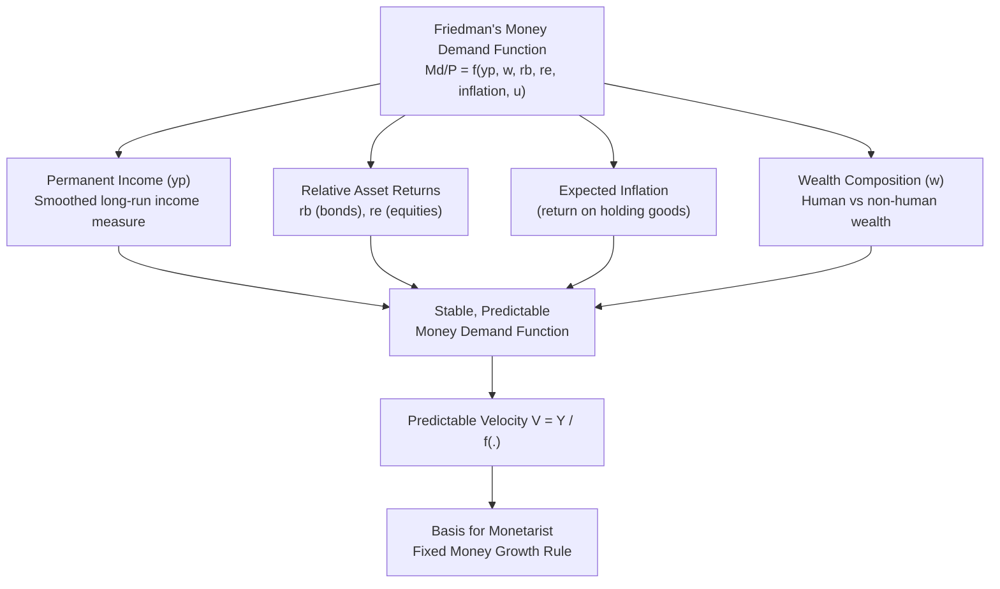

## Friedman's Restatement of the Quantity Theory

### Overview

Milton Friedman's 1956 essay "The Quantity Theory of Money: A Restatement" reframed the classical quantity theory not as a theory of prices or output, but as a **theory of the demand for money** — treating money as one asset among many in a wealth-holder's portfolio. Drawing on capital theory and consumption theory (particularly his own permanent income hypothesis), Friedman argued that the demand for money is a stable function of a small number of variables, chiefly **permanent income** and the **relative returns on alternative assets**. This became the theoretical foundation of monetarism.

### Theoretical Foundation: Money as an Asset

**Key Points**

- Friedman treats the demand for money analogously to the demand for any durable consumer good or capital asset — determined by wealth, the relative expected returns/services of holding money versus alternatives, and tastes
- Money demand is derived from a broader theory of **wealth allocation** across five main asset classes: money, bonds, equities, physical (non-human) capital, and human capital
- Unlike Keynes's motive-based decomposition (transactions, precautionary, speculative), Friedman does not decompose demand by *purpose*; instead he specifies a single reduced-form demand function with wealth and relative-return arguments

### The Money Demand Function

Friedman's general formulation for real per-capita money demand:

$$\frac{M^d}{P} = f\left(y_p, w, r_b, r_e, \frac{1}{P}\frac{dP}{dt}, u\right)$$

where:

- $y_p$ = **permanent income** (a long-run, smoothed measure of income, not current/transitory income)
- $w$ = ratio of human to non-human wealth (proxying the division of wealth between illiquid human capital and marketable assets)
- $r_b$ = expected nominal return on bonds
- $r_e$ = expected nominal return on equities
- $\frac{1}{P}\frac{dP}{dt}$ = expected rate of inflation (the return/cost of holding goods versus money)
- $u$ = a catch-all variable for tastes, institutional factors, and other influences on the utility derived from holding money

### Key Departures from Keynesian Theory

**1. Permanent Income, Not Current Income**

**Key Points**

- Friedman substitutes **permanent income** $y_p$ (the discounted expected long-run average income stream) for current measured income $Y$ used in Keynesian formulations
- Permanent income is smoother and more stable than current income, since it filters out transitory fluctuations (business cycle swings, one-off income shocks)
- Implication: money demand should be **more stable** over the business cycle than Keynesian theory predicts, since it responds to the smoothed, permanent component of income rather than volatile current income

Permanent income is often operationalized (following Friedman's consumption theory) as an exponentially weighted average of past incomes:

$$y_p = \beta \sum_{i=0}^{\infty} (1-\beta)^i Y_{t-i}$$

where $\beta$ is an adjustment coefficient reflecting how quickly expectations update.

**2. Broader Set of Substitute Assets**

**Key Points**

- Keynes's speculative motive considers only money versus bonds
- Friedman includes equities, physical goods (via the inflation-rate term, representing goods as an inflation hedge), and the human/non-human wealth ratio, treating money demand as embedded in general portfolio/wealth theory rather than isolated asset-substitution
- This yields a richer transmission mechanism: monetary policy affects not just bond yields but the full spectrum of relative asset returns and, ultimately, spending on goods and services directly

**3. Low Interest Elasticity**

**Key Points**

- [Inference] Friedman's empirical work, along with contemporaries such as Anna Schwartz, found the interest elasticity of money demand to be relatively small and money demand to be a highly **stable function of a few variables**, in contrast to the Keynesian emphasis on high interest-elasticity (especially the liquidity trap case) — though this finding on elasticity magnitude and stability has been challenged by numerous later empirical studies, particularly regarding money demand instability after the 1970s—80s
- A stable, predictable money demand function is a **necessary theoretical condition** for monetarist policy prescriptions (e.g., fixed money growth rules) to work as intended, since it establishes a tight link between the money supply and nominal income

### Velocity in Friedman's Framework

Since $M^d = P \cdot f(\cdot)$, and defining velocity as $V \equiv PY/M$, Friedman's theory implies:

$$V = \frac{Y}{f(y_p, w, r_b, r_e, \dot{P}/P, u)}$$

**Key Points**

- Unlike the crude quantity theory (which treats $V$ as roughly constant), Friedman's restatement allows $V$ to vary systematically with the same set of variables that determine money demand
- However, because these determinants (permanent income, relative yields) change slowly and predictably, velocity is *empirically* stable and *predictable* even though it is not constant — a distinction crucial to monetarist policy analysis

### Diagrammatic Representation

### Worked Example: Permanent Income vs. Current Income Response

**Example**

Suppose current income temporarily rises by 20% due to a one-time bonus, but the individual's assessment of long-run (permanent) income rises by only 3%, since the bonus is not expected to recur.

- **Keynesian prediction** (using current income $Y$): money demand would increase roughly proportionally to the transitory 20% income rise via $M^d = kY$
- **Friedman's prediction** (using permanent income $y_p$): money demand rises by much less, closer to 3%, since only the permanent component drives portfolio reallocation decisions

This illustrates why Friedman's theory predicts money demand — and by extension velocity — to be smoother and less responsive to short-run income noise than Keynesian theory would suggest.

### Comparison: Keynesian vs. Friedman Approaches

| Feature | Keynesian Liquidity Preference | Friedman's Restatement |
| --- | --- | --- |
| Income concept | Current income $Y$ | Permanent income $y_p$ |
| Assets considered | Money, bonds | Money, bonds, equities, goods, human capital |
| Interest elasticity | Potentially high (liquidity trap) | Low, per Friedman's empirical claims |
| Money demand stability | Potentially unstable (speculative swings) | Stable and predictable |
| Theoretical lineage | Macro/liquidity-preference based | Microeconomic capital/asset-choice theory |
| Policy implication | Active discretionary fiscal/monetary policy | Fixed money-growth rule (monetarism) |

### Policy Implications

- A stable money demand function implies a **tight, predictable relationship** between money supply growth and nominal income growth, underpinning Friedman's famous prescription for a **constant money growth rule** (the "k-percent rule") rather than discretionary monetary policy
- If money demand is stable, unpredictable movements in nominal GDP are attributed primarily to unpredictable movements in the money supply itself, arguing against activist countercyclical monetary policy which Friedman viewed as introducing "long and variable lags" of uncertain effect

### Criticisms and Extensions

- [Inference] The empirical stability of money demand that Friedman documented for the pre-1970s U.S. data appears to have broken down in subsequent decades across various measures of money (M1, M2), a phenomenon often termed "the missing money" or money demand instability, which has been documented extensively in the applied monetary economics literature, though the causes (financial innovation, deregulation, changing velocity patterns) remain debated
- Critics note the permanent income variable is not directly observable and must be estimated/proxied, introducing measurement and specification uncertainty into empirical tests of the theory
- The model's reduced-form nature (a single function of many variables) has been criticized for lacking the explicit optimizing microfoundations found in Baumol-Tobin or Tobin's portfolio models, though Friedman argued this was a deliberate methodological choice favoring empirical predictive power over structural detail

**Related Topics**

- The Baumol-Tobin inventory-theoretic model of transactions demand
- Tobin's portfolio balance approach to speculative demand
- Permanent Income Hypothesis (Friedman, 1957) and its consumption-theory origins
- Monetarism and the k-percent money growth rule
- Velocity of money: historical stability and post-1970s instability debates
- Quantity Theory of Money: classical (Fisher) versus Cambridge cash-balance versions