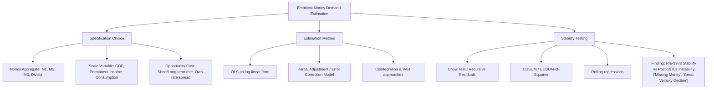

## Empirical Estimation and Stability of Money Demand

### Overview

Empirical money demand estimation seeks to test the theoretical formulations of Keynes, Baumol-Tobin, Tobin, and Friedman against real-world data, primarily estimating income and interest elasticities and testing the **stability** of the estimated relationship over time. Stability is not merely of academic interest — it is the linchpin of monetarist policy prescriptions, since a stable, predictable money demand function is required for the money supply to be a reliable target or indicator for monetary policy.

### The Standard Empirical Specification

**Key Points**

- Most empirical work estimates a log-linear money demand function of the form:

$$\ln\left(\frac{M}{P}\right)_t = \alpha + \beta \ln(Y_t) - \gamma \ln(i_t) + \varepsilon_t$$

where $\beta$ is the income elasticity, $\gamma$ is the interest semi-elasticity/elasticity (sign convention makes $\gamma > 0$ for money demand falling as $i$ rises), and $\varepsilon_t$ is a stochastic error term

- Extensions add lagged money balances to capture partial-adjustment dynamics, since money holdings adjust to their desired level gradually rather than instantaneously:

$$\ln\left(\frac{M}{P}\right)_t = \alpha + \beta \ln(Y_t) - \gamma \ln(i_t) + \lambda \ln\left(\frac{M}{P}\right)_{t-1} + \varepsilon_t$$

Here $\lambda$ (0 < $\lambda$ < 1) is the partial-adjustment coefficient; the **long-run elasticities** are obtained by dividing short-run coefficients by $(1-\lambda)$

- Choice of money aggregate matters substantially for results: M1 (currency + demand deposits), M2 (M1 + savings/small time deposits), and broader aggregates (M3, divisia measures) often yield different elasticity estimates and different degrees of stability

### Partial Adjustment Model (Goldfeld's Framework)

Stephen Goldfeld's influential 1973 study formalized the partial-adjustment approach, positing that actual money holdings adjust toward desired holdings $M^*$ according to:

$$\ln M_t - \ln M_{t-1} = \lambda \left[\ln M_t^* - \ln M_{t-1}\right]$$

where the desired level $M_t^*$ is determined by the standard income/interest-rate arguments. This distinguishes **short-run** elasticities (immediate response) from **long-run** elasticities (full adjustment), addressing the empirical observation that money demand does not adjust instantaneously to changes in its determinants — plausibly due to adjustment costs, habit persistence, or information lags.

### Diagrammatic Representation

### The "Case of the Missing Money" and Instability Episodes

**Key Points**

- Goldfeld's (1976) paper, provocatively titled "The Case of the Missing Money," documented that money demand equations which fit U.S. data well through the early 1970s began to systematically **over-predict** money demand starting around 1974 — actual M1 holdings were persistently lower than the stable historical relationship predicted
- [Inference] Proposed explanations for this and subsequent instability episodes include financial innovation (e.g., the spread of interest-bearing checking accounts (NOW accounts), money market mutual funds, and improved cash-management technology reducing transactions demand for a given income level), regulatory changes (deregulation of deposit interest rate ceilings under Regulation Q), and shifts in the public's portfolio preferences — though economists have not reached full consensus on which factor dominates, and the relative importance likely varies by country and time period
- A second major instability episode occurred in the early 1980s ("the case of the missing money, part 2" / velocity puzzles), coinciding with financial deregulation and the introduction of new deposit instruments, again disrupting previously stable M1 demand relationships
- These episodes are central to the decline of strict monetarist money-targeting regimes at major central banks (e.g., the Federal Reserve's move away from M1 targeting in the early 1980s, and other central banks similarly de-emphasizing narrow monetary targets)

### Stability Testing Methods

**1. Chow Test (Structural Break Test)**

Tests whether coefficients estimated over one sub-sample differ significantly from those in another (e.g., pre- and post-1974). The test statistic:

$$F = \frac{(RSS_{pooled} - (RSS_1 + RSS_2))/k}{(RSS_1 + RSS_2)/(n_1 + n_2 - 2k)}$$

where $RSS$ denotes residual sum of squares from pooled and separate-sample regressions, and $k$ is the number of parameters. A significant $F$-statistic indicates a structural break — evidence against stability.

**2. CUSUM and CUSUM-of-Squares Tests**

Plot cumulative sums of recursive residuals (or their squares) against time; if the plot crosses critical bound lines, this signals parameter instability at that point in the sample — a widely used diagnostic in applied money-demand studies for identifying *when* instability emerged, not just *whether* it occurred.

**3. Cointegration and Error-Correction Modeling**

**Key Points**

- Since money, income, and interest rates are typically non-stationary (integrated) time series, standard OLS on levels risks **spurious regression**
- The cointegration approach (Engle-Granger, Johansen methods) tests whether a stable long-run linear combination of $\ln(M/P)$, $\ln Y$, and $i$ exists, even if each variable individually trends over time
- If cointegration is found, an **Error Correction Model (ECM)** can be estimated, separating short-run dynamics from the long-run equilibrium relationship:

$$\Delta \ln(M/P)_t = \phi \left[\ln(M/P)_{t-1} - \beta \ln Y_{t-1} + \gamma \ln i_{t-1}\right] + \text{short-run terms} + \varepsilon_t$$

where $\phi < 0$ represents the speed of adjustment back to long-run equilibrium after a deviation

- [Inference] Cointegration-based studies have often found more stable long-run money demand relationships than simple levels regressions, suggesting that some of the apparent "instability" in earlier studies partly reflected a mis-specified dynamic structure rather than genuine breakdown of the underlying long-run relationship, though this remains an active area of methodological debate rather than a settled consensus

### Worked Example: Interpreting Elasticity Estimates

**Example**

Suppose an estimated long-run money demand equation for M2 yields:

$$\ln(M2/P) = 2.1 + 0.85 \ln Y - 0.12 \ln i$$

Interpretation:

- **Income elasticity of 0.85**: a 10% increase in real income is associated with an 8.5% increase in real M2 balances — close to, but below, unit elasticity, broadly consistent with the Baumol-Tobin prediction of economies of scale (though the Baumol-Tobin model predicts exactly 0.5, so 0.85 suggests only partial economies of scale, or that M2 behaves differently from a pure transactions balance)
- **Interest semi-elasticity of −0.12**: a one-unit (100 basis point) change in the interest rate variable is associated with roughly a 12% change in real M2 holdings in the opposite direction, indicating meaningful but not extreme interest sensitivity

If a Chow test on this equation, splitting the sample in 1980, yields $F = 4.8$ with a critical value of $F_{0.05} = 2.4$, this would indicate rejection of parameter stability across the two sub-periods — evidence of a structural break around the deregulation period.

### Divisia Monetary Aggregates as a Response to Instability

**Key Points**

- [Inference] One proposed remedy for money-demand instability is the use of **Divisia (weighted) monetary aggregates**, which weight each monetary component (currency, checking deposits, savings, etc.) by its "moneyness" (approximated by the user cost of holding that asset) rather than summing all components with equal weight as in simple-sum M1/M2
- Some studies (e.g., work associated with William Barnett) report that Divisia aggregates exhibit more stable demand relationships than simple-sum aggregates, since they better account for the changing degree of "moneyness" of assets as financial innovation blurs the distinction between money and near-money assets — though Divisia measures have not been widely adopted as official targets by most central banks, and the evidence on their superiority is mixed across country studies

### Comparison of Estimation Approaches

| Approach | Strength | Limitation |
| --- | --- | --- |
| Static log-linear OLS | Simple, interpretable elasticities | Ignores dynamics; risk of spurious regression on trending data |
| Partial adjustment (Goldfeld) | Distinguishes short/long-run response | Assumes fixed adjustment speed; sensitive to sample period |
| Cointegration/ECM | Addresses non-stationarity; separates long-run and short-run | Requires larger samples; sensitive to lag-length and specification choices |
| Divisia aggregates | Accounts for heterogeneous asset "moneyness" | Complex construction; not standard in most official statistics |

### Policy Relevance

- The empirical instability documented since the mid-1970s significantly undermined the practical case for **strict monetary targeting** as a policy rule, contributing to most major central banks shifting toward interest-rate-based operating frameworks (e.g., Taylor-rule-style approaches) and, later, inflation targeting, rather than targeting monetary aggregate growth directly
- Ongoing empirical money-demand research remains relevant for understanding the transmission mechanism of monetary policy and for macroeconomic forecasting models, even where monetary aggregates are no longer primary policy targets

**Related Topics**

- Cointegration and Error Correction Models in macroeconometrics
- Goldfeld's "Case of the Missing Money" and related instability literature
- Divisia monetary aggregates (Barnett critique of simple-sum aggregation)
- Financial innovation and its effects on monetary aggregates
- Transition from monetary targeting to inflation targeting in central bank practice
- Friedman's restatement of the quantity theory (theoretical basis for stability hypothesis)
- Velocity of money: historical trends and structural breaks