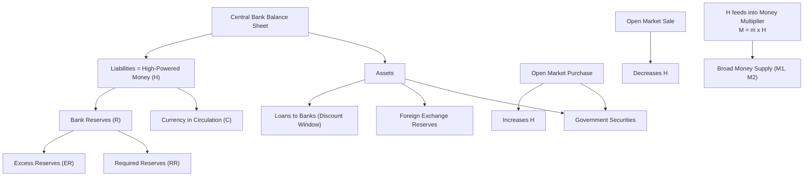

## High-Powered Money and the Monetary Base

### Overview

High-powered money (also termed the **monetary base**, or $H$/$MB$) refers to the liabilities of the central bank that serve as the foundation upon which the broader money supply is built through the banking system's credit-creation process. It is termed "high-powered" because each unit of base money is capable of supporting a multiple of that amount in broad money (via the money multiplier), making it the primary lever through which central banks influence the overall money supply.

### Definition and Composition

**Key Points**

- High-powered money consists of two components:

$$H = C + R$$

where:

- $C$ = **currency in circulation** (notes and coins held by the non-bank public)
- $R$ = **bank reserves** (deposits that commercial banks hold at the central bank, plus vault cash held by banks)
- Equivalently, from the central bank's balance sheet (liability side), the monetary base equals:

$$H = \text{Currency issued} + \text{Bank reserves (deposits at central bank)}$$

- $H$ is a subset of broader money supply measures (M1, M2); it is **not** itself a standard money-supply aggregate but the raw material from which those aggregates are created

### The Central Bank Balance Sheet

**Key Points**

- The monetary base appears on the **liability side** of the central bank's balance sheet
- Corresponding assets typically include:
  - Government securities (holdings from open market operations)
  - Foreign exchange reserves
  - Loans/advances to commercial banks (discount window lending)
  - Gold and other reserve assets (historically significant, now typically minor)

A simplified central bank balance sheet:

| Assets | Liabilities |
| --- | --- |
| Government securities | Currency in circulation |
| Foreign exchange reserves | Bank reserves (deposits) |
| Loans to banks (discount window) | Other liabilities (e.g., government deposits) |

**Key Points**

- Since assets must equal liabilities, any change in central bank assets (e.g., purchasing bonds via open market operations) directly changes the monetary base — this is the fundamental mechanical link between central bank operations and $H$

### Reserves: Required vs. Excess

$$R = RR + ER$$

where:

- $RR$ = **required reserves** — the minimum reserves banks must hold against deposits, determined by the required reserve ratio $r_r$ set by the central bank: $RR = r_r \times D$ (where $D$ is deposits)
- $ER$ = **excess reserves** — reserves held voluntarily above the required minimum, which banks may hold for precautionary liquidity management or, in some periods/jurisdictions, simply because the central bank pays interest on excess reserves (IOER), reducing the opportunity cost of holding them

[Unverified] Reserve requirement frameworks vary substantially by country and have changed over time (e.g., the U.S. Federal Reserve reduced reserve requirement ratios to zero in March 2020); readers should verify current requirements for any specific jurisdiction and time period rather than relying on a single fixed figure.

### Sources of Changes in the Monetary Base

**Key Points**

The central bank alters $H$ primarily through:

1. **Open Market Operations (OMOs)**: purchasing government securities increases $H$ (the central bank credits the seller's bank with new reserves); selling securities decreases $H$
2. **Discount window lending**: loans extended to commercial banks directly increase bank reserves, raising $H$
3. **Foreign exchange interventions**: central bank purchases of foreign currency (paying with domestic currency) increase $H$; sales decrease it
4. **Government deposit shifts**: movements of government deposits between the central bank and commercial banks can affect $H$ indirectly (shifting funds into commercial banks increases reserves; shifting into the central bank account withdraws them from the banking system)

### Diagrammatic Representation

### High-Powered Money and the Money Multiplier

**Key Points**

- $H$ is the base upon which broad money is created via fractional reserve banking; the relationship is:

$$M = m \times H$$

where $m$ is the **money multiplier**, typically derived as:

$$m = \frac{1 + c}{r_r + c + e}$$

with $c$ = currency-to-deposit ratio held by the public, $r_r$ = required reserve ratio, and $e$ = excess-reserve-to-deposit ratio held by banks

- Because $m > 1$ under normal fractional-reserve conditions, each unit of high-powered money supports a multiple of that amount in the broader money stock — hence the term "high-powered"

### Worked Example

**Example**

Suppose the central bank's balance sheet shows total assets of $500 billion, entirely composed of government securities. On the liability side, currency in circulation is $350 billion and bank reserves are $150 billion.

$$H = C + R = \$350\text{bn} + \$150\text{bn} = \$500\text{bn}$$

If the currency-deposit ratio $c = 0.5$, required reserve ratio $r_r = 0.1$, and excess-reserve ratio $e = 0.02$:

$$m = \frac{1 + 0.5}{0.1 + 0.5 + 0.02} = \frac{1.5}{0.62} \approx 2.42$$

Broad money supply:

$$M = m \times H = 2.42 \times \$500\text{bn} \approx \$1{,}210\text{bn}$$

If the central bank conducts an open market purchase of $20 billion in government securities, $H$ rises to $520 billion, and (holding $m$ constant) $M$ rises to approximately $1,258 billion — illustrating the multiplied effect of a base-money change on the broader money stock.

### Distinction: Monetary Base vs. Broader Money Aggregates

| Measure | Components | Controlled Directly By |
| --- | --- | --- |
| High-powered money ($H$/MB) | Currency + bank reserves | Central bank (via OMOs, lending, FX ops) |
| M1 | Currency + demand deposits | Determined by $H$ and banking-sector behavior (multiplier) |
| M2 | M1 + savings deposits, small time deposits | Determined by $H$, multiplier, and portfolio choices |

**Key Points**

- The central bank has close to direct control over $H$ (subject to some complications from autonomous factors like government deposit flows), but only indirect control over broader aggregates like M1/M2, since those also depend on the behavior of banks (excess reserve holding) and the public (currency-deposit preferences) via the multiplier $m$

### Criticisms and Modern Complications

- [Inference] The simple money-multiplier story, in which the central bank mechanically controls broad money by setting $H$, has been challenged by some economists (particularly those in the post-Keynesian "endogenous money" tradition) who argue that in modern banking systems banks extend credit first and seek reserves afterward, making the multiplier relationship better described as running from money/credit to the base rather than the reverse — though this remains a contested theoretical point rather than a settled consensus among monetary economists
- Since the global financial crisis (2008) and the adoption of large-scale asset purchase programs ("quantitative easing") by major central banks, the monetary base expanded dramatically in many economies without a proportional expansion in broad money or credit, as banks held much of the new reserves as excess reserves rather than lending them out — a pattern that significantly weakened the simple multiplier relationship in practice during that period
- The introduction of interest on excess reserves (IOER) by many central banks altered banks' incentives to hold excess reserves, further complicating the traditional multiplier framework

**Related Topics**

- The money multiplier: derivation and determinants
- Open market operations and central bank balance sheet management
- Quantitative easing and unconventional monetary policy
- Endogenous vs. exogenous money supply debates
- Required reserve ratios and their historical evolution
- Interest on excess reserves (IOER) and its effect on bank reserve holding behavior