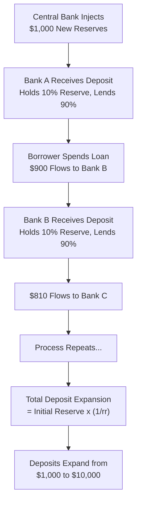

## Fractional Reserve Banking and Deposit Creation

### Overview

Fractional reserve banking is the system in which commercial banks hold only a fraction of their deposit liabilities as reserves, lending out the remainder. This practice enables the banking system as a whole to create new deposits — and hence expand the money supply — far beyond the initial injection of reserves by the central bank. The mechanics of this process explain how high-powered money is transformed into a multiple expansion of broad money.

### The Basic Mechanism

**Key Points**

- When a bank receives a deposit, it is not required to hold that deposit entirely as reserves; instead, it holds a fraction (the required reserve ratio, $r_r$) and lends out the rest
- The loaned funds, when spent, typically end up as a deposit in another bank, which again holds only a fraction as reserves and lends the remainder
- This process repeats across the banking system, with each successive round of lending being smaller than the last, until the initial reserve injection has generated a multiple expansion in total deposits

### Single-Bank vs. Banking-System Perspective

**Key Points**

- An individual bank cannot create money on its own in a meaningful sense — when it makes a loan, it typically loses the reserves associated with that loan as the borrower spends the funds and they flow to other banks (or leak into currency holdings)
- Money creation is a **banking-system phenomenon**: while each bank only re-lends a fraction of what it receives, the system as a whole expands deposits collectively as funds circulate and are redeposited repeatedly

### The Deposit Expansion Process — Step by Step

**Example**

Assume a required reserve ratio $r_r = 0.10$ (10%), no currency drain (the public holds all money as deposits), and no excess reserves held by banks (bank lends out 100% of what it is not required to hold).

Suppose the central bank injects $1,000 in new reserves into Bank A (e.g., via an open market purchase from a customer of Bank A).

| Round | Bank | New Deposit | Required Reserve (10%) | New Loan (Excess Lent Out) |
| --- | --- | --- | --- | --- |
| 1 | Bank A | $1,000.00 | $100.00 | $900.00 |
| 2 | Bank B | $900.00 | $90.00 | $810.00 |
| 3 | Bank C | $810.00 | $81.00 | $729.00 |
| 4 | Bank D | $729.00 | $72.90 | $656.10 |
| ... | ... | ... | ... | ... |

Each round's new deposit is $r_r$ smaller than the previous round's loan, forming a geometric series. Total deposit creation across all rounds:

$$\Delta D = \Delta R \times \left(1 + (1-r_r) + (1-r_r)^2 + (1-r_r)^3 + \dots\right) = \Delta R \times \frac{1}{r_r}$$

With $\Delta R = \$1{,}000$ and $r_r = 0.10$:

$$\Delta D = 1000 \times \frac{1}{0.10} = \$10{,}000$$

The initial $1,000 reserve injection ultimately supports $10,000 in total new deposits — a **simple deposit multiplier** of $1/r_r = 10$.

### Diagrammatic Representation

### The Simple Deposit Multiplier vs. the Full Money Multiplier

**Key Points**

- The simple deposit multiplier $1/r_r$ derived above assumes **no currency drain** (the public never withdraws cash, holding 100% of money as deposits) and **no excess reserves** held by banks
- In reality, both assumptions are unrealistic:
  - The public holds some money as currency, so a portion of each loan "leaks" out of the banking system as cash rather than being redeposited
  - Banks may hold excess reserves beyond the legal requirement for precautionary or interest-earning reasons
- Incorporating both leakages gives the **full money multiplier** (as covered in the high-powered money / monetary base topic):

$$m = \frac{1+c}{r_r + c + e}$$

where $c$ is the currency-deposit ratio and $e$ is the excess-reserve ratio. This full multiplier is always smaller than the simple deposit multiplier $1/r_r$, since currency drains and excess reserves reduce the amount re-lent at each round

### Balance Sheet Illustration of a Single Bank's Role

**Key Points**

- When Bank A receives a $1,000 deposit and lends out $900:

| Bank A Assets | Bank A Liabilities |
| --- | --- |
| Reserves: +$100 | Deposits: +$1,000 |
| Loans: +$900 |  |

- The loan ($900, an asset for Bank A) becomes a new deposit at Bank B once spent, illustrating how one bank's loan mechanically becomes another bank's deposit — the essential link in the chain of deposit creation

### Limits and Leakages on Deposit Creation

**Key Points**

The deposit expansion process is limited by several leakages that reduce the effective multiplier below the simple $1/r_r$ figure:

1. **Currency drain**: any cash withdrawn by borrowers/depositors and held outside the banking system does not generate further loans
2. **Excess reserves**: banks holding reserves beyond the legal minimum (for liquidity management, or because interest is paid on reserves) reduce the amount available for further lending
3. **Loan demand**: the process assumes there is always a willing borrower for the excess reserves at each stage; in periods of weak loan demand or heightened credit risk, banks may be unable or unwilling to lend out their full lending capacity, dampening deposit creation
4. **Regulatory capital constraints**: beyond reserve requirements, capital adequacy rules (e.g., Basel III risk-weighted capital ratios) may independently constrain a bank's capacity to expand its balance sheet through new lending, even where reserves are available

### Comparison: Textbook Multiplier vs. Real-World Banking

| Feature | Simple Textbook Model | Real-World Complication |
| --- | --- | --- |
| Reserve behavior | Banks hold exactly $r_r$ | Banks often hold excess reserves |
| Public cash holding | Assumed zero (all deposits) | Currency drain reduces multiplier |
| Loan supply | Assumed banks always lend excess reserves | Loan demand and credit risk assessment affect actual lending |
| Sequence of causation | Reserves → Loans → Deposits (multiplier) | Some economists argue causation partly reverses: Loans → Deposits → Reserves sought afterward (endogenous money view) |

### Criticisms and Alternative Views

- [Inference] The traditional "reserves-first" deposit-multiplier story presented above is the standard textbook depiction, but it has been challenged by proponents of the **endogenous money** view (associated with post-Keynesian economics, and echoed in explanatory material published by some central banks, including a widely cited 2014 Bank of England article) who argue that in modern banking systems, banks extend loans based on creditworthy demand and profitable opportunities first, creating deposits simultaneously, and then seek any required reserves afterward (from the central bank or interbank markets) — reversing the textbook causal sequence from reserves-constrain-lending to lending-creates-deposits-which-then-requires-reserves
- [Unverified] The practical relevance of the simple reserve-constrained multiplier model has been further questioned in monetary systems where reserve requirements have been reduced to zero or near-zero (as occurred in the U.S. as of March 2020) — in such systems, capital requirements and profitability considerations arguably become the binding constraints on lending rather than reserve availability, though the precise operational details vary by jurisdiction and monetary policy framework

**Related Topics**

- High-powered money and the monetary base
- The money multiplier: full derivation with currency drain and excess reserves
- Endogenous money theory and post-Keynesian banking views
- Basel III capital adequacy requirements and their effect on credit creation
- Central bank reserve requirement policy and its historical evolution
- Open market operations and the transmission of monetary policy to bank lending