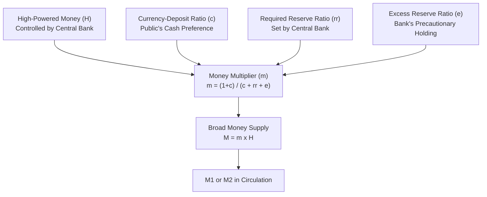

## The Money Multiplier Model

### Overview

The money multiplier model formalizes the relationship between the monetary base (high-powered money) and the broader money supply, expressing broad money as a scalar multiple of the base. It integrates the behavior of three distinct agents — the central bank, commercial banks, and the non-bank public — into a single coefficient, $m$, that determines how much broad money is generated per unit of base money.

### The Core Relationship

$$M^s = m \times H$$

where:

- $M^s$ = broad money supply (e.g., M1 or M2)
- $H$ = high-powered money / monetary base
- $m$ = the money multiplier

### Deriving the Multiplier

**Key Points**

The derivation defines money supply and the base in terms of currency ($C$) and deposits ($D$), then introduces two behavioral ratios.

**Step 1 — Define M1 and the base:**

$$M^s = C + D$$

$$H = C + R$$

where $R$ = total bank reserves.

**Step 2 — Introduce behavioral ratios:**

- **Currency-deposit ratio** ($c = C/D$): reflects the public's preference for holding cash versus bank deposits
- **Reserve-deposit ratio** ($rr = R/D$): reflects banks' reserve-holding behavior, itself composed of the required reserve ratio ($r_r$, set by the central bank) plus any voluntarily held excess-reserve ratio ($e$): $rr = r_r + e$

**Step 3 — Express $M^s$ and $H$ in terms of $D$:**

$$M^s = cD + D = (c+1)D$$

$$H = cD + rrD = (c + rr)D$$

**Step 4 — Take the ratio:**

$$\frac{M^s}{H} = \frac{(1+c)D}{(c+rr)D} = \frac{1+c}{c+rr}$$

Therefore:

$$\boxed{m = \frac{1+c}{c + r_r + e}}$$

### Diagrammatic Representation

### Comparative Statics: How Each Parameter Affects $m$

**Key Points**

**1. Effect of the required reserve ratio ($r_r$)**

$$\frac{\partial m}{\partial r_r} < 0$$

A higher required reserve ratio forces banks to hold more reserves per dollar of deposits, leaving less to lend, which reduces the multiplier. This is the classical rationale for using reserve requirements as a (now largely disused) monetary policy tool.

**2. Effect of the currency-deposit ratio ($c$)**

$$\frac{\partial m}{\partial c} < 0 \quad \text{(provided } rr < 1\text{, the normal case)}$$

A higher public preference for holding currency over deposits reduces the multiplier, since currency held by the public does not recirculate through the banking system's lending chain the way deposits do — each dollar diverted to currency "leaks" out of the deposit-creation process. [Inference] This is a standard, well-established comparative-static result under normal parameter ranges, since $r_r$ is typically well below 1 (i.e., reserve requirements are fractional, not 100%).

**3. Effect of the excess-reserve ratio ($e$)**

$$\frac{\partial m}{\partial e} < 0$$

Higher voluntary excess reserve holdings by banks mean a smaller fraction of each deposit is lent out, reducing the pace and extent of deposit (and hence broad money) creation.

### Worked Example

**Example**

Suppose $c = 0.30$ (public holds 30 cents of currency per dollar of deposits), $r_r = 0.08$ (8% required reserve ratio), and $e = 0.02$ (banks hold an additional 2% in excess reserves).

$$m = \frac{1 + 0.30}{0.30 + 0.08 + 0.02} = \frac{1.30}{0.40} = 3.25$$

If the monetary base is $H = \$800$ billion:

$$M^s = 3.25 \times \$800\text{bn} = \$2{,}600\text{bn}$$

**Policy scenario**: Suppose the central bank raises the required reserve ratio to $r_r = 0.12$. Recalculating:

$$m' = \frac{1.30}{0.30 + 0.12 + 0.02} = \frac{1.30}{0.44} \approx 2.95$$

Holding $H$ fixed at $800bn:

$$M^{s\prime} = 2.95 \times \$800\text{bn} = \$2{,}361\text{bn}$$

The money supply contracts by roughly $239 billion purely from the reserve-requirement increase, without any change in the monetary base itself — illustrating the multiplier's role as an independent channel of monetary control.

### Money Multiplier and Monetary Control

**Key Points**

- Under the money multiplier framework, the central bank can influence $M^s$ through two distinct channels:
  1. Changing $H$ directly (open market operations, discount lending, FX interventions)
  2. Changing $r_r$ (reserve requirement policy), which alters $m$ itself
- [Inference] Historically, central banks have relied far more heavily on channel (1) — base-money control via open market operations — since frequent changes to reserve requirements can be disruptive to bank balance-sheet planning and are considered a blunter policy instrument; many countries have accordingly reduced the practical role of reserve requirements as an active policy tool over recent decades, though the degree and timing of this shift vary by jurisdiction

### Multiplier Stability: Theoretical vs. Empirical Behavior

**Key Points**

- The model treats $c$, $r_r$, and $e$ as (relatively) stable parameters in the short run, implying a predictable, roughly constant $m$
- In practice, $c$ and $e$ are behavioral variables that can shift, especially during periods of financial stress, seasonal patterns (e.g., increased currency demand around holidays), or changes in interest rates (since $e$ responds to the opportunity cost of holding excess reserves, and this cost is affected by prevailing rates and, where applicable, interest paid on reserves)
- [Inference] During the 2008 global financial crisis and subsequent quantitative easing episodes, many empirical studies observed a sharp rise in $e$ (banks massively increased excess reserve holdings) even as $H$ expanded dramatically, causing the empirical money multiplier to fall well below its pre-crisis historical average in several economies — a pattern frequently cited as evidence that the simple multiplier model, while mechanically valid as an accounting identity, can behave quite differently from its "textbook stable coefficient" assumption during unusual monetary policy episodes

### Comparison: Simple Deposit Multiplier vs. Full Money Multiplier

| Feature | Simple Deposit Multiplier | Full Money Multiplier |
| --- | --- | --- |
| Formula | $1/r_r$ | $(1+c)/(c+r_r+e)$ |
| Currency drain | Ignored (assumes $c=0$) | Explicitly incorporated |
| Excess reserves | Ignored (assumes $e=0$) | Explicitly incorporated |
| Magnitude | Larger (overstates multiplier) | Smaller, more realistic |
| Use case | Pedagogical introduction | Applied/empirical money supply analysis |

### Criticisms and Alternative Perspectives

- The model implicitly assumes a **reserves-first, deposits-follow** causal structure (the base drives the money supply); this has been challenged by the endogenous-money view, which argues loan demand and bank lending decisions drive deposit creation, with reserves accommodated afterward by the central bank rather than acting as the binding constraint
- [Inference] The model treats behavioral ratios as exogenous parameters, but they plausibly respond to the interest rate, financial regulation, and payments technology, meaning $m$ is not truly constant but itself a function of these same variables — a refinement sometimes incorporated into more elaborate versions of the model but omitted from the basic textbook presentation
- In monetary regimes with zero or near-zero reserve requirements, the $r_r$ term in the formula becomes definitionally less binding, shifting the practical determinants of $m$ toward the behavior of $e$ and $c$ alone

**Related Topics**

- High-powered money and the monetary base
- Fractional reserve banking and deposit creation
- Endogenous money theory and post-Keynesian critiques of the multiplier model
- Quantitative easing and its effect on excess reserves
- Reserve requirement policy: historical use and decline
- Interest on excess reserves (IOER) and bank reserve-holding incentives